<div align="center">

# 🚀 ampy-config

**Typed Configuration & Secrets Façade for AmpyFin**

[](https://www.python.org/downloads/)
[](LICENSE)
[](https://github.com/AmpyFin/ampy-config/actions)
[](https://pypi.org/project/ampy-config/)
[](https://github.com/psf/black)

> 🎯 **Single, safe source of truth** for configuration and secrets across AmpyFin services  
> 🔗 Built to integrate with **ampy-bus** (control plane over NATS/JetStream) and **ampy-proto** (payload contracts)

[📖 Documentation](#-highlights-what-you-get) • [🚀 Quick Start](#-install-python--pypi) • [🔧 Usage](#-cli-usage) • [🤝 Contributing](#-contributing)

</div>

---

## 📋 Table of Contents

- [🎯 Why this exists](#-why-this-exists-the-problem)
- [✨ Highlights](#-highlights-what-you-get)
- [🚀 Quick Start](#-quick-start)
- [🚀 Install](#-install)
- [🎯 Basic Usage Examples](#-basic-usage-examples)
- [🔗 Integration Examples](#-integration-examples)
- [✅ Configuration Validation](#-configuration-validation)
- [🎮 Control Plane](#-control-plane-natsjetstream)
- [📚 Layering Model](#-layering-model)
- [🔐 Secrets](#-secrets-indirection-caching-rotation-redaction)
- [💻 CLI Usage](#-cli-usage)
- [🐍 Python Integration](#-use-from-a-service-python-example)
- [🐹 Go Client Usage](#-go-client-usage)
- [📊 Schema Examples](#-schema-notes-metrics-example)
- [🌍 Environment Variables](#-environment-variables)
- [🔧 Troubleshooting](#-troubleshooting)
- [🛡️ Security](#-security-notes)
- [🤝 Contributing](#-contributing)

---

## 🎯 Why this exists (the problem)

Without a unified configuration layer, distributed trading systems tend to develop:

> ⚠️ **Common Issues:**
> - **ENV/YAML sprawl** → drift, surprises, outages
> - **Secret handling risks** → credentials in logs, brittle rotations, no redaction
> - **Non-reproducibility** → can't reconstruct exactly which parameters were live for a given trade/run
> - **Inconsistent runtime behavior** → some services reload, others require restarts

**ampy-config** provides a single, typed, validated, observable configuration view with clean secret indirection and a runtime control plane for safe updates.

---

## ✨ Highlights (what you get)

| Feature | Description |
|---------|-------------|
| 🔍 **Typed schema + validation** | JSON Schema + semantic cross-field checks |
| 📚 **Layering & precedence** | defaults → environment profile → overlays → ENV allowlist → runtime overrides |
| 🔐 **Secret indirection** | `secret://…`, `aws-sm://…`, `gcp-sm://…` with caching, rotation, and universal redaction |
| 🎮 **Control plane for updates** | `config_preview` → `config_apply` → `config_applied` events on NATS (JetStream) |
| 📊 **Auditability & observability** | provenance for each key; logs/metrics/traces (no secrets) |
| 🌐 **Language-agnostic** | produces plain YAML effective config for Python, Go, C++, etc. |

---

## 🚀 Quick Start

### ⚠️ Prerequisites - NATS Server Required

**ampy-config requires a running NATS server for configuration management:**

```bash
# Start NATS with JetStream (required)
docker run --rm -d --name nats -p 4222:4222 nats:2.10 -js

# Or install NATS server locally
go install github.com/nats-io/nats-server/v2@latest
nats-server -js
```

**Verify NATS is running:**
```bash
# Test connection
nats --server "nats://localhost:4222" server info
```

> 🚨 **Common Issue**: If you get `nats: no servers available for connection` error, NATS server is not running. Start it with the command above.

## 🚀 Install

### 🐍 Python / PyPI

```bash
pip install ampy-config
```

**Developer mode** (local repo):
```bash
pip install -e .
```

### 🐹 Go Client

**Library:**
```bash
go get github.com/AmpyFin/ampy-config/go/ampyconfig@v1.1.5
```

**Binaries:**
```bash
cd go/ampyconfig
make     # builds bin/ampyconfig-{ops,agent,listener}
```

> 📦 **Available on [pkg.go.dev](https://pkg.go.dev/github.com/AmpyFin/ampy-config/go/ampyconfig)**

### 🔧 Optional secret backends

| Backend | Install Command | Use Case |
|---------|----------------|----------|
| 🔐 **HashiCorp Vault** | `pip install hvac` | Enterprise secret management |
| ☁️ **AWS Secrets Manager** | `pip install boto3` | AWS-native secret storage |
| 🌐 **GCP Secret Manager** | `pip install google-cloud-secret-manager` | Google Cloud secret storage |

> 💡 **Tip:** You **do not** need to sign up for all of these. Choose one or more real backends for your deployment; the library gracefully falls back to a local JSON file in development.

---

## 🎯 Basic Usage Examples

### 🐍 Python Quick Start

```python
import asyncio
from ampy_config.layering import build_effective_config

# Build effective configuration
cfg, _ = build_effective_config(
    schema_path="schema/ampy-config.schema.json",
    defaults_path="config/defaults.yaml",
    profile_yaml="examples/dev.yaml",
    overlays=[],
    service_overrides=[],
    env_allowlist_path="env_allowlist.txt",
    env_file=None,
    runtime_overrides_path="runtime/overrides.yaml",
)

# Get configuration values
nats_url = cfg["bus"]["nats_url"]
topic_prefix = cfg["bus"]["topic_prefix"]
risk_limit = cfg["oms"]["risk"]["max_order_notional_usd"]

print(f"NATS URL: {nats_url}")
print(f"Topic Prefix: {topic_prefix}")
print(f"Risk Limit: {risk_limit}")
```

### 🐹 Go Quick Start

```go
package main

import (
    "fmt"
    "log"
    
    "github.com/AmpyFin/ampy-config/go/ampyconfig"
    "github.com/nats-io/nats.go"
)

func main() {
    // Connect to NATS
    nc, err := nats.Connect("nats://localhost:4222")
    if err != nil {
        log.Fatal(err)
    }
    defer nc.Close()
    
    // Create ampy-config client
    client := ampyconfig.New("nats://localhost:4222", "ampy.dev", "runtime/overrides.yaml")
    
    // Get configuration values
    natsURL, err := client.Get("bus.nats_url")
    if err != nil {
        log.Fatal(err)
    }
    
    topicPrefix, err := client.Get("bus.topic_prefix")
    if err != nil {
        log.Fatal(err)
    }
    
    fmt.Printf("NATS URL: %s\n", natsURL)
    fmt.Printf("Topic Prefix: %s\n", topicPrefix)
}
```

### 🧪 Test Your Setup

**Python validation test:**
```bash
python -c "
from ampy_config.layering import build_effective_config
try:
    cfg, _ = build_effective_config(
        'schema/ampy-config.schema.json',
        'config/defaults.yaml',
        'examples/dev.yaml',
        [], [], 'env_allowlist.txt', None, 'runtime/overrides.yaml'
    )
    print('✅ ampy-config working correctly!')
    print(f'Bus config: {cfg[\"bus\"]}')
except Exception as e:
    print(f'❌ Error: {e}')
"
```

**Go validation test:**
```bash
go run - << 'EOF'
package main

import (
    "fmt"
    "log"
    
    "github.com/AmpyFin/ampy-config/go/ampyconfig"
)

func main() {
    client := ampyconfig.New("nats://localhost:4222", "ampy.dev", "runtime/overrides.yaml")
    
    // Test getting a value
    value, err := client.Get("test.key")
    if err != nil {
        log.Printf("Expected error for missing key: %v", err)
    }
    
    fmt.Println("✅ ampy-config working correctly!")
}
EOF
```

---

## 🔗 Integration Examples

### With ampy-bus

**Python integration:**
```python
import asyncio
from ampy_config.layering import build_effective_config
from ampy_config.bus.ampy_bus import AmpyBus

async def create_bus_from_config():
    # Build configuration
    cfg, _ = build_effective_config(
        schema_path="schema/ampy-config.schema.json",
        defaults_path="config/defaults.yaml",
        profile_yaml="examples/dev.yaml",
        overlays=[], service_overrides=[],
        env_allowlist_path="env_allowlist.txt",
        env_file=None,
        runtime_overrides_path="runtime/overrides.yaml",
    )
    
    # Get bus configuration
    nats_url = cfg["bus"]["nats_url"]
    stream_name = cfg["bus"]["stream_name"]
    topic_prefix = cfg["bus"]["topic_prefix"]
    
    # Create bus
    bus = AmpyBus(nats_url)
    await bus.connect()
    
    return bus, topic_prefix
```

**Go integration:**
```go
import (
    "github.com/AmpyFin/ampy-config/go/ampyconfig"
    "github.com/AmpyFin/ampy-bus/pkg/ampybus/natsbinding"
)

func createBusFromConfig() (*natsbinding.Bus, error) {
    // Create config client
    client := ampyconfig.New("nats://localhost:4222", "ampy.dev", "runtime/overrides.yaml")
    
    // Get configuration values
    natsURL, err := client.Get("bus.nats_url")
    if err != nil {
        return nil, err
    }
    
    streamName, err := client.Get("bus.stream_name")
    if err != nil {
        return nil, err
    }
    
    topicPrefix, err := client.Get("bus.topic_prefix")
    if err != nil {
        return nil, err
    }
    
    // Create bus configuration
    config := natsbinding.Config{
        URLs:          []string{natsURL},
        StreamName:    streamName,
        Subjects:      []string{topicPrefix + ".>"},
        DurablePrefix: "ampy-trading",
    }
    
    return natsbinding.NewBus(config)
}
```

### With ampy-proto

**Go integration:**
```go
import (
    "github.com/AmpyFin/ampy-config/go/ampyconfig"
    bars "github.com/AmpyFin/ampy-proto/v2/gen/go/ampy/bars/v1"
    common "github.com/AmpyFin/ampy-proto/v2/gen/go/ampy/common/v1"
)

func createBarFromConfig(client *ampyconfig.Client) (*bars.Bar, error) {
    // Get trading configuration
    symbol, err := client.Get("trading.symbol")
    if err != nil {
        return nil, err
    }
    
    mic, err := client.Get("trading.mic")
    if err != nil {
        return nil, err
    }
    
    // Create bar with config values
    bar := &bars.Bar{
        Security: &common.SecurityId{
            Symbol: symbol,
            Mic:    mic,
        },
        // ... other fields
    }
    
    return bar, nil
}
```

### Dynamic Configuration Updates

**Python:**
```python
async def setup_config_updates(bus, topic_prefix):
    async def on_config_apply(subject, data):
        print(f"Config applied: {data}")
        # Reload your application configuration
        reload_config()
    
    async def on_config_preview(subject, data):
        print(f"Config preview: {data}")
    
    # Subscribe to configuration events
    await bus.subscribe_json(f"{topic_prefix}.control.v1.config_apply", on_config_apply)
    await bus.subscribe_json(f"{topic_prefix}.control.v1.config_preview", on_config_preview)

def reload_config():
    # Reload your application configuration
    print("Reloading configuration...")
```

**Go:**
```go
func setupConfigUpdates(client *ampyconfig.Client) error {
    // Subscribe to configuration changes
    err := client.Subscribe(func(event ampyconfig.ConfigEvent) {
        switch event.Type {
        case "config_preview":
            fmt.Printf("Config preview: %s\n", event.Data)
        case "config_apply":
            fmt.Printf("Config applied: %s\n", event.Data)
            // Reload configuration
            reloadConfig()
        }
    })
    
    return err
}

func reloadConfig() {
    // Reload your application configuration
    fmt.Println("Reloading configuration...")
}
```

---

## ✅ Configuration Validation

### Required Configuration Keys

**Python validation:**
```python
def validate_config(cfg):
    """Validate that all required configuration keys are present"""
    required_keys = [
        "bus.nats_url",
        "bus.stream_name", 
        "bus.topic_prefix",
        "oms.risk.max_order_notional_usd",
        "trading.symbol",
        "trading.mic",
    ]
    
    missing_keys = []
    for key_path in required_keys:
        keys = key_path.split('.')
        current = cfg
        try:
            for key in keys:
                current = current[key]
        except (KeyError, TypeError):
            missing_keys.append(key_path)
    
    if missing_keys:
        raise ValueError(f"Missing required config keys: {missing_keys}")
    
    return True

# Usage
try:
    cfg, _ = build_effective_config(...)
    validate_config(cfg)
    print("✅ Configuration validation passed")
except ValueError as e:
    print(f"❌ Configuration validation failed: {e}")
```

**Go validation:**
```go
func validateConfig(client *ampyconfig.Client) error {
    requiredKeys := []string{
        "bus.nats_url",
        "bus.stream_name",
        "bus.topic_prefix",
        "trading.symbol",
        "trading.mic",
    }
    
    for _, key := range requiredKeys {
        if _, err := client.Get(key); err != nil {
            return fmt.Errorf("missing required config key: %s", key)
        }
    }
    
    return nil
}

// Usage
if err := validateConfig(client); err != nil {
    log.Fatalf("Configuration validation failed: %v", err)
}
```

### Schema Validation

**Validate configuration files:**
```bash
# Validate single file
python tools/validate.py examples/dev.yaml

# Validate multiple files
python tools/validate.py examples/*.yaml

# Validate with explicit schema
python tools/validate.py --schema schema/ampy-config.schema.json examples/dev.yaml
```

**Programmatic validation:**
```python
from ampy_config.layering import build_effective_config

try:
    cfg, provenance = build_effective_config(
        schema_path="schema/ampy-config.schema.json",  # Enables schema validation
        defaults_path="config/defaults.yaml",
        profile_yaml="examples/dev.yaml",
        overlays=[],
        service_overrides=[],
        env_allowlist_path="env_allowlist.txt",
        env_file=None,
        runtime_overrides_path="runtime/overrides.yaml",
    )
    print("✅ Schema validation passed")
except Exception as e:
    print(f"❌ Schema validation failed: {e}")
```

### Configuration File Examples

**defaults.yaml:**
```yaml
# Default configuration values
bus:
  nats_url: "nats://localhost:4222"
  stream_name: "AMPY_TRADING"
  topic_prefix: "ampy.dev"
  durable_prefix: "ampy-trading"

trading:
  symbol: "AAPL"
  mic: "XNAS"
  risk_limit: 10000
  position_limit: 1000

signals:
  ma_short_period: 10
  ma_long_period: 20
  threshold: 0.5

logging:
  level: "info"
  format: "json"
```

**development.yaml:**
```yaml
# Development overrides
bus:
  nats_url: "nats://localhost:4222"
  topic_prefix: "ampy.dev"

trading:
  symbol: "AAPL"
  risk_limit: 1000  # Lower limit for dev

logging:
  level: "debug"
  format: "text"
```

**production.yaml:**
```yaml
# Production overrides
bus:
  nats_url: "nats://prod-nats:4222"
  topic_prefix: "ampy.prod"

trading:
  risk_limit: 100000
  position_limit: 10000

logging:
  level: "warn"
  format: "json"
```

**runtime/overrides.yaml:**
```yaml
# Runtime dynamic overrides (can be updated via NATS)
trading:
  risk_limit: 5000  # Updated during runtime

signals:
  threshold: 0.7    # Updated during runtime
```

---

## 🎮 Control plane (NATS/JetStream)

**Start a local NATS with JetStream:**
```bash
docker run --rm -d --name nats -p 4222:4222 nats:2.10 -js
export NATS_URL="nats://127.0.0.1:4222"
```

**Provision the stream and durable consumers** (once). Using the `nats` CLI:

```bash
# Stream to cover all control-plane subjects
nats --server "$NATS_URL" stream add ampy-control \
  --subjects "ampy.*.control.v1.*" \
  --retention limits --max-age 24h --storage file \
  --max-msgs 10000 --max-bytes 100MB --discard old --defaults

# Agent durables (pull + explicit ack)
nats --server "$NATS_URL" consumer add ampy-control ampy-config-agent-ampy-dev-control-v1-config-preview \
  --filter "ampy.dev.control.v1.config_preview" --pull --deliver all --ack explicit --defaults
nats --server "$NATS_URL" consumer add ampy-control ampy-config-agent-ampy-dev-control-v1-config-apply \
  --filter "ampy.dev.control.v1.config_apply" --pull --deliver all --ack explicit --defaults
nats --server "$NATS_URL" consumer add ampy-control ampy-config-agent-ampy-dev-control-v1-secret-rotated \
  --filter "ampy.dev.control.v1.secret_rotated" --pull --deliver all --ack explicit --defaults
```

**Verify setup:**
```bash
nats --server "$NATS_URL" stream ls
nats --server "$NATS_URL" consumer ls ampy-control
```

> ⚡ **Note:** The library can also auto-provision if permitted, but explicit creation is more predictable for local dev and CI.

---

## 📚 Layering model

Effective config = **merge** in this order (later overrides earlier):

```mermaid
graph TD
    A[📄 Defaults<br/>config/defaults.yaml] --> B[🌍 Environment Profile<br/>examples/dev.yaml]
    B --> C[📋 Overlays<br/>--overlay path]
    C --> D[🔧 ENV Allowlist<br/>env_allowlist.txt]
    D --> E[⚡ Runtime Overrides<br/>runtime/overrides.yaml]
    E --> F[✅ Final Config]
```



| Layer | Description | Example |
|-------|-------------|---------|
| 1️⃣ **Defaults** | Checked-in base config | `config/defaults.yaml` |
| 2️⃣ **Environment profile** | Environment-specific settings | `examples/dev.yaml`, `examples/paper.yaml`, `examples/prod.yaml` |
| 3️⃣ **Overlays** | Region/cluster/service YAMLs | `--overlay path` (repeatable) |
| 4️⃣ **ENV allowlist** | Environment variable mapping | `env_allowlist.txt` maps allowed env keys |
| 5️⃣ **Runtime overrides** | Live configuration updates | `runtime/overrides.yaml` (written by agent) |

Each key tracks **provenance**: where it came from (defaults/profile/overlay/ENV/runtime).

### 📏 Units & types

| Type | Format | Examples |
|------|--------|----------|
| ⏱️ **Durations** | String format | `150ms`, `2s`, `5m`, `1h` |
| 📊 **Sizes** | String format | `128KiB`, `1MiB` |
| 🏷️ **Domains** | Explicit prefixes | `oms.*`, `ingest.*`, `broker.*`, `ml.*`, `warehouse.*`, `fx.*`, `metrics`, `logging`, `tracing`, `security.*`, `feature_flags.*` |

---

## 🔐 Secrets (indirection, caching, rotation, redaction)

Use **references**, not literal values:

| Backend | Format | Example |
|---------|--------|---------|
| 🔐 **Vault** | `secret://vault/<path>#<key>` | `secret://vault/tiingo#token` |
| ☁️ **AWS SM** | `aws-sm://<name>?versionStage=AWSCURRENT` | `aws-sm://ALPACA_SECRET?versionStage=AWSCURRENT` |
| 🌐 **GCP SM** | `gcp-sm://projects/<project>/secrets/<name>/versions/latest` | `gcp-sm://projects/demo/secrets/AMPY_API/versions/latest` |

**Local development fallback file** (`.secrets.local.json`):
```json
{
  "secret://vault/tiingo#token": "TIINGO_LOCAL_DEV_TOKEN",
  "aws-sm://ALPACA_SECRET?versionStage=AWSCURRENT": "ALPACA_LOCAL_DEV_SECRET",
  "gcp-sm://projects/demo/secrets/AMPY_API/versions/latest": "AMPY_LOCAL_DEV_API"
}
```

> 🔒 **Security:** Secrets are **always redacted** in logs/metrics/traces; rotation is signaled via `secret_rotated` events.

---

## 💻 CLI usage

All commands are available via `python -m ampy_config.cli …` (works without global entrypoints).

### 🎨 Render effective config

```bash
python -m ampy_config.cli render \
  --profile dev \
  --resolve-secrets redacted \
  --provenance
```

**Write it to a file:**
```bash
python -m ampy_config.cli render \
  --profile dev \
  --resolve-secrets redacted \
  --output /tmp/effective.yaml
```

**Resolve values** (dev only; requires `.secrets.local.json` or configured backends):
```bash
AMPY_CONFIG_LOCAL_SECRETS=.secrets.local.json \
python -m ampy_config.cli render --profile dev --resolve-secrets values
```

### ✅ Validate (schema + semantic checks)

```bash
python tools/validate.py examples/dev.yaml
# Or explicitly:
python tools/validate.py --schema schema/ampy-config.schema.json examples/*.yaml
```

### 🔧 Secrets utilities

```bash
# Resolve (redacted by default)
python -m ampy_config.cli secret get "aws-sm://ALPACA_SECRET?versionStage=AWSCURRENT"

# Print plain (development only)
python -m ampy_config.cli secret get --plain "secret://vault/tiingo#token"

# Invalidate cache entry
python -m ampy_config.cli secret rotate "gcp-sm://projects/demo/secrets/AMPY_API/versions/latest"
```

### 🤖 Run the agent

```bash
export NATS_URL="nats://127.0.0.1:4222"
export AMPY_CONFIG_SERVICE="ampy-config-agent"

python -m ampy_config.cli agent --profile dev
```

**It subscribes to:**
```
ampy.dev.control.v1.config_preview
ampy.dev.control.v1.config_apply
ampy.dev.control.v1.secret_rotated
```

### ⚡ Ops: preview & apply a runtime override

**Create an overlay:**
```bash
cat >/tmp/overlay.yaml <<'YAML'
oms:
  risk:
    max_order_notional_usd: 77777
YAML
```

**Preview** (validate only):
```bash
python -m ampy_config.cli ops preview \
  --profile dev \
  --overlay-file /tmp/overlay.yaml \
  --expires-at "2025-12-31T23:59:59Z" \
  --reason "intraday risk tightening" \
  --dry-run
```

**Apply** (persist) and **wait** until it's effective in the resolved view:
```bash
python -m ampy_config.cli ops apply \
  --profile dev \
  --overlay-file /tmp/overlay.yaml \
  --wait-applied --timeout 20
```

**Then verify:**
```bash
python -m ampy_config.cli render \
  --profile dev \
  --runtime runtime/overrides.yaml \
  --resolve-secrets redacted \
  --provenance
```

---

## 🐍 Use from a service (Python example)

```python
# examples/service_skel.py
import asyncio, os
from ampy_config.layering import build_effective_config
from ampy_config.bus.ampy_bus import AmpyBus
from ampy_config.control.events import subjects

async def main():
    cfg, _ = build_effective_config(
        schema_path="schema/ampy-config.schema.json",
        defaults_path="config/defaults.yaml",
        profile_yaml="examples/dev.yaml",
        overlays=[],
        service_overrides=[],
        env_allowlist_path="env_allowlist.txt",
        env_file=None,
        runtime_overrides_path="runtime/overrides.yaml",
    )
    print("[service] max_order_notional_usd =", cfg["oms"]["risk"]["max_order_notional_usd"])

    bus = AmpyBus(os.environ.get("NATS_URL"))
    await bus.connect()
    subs = subjects(cfg["bus"]["topic_prefix"])

    async def on_apply(subject, data):
        # Re-build after apply; in real code, you’d update state atomically & validate
        new_cfg, _ = build_effective_config(
            "schema/ampy-config.schema.json",
            "config/defaults.yaml",
            "examples/dev.yaml",
            [], [], "env_allowlist.txt", None, "runtime/overrides.yaml"
        )
        print("[service] updated max_order_notional_usd =", new_cfg["oms"]["risk"]["max_order_notional_usd"])

    await bus.subscribe_json(subs["apply"], on_apply)
    while True:
        await asyncio.sleep(1)

if __name__ == "__main__":
    os.environ.setdefault("AMPY_CONFIG_SERVICE", "ampy-service-demo")
    os.environ.setdefault("NATS_URL", "nats://127.0.0.1:4222")
    asyncio.run(main())
```

### 🐹 Go Client Usage

#### 📚 API Reference

**Core Types:**
```go
// Client structure
type Client struct {
    // ... internal fields
}

// Configuration event
type ConfigEvent struct {
    Type string
    Data string
}

// Configuration methods
func New(natsURL, topicPrefix, configPath string) *Client
func (c *Client) Get(key string) (string, error)
func (c *Client) GetAll() (map[string]interface{}, error)
func (c *Client) Subscribe(handler func(ConfigEvent)) error
func (c *Client) Close() error
```

**Key Methods:**
```go
// Create client
func New(natsURL, topicPrefix, configPath string) *Client

// Get configuration value
func (c *Client) Get(key string) (string, error)

// Get all configuration
func (c *Client) GetAll() (map[string]interface{}, error)

// Subscribe to config events
func (c *Client) Subscribe(handler func(ConfigEvent)) error

// Close client
func (c *Client) Close() error
```

#### 🚀 Basic Usage

**Create and use client:**
```go
package main

import (
    "fmt"
    "log"
    
    "github.com/AmpyFin/ampy-config/go/ampyconfig"
)

func main() {
    // Create ampy-config client
    client := ampyconfig.New("nats://localhost:4222", "ampy.dev", "runtime/overrides.yaml")
    defer client.Close()
    
    // Get configuration values
    natsURL, err := client.Get("bus.nats_url")
    if err != nil {
        log.Fatal(err)
    }
    
    topicPrefix, err := client.Get("bus.topic_prefix")
    if err != nil {
        log.Fatal(err)
    }
    
    fmt.Printf("NATS URL: %s\n", natsURL)
    fmt.Printf("Topic Prefix: %s\n", topicPrefix)
}
```

**Subscribe to configuration changes:**
```go
func setupConfigUpdates(client *ampyconfig.Client) error {
    // Subscribe to configuration changes
    err := client.Subscribe(func(event ampyconfig.ConfigEvent) {
        switch event.Type {
        case "config_preview":
            fmt.Printf("Config preview: %s\n", event.Data)
        case "config_apply":
            fmt.Printf("Config applied: %s\n", event.Data)
            // Reload configuration
            reloadConfig()
        }
    })
    
    return err
}

func reloadConfig() {
    // Reload your application configuration
    fmt.Println("Reloading configuration...")
}
```

#### 🛠️ Command Line Tools

**Start the agent:**
```bash
./bin/ampyconfig-agent \
  -nats "$NATS_URL" \
  -topic ampy/dev \
  -runtime runtime/overrides.yaml \
  -service ampy-config-agent \
  -log info
```

**Apply configuration changes:**
```bash
cat >/tmp/overlay.yaml <<'YAML'
oms:
  risk:
    max_order_notional_usd: 123456
YAML

./bin/ampyconfig-ops \
  -nats "$NATS_URL" \
  -topic ampy/dev \
  -overlay-file /tmp/overlay.yaml \
  -wait-applied -timeout 20 \
  -runtime runtime/overrides.yaml
```

**Available binaries:**
- `ampyconfig-ops` — publish `config_preview`, `config_apply`, `secret_rotated`
- `ampyconfig-agent` — consume control events and persist `runtime/overrides.yaml`
- `ampyconfig-listener` — example service listener that reacts to changes

> 📝 **Status:** v0 thin client — Python `ampy-config` remains the source of truth for schema validation and layering. This Go module focuses on control-plane parity and operational UX.

### 🌐 Go / C++ services

- Parse the **effective YAML** (rendered by ops at boot or on a schedule)
- Subscribe to the same control-plane subjects and re-load your resolved config (or just read `runtime/overrides.yaml`) when a `config_apply` is observed
- Keep reloads **transactional** for safety-critical domains

---

## 📊 Schema notes (metrics example)

The schema allows **either** OTLP (with endpoint) **or** Prometheus (with port):

```json
"metrics": {
  "type": "object",
  "additionalProperties": false,
  "properties": {
    "exporter": { "type": "string", "enum": ["otlp", "prom"] },
    "endpoint": { "type": "string" },
    "sampling_ratio": { "type": "number", "minimum": 0, "maximum": 1 },
    "port": { "type": "integer", "minimum": 1, "maximum": 65535 }
  },
  "required": ["exporter"]
}
```

**Examples:**

```yaml
# OTLP
metrics:
  exporter: otlp
  endpoint: https://otel.dev.ampyfin.com:4317
  sampling_ratio: 0.25

# Prometheus
metrics:
  exporter: prom
  port: 9464
```

---

## 🌍 Environment variables

| Variable | Description | Example |
|----------|-------------|---------|
| `NATS_URL` | NATS server URL | `nats://127.0.0.1:4222` |
| `AMPY_CONFIG_SERVICE` | Logical service name (used to derive durable names) | `ampy-config-agent` |
| `AMPY_CONFIG_RUNTIME_OVERRIDES` | Path for persisted runtime overrides | `runtime/overrides.yaml` |
| `AMPY_CONFIG_LOCAL_SECRETS` | Path to local dev secrets JSON | `.secrets.local.json` |
| `AMPY_CONFIG_SECRET_TTL_MS` | Secrets cache TTL in milliseconds | `120000` |
| `AMPY_CONFIG_JS_FALLBACK` | Force direct NATS subscription fallback | `1` (skip JetStream) |

**Secret Backend Variables:**
- **🔐 Vault**: `VAULT_ADDR`, `VAULT_TOKEN` (if using `secret://`)
- **☁️ AWS**: `AWS_DEFAULT_REGION` + credentials (if using `aws-sm://`)
- **🌐 GCP**: `GOOGLE_APPLICATION_CREDENTIALS` (if using `gcp-sm://`)

---

## 🔧 Troubleshooting

### 🚨 Common Issues & Solutions

| Issue | Cause | Solution |
|-------|-------|----------|
| **`nats: no servers available for connection`** | NATS server is not running | Start NATS: `docker run --rm -d --name nats -p 4222:4222 nats:2.10 -js` |
| **`config key not found`** | Configuration key doesn't exist | Check your YAML files and ensure the key path is correct (e.g., `bus.nats_url`) |
| **`yaml: unmarshal errors`** | Invalid YAML syntax | Validate YAML syntax in your configuration files |
| **`permission denied`** | File permission issues | Check file permissions for configuration files and runtime directory |
| **Configuration not updating** | Not subscribing to config events | Ensure you're subscribing to `config_apply` events and handling updates |
| **🤖 Agent only shows one subscription** | Blocked while initializing a secret backend | Unset or configure that backend properly, or run with only local secrets in dev |
| **⏰ No messages consumed / timeouts** | `NATS_URL` points to wrong port, JetStream disabled | Check `NATS_URL`, enable JetStream, verify `ampy-control` stream & consumers exist |
| **❌ Apply says OK but value didn't change** | Agent didn't write `runtime/overrides.yaml` | Verify file path via `AMPY_CONFIG_RUNTIME_OVERRIDES` and service reloads on `config_apply` |
| **⚠️ Schema validation passes but semantic check fails** | Semantic checks run after schema validation | Fix the offending values called out in the error |

### 🔍 Debug Mode

**Python debug:**
```python
# Enable debug logging
import logging
logging.basicConfig(level=logging.DEBUG)

# Add debug logging to your config loading
def debug_config(cfg):
    if cfg.get("debug", {}).get("enabled") == True:
        print("🔍 DEBUG: Configuration loaded successfully")
        print(f"🔍 DEBUG: All config: {cfg}")

# Usage
cfg, _ = build_effective_config(...)
debug_config(cfg)
```

**Go debug:**
```go
// Enable debug logging
client := ampyconfig.New("nats://localhost:4222", "ampy.dev", "runtime/overrides.yaml")

// Add debug logging
func debugConfig(client *ampyconfig.Client) {
    if value, err := client.Get("debug.enabled"); err == nil && value == "true" {
        fmt.Println("🔍 DEBUG: Configuration loaded successfully")
        
        // Print all configuration
        if allConfig, err := client.GetAll(); err == nil {
            fmt.Printf("🔍 DEBUG: All config: %+v\n", allConfig)
        }
    }
}
```

### 🧪 Quick Health Check

**Test NATS connection:**
```bash
# Test NATS server
nats --server "nats://localhost:4222" server info

# Test JetStream
nats --server "nats://localhost:4222" stream ls
```

**Test configuration loading:**
```bash
# Python
python -c "
from ampy_config.layering import build_effective_config
try:
    cfg, _ = build_effective_config(
        'schema/ampy-config.schema.json',
        'config/defaults.yaml', 
        'examples/dev.yaml',
        [], [], 'env_allowlist.txt', None, 'runtime/overrides.yaml'
    )
    print('✅ Configuration loading works!')
except Exception as e:
    print(f'❌ Error: {e}')
"

# Go
go run - << 'EOF'
package main
import (
    "fmt"
    "github.com/AmpyFin/ampy-config/go/ampyconfig"
)
func main() {
    client := ampyconfig.New("nats://localhost:4222", "ampy.dev", "runtime/overrides.yaml")
    fmt.Println("✅ ampy-config client created successfully!")
}
EOF
```

---

## 🛡️ Security notes

- 🔒 **Secrets are never logged**; redaction is enforced throughout the library
- 🚨 **Prefer fail-shut** for safety-critical domains (OMS risk, broker creds) and **fail-open** for low-risk knobs (metric sampling)
- 🔐 **Ensure access to secret backends** is locked down with least privilege

---

## 🤝 Contributing

PRs welcome! Please include tests for new config keys, validation rules, and control-plane flows.

**Before submitting:**
```bash
pytest -q
python tools/validate.py examples/*.yaml
```

---

## 📄 License

Apache-2.0 (proposed). See `LICENSE` for details.
