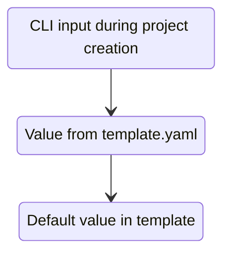

# BoilerGen

BoilerGen creates files from reusable templates and injects necessary code (e.g. imports, registrations) directly into your project — without breaking existing code.

No more manual integration steps. No more forgotten imports. Just working boilerplate.

## Setup

1. Run `pip install boilergen` 
2. [Set up your first templates](https://github.com/HumanBot000/BoilerGen?tab=readme-ov-file#templates)  
3. Fill in the location of your templates in the config file. (can be found via `boilergen config`)
4. Run `boilergen create` and follow the instructions.
→ All available commands can be accessed by `boilergen --help`.


## Templates

Templates are pre-defined code snippets that can be reused across multiple projects with the same tech stack.  
If you already have a boilerplate repository, you may need to edit some snippets to follow [BoilerGen's tagging rules](https://github.com/HumanBot000/BoilerGen?tab=readme-ov-file#tagging).

Templates are configured in the `boilergen/templates` directory and can be grouped into multiple subgroups [(see examples)](https://github.com/HumanBot000/BoilerGen/tree/master/boilergen/templates).

## Template.yaml
Each template needs a `template.yaml` file for its Template Definition.
We highly encourage you to take a look at the  [(Example Template repository)](https://github.com/HumanBot000/boilergen-templates).
Otherwise, here is a quick breakdown:
```yaml
id: flask  
label: "Flask Base App"  
requires: [example]  
config:  
  debug: True  
  port: 5000
```
### Fields
| id       	| The technical identifier for this template (Must be unique across all Templates)                                                           	|
|----------	|--------------------------------------------------------------------------------------------------------------------------------------------	|
| label    	| The human-readable name of this Template (This will be shown in the Template browser)                                                      	|
| requires 	| List of templates this template relies on (dependence management). This will be needed for injections. Use the `id` field of the template. 	|
| config   	| A Map of default values for [boilergen configurations](https://github.com/HumanBot000/BoilerGen?tab=readme-ov-file#configurations)                                                                                       	|
## Tagging

Often, multiple code snippets depend on each other and can't simply be copy-pasted and expected to work (e.g., special API routes need to be registered in the main API definition before startup). To simplify this process, BoilerGen uses a tagging system to automatically adjust your code.

```python
# <<boilergen:imports
from flask import Flask  
# boilergen:imports>>
```

> Depending on your language of choice, you may need to edit the [comment syntax](https://gist.github.com/dk949/88b2652284234f723decaeb84db2576c). BoilerGen will comply with this, but the core syntax remains the same.

### Tagging Syntax Explained

- `<<` indicates an opening tag.
- `>>` indicates a closing tag.
- The comment contains the keyword `boilergen`, identifying it as a special tag.
- After `boilergen`, a colon `:` and a unique identifier (e.g., `imports`) must follow.
- Everything between the tag lines is the tag's content and will be used for code injection.
> ⚠️ Tag opening and closing definitions **may not happen inline**. They need their own line with with no additional syntax.
>
> ⚠️ You **must not** use this exact syntax (`<<boilergen:...>>`) in any context not intended for BoilerGen. Doing so will corrupt your template.
>
> ⚠️ Identifiers must be unique **within** a template. We strongly recommend aslo keeping them unique **across** all templates to avoid confusion.

Example of unique identifiers:
```text
boilergen:main-template_imports
boilergen:main-template_routes
```
---

## Configurations

To simplify simple variations between projects (e.g., changing the app name or enabling debug mode), templates support configurable variables. These can be set in a `template.yaml` file or supplied interactively during `boilergen create`.

```python
debug = bool("boilergen:config | debug | True")
```

### Configuration Syntax Explained

- Follows the same general structure as tagging.
- Does **not** require a unique identifier after the colon.
- The format is:  
  `boilergen:config | config_name | default_value`
- The `default_value` is optional, but must be provided at some point.

Example:
```python
app.run(
    host='boilergen:config | IP | "0.0.0.0"',
    port="boilergen:config | port",
    debug=debug
)
```

> In this example:
> - `host` will be parsed as a `str ("0.0.0.0")` .
> - `debug` is already parsed using `bool(...)` above

We **strongly recommend** not placing configuration tags inside **inline comments**, as this may break the syntax highlighting and parsing in your language-specific editor or runtime. BoilerGen tries to **verify data types**, but we **strongly recommend** accepting them as **Strings** and parsing them individually, depending on your language,

---

### Configuration Precedence

The order of precedence for resolving configuration values is:


## Injections
Injections are a way to specify insertion/editing operations to files of foreign Templates.

### Defining Injections
Injection definitions are located inside a special `injections;` folder at the parent level.
```
boilergen/
├── templates/
│   ├── base-template/
│   │   ├── template.yaml
│   │   └── template/
│   │       └── api/
│   │           └── test-file.txt
│   └── test-template/
│       ├── injections/
│       │   ├── data-file1.txt
│       │   ├── data-file2.txt
│       │   └── injections.yaml
│       ├── template/
│       └── template.yaml
```

Generally you define injections in the extending template, not the base template. 

#### injections.yaml
This File lays out a structure on how the injection behaves.
```yaml
injections:  
  - target: base
    at:  
      file: api/test-file.txt
      tag: start
    method:  
      insert:  
        - bottom  
    from: data-file1.txt
  
  - target: base
    at:  
      file: api/test-file.txt
      tag: main
    method:  
      replace:
    from: data-file2.txt
```
This setup takes the whole content of `data-file1.txt` and inserts right before the closing definition of the "start" tag at `api/test-file.txt` inside the base template. It does the same for data-file2.txt but replaces the whole "main" section of the file.

##### Fields
| name      	| description                                                                          	| note                                                                       	| possible values           	|
|-----------	|--------------------------------------------------------------------------------------	|----------------------------------------------------------------------------	|---------------------------	|
| at        	| The relative path to the file to inject into                                         	| This must be defined inside the `requires` part of the template.yaml file. 	|                           	|
| tag       	| The identifier of the tag to inject into                                             	| Can't be used alongside `line` in the same injection.                      	|                           	|
| line      	| A single integer describing the line the injection affects                           	| Can't be used alongside `tag` in the same injection.                       	|                           	|
| method    	| what to do with the current tag content                                              	|                                                                            	| insert, replace           	|
| -> insert 	| Where to insert the new content                                                      	| Can only be used when method is `insert`                                   	| above, below, top, bottom 	|
| from      	| The relative path to the file inside the injecting template to pull the content from 	|                                                                            	|                           	|

## Hooks
Hooks are a way to specify operations to be executed on specific times during the project generation process.

### Defining Hooks
Hooks are configured in the `boilergen/hooks` directory. The file name specifies the event the hook is triggered on.
Currently supported events are:
- `pre-generation.txt`
- `post-generation.txt`

Inside those files, you can define shell commands to be executed. Each command is separated by a newline. The execution order is top to bottom.
