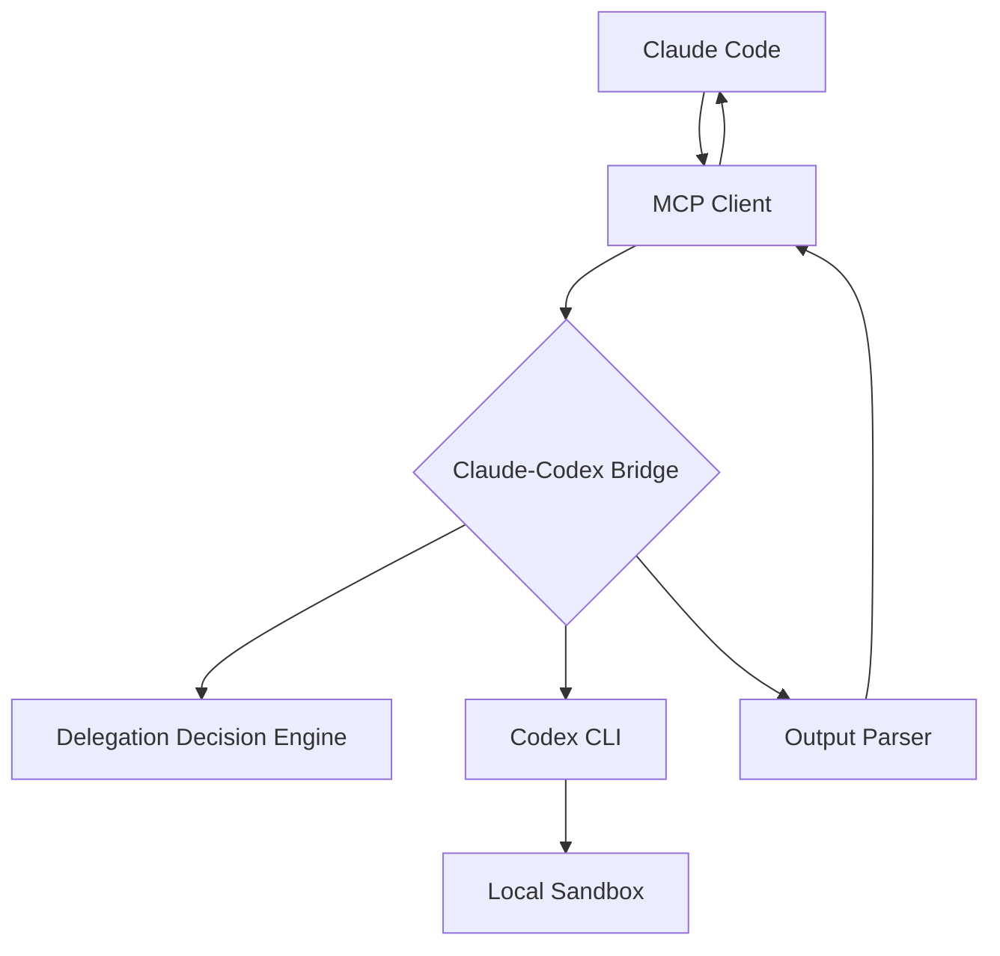

# Claude-Codex Bridge

An intelligent **MCP (Model Context Protocol) server** that leverages Codex's exceptional capabilities in **code analysis, architectural planning, and complex problem-solving**.

## Screenshots


## Philosophy: Think First, Execute Later

Claude-Codex Bridge embraces a **planning-first approach** to software development. Codex's true strength lies not in blindly executing changes, but in:

- 🧠 **Deep Understanding**: Comprehending complex code relationships and patterns
- 📊 **Strategic Analysis**: Identifying optimization opportunities and architectural insights
- 🎯 **Thoughtful Planning**: Designing robust, well-considered solutions
- ✅ **Quality Assurance**: Reviewing code for best practices, security, and performance

### Why Read-Only by Default?

1. **Safety First**: Prevent accidental modifications during code exploration
2. **Better Decisions**: Encourage thorough analysis before making changes
3. **Learning Tool**: Understand the "why" behind recommendations, not just the "what"
4. **Audit Trail**: Clear separation between planning and execution phases


## Project Overview

Claude-Codex Bridge is an **Intelligent Analysis Engine** that orchestrates task delegation between Claude Code and locally running OpenAI Codex CLI. Rather than a simple code generator, it's a sophisticated planning and analysis system with security validation and read-only safety defaults.

## Technical Architecture



### Component Overview

1. **MCP Server**: High-performance server based on FastMCP, providing standardized tool interfaces
2. **Delegation Decision Engine (DDE)**: Intelligently analyzes tasks and determines optimal execution strategies
3. **Output Parser**: Intelligently identifies and formats Codex output into structured data

## Quick Start

### Prerequisites

1. **Python 3.11+**
2. **OpenAI Codex CLI**: `npm install -g @openai/codex`

### Installation

#### From PyPI (Recommended)

```bash
pip install claude-codex-bridge
```

### Starting the Server

The server supports two operational modes:

#### 📋 Planning Mode (Default - Recommended)
Start in read-only mode for safe code analysis and planning:

**Using Python module:**
```bash
python -m claude_codex_bridge
```

#### ⚡ Execution Mode (When Ready to Apply Changes)
Enable write operations when you're ready to implement Codex's recommendations:

**Using Python module:**
```bash
python -m claude_codex_bridge --allow-write
```

#### Command-Line Options
- `--allow-write`: Enable file modification operations (default: read-only)
- `--legacy-cmd`: Use legacy Codex CLI backend (`codex exec`). By default the bridge
  uses the Codex MCP backend.
- `--verbose`: Enable verbose output for debugging

### Claude Code Integration

#### 1. Configure MCP Server
You can configure separate servers for planning and execution modes:

**Planning Mode (Default):**
```bash
# In your project directory - for safe analysis and planning
claude mcp add codex-planning --command "claude-codex-bridge" --scope project
```

**Execution Mode:**
```bash
# In your project directory - for applying changes
claude mcp add codex-execution --command "claude-codex-bridge --allow-write" --scope project
```

**Or use the example configuration file:**
```bash
# Copy the example configuration
cp .mcp.json.example .mcp.json
# Edit to match your setup
```

## Main Tools

### `codex_delegate`

Leverage Codex's advanced analytical capabilities for code comprehension and strategic planning.

**Codex Specializes In**:
- 🔍 Analyzing complex codebases and identifying improvement opportunities
- 🏗️ Designing architectural solutions and refactoring strategies
- 📋 Planning implementation approaches for new features
- 🧪 Generating comprehensive test strategies
- ⚡ Reviewing code for quality, security, and performance issues

**Parameters**:
- `task_description` (required): Describe what you want Codex to analyze or plan
- `working_directory` (required): Project directory to analyze
- `execution_mode` (optional): Approval strategy (default: on-failure)
- `sandbox_mode` (optional): File access mode (forced to read-only unless --allow-write)
- `output_format` (optional): How to format the analysis results (diff/full_file/explanation)
- `task_complexity` (optional): Model reasoning effort (low/medium/high)
- Codex CLI invocations time out after **1 hour** by default to support long-running analyses

**Planning Mode Example**:
```json
{
  "task_description": "Analyze the user authentication system for security vulnerabilities and design improvement strategies",
  "working_directory": "/Users/username/my-project",
  "execution_mode": "on-failure",
  "sandbox_mode": "read-only",
  "output_format": "explanation",
  "task_complexity": "medium"
}
```

**Execution Mode Example**:
```json
{
  "task_description": "Implement the security improvements we planned for the authentication system",
  "working_directory": "/Users/username/my-project",
  "execution_mode": "on-failure",
  "sandbox_mode": "workspace-write",
  "output_format": "diff",
  "task_complexity": "high"
}
```
 

## Version History

### v0.1.3
- 🔄 **Default Codex MCP Backend**: Switch from CLI to MCP backend by default with `--legacy-cmd` fallback option
- 🛡️ **Enhanced Security**: Read-only sandbox mode as default, explicit `--allow-write` required for file modifications
- 🎯 **Robust Output Extraction**: New wrapper-style delimiter system with configurable start/end delimiters and strict mode support
- ⚙️ **New CLI Options**: Added `--legacy-cmd` flag for backward compatibility with CLI backend
- 🔧 **Extended Tool Parameters**: New `final_output_start_delimiter`, `final_output_end_delimiter`, `final_output_strict`, and `request_id` parameters for enhanced control
- 📊 **Dynamic Tool Descriptions**: Tool descriptions now adapt to current write permissions for precise guidance
- 🎨 **Format-Specific Prompts**: Automatic injection of format-specific prompt preambles for better model responses
- 🔒 **Enforced Security Defaults**: Operation mode notices when overriding to planning mode (read-only)
- 🛠️ **Improved Content Detection**: Better content-type detection applied after wrapper extraction
- 🧹 **Architecture Cleanup**: Complete removal of cache subsystem for simplified, more reliable operation
- ⚠️ **Breaking Changes**: Default sandbox mode changed from `workspace-write` to `read-only`, cache-related tools and response fields removed
- ❌ **Removals**: Cache subsystem, cache tests, cache environment variables, and cache-related MCP tools completely removed

### v0.1.2
- 🆕 Support specifying task complexity when invoking Codex
- ⏱️ Increase default timeout to 1 hour for Codex CLI operations

### v0.1.1
- 🔄 Version update and maintenance release

### v0.1.0
- ✅ Basic MCP server implementation
- ✅ Codex CLI integration
- ✅ Delegation Decision Engine
- ✅ Result caching system
- ✅ Security validation mechanism

## License

MIT License - see [LICENSE](LICENSE) file for details

## Support

For questions or suggestions, please create a GitHub Issue or contact the maintainers.

---

**Claude-Codex Bridge** - Making AI agent collaboration smarter 🚀
