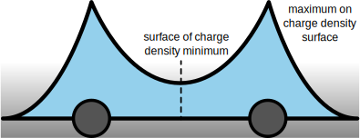

======================
Bader Charge Analysis
======================

Richard Bader's Quantum Theory of Atoms in Molecules (QTAIM) separates regions
of space into atoms using 2D surfaces of zero flux.

QTAIM can be used to identify Bader volumes in which charge density can be
attributed to an atom. The |bader|_ code developed by the Henkelman Group
([TSH09]_, [SKSH09]_, [HAJ06]_, [YT11]_)  can be used to perform Bader charge
analysis (BCA) using the output of a VASP or Gaussian calculation. Follow the
instructions for how to appropriately set up these calculations and generate
the `ACF.dat` file. For a VASP calculation, the following script is a good
starting point:

.. code:: python

    from ase.calculators.vasp import vasp
    from ase.build import molecule

    atoms = molecule('HOCl', vacuum=10, pbc=True, tags=[0, 1, 1])
    calc = Vasp(
        algo="all",
        encut=450,
        gga='PE',
        gamma=False,
        isearch=1,
        ismear=0,
        ispin=2,
        ivdw=12,
        kpts=(1, 1, 1),
        kpar=4,
        laechg=True,
        prec='Accurate',
    )
    atoms.calc = calc
    atoms.get_potential_energy()

``ccu`` wraps functionality from :external:doc:`ASE's attach_charges() <ase/dft/bader>` to
analyze BCA data from the `ACF.dat` file. The `ccu pop bader-sum` subcommand
can be used to calculate net atomic charges for user-defined moieties:

.. code:: shell

    $ ccu pop bader-sum --atoms final.traj --sort-file ase-sort.dat 0 1
    [0, 1]: ...
    $ ccu pop bader-sum --atoms final.traj --smart-mode --sort-file ase-sort.dat
    0: ...
    1: ...

.. [TSH09] W. Tang, E. Sanville, and G. Henkelman A grid-based Bader analysis algorithm without
    lattice bias, J. Phys.: Condens. Matter 21, 084204 (2009).

.. [SKSH09] E. Sanville, S. D. Kenny, R. Smith, and G. Henkelman An improved grid-based algorithm for
    Bader charge allocation, J. Comp. Chem. 28, 899-908 (2007).

.. [HAJ06] G. Henkelman, A. Arnaldsson, and H. Jónsson, A fast and robust algorithm for Bader decomposition
    of charge density, Comput. Mater. Sci. 36, 354-360 (2006).

.. [YT11] M. Yu and D. R. Trinkle, Accurate and efficient algorithm for Bader charge integration, J. Chem.
    Phys. 134, 064111 (2011).

.. |bader| replace:: ``bader``
.. _bader: https://theory.cm.utexas.edu/henkelman/research/bader/
