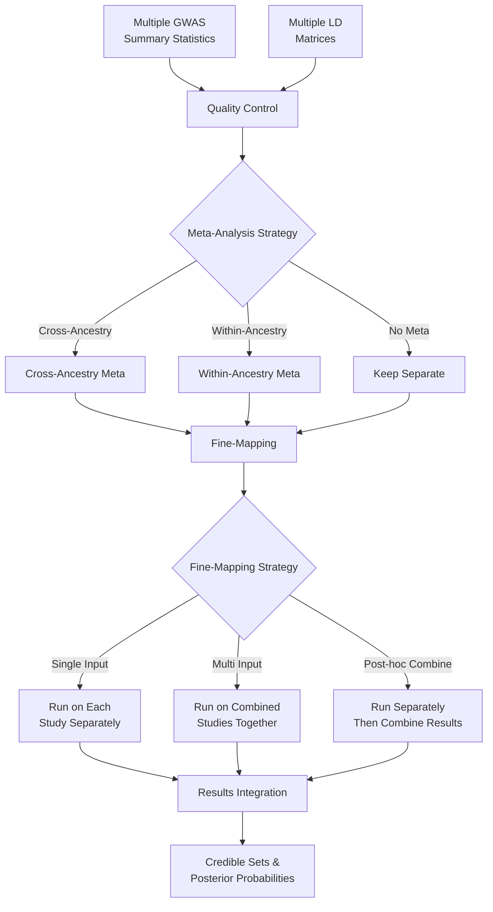

# Getting Started

## What is CREDTOOLS?

CREDTOOLS (Credible Set Tools) is a comprehensive pipeline for performing statistical fine-mapping analysis across multiple ancestries and cohorts. It provides a unified framework for:

- **Quality Control**: Assess the reliability of summary statistics and LD matrices
- **Meta-Analysis**: Combine data across populations and cohorts  
- **Fine-Mapping**: Identify causal variants using multiple statistical methods
- **Post-Processing**: Combine and interpret results across studies

## The CREDTOOLS Framework

CREDTOOLS's workflow can be visualized as follows:

## Input Data

CREDTOOLS works with two main types of input data:

- **Summary Statistics**: GWAS results containing effect sizes, standard errors, and p-values
- **LD Matrices**: Linkage disequilibrium correlation matrices from reference panels

## Meta-analysis Methods

CREDTOOLS supports three meta-analysis approaches:

- **`meta_all`**: Combine all studies regardless of ancestry
- **`meta_by_population`**: Combine studies within each ancestry separately  
- **`no_meta`**: Keep all studies separate

## Fine-mapping Strategies

CREDTOOLS offers three complementary fine-mapping strategies:

- **Single Input** (`single_input`)
: Use traditional fine-mapping tools that analyze one study at a time
: Best for: Well-powered single studies, ancestry-specific analysis

- **Multi Input** (`multi_input`)  
: Use tools designed to analyze multiple studies simultaneously
: Best for: Leveraging shared causal architecture across populations

- **Post-hoc Combine** (`post_hoc_combine`)
: Run single-input tools on each study, then combine results
: Best for: Maximum flexibility and interpretability

## Quality Control

CREDTOOLS provides comprehensive QC including:

- **Consistency checks**: Kriging RSS to detect allele switches
- **LD structure**: Eigenvalue decomposition and 4th moment analysis  
- **Cross-study comparisons**: Cochran's Q test for heterogeneity
- **Frequency comparisons**: MAF consistency across studies

## Output Files

CREDTOOLS generates:

- **Credible sets**: Sets of variants likely to contain causal variants
- **Posterior inclusion probabilities (PIPs)**: Individual variant probabilities
- **QC reports**: Detailed quality control metrics
- **Meta-analysis results**: Combined summary statistics and LD matrices

## When to Use CREDTOOLS

!!! tip "Use Cases"
    
    **Multi-ancestry studies**
    : Leverage power across populations while accounting for LD differences
    
    **Multiple cohorts per ancestry**  
    : Combine studies within ancestry groups for increased power
    
    **Heterogeneous effect sizes**
    : Use post-hoc combination to preserve ancestry-specific signals
    
    **Quality control focus**
    : Extensive QC metrics help identify problematic data

!!! warning "Considerations"
    
    - Requires matched summary statistics and LD matrices
    - Computational requirements scale with number of studies
    - Some tools require specific data formats or parameter tuning

## Next Steps

Now that you understand the CREDTOOLS framework, let's jump into a practical example:

👉 **[Quick Start Guide](quick-start.md)** - Run your first CREDTOOLS analysis

Or explore specific scenarios:

- [Single-Input Fine-Mapping](single-input.md) for single-study analysis
- [Multi-Input Fine-Mapping](multi-input.md) for multi-study analysis 