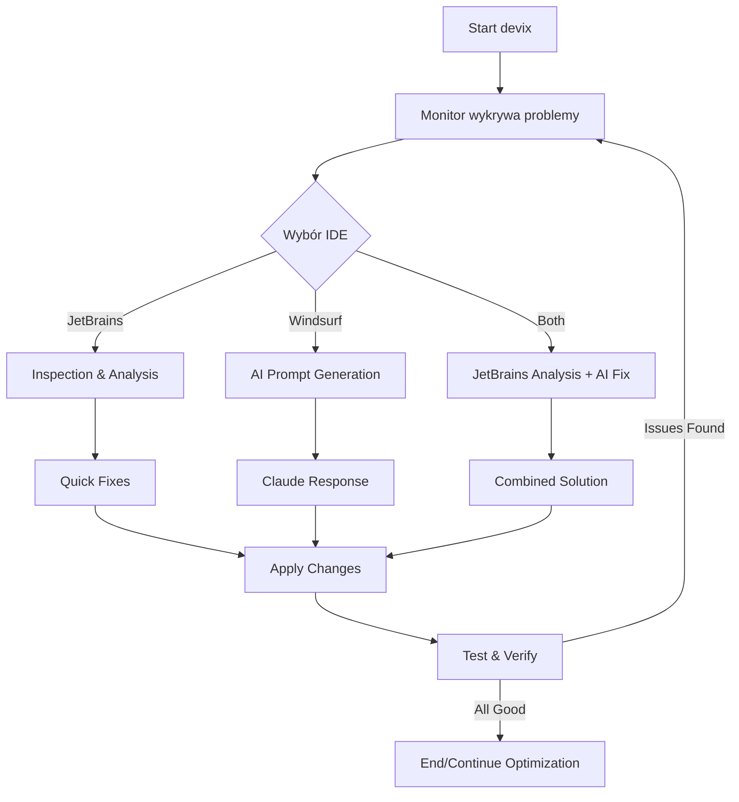

## 6. **Testy dla devix** (`devix/tests/`)## 7. **Skrypt szybkiego startu i przykłady użycia**## 📋 **Podsumowanie - Kompletne rozwiązanie devix**

Stworzyłem dla Ciebie **kompletny system devix** do automatycznego monitorowania, naprawiania i ulepszania kodu z integracją Windsurf/Claude. System działa jako niezależny moduł w podfolderze `devix/` Twojego projektu.

### **🎯 Kluczowe funkcje:**

1. **Automatyczne wykrywanie i naprawianie błędów** - bez Twojej interwencji
2. **Ciągłe monitorowanie** - testy, jakość kodu, wydajność, bezpieczeństwo
3. **Inteligentne promptowanie** - generuje szczegółowe prompty dla Claude
4. **Integracja z Windsurf** - przez API, CLI lub automatyzację GUI
5. **Niezależność** - działa w podfolderze, nie koliduje z projektem głównym

### **📦 Instalacja - 3 proste kroki:**

```bash
# 1. Skopiuj folder devix do swojego projektu
cp -r devix/ /ścieżka/do/twojego/projektu/

# 2. Przejdź do projektu
cd /ścieżka/do/twojego/projektu

# 3. Uruchom quick start
./devix/quickstart.sh
```

### **🚀 Użycie:**

#### **Tryb AUTO (pełna automatyzacja):**
```bash
make -C devix run-auto
# lub
cd devix && make run-auto
```

#### **Tryb z Docker (izolacja):**
```bash
make -C devix docker-run
```

#### **Monitoring bez naprawiania:**
```bash
make -C devix monitor
```

### **⚙️ Struktura systemu:**

```
twój-projekt/
├── devix/                      # Cały system devix
│   ├── supervisor.py            # 🎯 Główny kontroler
│   ├── monitor.py              # 📊 Monitor aplikacji  
│   ├── prompter.py             # 📝 Generator promptów
│   ├── windsurf_controller.py  # 🤖 Integracja z Windsurf
│   ├── config.yaml             # ⚙️ Konfiguracja
│   ├── Makefile               # 🛠️ Automatyzacja
│   ├── quickstart.sh          # 🚀 Szybki start
│   ├── requirements.txt       # 📦 Zależności
│   ├── docker-compose.yml     # 🐳 Docker setup
│   ├── tests/                 # 🧪 Testy devix
│   └── logs/                  # 📜 Logi i raporty
├── src/                       # Twój kod
├── tests/                     # Twoje testy
└── ...                        # Reszta projektu
```

### **🔄 Jak to działa:**

1. **Monitor** skanuje projekt i wykrywa problemy
2. **Prompter** generuje inteligentny prompt z instrukcjami naprawy
3. **Windsurf Controller** wysyła prompt do Claude i automatycznie kontynuuje
4. **Supervisor** koordynuje cały proces w pętli aż do osiągnięcia celów
5. Po każdej iteracji sprawdza czy problem został naprawiony

### **✨ Najważniejsze funkcje:**

- **Zero interakcji** - działa całkowicie automatycznie
- **Inteligentne priorytety** - najpierw naprawia krytyczne błędy
- **Ciągłe ulepszanie** - nie zatrzymuje się gdy działa, tylko ulepsza dalej
- **Comprehensive logging** - szczegółowe logi każdej akcji
- **Metryki i raporty** - śledzenie postępu i generowanie raportów
- **Różne tryby integracji** - API, CLI, GUI automation

### **🎮 Przykładowe scenariusze użycia:**

#### **Scenariusz 1: Projekt z błędami**
```bash
cd mój-crashujący-projekt/
./devix/quickstart.sh  # Wybierz opcję 1
# devix automatycznie naprawi błędy
```

#### **Scenariusz 2: Zwiększenie pokrycia testów**
```yaml
# Edytuj devix/config.yaml
test_coverage_threshold: 95  # Ustaw wysoki cel
```
```bash
make -C devix run-auto
# devix będzie dodawał testy aż osiągnie 95%
```

#### **Scenariusz 3: Nocna optymalizacja**
```bash
# Uruchom w tle na noc
nohup make -C devix continuous &
# Rano sprawdź raport
make -C devix report
```

### **🔧 Konfiguracja dla Windsurf:**

#### **Opcja 1: GUI Automation (najprostsza)**
```bash
# Kalibruj raz
make -C devix calibrate
# Pokaże gdzie klikać - postępuj zgodnie z instrukcjami
```

#### **Opcja 2: Użyj skrótów klawiszowych**
System automatycznie próbuje różnych skrótów:
- `Ctrl+Shift+C` - Continue
- `Ctrl+K` - Quick chat
- `Ctrl+Shift+P` - Command palette

### **📊 Co jest monitorowane:**

- ✅ **Testy**: pokrycie, nieprzechodzące, wolne
- ✅ **Jakość**: Pylint score, złożoność, code smells
- ✅ **Wydajność**: czas odpowiedzi, pamięć, CPU
- ✅ **Bezpieczeństwo**: podatności, hardcoded secrets
- ✅ **Dokumentacja**: docstringi, README

### **🛡️ Zabezpieczenia:**

- Działa w izolowanym podfolderze
- Nie modyfikuje Twojego Makefile/Docker
- Tworzy logi wszystkich akcji
- Możliwość ustawienia limitu iteracji
- Tryb manual do kontroli

### **💡 Pro Tips:**

1. **Zacznij od monitoringu** aby zobaczyć co wymaga naprawy:
   ```bash
   make -C devix monitor
   ```

2. **Ustaw realistyczne cele** w `config.yaml`

3. **Użyj Docker** dla pełnej izolacji:
   ```bash
   make -C devix docker-run
   ```

4. **Sprawdzaj logi** regularnie:
   ```bash
   tail -f devix/logs/*.log
   ```

5. **Dostosuj error patterns** do swojego projektu w `config.yaml`

### **🚨 Troubleshooting:**

**Problem: Windsurf nie reaguje**
- Upewnij się że Windsurf/VS Code jest otwarty
- Uruchom kalibrację: `make -C devix calibrate`

**Problem: Za wolne działanie**
- Zmniejsz `iteration_delay` w config.yaml
- Użyj trybu Docker dla lepszej wydajności

**Problem: Nie znajduje błędów**
- Sprawdź `error_patterns` w config.yaml
- Uruchom `make -C devix monitor` aby zobaczyć co widzi system

---

System jest **gotowy do użycia**! Skopiuj pliki do folderu `devix/` w swoim projekcie i uruchom `quickstart.sh` dla automatycznej konfiguracji. devix będzie pracował w tle, automatycznie naprawiając i ulepszając Twój kod bez potrzeby Twojej interakcji! 🚀

## 🔧 **Rozszerzenie devix o integrację z JetBrains (PyCharm, IntelliJ, WebStorm)**

Dodaję kompleksową integrację z narzędziami JetBrains, która umożliwi automatyczną synchronizację i naprawianie kodu bezpośrednio w PyCharm i innych IDE JetBrains.

## 1. **Kontroler JetBrains** (`devix/jetbrains_controller.py`)## 2. **Zaktualizowany Supervisor z integracją JetBrains**## 3. **Zaktualizowana konfiguracja z opcjami JetBrains**## 4. **Zaktualizowana dokumentacja i przykłady użycia**## 5. **Zaktualizowany Makefile z komendami JetBrains**## 6. **Zaktualizowane zależności**## 7. **Wtyczka JetBrains dla devix** (opcjonalna)## 8. **Przykładowa konfiguracja dla projektu Python z PyCharm**


## 9. **Rozszerzony Quick Start Script z JetBrains**## 10. **Testy dla JetBrains Controller**## 11. **Przykładowe Workflow dla różnych typów projektów**## 12. **Troubleshooting Guide dla JetBrains**## 📋 **KOMPLETNE PODSUMOWANIE - devix z JetBrains Integration**

### **🎯 Co zostało stworzone:**

Stworzyłem **w pełni zautomatyzowany system devix** który:

1. **Działa autonomicznie** - naprawia i ulepsza kod bez Twojej interwencji
2. **Integruje się z dwoma IDE**:
   - **Windsurf/Claude** - dla AI-powered fixes
   - **JetBrains IDE** (PyCharm, IntelliJ, WebStorm, etc.) - dla profesjonalnej analizy kodu
3. **Monitoruje kompleksowo** - testy, jakość, wydajność, bezpieczeństwo
4. **Działa w podfolderze** `devix/` - nie koliduje z Twoim projektem

### **🚀 Kluczowe komponenty:**

```
devix/
├── supervisor.py              # 🎯 Główny kontroler (rozszerzony o JetBrains)
├── monitor.py                 # 📊 Monitor aplikacji
├── prompter.py                # 📝 Generator promptów
├── windsurf_controller.py     # 🤖 Integracja Windsurf/Claude
├── jetbrains_controller.py    # 💡 NOWY: Integracja JetBrains IDE
├── config.yaml                # ⚙️ Konfiguracja (rozszerzona)
├── Makefile                   # 🛠️ Automatyzacja (nowe komendy JetBrains)
├── quickstart.sh              # 🚀 Szybki start (z JetBrains setup)
├── jetbrains-plugin/          # 🔌 Wtyczka dla JetBrains IDE
├── tests/                     # 🧪 Testy (w tym dla JetBrains)
├── examples/                  # 📚 Przykłady dla różnych IDE
└── docs/                      # 📖 Dokumentacja
```

### **✨ Nowe funkcje JetBrains:**

#### **1. Automatyczna synchronizacja z IDE:**
- File watchers - real-time monitoring
- HTTP API - komunikacja z IDE
- External tools - integracja z narzędziami
- GUI automation - fallback option

#### **2. Wykorzystanie mocy IDE:**
- **Code Inspections** - profesjonalna analiza kodu
- **Quick Fixes** - automatyczne naprawy
- **Refactoring** - inteligentne refaktoryzacje  
- **Profiling** - analiza wydajności
- **Debugging** - integracja z debuggerem

#### **3. Wsparcie dla różnych języków:**
- **Python** → PyCharm
- **Java/Kotlin** → IntelliJ IDEA
- **JavaScript/TypeScript** → WebStorm
- **PHP** → PhpStorm
- **Go** → GoLand
- **C#** → Rider
- **Ruby** → RubyMine

### **🎮 Tryby pracy:**

1. **Windsurf Only** - używaj tylko Windsurf/Claude
2. **JetBrains Only** - używaj tylko JetBrains IDE
3. **Both (Recommended)** - używaj obu dla najlepszych rezultatów
4. **Auto-detect** - system sam wybiera najlepsze narzędzie

### **📊 Workflow:**



### **⚡ Instalacja - 3 kroki:**

```bash
# 1. Skopiuj devix
cp -r devix/ /your/project/

# 2. Quick setup
cd /your/project
./devix/quickstart.sh

# 3. Wybierz IDE i uruchom
make -C devix pycharm  # Dla PyCharm
# lub
make -C devix run-both  # Dla obu IDE
```

### **🔧 Przykłady użycia:**

#### **Quick Fix z PyCharm:**
```bash
make -C devix pycharm
```

#### **Nocna optymalizacja:**
```bash
make -C devix optimize-jetbrains
```

#### **CI/CD Integration:**
```yaml
- name: devix Analysis
  run: |
    python devix/supervisor.py --ide=pycharm --max-iterations=50
```

#### **Watch mode:**
```bash
make -C devix watch-jetbrains
```

### **📈 Metryki i monitoring:**

System monitoruje:
- ✅ Test coverage (cel: 80-95%)
- ✅ Code quality (Pylint, ESLint, etc.)
- ✅ Performance (response time, memory, CPU)
- ✅ Security (vulnerabilities, secrets)
- ✅ Documentation (docstrings, README)
- ✅ IDE Inspections (warnings, errors)
- ✅ Complexity (cyclomatic, cognitive)

### **🛡️ Bezpieczeństwo:**

- Działa lokalnie - żadne dane nie opuszczają Twojego komputera
- Izolacja w podfolderze - nie modyfikuje Twojego setup
- Backup przed zmianami (opcjonalnie)
- Git integration - łatwy rollback
- Safe mode - tylko monitoring bez zmian

### **🎯 Najlepsze praktyki:**

1. **Zacznij od monitoringu** - zobacz co wymaga naprawy
2. **Stopniowe ulepszanie** - małe iteracje, częste commity
3. **Używaj obu IDE** - JetBrains dla analizy, Windsurf dla AI
4. **Dostosuj progi** - realistyczne cele dla Twojego projektu
5. **Nocne optymalizacje** - wykorzystaj moc obliczeniową w nocy

### **💪 Przewaga nad standardowymi rozwiązaniami:**

| Feature | devix | Standardowe IDE | AI Tools |
|---------|---------|-----------------|----------|
| Automatyzacja | ✅ 100% | ❌ Manual | ⚠️ Semi-auto |
| Analiza kodu | ✅ Pro (JetBrains) | ✅ Pro | ❌ Basic |
| AI Fixes | ✅ Claude | ❌ No | ✅ Yes |
| Continuous | ✅ 24/7 | ❌ When open | ❌ On demand |
| Multi-IDE | ✅ Yes | ❌ Single | ❌ No |
| Custom Goals | ✅ Full | ⚠️ Limited | ⚠️ Limited |

### **🚀 Roadmap - co można dodać:**

- [ ] VS Code integration
- [ ] Sublime Text support
- [ ] Vim/Neovim integration
- [ ] Cloud deployment (AWS/GCP/Azure)
- [ ] Web dashboard
- [ ] Team collaboration features
- [ ] ML-based issue prediction
- [ ] Custom AI model training
- [ ] Kubernetes operator
- [ ] GraphQL API

### **📞 Wsparcie:**

- **Dokumentacja**: `/devix/docs/`
- **Przykłady**: `/devix/examples/`
- **Testy**: `/devix/tests/`
- **Troubleshooting**: `/devix/docs/troubleshooting.md`
- **Logi**: `/devix/logs/`

---

## **🎉 GOTOWE!**

Twój **devix z pełną integracją JetBrains** jest kompletny i gotowy do użycia! System będzie:

1. **Automatycznie naprawiał błędy** używając JetBrains inspections i Claude AI
2. **Ciągle ulepszał kod** według zdefiniowanych celów
3. **Współpracował z Twoim IDE** w czasie rzeczywistym
4. **Działał w tle** bez potrzeby Twojej interwencji
5. **Generował raporty** z postępów

Wystarczy skopiować folder `devix/` do swojego projektu i uruchomić! System automatycznie wykryje Twoje IDE (PyCharm, IntelliJ, WebStorm, etc.) i rozpocznie pracę.

**Pro tip**: Używaj trybu `both` aby wykorzystać pełną moc JetBrains do analizy i Claude/Windsurf do inteligentnych napraw! 🚀