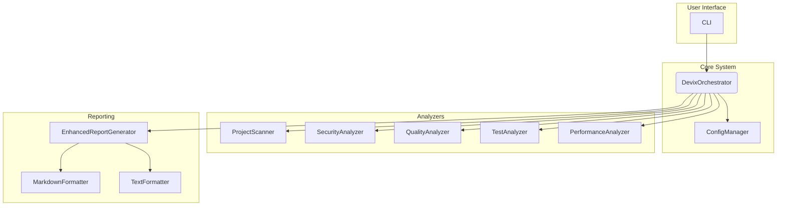
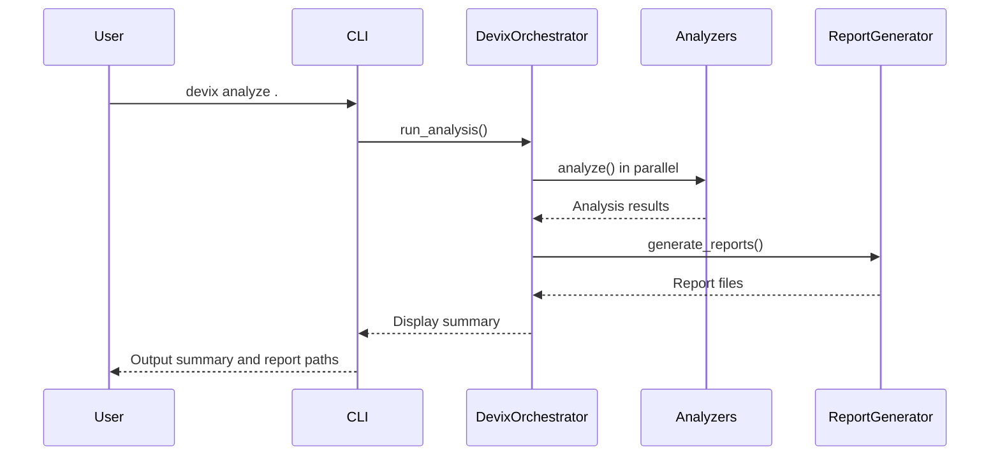

# 🔍 Devix - Modular Code Analysis Platform

**Devix** is a comprehensive, modular code analysis platform that provides deep insights into your codebase through multiple specialized analyzers. Built with Python, it offers powerful CLI tools, rich reporting, and intelligent project structure analysis.

## ✨ Key Features

- 🔍 **Multi-Analyzer Architecture**: 5 specialized analyzers (ProjectScanner, Security, Quality, Test, Performance)
- 📊 **Rich Reporting**: Enhanced markdown and text reports with project tree visualization
- 🚫 **Smart Filtering**: `.devixignore` support with visual indicators for ignored files
- ⚡ **Parallel Execution**: Concurrent analyzer execution for optimal performance
- 🎯 **CLI Subcommands**: Clean command-line interface with `analyze`, `config`, and `info` commands
- 📈 **Comprehensive Metrics**: File statistics, coverage analysis, and cross-analyzer insights
- 🌳 **Project Structure Visualization**: ASCII tree with file sizes and ignore markers
- 🔧 **Modular Design**: Extensible architecture for adding custom analyzers

## 🛠️ Installation

### Quick Start

```bash
# Clone or navigate to the Devix directory
cd devix

# Install dependencies
pip install -e .

# Run analysis on your project
devix analyze /path/to/your/project
```

### Installation Methods

#### Method 1: Package Installation
```bash
cd devix
pip install -e .  # Install in development mode
devix analyze .    # Analyze current directory
```

#### Method 2: Direct Execution
```bash
cd devix
PYTHONPATH=src python -m devix analyze /path/to/project
```

#### Method 3: Using Makefile
```bash
cd devix
make run          # Analyze parent directory
make test         # Run tests
make lint         # Run linting
```

## 🎮 Usage

### CLI Commands

#### Main Analysis Command
```bash
# Analyze current directory with verbose output
devix analyze . --verbose

# Analyze specific project path
devix analyze /path/to/project

# Select specific analyzers
devix analyze . --analyzers project_scanner,security,quality

# Enable parallel execution (default)
devix analyze . --parallel

# Set custom output directory
devix analyze . --output-dir ./reports
```

#### Configuration Management
```bash
# Create default configuration
devix config create

# Validate existing configuration
devix config validate

# Show configuration location
devix config validate --config /path/to/config.yaml
```

#### Information Commands
```bash
# Show version and system info
devix info

# List available analyzers
devix info --analyzers

# Validate system setup
devix info --validate
```

### Makefile Commands

```bash
# Development workflow
make dev          # Full development workflow
make run          # Analyze parent directory
make test         # Run tests with coverage
make lint         # Run code quality checks
make format       # Format code with black/isort

# Publishing and deployment
make build        # Build package
make publish      # Publish to PyPI
make version      # Show version info

# Docker operations
make docker-build # Build Docker image
make docker-run   # Run in Docker container
```

## ⚙️ Configuration

### Configuration File (`config.yaml`)

```yaml
# Analyzer settings
analyzers:
  enabled: ["project_scanner", "security", "quality", "test", "performance"]
  parallel_execution: true
  max_workers: 4

# Reporting configuration
reporting:
  formats: ["markdown", "text"]
  output_directory: "."
  include_tree_visualization: true
  include_file_statistics: true

# File filtering
filtering:
  use_gitignore: true
  custom_ignore_patterns:
    - "*.log"
    - "node_modules/"
    - ".pytest_cache/"
```

### .devixignore File

Create a `.devixignore` file to exclude files/directories from analysis:

```
# Dependencies
node_modules/
__pycache__/
.venv/

# Build artifacts
dist/
build/
*.egg-info/

# IDE and system files
.vscode/
.idea/
.DS_Store

# Logs and temporary files
logs/
*.log
.coverage
```

## 🔍 Analyzers

### Project Scanner
- **Purpose**: Analyzes project structure, file statistics, and generates tree visualization
- **Features**: 
  - Full and filtered project trees
  - File type breakdown and statistics
  - Code fragment extraction
  - Visual ignore markers (🚫) for excluded files

### Security Analyzer
- **Purpose**: Identifies security vulnerabilities and risks
- **Tools**: Bandit, Safety (when available)
- **Features**:
  - Static security analysis
  - Dependency vulnerability scanning
  - Hardcoded credentials detection

### Quality Analyzer
- **Purpose**: Evaluates code quality and style
- **Tools**: Pylint, Flake8, Black, isort, mypy (when available)
- **Features**:
  - Code complexity analysis
  - Style guide compliance
  - Type checking validation

### Test Analyzer
- **Purpose**: Analyzes test coverage and quality
- **Tools**: pytest, coverage.py (when available)
- **Features**:
  - Test discovery and execution
  - Coverage measurement
  - Test quality assessment

### Performance Analyzer
- **Purpose**: Identifies performance bottlenecks
- **Features**:
  - Runtime profiling
  - Resource usage analysis
  - Performance pattern detection

## 📊 Report Features

### Enhanced Reporting
- **Multiple Formats**: Markdown and text reports with rich formatting
- **Project Statistics**: Real file counts (analyzed vs skipped)
- **Tree Visualization**: ASCII project structure with file sizes
- **Visual Indicators**: 🚫 markers for ignored files and directories
- **Cross-Analyzer Insights**: Correlations between different analysis results

### Report Contents
- **Executive Summary**: Health scores and quick metrics
- **Detailed Analysis**: Per-analyzer results with issues and recommendations
- **File Statistics**: Comprehensive breakdown by file type and location
- **Project Structure**: Complete tree view with ignore patterns applied
- **Actionable Recommendations**: Priority-sorted improvement suggestions

## 🚨 Troubleshooting

### Common Issues

**No files found for analysis**
- Check your `.devixignore` patterns
- Ensure project path is correct
- Verify file permissions

**Missing analyzer tools**
- Install optional dependencies: `pip install bandit safety pylint`
- Check tool availability: `devix info --validate`

**Slow performance**
- Use parallel execution: `--parallel` (default)
- Reduce analyzer scope: `--analyzers project_scanner,quality`
- Filter large directories in `.devixignore`

**Import errors**
- Ensure proper installation: `pip install -e .`
- Check PYTHONPATH: `export PYTHONPATH=src:$PYTHONPATH`
- Verify Python version compatibility (3.8+)

## 📝 Example Workflows

### Basic Analysis
```bash
# Quick analysis of current directory
devix analyze . --verbose

# Check reports
ls devix_report_*.md devix_report_*.txt
```

### CI/CD Integration
```bash
# In your CI pipeline
devix analyze . --output-dir ./reports

# Check exit code for quality gates
if [ $? -eq 0 ]; then
  echo "Analysis passed!"
else
  echo "Analysis found issues"
  exit 1
fi
```

### Custom Configuration
```bash
# Create and customize config
devix config create
# Edit config.yaml as needed

# Run with custom config
devix analyze . --config ./my-config.yaml
```

## 🏗️ Architecture

### High-Level Architecture

This diagram illustrates the main components of the Devix platform and their interactions:



### Workflow Sequence Diagram

This diagram shows the sequence of operations during a typical analysis run:



### Module Structure

```
devix/
├── src/devix/
│   ├── analysis/          # Analysis modules
│   │   ├── project_scanner.py
│   │   ├── security_analyzer.py
│   │   ├── quality_analyzer.py
│   │   ├── test_analyzer.py
│   │   └── performance_analyzer.py
│   ├── reporting/         # Report generation
│   │   ├── enhanced_generator.py
│   │   ├── markdown_formatter.py
│   │   └── text_formatter.py
│   ├── cli/              # Command-line interface
│   ├── config/           # Configuration management
│   └── core/             # Core orchestration
├── tests/                # Test suite
└── docs/                 # Documentation
```

### Extension Points
- **Custom Analyzers**: Inherit from `BaseAnalyzer`
- **Custom Formatters**: Inherit from `BaseFormatter`
- **Custom Configuration**: Extend `ConfigManager`

## 🤝 Contributing

### Development Setup
```bash
# Clone and setup
git clone <repository>
cd devix
pip install -e ".[dev]"

# Run tests
make test

# Run linting
make lint

# Format code
make format
```

### Adding New Analyzers
1. Create new analyzer in `src/devix/analysis/`
2. Inherit from `BaseAnalyzer`
3. Implement `analyze()` method
4. Register in `DevixOrchestrator`
5. Add tests and documentation

## 📄 License

This project is licensed under the MIT License - see the LICENSE file for details.

---

*Generated by **Devix** - Modular Code Analysis Platform*
