# Finter Workspace

A quantitative signal research workspace for developing and backtesting trading strategies using the Finter framework with multi-agent architecture.

## Overview

This workspace provides a structured environment for creating and validating quantitative trading strategies (alpha signals) through specialized AI agents that handle different aspects of strategy development.

## Architecture

```mermaid
graph TB
    User[👤 User] --> SuperAgent[🎯 Super Agent<br/>Orchestrator]
    
    SuperAgent --> |Strategy Ideas| Generator[🔵 Alpha Generator<br/>Strategy Development]
    SuperAgent --> |Code Review| Reviewer[🔴 Alpha Reviewer<br/>Validation & Testing]
    
    Generator --> |Creates| Code[📁 research/strategy_name/<br/>├── strategy.py<br/>├── analysis.ipynb<br/>└── requirements.txt]
    
    Code --> Reviewer
    Reviewer --> |Backtest Results| SuperAgent
    SuperAgent --> |Final Assessment| User
    
    style SuperAgent fill:#e1f5fe
    style Generator fill:#e3f2fd
    style Reviewer fill:#ffebee
    style Code fill:#f3e5f5
```



## Agent Roles

### 🎯 Super Agent (Main Interface)
- **User Interaction**: Primary interface for strategy discussions
- **Orchestration**: Routes tasks to specialized agents
- **Final Evaluation**: Assesses strategies for profitability and quality

### 🔵 Alpha Generator
- **Strategy Development**: Creates complete trading strategies
- **Research Planning**: Guides strategy conceptualization
- **Implementation**: Builds BaseSignal-based alpha strategies

### 🔴 Alpha Reviewer
- **Quality Assurance**: Reviews code for methodological errors
- **Bias Detection**: Identifies look-ahead and survivorship bias
- **Performance Testing**: Runs backtests and optimization

## Quick Start

1. **Develop Strategy**: Describe your trading idea to start strategy generation
2. **Review & Test**: Automated review and backtesting of generated strategies
3. **Evaluate Results**: Final assessment for profitability and implementation viability

## Project Structure

```
research/
├── strategy_name/
│   ├── strategy.py          # Main Alpha implementation
│   ├── analysis.ipynb       # Research and backtesting
│   └── requirements.txt     # Strategy dependencies
```

## Development Standards

- **Package Management**: All operations use `uv run`
- **Strategy Organization**: Each strategy in dedicated `research/` folder
- **Quality Gates**: Automated bias detection and performance validation

---

*Powered by specialized AI agents for systematic quantitative research*