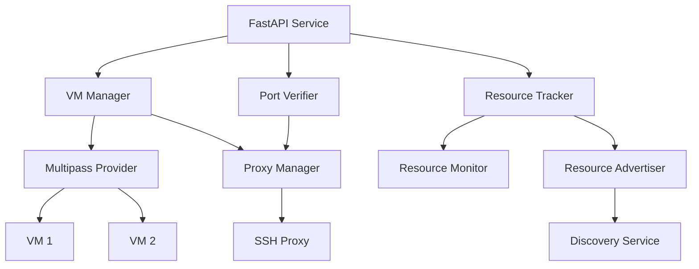
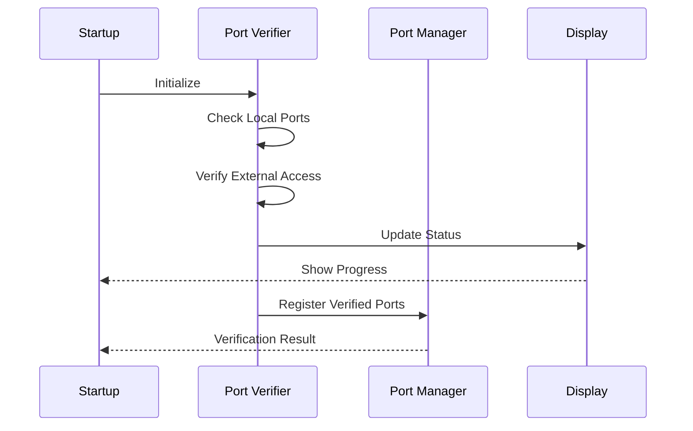
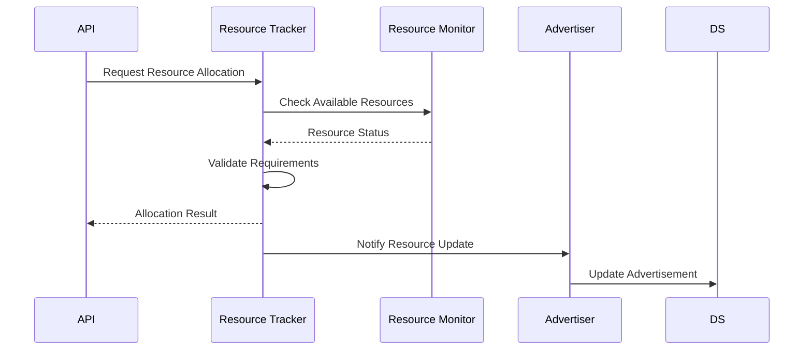
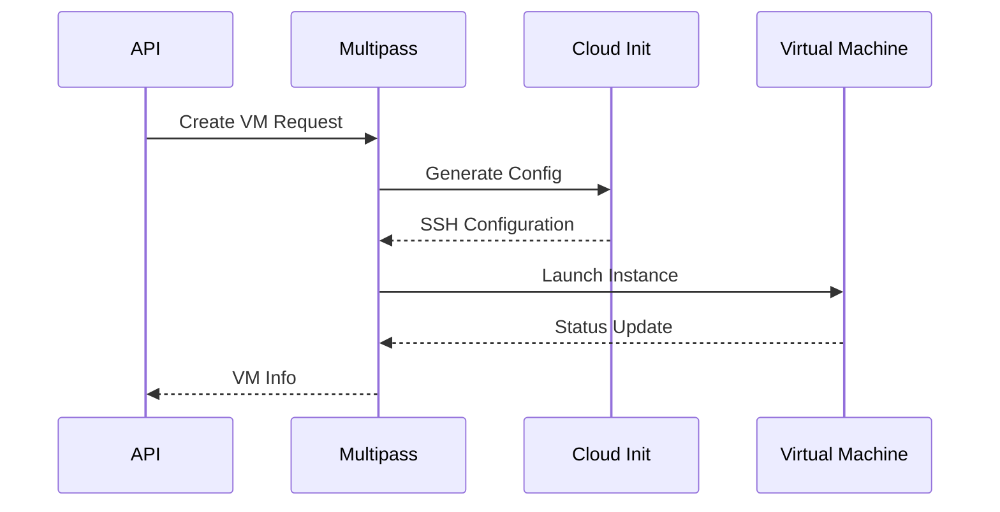
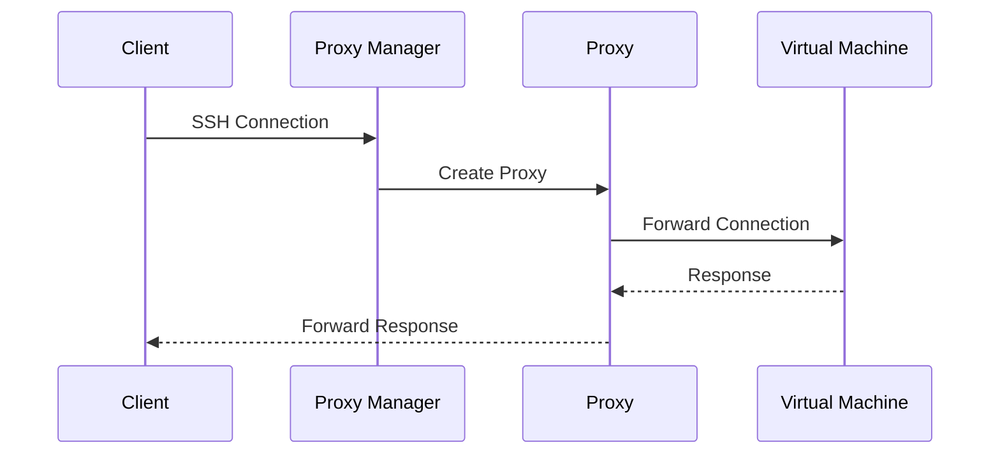
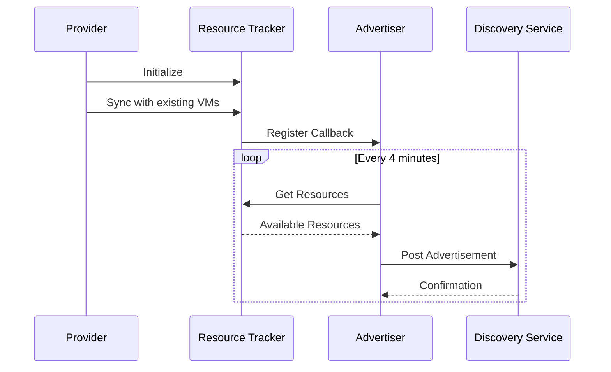

# VM on Golem Provider Node

Earn by renting out your machine’s compute — like Airbnb for servers. The Provider service runs VMs for requestors, verifies payments via streaming, and lets you withdraw earnings.

## Quick Start (Host and Earn)

1) Install (Python 3.11+ recommended):

```bash
pip install golem-vm-provider
```

2) Start the provider (testnet by default is fine):

```bash
golem-provider start --network testnet
```

Verify your environment and connectivity anytime:

```bash
golem-provider status
```
This checks Multipass availability, local/external port reachability, and whether an update is available on PyPI.

### Status Command (TTY and JSON)

Use `golem-provider status` to quickly assess health.

TTY output highlights

```
Overall         Error | Issues detected | Healthy

Multipass       ✅ OK | ❌ Missing

Provider Port   0.0.0.0:7466
  Local         ✅ service is listening | ❌ port unavailable
  External      ✅ reachable | ❌ unreachable — <reason>

SSH Ports       <start>-<end> — OK | limited — N issue(s) | blocked
  Usable free   <count>   # free AND externally reachable
  In use        <count>
  Issues        e.g. "100 not reachable externally" or "3 unreachable, 1 not listening"
```

Severity rules

- Overall is Error when any critical prerequisite fails:
  - Provider API port not externally reachable (or external check fails).
  - No externally reachable SSH ports in the configured range.
  - Multipass missing or provider local port not ready.
- Otherwise it shows Issues detected or Healthy.

Machine‑readable JSON

```bash
golem-provider status --json
```

Key fields:

- `overall.status`: "healthy" | "issues" | "error"
- `overall.issues`: list of concise issue strings
- `ports.provider`:
  - `port`: int, `host`: string
  - `status`: "reachable" | "unreachable" (external check failures are treated as "unreachable")
- `ports.ssh`:
  - `range`: [start, end)
  - `status`: "ok" | "limited" | "blocked"
  - `usable_free`: integer — free AND externally reachable
  - `in_use`: integer
  - `issues`: `{ unreachable: int, not_listening: int }`
  - `ports`: array of per‑port summaries:
    - `{ port: int, status: "reachable" | "unreachable" | "unknown", listening: bool }`

Notes

- The concept of "free" in JSON is replaced by `usable_free` (free + externally reachable) to avoid misleading counts when ports are blocked.
- When the external checker is unavailable, per‑port `status` is `"unknown"` and `listening` still reflects local state.

3) Set pricing in USD (GLM rates auto‑compute):

```bash
golem-provider pricing set --usd-per-core 12 --usd-per-mem 4 --usd-per-disk 0.1
```

4) On testnets, optionally fund gas for withdrawals:

```bash
golem-provider wallet faucet-l2
```

You are now discoverable to requestors and will earn as your VMs run.

## System Architecture



The Provider Node implements a clean, modular architecture where each component handles a specific responsibility:

## Core Components

### Port Verification

The port verification system ensures proper network connectivity:



-   Comprehensive port accessibility verification
-   Real-time status display with progress indicators
-   Local and external port validation
-   Automatic port allocation management

### Future Developments

The current port verification system uses dedicated port check servers to verify external accessibility. In future releases, this functionality will be integrated into the Golem Network's verifier nodes, providing:

-   Decentralized port verification through the network
-   Increased reliability with multiple verification sources
-   Consensus-based verification results
-   Reduced dependency on centralized services
-   Enhanced security through the network's trust system

This integration aligns with Golem's vision of a fully decentralized computing platform, moving critical infrastructure services like port verification into the network itself.

### Resource Management

The resource management system ensures optimal allocation and utilization of system resources:

-   Real-time monitoring of CPU, memory, and storage
-   Intelligent resource allocation with minimum requirement enforcement
-   Threshold-based resource protection
-   Automatic resource reclamation



### VM Management

VM operations are handled through Multipass integration:



-   Automated VM provisioning with cloud-init
-   Secure SSH key management
-   Status monitoring and health checks
-   Automatic cleanup procedures

### Network Proxy System

A pure Python implementation manages SSH connections:



-   Dynamic port allocation and management
-   Connection state persistence
-   Clean connection handling
-   Automatic proxy cleanup

## Installation (from source / development)

1. Prerequisites:
   - Python 3.11+
   - Multipass
   - Poetry (for development)

2. Install from source:

```bash
cd provider-server
poetry install
```

3. Local environment (optional):

```bash
cp .env.example .env
# Edit .env to tweak defaults if needed
```

## Configuration

Key configuration options in `.env`:

```bash
# Provider Settings
GOLEM_PROVIDER_ID="your-provider-id"
GOLEM_PROVIDER_NAME="your-provider-name"
GOLEM_PROVIDER_COUNTRY="SE"

# Resource Limits
GOLEM_PROVIDER_MAX_VMS=10
GOLEM_PROVIDER_MIN_CPU_CORES=1
GOLEM_PROVIDER_MIN_MEMORY_GB=1
GOLEM_PROVIDER_MIN_STORAGE_GB=10

# Port Verification Settings
GOLEM_PROVIDER_PORT={provider_port}  # Default: 7466
GOLEM_PROVIDER_PORT_CHECK_SERVERS=[
    "https://ports1.golem.network",
    "https://ports2.golem.network"
]

# Network Settings
GOLEM_PROVIDER_PORT_RANGE_START={start_port}  # Default: 50800
GOLEM_PROVIDER_PORT_RANGE_END={end_port}      # Default: 50900
GOLEM_PROVIDER_PUBLIC_IP="auto"

# Legacy discovery (optional; not required in normal operation)
# GOLEM_PROVIDER_DISCOVERY_URL="http://discovery.golem.network:9001"
# GOLEM_PROVIDER_ADVERTISEMENT_INTERVAL=240

# Network Selection
# Adds an annotation to on-chain advertisements and can be used by requestors to filter
GOLEM_PROVIDER_NETWORK="testnet"  # or "mainnet"
```

### Streaming Payments (Native ETH on L2)

Enable on‑chain stream‑gated rentals funded in native ETH. By default, the provider auto‑loads the StreamPayment contract from `contracts/deployments/l2.json` and enables payments out of the box. Configure/override (env prefix `GOLEM_PROVIDER_`):

- `POLYGON_RPC_URL` — EVM RPC URL (default L2 RPC)
- `STREAM_PAYMENT_ADDRESS` — StreamPayment address (defaults from `contracts/deployments/l2.json`)
- `GLM_TOKEN_ADDRESS` — Token address (defaults from `contracts/deployments/l2.json`; `0x0` means native ETH)
  - Optional override of deployments directory: set `GOLEM_DEPLOYMENTS_DIR` to a folder containing `l2.json`.

Optional background automation (all disabled by default):

- `STREAM_MIN_REMAINING_SECONDS` — minimum remaining runway to keep a VM running (default 0)
- `STREAM_MONITOR_ENABLED` — stop VMs when remaining runway < threshold (default true)
- `STREAM_MONITOR_INTERVAL_SECONDS` — how frequently to check runway (default 30)
- `STREAM_WITHDRAW_ENABLED` — periodically withdraw vested funds (default false)
- `STREAM_WITHDRAW_INTERVAL_SECONDS` — how often to attempt withdrawals (default 1800)
- `STREAM_MIN_WITHDRAW_WEI` — only withdraw when >= this amount (gas‑aware)

Implementation notes:

- The provider exposes `GET /api/v1/provider/info` returning `provider_id`, `stream_payment_address`, and `glm_token_address`. Requestors should prefer these values when opening streams.
- On successful VM creation with a valid `stream_id`, the provider persists a VM→stream mapping in `streams.json`. This enables the background monitor to stop VMs with low remaining runway and to withdraw vested funds according to configured intervals.
- When a VM is deleted, the VM→stream mapping is cleaned up.

When enabled, the provider verifies each VM creation request’s `stream_id` and refuses to start the VM if:

- stream recipient != provider’s Ethereum address
- deposit is zero, stream not started, or stream halted
- (Optional) remaining runway < `STREAM_MIN_REMAINING_SECONDS`

## API Reference (for integrators)

### Create VM

```bash
POST /api/v1/vms
```

Request:

```json
{
    "name": "my-webserver",
    "cpu_cores": 2,
    "memory_gb": 4,
    "storage_gb": 20,
    "stream_id": 123            // required when STREAM_PAYMENT_ADDRESS is set
}
```

Response:

```json
{
    "id": "golem-my-webserver-20250219-130424",
    "name": "my-webserver",
    "status": "running",
    "ip_address": "192.168.64.2",
    "ssh_port": 50800,
    "resources": {
        "cpu": 2,
        "memory": 4,
        "storage": 20
    }
}
```

### VM Operations

-   List VMs: `GET /api/v1/vms`
-   Get VM Status: `GET /api/v1/vms/{vm_id}`
-   Delete VM: `DELETE /api/v1/vms/{vm_id}`
-   Stop VM: `POST /api/v1/vms/{vm_id}/stop`
-   Get Access Info: `GET /api/v1/vms/{vm_id}/access`

### Provider Info

```bash
GET /api/v1/provider/info
```

Response:

```json
{
  "provider_id": "0xProviderEthereumAddress",
  "stream_payment_address": "0xStreamPayment",
  "glm_token_address": "0x0000000000000000000000000000000000000000"  
  
}
```

Use this endpoint to discover the correct recipient for creating a GLM stream.

### Payment Streams

- Get a VM’s stream status: `GET /api/v1/vms/{vm_id}/stream`
- List all mapped streams: `GET /api/v1/payments/streams`

Response (per stream):

```json
{
  "vm_id": "golem-my-webserver-20250219-130424",
  "stream_id": 123,
  "verified": true,
  "reason": "ok",
  "chain": {
    "token": "0x0000000000000000000000000000000000000000",
    "sender": "0x...",
    "recipient": "0xProviderEthereumAddress",
    "startTime": 1700000000,
    "stopTime": 1700007200,
    "ratePerSecond": 12345,
    "deposit": 1000000000000000000,
    "withdrawn": 0,
    "halted": false
  },
  "computed": {
    "now": 1700003600,
    "remaining_seconds": 3600,
    "vested_wei": 44442000,
    "withdrawable_wei": 44442000
  }
}
```

Notes:
- Endpoints return 400 when streaming is disabled (zero `STREAM_PAYMENT_ADDRESS`).
- In development mode (`GOLEM_PROVIDER_ENVIRONMENT=development`) additional debug logs are emitted around stream verification and monitor ticks.

 ## Operations
 
### Starting the Provider

```bash
# Production mode
golem-provider start

# Development mode with extra logs and reload
GOLEM_PROVIDER_ENVIRONMENT=development golem-provider start --network testnet
```

Run as a background service (no terminal):

```bash
# Start in background and write a PID file
golem-provider start --daemon [--network testnet|mainnet]

# Stop the background process
golem-provider stop

# Check environment and port health (unchanged)
golem-provider status [--json]
```

### Mode vs. Network

- Development Mode (`GOLEM_PROVIDER_ENVIRONMENT=development`)
  - Optimizes for local iteration: enables reload + debug logging and uses local defaults (e.g., local port check servers). May derive a local/LAN IP automatically and prefix the provider name with `DEVMODE-`.
  - Does not decide which chain you target.

- Network Selection (`--network` or `GOLEM_PROVIDER_NETWORK`)
  - Chooses the discovery/advertisement scope: providers advertise `golem_network=testnet|mainnet` and requestors filter accordingly.
  - Pair with appropriate RPC envs (`GOLEM_PROVIDER_GOLEM_BASE_RPC_URL`, `GOLEM_PROVIDER_GOLEM_BASE_WS_URL`).
  - Does not change dev ergonomics (logging, reload, or port verification behavior).

- Payments Network (`GOLEM_PROVIDER_PAYMENTS_NETWORK`)
  - Selects the payments chain profile (e.g., `l2.holesky`, `mainnet`). Determines default payments RPC, faucet enablement, and symbols.

Common setups:
- Local dev on testnet: `GOLEM_PROVIDER_ENVIRONMENT=development` plus `--network testnet`.
- Staging on testnet: keep `ENVIRONMENT=production`, set `--network testnet` and testnet RPCs.
- Production on mainnet: `ENVIRONMENT=production` with `--network mainnet` and mainnet RPCs.

The provider will:

1. Verify port accessibility
    - Check discovery port (7466)
    - Verify SSH ports (50800-50900)
    - Display verification progress
2. Initialize resource monitoring
3. Start the proxy manager
4. Begin resource advertisement
5. Listen for VM requests

Notes:
- Advertisements include both `golem_network` (testnet/mainnet) and `golem_payments_network` (e.g., `l2.holesky`). Requestors default to matching both; they can list all payments networks with a CLI flag.

### Faucet

- L3 (Golem Base adverts): provider auto-requests funds on startup from `FAUCET_URL` (defaults to EthWarsaw Holesky) protected by CAPTCHA at `CAPTCHA_URL/05381a2cef5e`.
- L2 (payments): Use the CLI to request native ETH (enabled only on testnet profiles):

```bash
golem-provider wallet faucet-l2
```

Defaults:
- Faucet URL and enablement come from the active payments profile. On `mainnet` (or other profiles without faucet) the command is disabled.
- CAPTCHA: `https://cap.gobas.me/05381a2cef5e`
- Override with env: `GOLEM_PROVIDER_L2_FAUCET_URL`, `GOLEM_PROVIDER_L2_CAPTCHA_URL`, `GOLEM_PROVIDER_L2_CAPTCHA_API_KEY`.

### Streams (CLI)

- List all mapped streams with computed fields:

```bash
poetry run golem-provider streams list
# or JSON
poetry run golem-provider streams list --json
```

- Show one VM’s stream (VM id = `requestor_name`):

```bash
poetry run golem-provider streams show <vm_id>
```

- Summarize earnings and withdrawable amounts:

```bash
poetry run golem-provider streams earnings
# or JSON
poetry run golem-provider streams earnings --json
```

- Withdraw vested funds:

```bash
# One VM by id
poetry run golem-provider streams withdraw --vm-id <vm_id>

# All mapped streams
poetry run golem-provider streams withdraw --all
```

Note: On testnets, the withdraw command auto-attempts to fund the provider's L2 address via the configured faucet if native gas balance is low.

Configure monitor and withdraw via CLI:

```bash
# Set monitor to require 1h remaining, check every 30s
golem-provider config monitor --enable true --interval 30 --min-remaining 3600

# Enable auto-withdraw every 15 minutes when >= 1e15 wei
golem-provider config withdraw --enable true --interval 900 --min-wei 1000000000000000
```

### Resource Advertisement Flow



On startup, the provider syncs the resource tracker with all VMs currently running on the host (via Multipass). This ensures advertisements reflect already-allocated CPU, RAM, and storage after restarts, preventing false “outdated advertisement” updates when existing VMs are consuming resources. The sync is based on actual VMs present, independent of any still-open payment streams.

### Monitoring

The provider includes comprehensive logging:

-   Resource allocation events
-   VM lifecycle changes
-   Network proxy operations
-   Discovery service interactions

## Technical Details

### Security

-   Resource isolation through Multipass
-   Secure SSH key provisioning
-   Connection proxying for network isolation
-   Rate limiting on API endpoints

### Performance

-   Asynchronous operations with FastAPI
-   Efficient resource tracking
-   Connection pooling for proxy servers
-   Optimized VM provisioning

### Resource Protection

-   CPU threshold: 90%
-   Memory threshold: 85%
-   Storage threshold: 90%
-   Minimum resource guarantees

## Troubleshooting

Common issues and solutions:

### Port Verification Issues

1. Provider Port ({provider_port}) Issues

    - Check if port is already in use
    - Verify port forwarding on router
    - Check firewall rules
    - Ensure provider is accessible to requestors

2. VM Access Port Range ({start_port}-{end_port}) Issues

    - Verify port range availability
    - Check for port conflicts
    - Configure router port forwarding
    - Review firewall settings for range

3. External Access Issues
    - Verify internet connectivity
    - Check port check servers are accessible
    - Review router NAT/firewall settings
    - Consider using alternative port check servers

### Port Verification Monitoring

The provider includes real-time port verification status:

-   Visual progress indicators
-   Port accessibility status
-   Critical issues detection
-   Quick fix suggestions
-   Links to troubleshooting documentation

Example status output:

```
Overall         Healthy

Provider Port   {host}:{provider_port}
  Local         ✅ service is listening
  External      ✅ reachable

SSH Ports       {start_port}-{end_port_minus_one} — OK
  Usable free   {usable_free}
  In use        {in_use}
```

### Resource Allocation Issues

-   Check system resource availability
-   Verify minimum requirements
-   Monitor resource thresholds
-   Review resource allocation logs

### Discovery Service Issues

-   Check network connectivity
-   Verify discovery service URL
-   Check advertisement interval
-   Monitor advertisement responses
-   Verify provider registration status

## Contributing

1. Fork the repository
2. Create a feature branch
3. Make your changes
4. Run the tests
5. Submit a pull request
