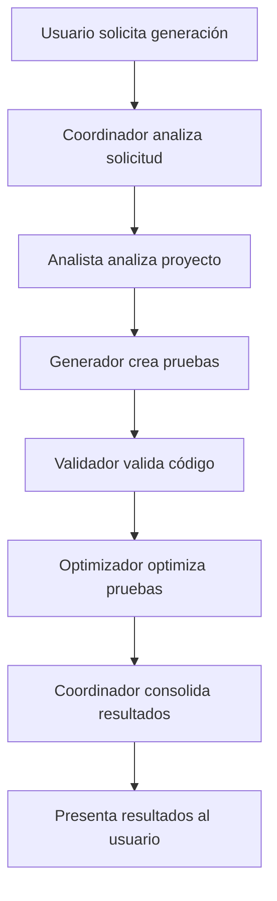
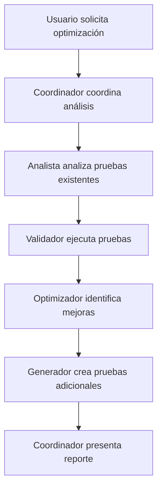
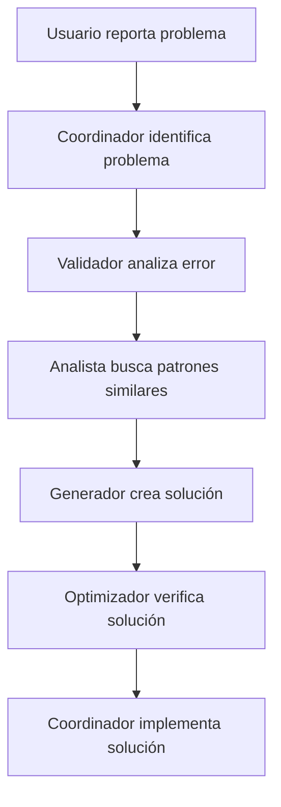

# Arquitectura del Sistema Multi-Agente
## IA Agent para Generación de Pruebas Unitarias .NET

### Versión: 1.0.0
### Fecha: Septiembre 2024

---

## 🏗️ **VISIÓN GENERAL DE LA ARQUITECTURA**

El sistema está diseñado como una arquitectura multi-agente que combina **LangChain** para capacidades ReAct individuales y **AutoGen** para colaboración entre agentes especializados. La arquitectura es modular, escalable y permite la extensión de funcionalidades.

### **Principios de Diseño**
- **Modularidad**: Componentes independientes y reutilizables
- **Escalabilidad**: Soporte para múltiples agentes concurrentes
- **Extensibilidad**: Fácil agregar nuevos agentes y herramientas
- **Mantenibilidad**: Código limpio y bien documentado
- **Confiabilidad**: Manejo robusto de errores y recuperación

---

## 🎯 **ARQUITECTURA DE ALTO NIVEL**

```
┌─────────────────────────────────────────────────────────────────┐
│                    IA AGENT UNIT TESTS                         │
│                     Sistema Multi-Agente                       │
└─────────────────────────────────────────────────────────────────┘
                                │
                                ▼
┌─────────────────────────────────────────────────────────────────┐
│                        CLI LAYER                               │
│  ┌─────────────┐ ┌─────────────┐ ┌─────────────┐              │
│  │ Interactive │ │   Commands  │ │ Multi-Agent │              │
│  │    Mode     │ │    Mode     │ │    Mode     │              │
│  └─────────────┘ └─────────────┘ └─────────────┘              │
└─────────────────────────────────────────────────────────────────┘
                                │
                                ▼
┌─────────────────────────────────────────────────────────────────┐
│                    COORDINATION LAYER                          │
│  ┌─────────────┐ ┌─────────────┐ ┌─────────────┐              │
│  │  Workflow   │ │   Conflict  │ │  Monitoring │              │
│  │  Manager    │ │  Resolver   │ │   System    │              │
│  └─────────────┘ └─────────────┘ └─────────────┘              │
└─────────────────────────────────────────────────────────────────┘
                                │
                                ▼
┌─────────────────────────────────────────────────────────────────┐
│                      AGENT LAYER                               │
│  ┌─────────────┐ ┌─────────────┐ ┌─────────────┐              │
│  │  Analysis   │ │ Generation  │ │ Validation  │              │
│  │   Agent     │ │   Agent     │ │   Agent     │              │
│  └─────────────┘ └─────────────┘ └─────────────┘              │
│  ┌─────────────┐ ┌─────────────┐                              │
│  │Optimization │ │Coordinator  │                              │
│  │   Agent     │ │   Agent     │                              │
│  └─────────────┘ └─────────────┘                              │
└─────────────────────────────────────────────────────────────────┘
                                │
                                ▼
┌─────────────────────────────────────────────────────────────────┐
│                      MEMORY LAYER                              │
│  ┌─────────────┐ ┌─────────────┐ ┌─────────────┐              │
│  │ Individual  │ │   Shared    │ │   Vector    │              │
│  │   Memory    │ │   Memory    │ │   Store     │              │
│  └─────────────┘ └─────────────┘ └─────────────┘              │
└─────────────────────────────────────────────────────────────────┘
                                │
                                ▼
┌─────────────────────────────────────────────────────────────────┐
│                      TOOLS LAYER                               │
│  ┌─────────────┐ ┌─────────────┐ ┌─────────────┐              │
│  │   .NET      │ │   Search    │ │    File     │              │
│  │   Tools     │ │   Tools     │ │   Tools     │              │
│  └─────────────┘ └─────────────┘ └─────────────┘              │
└─────────────────────────────────────────────────────────────────┘
```

---

## 🤖 **AGENTES ESPECIALIZADOS**

### **1. Agente Analista (Analysis Agent)**
```python
class AnalysisAgent:
    """
    Especializado en análisis de código .NET
    """
    def __init__(self):
        self.role = "Analista"
        self.tools = [
            "analyze_dotnet_project",
            "parse_controller", 
            "identify_dependencies",
            "extract_models"
        ]
        self.memory = AnalysisMemory()
        
    def analyze_project(self, project_path: str) -> ProjectAnalysis:
        """Analiza un proyecto .NET completo"""
        pass
        
    def parse_controller(self, controller_file: str) -> ControllerInfo:
        """Extrae información de un controlador API"""
        pass
```

**Responsabilidades**:
- Analizar estructura de proyectos .NET
- Extraer información de controladores y endpoints
- Identificar dependencias e inyección de servicios
- Detectar patrones de arquitectura
- Generar metadatos del proyecto

### **2. Agente Generador (Generation Agent)**
```python
class GenerationAgent:
    """
    Especializado en generación de código de pruebas
    """
    def __init__(self):
        self.role = "Generador"
        self.tools = [
            "generate_test_file",
            "create_test_method",
            "validate_generated_code"
        ]
        self.memory = GenerationMemory()
        
    def generate_tests(self, analysis: ProjectAnalysis) -> List[TestFile]:
        """Genera pruebas unitarias basadas en análisis"""
        pass
        
    def create_test_method(self, method_info: MethodInfo) -> TestMethod:
        """Crea un método de prueba específico"""
        pass
```

**Responsabilidades**:
- Generar código de pruebas unitarias
- Crear templates adaptativos por framework
- Generar mocks y stubs
- Aplicar patrones de testing
- Validar código generado

### **3. Agente Validador (Validation Agent)**
```python
class ValidationAgent:
    """
    Especializado en validación y ejecución de pruebas
    """
    def __init__(self):
        self.role = "Validador"
        self.tools = [
            "run_tests",
            "check_code_coverage",
            "compile_project"
        ]
        self.memory = ValidationMemory()
        
    def validate_code(self, test_files: List[TestFile]) -> ValidationResult:
        """Valida código de pruebas generado"""
        pass
        
    def run_tests(self, test_project: str) -> TestResults:
        """Ejecuta pruebas y analiza resultados"""
        pass
```

**Responsabilidades**:
- Validar código generado
- Ejecutar pruebas unitarias
- Analizar cobertura de código
- Verificar compilación
- Generar reportes de validación

### **4. Agente Optimizador (Optimization Agent)**
```python
class OptimizationAgent:
    """
    Especializado en optimización y mejoras
    """
    def __init__(self):
        self.role = "Optimizador"
        self.tools = [
            "optimize_test_code",
            "suggest_improvements",
            "refactor_tests"
        ]
        self.memory = OptimizationMemory()
        
    def optimize_tests(self, test_files: List[TestFile]) -> OptimizationResult:
        """Optimiza pruebas existentes"""
        pass
        
    def suggest_improvements(self, analysis: ProjectAnalysis) -> List[Improvement]:
        """Sugiere mejoras para el proyecto"""
        pass
```

**Responsabilidades**:
- Optimizar código de pruebas
- Sugerir mejoras de rendimiento
- Refactorizar código existente
- Identificar patrones de optimización
- Aplicar mejores prácticas

### **5. Agente Coordinador (Coordinator Agent)**
```python
class CoordinatorAgent:
    """
    Coordina tareas y gestiona flujos de trabajo
    """
    def __init__(self):
        self.role = "Coordinador"
        self.tools = [
            "coordinate_tasks",
            "manage_workflow",
            "make_decisions"
        ]
        self.memory = CoordinatorMemory()
        
    def coordinate_workflow(self, request: UserRequest) -> WorkflowPlan:
        """Coordina flujo de trabajo multi-agente"""
        pass
        
    def resolve_conflicts(self, conflicts: List[Conflict]) -> Resolution:
        """Resuelve conflictos entre agentes"""
        pass
```

**Responsabilidades**:
- Coordinar tareas entre agentes
- Gestionar flujos de trabajo
- Tomar decisiones estratégicas
- Resolver conflictos
- Monitorear progreso

---

## 🔄 **PATRONES DE COMUNICACIÓN**

### **1. GroupChat (AutoGen)**
```python
# Comunicación grupal para tareas complejas
group_chat = GroupChat(
    agents=[analysis_agent, generation_agent, validation_agent, optimization_agent],
    messages=[],
    max_round=10,
    speaker_selection_method="auto"
)
```

**Uso**:
- Discusión colaborativa para tareas complejas
- Toma de decisiones consensuadas
- Resolución de problemas en grupo
- Aprendizaje colaborativo

### **2. AgentChat (AutoGen)**
```python
# Comunicación directa entre pares
agent_chat = AgentChat(
    agent1=analysis_agent,
    agent2=generation_agent,
    max_turns=5
)
```

**Uso**:
- Transferencia de información específica
- Colaboración en tareas específicas
- Consultas directas entre agentes
- Delegación de tareas

### **3. Shared Memory**
```python
# Memoria compartida entre agentes
shared_memory = SharedMemory(
    storage_path="./memory/shared",
    sync_interval=30
)
```

**Uso**:
- Contexto común del proyecto
- Aprendizaje colaborativo
- Compartir patrones descubiertos
- Sincronización de conocimiento

---

## 🧠 **SISTEMA DE MEMORIA**

### **Arquitectura de Memoria**
```
┌─────────────────────────────────────────────────────────────────┐
│                        MEMORY SYSTEM                           │
└─────────────────────────────────────────────────────────────────┘
                                │
                ┌───────────────┼───────────────┐
                ▼               ▼               ▼
┌─────────────────┐ ┌─────────────────┐ ┌─────────────────┐
│   Individual    │ │    Shared       │ │    Vector       │
│     Memory      │ │     Memory      │ │     Store       │
└─────────────────┘ └─────────────────┘ └─────────────────┘
        │                     │                     │
        ▼                     ▼                     ▼
┌─────────────┐     ┌─────────────┐     ┌─────────────┐
│Conversation │     │   Project   │     │  Semantic   │
│   Buffer    │     │   Context   │     │   Search    │
└─────────────┘     └─────────────┘     └─────────────┘
┌─────────────┐     ┌─────────────┐     ┌─────────────┐
│Conversation │     │   User      │     │  Pattern    │
│  Summary    │     │Preferences  │     │  Learning   │
└─────────────┘     └─────────────┘     └─────────────┘
```

### **Tipos de Memoria**

#### **1. Memoria Individual**
- **ConversationBufferMemory**: Contexto inmediato de conversación
- **ConversationSummaryMemory**: Resumen de conversaciones largas
- **Vector Memory**: Búsqueda semántica de contexto histórico

#### **2. Memoria Compartida**
- **Project Context**: Contexto específico del proyecto actual
- **User Preferences**: Preferencias del usuario aprendidas
- **Pattern Memory**: Patrones de código y testing aprendidos

#### **3. Vector Store**
- **ChromaDB/FAISS**: Almacenamiento de embeddings
- **Semantic Search**: Búsqueda por similitud semántica
- **Pattern Recognition**: Identificación de patrones similares

---

## 🛠️ **HERRAMIENTAS Y UTILIDADES**

### **Categorías de Herramientas**

#### **1. Herramientas .NET**
```python
class DotNetTools:
    def analyze_project(self, project_path: str) -> ProjectInfo:
        """Analiza proyecto .NET usando Roslyn"""
        pass
        
    def execute_command(self, command: str) -> CommandResult:
        """Ejecuta comandos .NET CLI"""
        pass
        
    def compile_project(self, project_path: str) -> CompilationResult:
        """Compila proyecto .NET"""
        pass
```

#### **2. Herramientas de Búsqueda**
```python
class SearchTools:
    def search_documentation(self, query: str) -> List[Documentation]:
        """Busca en documentación oficial"""
        pass
        
    def search_code_patterns(self, pattern: str) -> List[CodeExample]:
        """Busca patrones de código similares"""
        pass
```

#### **3. Herramientas de Archivos**
```python
class FileTools:
    def read_file(self, file_path: str) -> str:
        """Lee archivo de código fuente"""
        pass
        
    def write_file(self, file_path: str, content: str) -> bool:
        """Escribe archivo generado"""
        pass
```

---

## 🔄 **FLUJOS DE TRABAJO**

### **Flujo 1: Generación Completa de Pruebas**


### **Flujo 2: Análisis y Optimización**


### **Flujo 3: Resolución de Problemas**


---

## 📊 **MONITOREO Y MÉTRICAS**

### **Métricas del Sistema**
- **Tiempo de respuesta por agente**
- **Tasa de éxito de tareas**
- **Uso de memoria por agente**
- **Eficiencia de colaboración**
- **Calidad de código generado**

### **Métricas de Agentes**
- **Tiempo de procesamiento**
- **Precisión de análisis**
- **Calidad de generación**
- **Tasa de errores**
- **Satisfacción del usuario**

---

## 🔒 **SEGURIDAD Y CONFIABILIDAD**

### **Medidas de Seguridad**
- **Encriptación de API keys**
- **Validación de entrada de datos**
- **Sanitización de salida**
- **Configuración segura por defecto**
- **Auditoría de operaciones**

### **Medidas de Confiabilidad**
- **Manejo graceful de errores**
- **Recuperación automática**
- **Backup de configuración**
- **Logging detallado**
- **Health checks**

---

## 🚀 **EXTENSIBILIDAD**

### **Puntos de Extensión**
- **Nuevos agentes especializados**
- **Herramientas adicionales**
- **Nuevos frameworks de testing**
- **Integraciones con IDEs**
- **Nuevos patrones de arquitectura**

### **APIs de Extensión**
- **Agent Interface**: Para crear nuevos agentes
- **Tool Interface**: Para agregar nuevas herramientas
- **Memory Interface**: Para nuevos tipos de memoria
- **Communication Interface**: Para nuevos protocolos

---

**Documento preparado por**: Equipo de Desarrollo IA Agent  
**Revisado por**: [Pendiente]  
**Aprobado por**: [Pendiente]  
**Próxima revisión**: [Pendiente]
