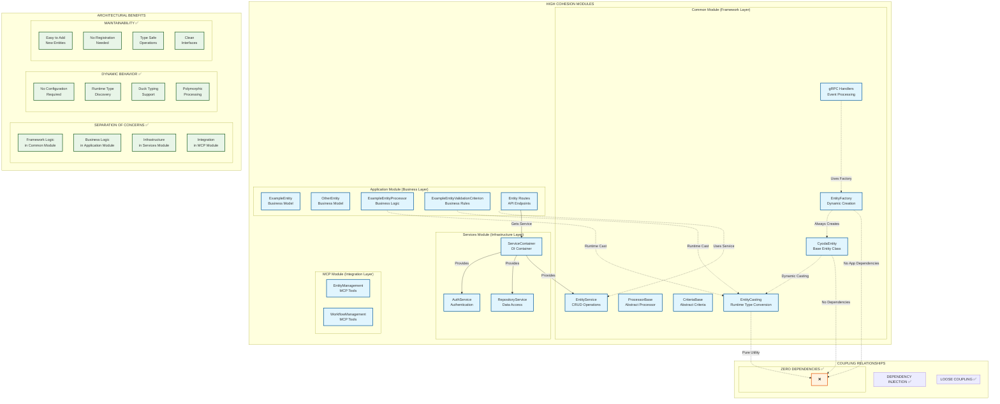

# Cyoda Application Architecture: Cohesion and Coupling Analysis

## Overview

This document analyzes the cohesion and coupling characteristics of the Cyoda client application architecture, particularly focusing on the dynamic entity system implementation.

## Architecture Diagram



## High Cohesion Analysis

### 1. Common Module (Framework Layer)
- **CyodaEntity**: Base entity class with core functionality
- **EntityFactory**: Simple, focused entity creation
- **EntityCasting**: Dedicated runtime type conversion utilities
- **ProcessorBase/CriteriaBase**: Abstract base classes for business logic
- **gRPC Handlers**: Event processing and communication
- **EntityService**: CRUD operations and data management

**Cohesion Level**: **HIGH** - Each component has a single, well-defined responsibility

### 2. Application Module (Business Layer)
- **ExampleEntity/OtherEntity**: Domain-specific business models
- **ExampleEntityProcessor**: Business logic processing
- **ExampleEntityValidationCriterion**: Business rule validation
- **Entity Routes**: API endpoint definitions

**Cohesion Level**: **HIGH** - Components are grouped by business domain

### 3. Services Module (Infrastructure Layer)
- **ServiceContainer**: Dependency injection and service management
- **AuthService**: Authentication concerns
- **RepositoryService**: Data access abstraction

**Cohesion Level**: **HIGH** - Infrastructure concerns properly separated

### 4. MCP Module (Integration Layer)
- **EntityManagement**: MCP tools for entity operations
- **WorkflowManagement**: MCP tools for workflow operations

**Cohesion Level**: **HIGH** - Integration tools grouped by functionality

## Low Coupling Analysis

### 1. Loose Coupling ✅
- **Dynamic Casting**: Runtime type conversion eliminates compile-time dependencies
- **Factory Pattern**: Simple creation without complex dependencies
- **Service Abstraction**: Routes depend on service interfaces, not implementations
- **Event-Driven**: gRPC handlers process events without tight coupling

### 2. Dependency Injection ✅
- **Service Container**: Centralized dependency management
- **Interface-Based**: Components depend on abstractions, not concretions
- **Runtime Resolution**: Dependencies resolved at runtime

### 3. Zero Dependencies ✅
- **Common Module**: No dependencies on application-specific modules
- **Pure Utilities**: Entity casting is a pure utility function
- **Framework Independence**: Core entities don't depend on specific frameworks

## Architectural Benefits

### 1. Separation of Concerns ✅
- **Framework Logic**: Generic, reusable components in common module
- **Business Logic**: Domain-specific logic in application module
- **Infrastructure**: Technical concerns in services module
- **Integration**: External system integration in MCP module

### 2. Dynamic Behavior ✅
- **No Configuration Required**: Zero-config entity system
- **Runtime Type Discovery**: Dynamic casting based on data structure
- **Duck Typing Support**: Flexible type handling
- **Polymorphic Processing**: Same interface, different implementations

### 3. Maintainability ✅
- **Easy to Add New Entities**: No registration or configuration needed
- **Type Safe Operations**: Runtime casting provides type safety
- **Clean Interfaces**: Well-defined boundaries between modules
- **Testable Components**: Loose coupling enables easy testing

## Key Design Decisions

### 1. Dynamic Entity Factory
```python
def create_entity(entity_type: str, data: Dict[str, Any]) -> CyodaEntity:
    # Always creates generic CyodaEntity - no configuration needed
    return CyodaEntity(**data)
```

### 2. Runtime Type Casting
```python
def cast_entity(entity: CyodaEntity, target_type: Type[T]) -> T:
    # Dynamic casting at implementation level
    return target_type(**entity.model_dump())
```

### 3. Implementation-Level Type Safety
```python
async def process(self, entity: CyodaEntity, **kwargs: Any) -> CyodaEntity:
    # Cast to specific type for type-safe operations
    example_entity = cast_entity(entity, ExampleEntity)
    # Process with full type safety
```

## Conclusion

The current architecture achieves:

- ✅ **High Cohesion**: Each module has focused, related responsibilities
- ✅ **Low Coupling**: Minimal dependencies between modules
- ✅ **Dynamic Behavior**: No configuration required
- ✅ **Type Safety**: Runtime casting provides compile-time benefits
- ✅ **Maintainability**: Easy to extend and modify
- ✅ **Testability**: Components can be tested in isolation

This design represents an optimal balance between flexibility and structure, enabling rapid development while maintaining clean architecture principles.
