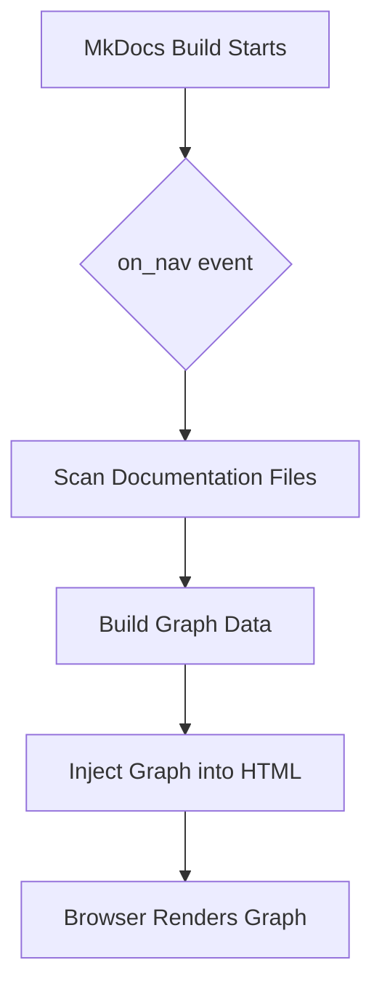

# How it Works

The MkDocs Network Graph Plugin integrates with the MkDocs build process to generate a graph of your documentation. This process involves a few key steps, from scanning your files to rendering the final visualization in the browser.

## The Build Process

The graph is generated dynamically every time you build your MkDocs site. Here is a high-level overview of the process:

1. **`on_nav` Event:** The plugin hooks into the `on_nav` event in the MkDocs build process. This event is triggered after the navigation has been built, but before the pages are rendered to HTML.

    [Learn more about plugin events in the MkDocs documentation.](https://www.mkdocs.org/dev-guide/plugins/#events)

2. **Scan Documentation Files:** The plugin iterates through all the Markdown files in your documentation to identify the pages and the links between them.

3. **Build Graph Data:** Based on the scanned files, the plugin constructs a graph representation of your documentation. This includes a list of nodes (pages) and edges (links).

4. **Inject Graph into HTML:** The graph data is then serialized to JSON and injected into the HTML of each page. The plugin also adds the necessary CSS and JavaScript files to render the graph.

5. **Browser Renders Graph:** When a user visits a page, the browser executes the JavaScript, which renders the graph in the designated container.

## See Also

- [Getting Started](../tutorials/getting-started.md)
- [Configuration](../reference/configuration.md)
