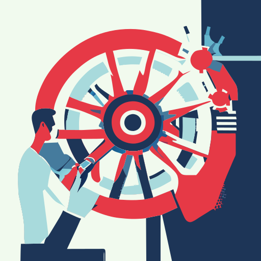

<!-- These are examples of badges you might want to add to your README:
     please update the URLs accordingly

-->

# 🛞 mywheel

> Reinventing my wheel in Python

A longer description of your project goes here...

## Used In

- [digraphx](https://luk036.github.io/digraphx)
- [netlistx](https://luk036.github.io/netlistx)
- [ckpttnpy](https://luk036.github.io/ckpttnpy)

<!-- pyscaffold-notes -->

## 👉 Note

This project has been set up using PyScaffold 4.5. For details and usage
information on PyScaffold see https://pyscaffold.org/.
