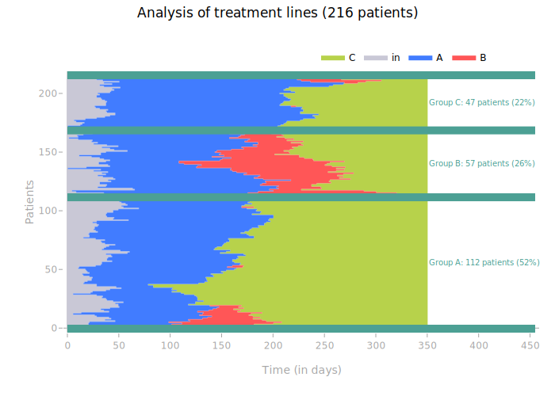
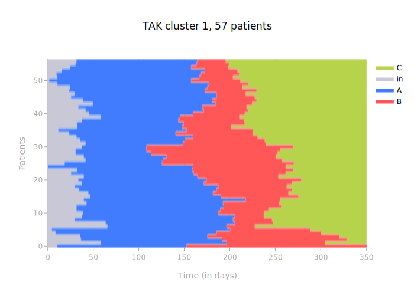

# Advanced Usage

## Choosing the Clustering Algorithm

#### Hierarchical Agglomerative Clustering

This algorithm is recommended when the population does not contain too many patients (< 8000 patients).

```python
from opentak import TakBuilder, TakVisualizer

tak_hca = TakBuilder(base).build()
tak_hca.fit()
tak_hca_viz = TakVisualizer(tak_hca)
tak_hca_viz.process_visualization()
tak_hca_viz.get_plot()
```


!!! note
    When calling `fit()`, it is possible to change the distance (`hamming` by default), or the linkage method (`ward` by default).

## Fit Parameters

- `n_clusters`: the number of clusters to search for
- `method`: method for computing the linkage matrix. Possible values are "ward", "single", "complete", "average". This parameter can often be left at the default value, which is "ward".
- `distance`: distance used for clustering. Can be any possible value for the metric argument of [scipy.spatial.distance.pdist](https://docs.scipy.org/doc/scipy-1.16.0/reference/generated/scipy.spatial.distance.pdist.html), "hamming" by default. Can also be a custom function, see [#customize-the-distance](#customize-the-distance)
- `optimal_ordering`: Reorder tree leaves to minimize the distances between two successive leaves. This allows for better appreciation of the variety of sequences within each cluster in the visualization by grouping similar sequences together. This defaults to True, but can be switched off by providing False given this algorithm is computationnaly expensive. 

## Customizing the TAK Result

#### Change the color of an event

The `update_colors()` function allows to change the colors of events displayed on the TAK.

It can take different arguments:

- A dictionary `{"event name": "color in RGB or Hexadecimal"}`
- The event name as an argument and the color as a value

```python
from opentak import TakBuilder, TakVisualizer

tak = TakBuilder(base).build()
tak.fit()
tak_viz = TakVisualizer(tak)

tak_viz.update_colors(
    dict_new_colors={"A": "rgb(255, 114, 64)"}, B="#5E5A85"
)
tak_viz.process_visualization()
tak_viz.get_plot()
```


!!! warning
    `process_visualization()` must be used **after** and not **before** changing the colors.

#### Change the name of events

When calling the `TakVisualizer()` class, it is possible to pass a dictionary `dico_evt_for_legend` which allows to rename the event names in the legend.

```python
from opentak import TakBuilder, TakVisualizer

tak = TakBuilder(base).build()
tak.fit()
tak_viz = TakVisualizer(tak, dico_evt_for_legend = {"A": "New name for A"})

tak_viz.process_visualization()
tak_viz.get_plot()
```


#### Add a grid to the TAK

It is possible to add a grid to the TAK heatmap, on the X and/or Y axis, via `add_xgrid`, `add_ygrid`.
The plotly functions used are `add_hline()` and `add_vline()`.
It is also possible to change the parameters passed to these functions via `xgrid_params` and `ygrid_params`.

!!! note
    By default, the grid is added to both X and Y, with the following arguments for `xgrid_params` and `ygrid_params`:
    `line_width = 0.5`, `line_dash = "dot"`, `line_color = "grey"`, `opacity = 0.5`

```python
from opentak import TakBuilder, TakVisualizer
from opentak.visualization import add_grid_on_tak_fig

tak = TakBuilder(base).build()
tak.fit()
tak_viz = TakVisualizer(tak)

tak_viz.process_visualization()
fig = tak_viz.get_plot()
fig = add_grid_on_tak_fig(
    fig,
    grid = "xy",
    params = {
        "x":{"opacity": 1},
        "y":{"opacity": 1}
    }
)
fig
```


### Calendar x axes

It is possible to request for the ticks on the x-axis to be marked every N months, by setting `unit_as_months` to True and `nb_months` to N.

```python
tak_viz.get_plot(unit_as_months=True, nb_months=2)
```


If the follow-up period is long, the x-axis can also be formatted in years with the `unit_as_years` argument.

```python
tak_viz.get_plot(unit_as_years=True)
```


It is also possible to convert to dates via the `base_date` argument.
Be careful not to indicate `unit_as_years=True`, as this will remove the dates...

```python
tak_viz.process_visualization(base_date=pd.to_datetime("2014-01-01"))
tak_viz.get_plot(unit_as_years=False)
```


## Display clusters

By specifying the number of clusters `n_clusters` as an argument to `fit`, it is possible to automatically find and display patient clusters.

### Display clusters on one figure

```python
from opentak import TakBuilder, TakVisualizer

n_clusters = 3

tak = TakBuilder(base).build()
tak.fit(n_clusters=n_clusters)

tak_viz = TakVisualizer(tak)
tak_viz.process_visualization()
figplotly_with_default_sep = tak_viz.get_plot(add_sep=True)
figplotly_with_default_sep.show()
```


The size of the annotations, as well as their color, can be changed via `size_annotation` (default `10`) and `color_annotation` (default `"#4CA094"`).

```python
figplotly_with_changed_annotation = tak_viz.get_plot(
    add_sep=True, size_annotation=20, color_annotation="#0000FF"
)
figplotly_with_changed_annotation.show()
```


The size of the horizontal lines can be changed via `coef_line_extension`,
it is `0.15` by default (for a right extension of the bars by 15%).
The thickness of the horizontal bars can be changed via `width_line`,
it is `3` by default.

```python
figplotly_with_changed_line_extension_and_width = tak_viz.get_plot(
    add_sep=True, coef_line_extension=0.3, width_line=10
)
figplotly_with_changed_line_extension_and_width.show()
```



### Display a specific cluster in a figure
```python
num_cluster = 1

tak_viz.process_visualization(num_cluster=num_cluster)

# Generating Plotly figure
n_pat_cluster = len(tak.list_ids_clusters[num_cluster])
# Generating Plotly figure
fig = tak_viz.get_plot().update_layout(title_text=f"TAK cluster {num_cluster}, {n_pat_cluster} patients")
fig.show()
```



## Customize the distance

The distance used by TAK is the **Hamming distance**.
`TIMESTAMP` by `TIMESTAMP`, it assigns 1 if the treatments of the 2 patients are different and 0 if they are identical, then all these `1`s are summed and the result is divided by the number of `TIMESTAMP`.

This distance can be modified, either by a [pre-coded distance by `scipy`](https://docs.scipy.org/doc/scipy/reference/generated/scipy.spatial.distance.pdist.html), or by a custom function.

For example, when the patients in the cohort have very different follow-up times/periods, it may be useful to assign a lower weight to their "out of follow-up" periods.
Or, when 2 drugs are clinically "closer" (for example `Drug_A_MCO` and `Drug_A_HAD`), it may be useful to assign a higher weight to their distance from other drugs.

```python
import numpy as np

def hamming_02(u, v):
    """Compiled distance metric for which timestamps involving
    start (id 0), out (id 2) or death (id 3) are taken into account 5 times less
    in the distance computation than other instants.

    Example:
    u             = [  0  |  0  |  0  |  5  |  2  |  2  ]
    v             = [  5  |  5  |  5  |  5  |  5  |  5  ]
    hamming       = [  1  |  1  |  1  |  0  |  1  |  1  ]
    weight        = [ 0.2 | 0.2 | 0.2 |  1  | 0.2 | 0.2 ]
    d_per_instant = [ 0.2 | 0.2 | 0.2 |  0  | 0.2 | 0.2 ]
    d             =  0.2*5 / (1 + 0.2*5) =  1 / 2  =  0.5
    """

    # parameters
    coef = 0.2
    id_low_dist = [0, 2, 3] # event ids: ["start", "out", "death"]

    # classic hamming
    hamming = u != v

    u_low_dist = np.isin(u, id_low_dist)
    v_low_dist = np.isin(v, id_low_dist)

    weight = np.where(np.logical_or(u_low_dist, v_low_dist), coef, 1)
    hamming_weighted = np.multiply(hamming, weight)

    # normalization
    res = hamming_weighted.sum()/weight.sum()

    return res
```

!!! note "Note: `coef`"
    If `coef = 0`, then the distance is computed as "all or nothing": when the patient is in start, out or death, they are no longer taken into account.
    Otherwise, `coef` is a `float`, the closer it is to 0, the less weight the `id_low_dist` events have in the distance, the larger it is, the more weight they have.
    If `coef = 1`, we return to the classic Hamming distance.

!!! warning "Warning: `used ids`"
    The distance is calculated between the event IDs, so make sure that in all cases the IDs indicated in your distance function correspond to the events you want to customize the distance for (for example using `tak.dict_label_id`)

!!! note "Note: vectorize!"
    Working with a customized distance makes all calculations longer.
    It is very important to avoid `for` loops, and therefore to work with vectorized calls (via numpy arrays)

!!! note "Note: `numba`"
    Using `numba` (decorator `@nb.njit`) speeds up the calculation (factor of 4 on an estimate).
    Unfortunately, `numba` does not recognize `np.isin`, so you have to write things differently if you want to use numba (example below).

```python
import numpy as np
import numba as nb

@nb.njit
def hamming_02_numba(u, v):
    """Compiled distance metric for which timestamps involving
    start (id 0), out (id 2) or death (id 3) are taken into account 5 times less
    in the distance computation than other instants.

    Example:
    u             = [  0  |  0  |  0  |  5  |  2  |  2  ]
    v             = [  5  |  5  |  5  |  5  |  5  |  5  ]
    hamming       = [  1  |  1  |  1  |  0  |  1  |  1  ]
    weight        = [ 0.2 | 0.2 | 0.2 |  1  | 0.2 | 0.2 ]
    d_per_instant = [ 0.2 | 0.2 | 0.2 |  0  | 0.2 | 0.2 ]
    d             =  0.2*5 / (1 + 0.2*5) =  1 / 2  =  0.5
    """

    # parameters
    coef = 0.2

    # classic hamming
    hamming = u != v

    u_low_dist = (u == 0) | (u == 2) | (u == 3)
    v_low_dist = (v == 0) | (v == 2) | (v == 3)

    weight = np.where(np.logical_or(u_low_dist, v_low_dist), coef, 1)
    hamming_weighted = np.multiply(hamming, weight)

    # normalization
    res = hamming_weighted.sum()/weight.sum()

    return res
```

It may also be interesting to increase the weight of alignment on certain parts of the time window:

```python
import numpy as np

def hamming_ponderation_around_end_of_line(u, v, time_end_line):
    """Compiled distance metric for which instants close to time_end_line
    are weighted to have more importance
    """

    # classic hamming
    hamming = u != v

    # weighting
    # we want to greatly favor weights around t=0 on the TAK (which is actually at time_end_line
    # because TAK does not take negative events as input)
    weight = np.append(
        np.logspace(0.25, 1, time_end_line),  # increasing weights from t=0 to time_end_line
        np.logspace(0.25, 1, len(u) - time_end_line)[
            ::-1
        ],  # decreasing weights from t=time_end_line to the end
    )
    hamming_weighted = np.multiply(hamming, weight)

    # normalization
    res = hamming_weighted.sum() / weight.sum()

    return res
```

## Select a sub-TAK

Once the TAK is trained, it is possible to select only a sub-population to display.

Let's take the example of a trained TAK:

```python
    tak = TakBuilder(base).build()
    tak.fit()

    tak_viz = TakVisualizer(tak)
    tak_viz.process_visualization()
    tak_viz.get_plot()
```


We can display only the patients included in the list `range(100)` using the `split()` method.

```python
    # Split: Only select patients between ID 0 and ID 100
    tak_viz.split(list(range(100)))
    tak_viz.process_visualization()
    tak_viz.get_plot()
```


!!! note "Note: `reset_split()`"
    To reset the `TakVisualizer` object, use the `reset_split()` method.

This same method works on a TAK with several clusters.

```python
    tak = TakBuilder(base).build()
    tak.fit(n_sub_clusters=3)

    tak_viz = TakVisualizer(tak)
    tak_viz.process_visualization()
    tak_viz.get_plot(add_sep=True)
```


Using the `split()` method does not disrupt the display of separations.

```python
    tak_viz.split(list(range(100)))
    tak_viz.process_visualization()
    tak_viz.get_plot(add_sep=True)
```


## Visualize the dendrogram

Visualizing the dendrogram can be useful to visually determine the desired number of clusters.

```python
    tak_viz.get_plot(dendrogram=True)
```


This function makes more sense with `add_sep`, as you can relate the clusters found to the dendrogram subtrees.

```python
    tak_viz.get_plot(add_sep=True, dendrogram=True)
```

