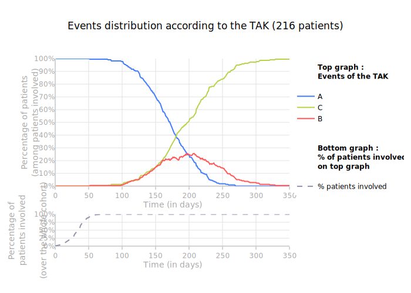

# Basic Usage

## Initialization

### Data

The base table must follow this format:

| ID_PATIENT | TIMESTAMP |  EVT |
| ---------: | :-------- | ---: |
|          0 | 0         |   in |
|          0 | 15        |    A |
|          0 | 32        |    B |
|          0 | 160       |  out |
|          1 | 0         |   in |
|          1 | 11        |    C |
|          1 | 54        |  out |

!!! warning "Conditions to check"

    - Each patient must have an `in` as the first event
    - Each patient must have an `out` as the last event
    - A patient cannot have more than one `in` or `out` event
    - A patient cannot have multiple events on the same TIMESTAMP
    - TIMESTAMP must be an integer
    - ID_PATIENT can either be an integer or a string

### Initialization and Training

This code snippet creates a `TakBuilder` object and fits it.

```python
from opentak import TakBuilder

tak = TakBuilder(base).build()
tak.fit(n_clusters = 3)
```

!!! question "What are the possible build parameters?"

        ``"hca"``
        Classic TAK by default (Hierarchical Clustering Analysis).
        Example:
        ``` python
        tak = TakBuilder(base).build("hca")
        ```
The clusters are stored in the attribute `tak.list_ids_cluster`

For more details on the implementation, refer to the advanced usage section.

!!! question "Does the execution time depend on the number of patients ?"
    The execution time depends on many parameters, especially the number of patients, but also the observation period.
    Using custom distances also drastically increases calculation time.
    Simulations on simulated datasets give fairly fast results:   
    - 2 minutes for 3000 patients over 5 years   
    - 20 minutes for 5000 patients over 5 years   
    However, when working on "real" data, the order of magnitude quickly changes: between 30 minutes and 1 hour for 2000 patients over 5 years.

## Visualization

#### Initializing the `TakVisualizer`

Simple example

```python
from opentak import TakVisualizer

tak_viz = TakVisualizer(tak)
tak_viz.process_visualization()
```

Example with color update

```python
from opentak import TakVisualizer

tak_viz = TakVisualizer(tak)
tak_viz.update_colors(dict_new_colors={"A": "rgb(255, 114, 64)"}, B="#5E5A85")
tak_viz.process_visualization()
```

#### TAK

```python
figplotly = tak_viz.get_plot()
config = {"toImageButtonOptions": {"height": None, "width": None}}
figplotly.show(config=config)
```


!!! tip

    To automatically apply the optimal config, you can import `nice_plotly_show`

    ```python
    from opentak.visualization import nice_plotly_show

    figplotly = tak_viz.get_plot()
    nice_plotly_show(figplotly)
    ```

#### Distribution curve 

```python
fig_events_on_tak_percent = tak_viz.graph_events_rep_on_tak(
    events_not_shown=["start", "in", "out", "end"],
    events_not_in_percent=["start", "in", "out", "end"],
    threshold_percent=0
)
```


