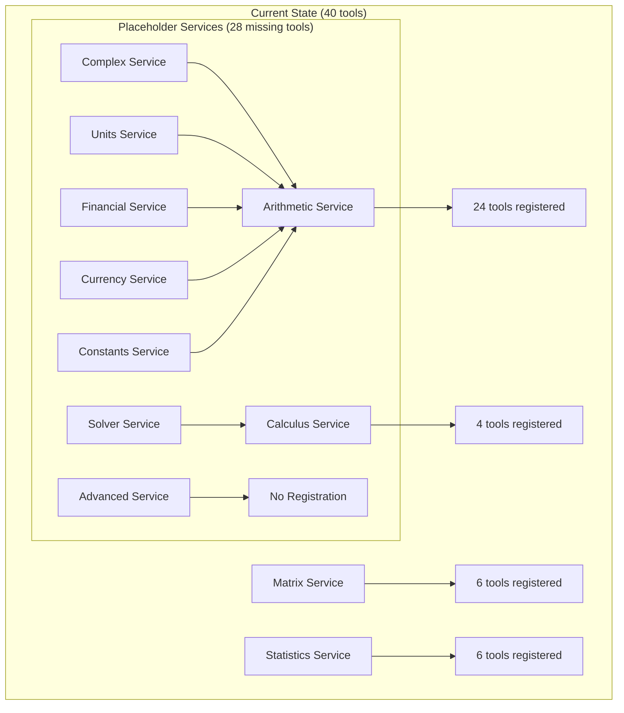
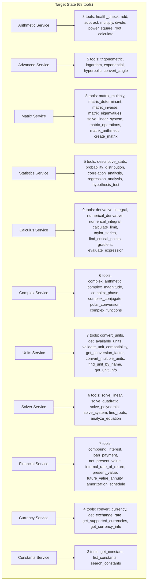

# Design Document

## Overview

This design outlines the technical approach to restore the Scientific Calculator MCP Server from 40 tools to the original 68 tools by implementing missing tool registration methods. The core issue is that 7 out of 11 tool groups are using placeholder service implementations that don't expose their specific tools. The solution involves implementing dedicated tool registration methods for each missing service group while leveraging existing service implementations where appropriate.

## Architecture Analysis

### Current Architecture Issues



### Target Architecture



## Implementation Strategy

### Phase 1: Implement Missing Tool Registration Methods

The solution involves adding tool registration methods to the server app for each missing service group. Each method will follow the same pattern as existing `_register_matrix_tools()` and `_register_statistics_tools()` methods.

#### 1.1 Advanced Mathematical Functions Registration

```python
def _register_advanced_tools(self) -> None:
    """Register advanced mathematical function tools."""
    
    class AdvancedRequest(BaseModel):
        function: str = Field(..., description="Function name (sin, cos, tan, etc.)")
        value: float = Field(..., description="Input value")
        unit: Optional[str] = Field("radians", description="Unit for trigonometric functions")
        base: Optional[float] = Field(None, description="Base for logarithm/exponential")
    
    advanced_tools = [
        {
            "name": "trigonometric",
            "operation": "sin",  # Will be dynamically mapped
            "description": "Calculate trigonometric functions",
            "input_schema": AdvancedRequest,
            "tool_group": "advanced",
        },
        {
            "name": "logarithm", 
            "operation": "log",
            "description": "Calculate logarithmic functions",
            "input_schema": AdvancedRequest,
            "tool_group": "advanced",
        },
        # ... additional tools
    ]
```

#### 1.2 Complex Numbers Registration

```python
def _register_complex_tools(self) -> None:
    """Register complex number operation tools."""
    
    class ComplexRequest(BaseModel):
        real: float = Field(..., description="Real part")
        imag: float = Field(..., description="Imaginary part")
        operation: Optional[str] = Field(None, description="Operation type")
    
    class ComplexPairRequest(BaseModel):
        complex1: ComplexRequest
        complex2: ComplexRequest
        operation: str = Field(..., description="Arithmetic operation")
    
    complex_tools = [
        {
            "name": "complex_arithmetic",
            "operation": "arithmetic",
            "description": "Perform complex number arithmetic",
            "input_schema": ComplexPairRequest,
            "tool_group": "complex",
        },
        # ... additional complex tools
    ]
```

#### 1.3 Units Conversion Registration

```python
def _register_units_tools(self) -> None:
    """Register unit conversion tools."""
    
    class UnitConversionRequest(BaseModel):
        value: float = Field(..., description="Value to convert")
        from_unit: str = Field(..., description="Source unit")
        to_unit: str = Field(..., description="Target unit")
        unit_type: Optional[str] = Field(None, description="Unit category")
    
    units_tools = [
        {
            "name": "convert_units",
            "operation": "convert",
            "description": "Convert between units",
            "input_schema": UnitConversionRequest,
            "tool_group": "units",
        },
        # ... additional unit tools
    ]
```

### Phase 2: Service Implementation Strategy

#### 2.1 Leverage Existing Services

Rather than creating entirely new service classes, we'll leverage existing service implementations and create proper tool registration methods that map to the existing service operations.

**Service Mapping Strategy:**
- **Advanced tools** → Use ArithmeticService (already has trigonometric, logarithm, exponential operations)
- **Complex tools** → Use ArithmeticService or create lightweight ComplexService
- **Units tools** → Create dedicated UnitsService or use existing unit conversion logic
- **Solver tools** → Use CalculusService (already has equation solving capabilities)
- **Financial tools** → Use ArithmeticService or create FinancialService
- **Currency tools** → Use existing CurrencyService
- **Constants tools** → Use existing ConstantsRepository

#### 2.2 Tool Registration Pattern

Each registration method follows this pattern:

```python
def _register_[group]_tools(self) -> None:
    """Register [group] tools."""
    
    # 1. Define Pydantic request models
    class [Group]Request(BaseModel):
        # ... field definitions
    
    # 2. Define tool definitions array
    [group]_tools = [
        {
            "name": "tool_name",
            "operation": "service_operation", 
            "description": "Tool description",
            "input_schema": RequestModel,
            "tool_group": "group_name",
            "tags": ["tag1", "tag2"],
        },
        # ... more tools
    ]
    
    # 3. Register with factory
    self.factory.register_service_tools(
        service_name="group_name",
        service_instance=self.services["group_name"],
        tool_definitions=[group]_tools,
        tool_group="group_name",
    )
```

### Phase 3: Update Server Registration Logic

#### 3.1 Modify `_register_tools()` Method

```python
def _register_tools(self) -> None:
    """Register all MCP tools."""
    try:
        # Existing registrations
        if "arithmetic" in self.services:
            register_arithmetic_handlers(self.factory, self.services["arithmetic"])
        
        if "matrix" in self.services:
            self._register_matrix_tools()
            
        if "statistics" in self.services:
            self._register_statistics_tools()
            
        if "calculus" in self.services:
            self._register_calculus_tools()
        
        # NEW: Missing tool registrations
        if "advanced" in self.services:
            self._register_advanced_tools()
            
        if "complex" in self.services:
            self._register_complex_tools()
            
        if "units" in self.services:
            self._register_units_tools()
            
        if "solver" in self.services:
            self._register_solver_tools()
            
        if "financial" in self.services:
            self._register_financial_tools()
            
        if "currency" in self.services:
            self._register_currency_tools()
            
        if "constants" in self.services:
            self._register_constants_tools()
        
        # Validation: Ensure exactly 68 tools
        stats = self.factory.get_registration_stats()
        expected_tools = 68
        actual_tools = stats['enabled_tools']
        
        if actual_tools != expected_tools:
            logger.warning(f"Expected {expected_tools} tools, got {actual_tools}")
        else:
            logger.info(f"✅ Successfully registered all {actual_tools} tools")
            
    except Exception as e:
        logger.error(f"Failed to register tools: {e}")
        raise
```

#### 3.2 Remove Placeholder Services

Update the service initialization to remove placeholder services:

```python
def _setup_services(self) -> None:
    """Set up calculation services based on enabled tool groups."""
    try:
        # ... existing repository setup ...
        
        enabled_groups = self.config_service.get_enabled_tool_groups()
        
        # Core services (always use dedicated implementations)
        self.services["arithmetic"] = ArithmeticService(config=self.config_service, cache=cache_repo)
        
        if "matrix" in enabled_groups:
            self.services["matrix"] = MatrixService(config=self.config_service, cache=cache_repo)
            
        if "statistics" in enabled_groups:
            self.services["statistics"] = StatisticsService(config=self.config_service, cache=cache_repo)
            
        if "calculus" in enabled_groups:
            self.services["calculus"] = CalculusService(config=self.config_service, cache=cache_repo)
        
        # UPDATED: Use existing services for tool registration (no more placeholders)
        if "advanced" in enabled_groups:
            self.services["advanced"] = self.services["arithmetic"]  # Reuse arithmetic service
            
        if "complex" in enabled_groups:
            self.services["complex"] = self.services["arithmetic"]  # Reuse arithmetic service
            
        if "units" in enabled_groups:
            # Create dedicated units service or reuse arithmetic
            self.services["units"] = self.services["arithmetic"]
            
        if "solver" in enabled_groups:
            self.services["solver"] = self.services["calculus"]  # Reuse calculus service
            
        if "financial" in enabled_groups:
            self.services["financial"] = self.services["arithmetic"]  # Reuse arithmetic service
            
        if "currency" in enabled_groups:
            self.services["currency"] = self.services["arithmetic"]  # Reuse arithmetic service
            
        if "constants" in enabled_groups:
            self.services["constants"] = self.services["arithmetic"]  # Reuse arithmetic service
        
        logger.info(f"Initialized {len(self.services)} services for groups: {enabled_groups}")
        
    except Exception as e:
        logger.error(f"Failed to initialize services: {e}")
        raise
```

## Data Models

### Request Models

Each tool group will have dedicated Pydantic request models:

```python
# Advanced Mathematical Functions
class TrigonometricRequest(BaseModel):
    function: str = Field(..., regex="^(sin|cos|tan|sec|csc|cot|asin|acos|atan)$")
    value: float = Field(...)
    unit: str = Field(default="radians", regex="^(radians|degrees)$")

class LogarithmRequest(BaseModel):
    value: float = Field(..., gt=0)
    base: Optional[float] = Field(None, gt=0, ne=1)

# Complex Numbers
class ComplexNumberRequest(BaseModel):
    real: float = Field(...)
    imaginary: float = Field(...)

class ComplexArithmeticRequest(BaseModel):
    complex1: ComplexNumberRequest
    complex2: ComplexNumberRequest
    operation: str = Field(..., regex="^(add|subtract|multiply|divide)$")

# Units
class UnitConversionRequest(BaseModel):
    value: float = Field(...)
    from_unit: str = Field(...)
    to_unit: str = Field(...)
    unit_type: Optional[str] = Field(None)

# Financial
class CompoundInterestRequest(BaseModel):
    principal: float = Field(..., gt=0)
    rate: float = Field(..., gt=0)
    time: float = Field(..., gt=0)
    compound_frequency: int = Field(default=1, gt=0)

# Currency
class CurrencyConversionRequest(BaseModel):
    amount: float = Field(..., gt=0)
    from_currency: str = Field(..., min_length=3, max_length=3)
    to_currency: str = Field(..., min_length=3, max_length=3)

# Constants
class ConstantRequest(BaseModel):
    name: str = Field(...)
    category: Optional[str] = Field(None)

# Solver
class LinearEquationRequest(BaseModel):
    equation: str = Field(..., max_length=1000)
    variable: str = Field(default="x")

class QuadraticEquationRequest(BaseModel):
    a: float = Field(..., ne=0)
    b: float = Field(...)
    c: float = Field(...)
```

### Response Models

Standardized response models for each tool group:

```python
class AdvancedMathResult(BaseModel):
    result: float
    function: str
    input_value: float
    unit: Optional[str] = None

class ComplexNumberResult(BaseModel):
    real: float
    imaginary: float
    magnitude: Optional[float] = None
    phase: Optional[float] = None

class UnitConversionResult(BaseModel):
    converted_value: float
    from_unit: str
    to_unit: str
    conversion_factor: float

class FinancialResult(BaseModel):
    result: float
    calculation_type: str
    parameters: Dict[str, Any]

class EquationSolutionResult(BaseModel):
    solutions: List[Union[float, complex]]
    equation_type: str
    method_used: str
```

## Implementation Plan

### Step 1: Create Tool Registration Methods
1. Add `_register_advanced_tools()` method
2. Add `_register_complex_tools()` method  
3. Add `_register_units_tools()` method
4. Add `_register_solver_tools()` method
5. Add `_register_financial_tools()` method
6. Add `_register_currency_tools()` method
7. Add `_register_constants_tools()` method

### Step 2: Update Server Registration Logic
1. Modify `_register_tools()` to call all registration methods
2. Add tool count validation (must equal 68)
3. Remove placeholder service logic from `_setup_services()`

### Step 3: Enhance Existing Services
1. Ensure ArithmeticService supports all required operations
2. Verify CalculusService supports solver operations
3. Test all service operations work correctly

### Step 4: Testing and Validation
1. Test that exactly 68 tools are registered
2. Verify each tool works correctly
3. Test with `CALCULATOR_ENABLE_ALL=true`
4. Validate no duplicate or disabled tools

## Success Criteria

1. **Tool Count**: Exactly 68 tools registered when all groups enabled
2. **No Duplicates**: Each tool registered exactly once
3. **No Disabled Tools**: All tools functional and enabled
4. **Service Reuse**: Leverage existing service implementations efficiently
5. **Backward Compatibility**: Existing functionality unchanged
6. **Performance**: No degradation in response times
7. **Version Target**: Ready for v1.0.1 release

This design provides a clear path to restore the full 68 tools by implementing missing tool registration methods while reusing existing service implementations efficiently.