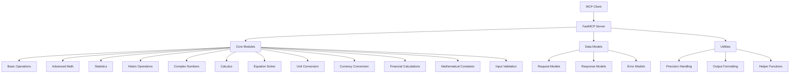

# Design Document

## Overview

The Scientific Calculator MCP Server is designed as a comprehensive mathematical computation service using the FastMCP v2 framework. The server exposes mathematical capabilities through MCP tools, following a modular architecture that separates concerns across different mathematical domains. The design prioritizes performance, security, precision, and maintainability while providing a rich set of mathematical operations.

## Architecture

### High-Level Architecture



### Project Structure

```
p6plab-mcp-calculator/
├── pyproject.toml              # PyPI packaging with FastMCP v2 dependency and uvx entry points
├── README.md                   # PyPI-compatible installation and usage documentation
├── LICENSE                     # MIT License for PyPI distribution
├── .gitignore                  # Python gitignore
├── MANIFEST.in                 # PyPI package manifest
├── scripts/                    # Development and deployment shell scripts
│   ├── build-uvx-package.sh   # Build uvx-compatible package for distribution
│   ├── test-uvx-package.sh    # Test uvx package creation and execution
│   ├── test-uvx-install.sh    # Test uvx installation from PyPI repositories
│   ├── publish-test-pypi.sh   # Publish uvx-compatible package to Test PyPI
│   ├── publish-pypi.sh        # Publish uvx-compatible package to production PyPI
│   ├── run-tests.sh           # Run comprehensive test suite
│   └── clean.sh               # Clean build artifacts and uvx cache
├── calculator/
│   ├── __init__.py
│   ├── server.py              # Main FastMCP server implementation
│   ├── core/                  # Mathematical computation modules
│   │   ├── __init__.py
│   │   ├── basic.py           # Basic arithmetic operations
│   │   ├── advanced.py        # Advanced mathematical functions
│   │   ├── statistics.py      # Statistical operations
│   │   ├── matrix.py          # Matrix operations
│   │   ├── complex.py         # Complex number operations
│   │   ├── calculus.py        # Calculus operations
│   │   ├── solver.py          # Equation solving
│   │   ├── units.py           # Unit conversions
│   │   ├── currency.py        # Currency conversion (optional)
│   │   ├── financial.py       # Financial calculations
│   │   ├── constants.py       # Mathematical and physical constants
│   │   └── validators.py      # Input validation and error handling
│   ├── models/                # Pydantic data models
│   │   ├── __init__.py
│   │   ├── request.py         # Request models
│   │   ├── response.py        # Response models
│   │   └── errors.py          # Error models
│   └── utils/                 # Utility functions
│       ├── __init__.py
│       ├── precision.py       # Precision handling with Decimal
│       ├── formatting.py      # Output formatting
│       └── helpers.py         # Common utility functions
├── tests/                     # Comprehensive test suite
│   ├── __init__.py
│   ├── test_server.py         # Server integration tests
│   ├── test_basic.py          # Basic operations tests
│   ├── test_advanced.py       # Advanced functions tests
│   ├── test_statistics.py     # Statistical operations tests
│   ├── test_matrix.py         # Matrix operations tests
│   ├── test_units.py          # Unit conversion tests
│   ├── test_performance.py    # Performance benchmarks
│   └── fixtures/              # Test data fixtures
└── docs/                      # Documentation
    ├── api.md                 # API documentation
    ├── examples.md            # Usage examples
    └── troubleshooting.md     # Common issues and solutions
```

## Components and Interfaces

### FastMCP Server (server.py)

The main server implementation using FastMCP v2 framework:

```python
from fastmcp import FastMCP
from calculator.core import *
from calculator.models import *
from calculator.utils import *

# Initialize FastMCP server
mcp = FastMCP("Scientific Calculator")

# Basic arithmetic tools
@mcp.tool
def add(a: float, b: float) -> CalculationResult:
    """Add two numbers with high precision."""
    
@mcp.tool
def calculate(expression: str) -> CalculationResult:
    """Evaluate mathematical expressions safely."""

# Advanced mathematical functions
@mcp.tool
def trigonometric(function: str, value: float, unit: str = "radians") -> CalculationResult:
    """Calculate trigonometric functions."""

# Statistical operations
@mcp.tool
def descriptive_stats(data: list[float]) -> StatisticalResult:
    """Calculate descriptive statistics for a dataset."""

# Matrix operations
@mcp.tool
def matrix_multiply(matrix_a: list[list[float]], matrix_b: list[list[float]]) -> MatrixResult:
    """Multiply two matrices."""

# Unit conversions
@mcp.tool
def convert_units(value: float, from_unit: str, to_unit: str, unit_type: str) -> ConversionResult:
    """Convert between different units of measurement."""

# Mathematical constants resource
@mcp.resource("constants://{constant_name}")
def get_constant(constant_name: str) -> str:
    """Get mathematical or physical constants."""

if __name__ == "__main__":
    mcp.run()
```

### Core Mathematical Modules

#### Basic Operations (core/basic.py)
- Arithmetic operations with Decimal precision
- Power and root operations
- Modular arithmetic
- Input validation and error handling

#### Advanced Mathematics (core/advanced.py)
- Trigonometric functions using numpy
- Logarithmic and exponential functions
- Hyperbolic functions
- Angle unit conversion (radians/degrees)

#### Statistics Module (core/statistics.py)
- Descriptive statistics using numpy/scipy
- Probability distributions
- Correlation and regression analysis
- Hypothesis testing functions

#### Matrix Operations (core/matrix.py)
- Matrix arithmetic using numpy
- Linear algebra operations
- Eigenvalue/eigenvector calculations
- Matrix decomposition functions

#### Complex Numbers (core/complex.py)
- Complex arithmetic operations
- Polar/rectangular conversions
- Complex function evaluations

#### Calculus Operations (core/calculus.py)
- Symbolic differentiation using SymPy
- Numerical integration using scipy
- Definite and indefinite integrals
- Multi-variable calculus support

#### Equation Solver (core/solver.py)
- Linear equation systems
- Polynomial root finding
- Numerical optimization
- Constraint solving

#### Unit Conversion (core/units.py)
- Comprehensive unit database
- Conversion factor calculations
- Unit validation and normalization
- Scientific unit support

#### Currency Conversion (core/currency.py)
- Optional external API integration
- Fallback mechanisms
- Rate caching
- Privacy controls

### Data Models

#### Request Models (models/request.py)
```python
from pydantic import BaseModel, Field
from typing import List, Optional, Union

class BasicOperationRequest(BaseModel):
    a: float
    b: float

class ExpressionRequest(BaseModel):
    expression: str = Field(..., max_length=1000)

class TrigonometricRequest(BaseModel):
    function: str = Field(..., regex="^(sin|cos|tan|sec|csc|cot|asin|acos|atan)$")
    value: float
    unit: str = Field(default="radians", regex="^(radians|degrees)$")

class StatisticalRequest(BaseModel):
    data: List[float] = Field(..., min_items=1, max_items=10000)

class MatrixRequest(BaseModel):
    matrix_a: List[List[float]]
    matrix_b: Optional[List[List[float]]] = None

class UnitConversionRequest(BaseModel):
    value: float
    from_unit: str
    to_unit: str
    unit_type: str
```

#### Response Models (models/response.py)
```python
class CalculationResult(BaseModel):
    result: Union[float, str]
    precision: int
    unit: Optional[str] = None
    metadata: Optional[dict] = None

class StatisticalResult(BaseModel):
    mean: float
    median: float
    mode: Optional[float]
    std_dev: float
    variance: float
    count: int

class MatrixResult(BaseModel):
    result: List[List[float]]
    dimensions: tuple[int, int]
    determinant: Optional[float] = None
    rank: Optional[int] = None
```

#### Error Models (models/errors.py)
```python
class CalculatorError(BaseModel):
    error: bool = True
    error_type: str
    message: str
    details: dict
    suggestions: List[str]
```

## Data Models

### Input Validation Strategy
- All inputs validated using Pydantic models
- Range checking for numerical inputs
- Expression parsing validation using SymPy
- Matrix dimension compatibility checks
- Unit type validation against known units

### Precision Handling
- Use Python's Decimal module for high-precision arithmetic
- Configurable precision levels (default: 15 decimal places)
- Proper rounding and truncation strategies
- Precision metadata in responses

### Caching Strategy
- LRU cache for expensive operations (matrix operations, complex calculations)
- Configurable cache size via environment variables
- Cache invalidation for time-sensitive operations (currency rates)
- Memory-efficient caching for large datasets

## Error Handling

### Error Hierarchy
```python
class CalculatorError(Exception):
    """Base calculator error"""

class ValidationError(CalculatorError):
    """Input validation errors"""

class PrecisionError(CalculatorError):
    """Precision-related errors"""

class MatrixError(CalculatorError):
    """Matrix operation errors"""

class UnitConversionError(CalculatorError):
    """Unit conversion errors"""

class CurrencyError(CalculatorError):
    """Currency conversion errors"""
```

### Error Response Format
All errors return structured responses with:
- Error type classification
- Clear, actionable error messages
- Input validation details
- Suggested corrections
- Context information for debugging

### Graceful Degradation
- Fallback mechanisms for external API failures
- Reduced precision modes for memory constraints
- Alternative algorithms for edge cases
- Timeout handling for long-running operations

## Testing Strategy

### Unit Testing
- Individual function testing with pytest
- Edge case coverage (division by zero, invalid inputs)
- Precision accuracy validation
- Performance benchmarking

### Integration Testing
- End-to-end MCP communication testing
- Complex calculation workflows
- Error propagation testing
- Resource usage monitoring

### Performance Testing
- Response time benchmarking
- Memory usage profiling
- Concurrent operation testing
- Load testing with large datasets

### Security Testing
- Input sanitization validation
- Expression injection prevention
- Resource limit enforcement
- External API security testing

## Security Considerations

### Input Sanitization
- Strict validation of all mathematical expressions
- Prevention of code injection through eval()
- Limits on computation complexity and memory usage
- Sanitization of all user inputs using Pydantic

### Resource Management
- Maximum computation time limits (configurable)
- Memory usage restrictions
- Concurrent operation limits
- Rate limiting for expensive operations

### Privacy Controls
- Currency conversion disabled by default
- No external API calls without explicit enablement
- Local computation preferred over external services
- Environment variable controls for all external features

### External API Security
- API key validation and secure storage
- HTTPS-only external communications
- Request timeout and retry limits
- Fallback to cached data when APIs unavailable

### Security Scanning with Bandit

#### Bandit Integration Architecture
```python
# .bandit configuration file
[bandit]
exclude_dirs = ["tests", "venv", "dist", "build"]
skips = ["B101"]  # Skip assert_used test for test files
severity = ["high", "medium", "low"]

# Security scanning in CI/CD pipeline
bandit -r calculator/ -f json -o security-report.json
bandit -r calculator/ -ll  # Only show medium and high severity
```

#### Security Scanning Workflow
1. **Pre-commit Scanning**: Bandit runs on all Python files before commits
2. **CI/CD Integration**: Automated security scanning in build pipeline
3. **Severity Classification**: 
   - **High Severity**: Immediate fix required, blocks deployment
   - **Medium Severity**: Fix required before release
   - **Low Severity**: May be left with proper justification
4. **Report Generation**: JSON and text reports with remediation guidance

#### Security Rules Configuration
```python
# Custom bandit configuration for mathematical operations
[bandit.blacklist]
# Allow mathematical eval() alternatives like SymPy parsing
B307 = "Use of possibly insecure function - consider using safer alternatives"

# Security scanning shell script integration
#!/bin/bash
echo "🔒 Running security scan with bandit..."
bandit -r calculator/ -f json -o reports/security-report.json
bandit -r calculator/ -ll --exit-zero  # Show issues but don't fail build for low severity
```

#### Remediation Strategy
- **Code Review**: All security issues reviewed by development team
- **Documentation**: Security scan results documented in build reports
- **Continuous Monitoring**: Regular security scans on dependency updates
- **False Positive Management**: Proper configuration to exclude legitimate patterns

## Performance Optimization

### Computational Efficiency
- Vectorized operations using numpy
- Optimized algorithms for matrix operations
- Lazy evaluation for complex expressions
- Memory-efficient data structures

### Caching Strategy
- Result caching for expensive operations
- Smart cache invalidation
- Memory-bounded cache sizes
- Cache warming for common operations

### Concurrency Support
- Async/await patterns for I/O operations
- Thread-safe mathematical operations
- Connection pooling for external APIs
- Resource sharing optimization

## Configuration Management

### Environment Variables
```python
CALCULATOR_PRECISION = 15                    # Decimal precision
CALCULATOR_LOG_LEVEL = "INFO"               # Logging level
CALCULATOR_CACHE_SIZE = 1000                # Cache size
CALCULATOR_ENABLE_CURRENCY_CONVERSION = False  # Currency feature
CALCULATOR_CURRENCY_API_KEY = ""            # API key
CALCULATOR_MAX_COMPUTATION_TIME = 30        # Timeout in seconds
CALCULATOR_MAX_MEMORY_MB = 512              # Memory limit
```

### Security Configuration (.bandit)
```ini
[bandit]
exclude_dirs = ["tests", "venv", "dist", "build", "__pycache__"]
skips = ["B101"]  # Skip assert_used test for test files
severity = ["high", "medium", "low"]

[bandit.blacklist]
# Mathematical operations may use eval-like functions safely
B307 = "Use of possibly insecure function - consider using safer alternatives"

[bandit.hardcoded_password_string]
# Exclude test files and configuration examples
word_list = ["tests/", "examples/", "docs/"]
```

### Runtime Configuration
- Dynamic precision adjustment
- Cache size modification
- Feature enabling/disabling
- Performance tuning parameters
- Security scanning integration

This design provides a robust, scalable, and secure foundation for the Scientific Calculator MCP Server while maintaining high performance and comprehensive mathematical capabilities.
### Fast
MCP v2 Integration

The server leverages FastMCP v2's advanced features:

#### Server Execution
```python
# Development mode
fastmcp run server.py

# Production deployment with configuration
mcp.run(host="0.0.0.0", port=8000)

# uvx execution (recommended for MCP servers)
# uvx p6plab-mcp-calculator@latest
```

#### Resource Templates
Mathematical constants and formulas exposed as dynamic resources:

```python
@mcp.resource("constants://{category}/{name}")
def get_constant(category: str, name: str) -> str:
    """Get mathematical or physical constants by category."""

@mcp.resource("formulas://{domain}/{formula}")
def get_formula(domain: str, formula: str) -> str:
    """Get mathematical formulas and their descriptions."""
```

#### Context and State Management
```python
from fastmcp import Context

@mcp.tool
def solve_system(equations: list[str], ctx: Context) -> SystemSolutionResult:
    """Solve system of equations with context tracking."""
    # Access request context for logging and state management
    ctx.log(f"Solving system with {len(equations)} equations")
    return solve_linear_system(equations)
```

#### Error Handling Integration
FastMCP v2's built-in error handling with custom calculator exceptions:

```python
from fastmcp import MCPError

class CalculatorMCPError(MCPError):
    """Custom MCP error for calculator operations."""
    
@mcp.tool
def divide(a: float, b: float) -> float:
    """Divide two numbers."""
    if b == 0:
        raise CalculatorMCPError("Division by zero is not allowed")
    return a / b
```

This design ensures compatibility with FastMCP v2's latest features while maintaining the comprehensive mathematical capabilities outlined in the requirements.
##
 PyPI Distribution Architecture

### Package Structure for PyPI
The project follows modern Python packaging standards for PyPI distribution:

```toml
# pyproject.toml
[build-system]
requires = ["hatchling"]
build-backend = "hatchling.build"

[project]
name = "p6plab-mcp-calculator"
dynamic = ["version"]
description = "Scientific Calculator MCP Server"
readme = "README.md"
license = {file = "LICENSE"}
authors = [{name = "Author Name", email = "author@example.com"}]
classifiers = [
    "Development Status :: 4 - Beta",
    "Intended Audience :: Developers",
    "License :: OSI Approved :: MIT License",
    "Programming Language :: Python :: 3.8",
    "Programming Language :: Python :: 3.9",
    "Programming Language :: Python :: 3.10",
    "Programming Language :: Python :: 3.11",
    "Programming Language :: Python :: 3.12",
]
dependencies = [
    "fastmcp>=2.0.0",
    "numpy>=1.21.0",
    "scipy>=1.7.0",
    "sympy>=1.9.0",
    "pydantic>=2.0.0",
    "loguru>=0.6.0",
]

[project.optional-dependencies]
dev = [
    "pytest>=7.0.0",
    "pytest-asyncio>=0.21.0",
    "pytest-cov>=4.0.0",
    "bandit>=1.7.0",
    "ruff>=0.1.0",
    "pyright>=1.1.0",
]

[project.scripts]
p6plab-mcp-calculator = "calculator.server:main"

[project.urls]
Homepage = "https://github.com/username/p6plab-mcp-calculator"
Repository = "https://github.com/username/p6plab-mcp-calculator"
Issues = "https://github.com/username/p6plab-mcp-calculator/issues"
```

### uvx Packaging and Execution Support
The server is designed for optimal uvx packaging and execution:

#### Entry Point Configuration
```python
# calculator/server.py
def main():
    """Main entry point for uvx execution."""
    mcp = FastMCP("Scientific Calculator")
    # ... tool definitions ...
    mcp.run()

if __name__ == "__main__":
    main()
```

#### uvx Command Support
```bash
# Direct execution
uvx p6plab-mcp-calculator@latest

# With environment variables
CALCULATOR_PRECISION=20 uvx p6plab-mcp-calculator@latest

# MCP client configuration
{
  "mcpServers": {
    "p6plab-mcp-calculator": {
      "command": "uvx",
      "args": ["p6plab-mcp-calculator@latest"],
      "env": {
        "CALCULATOR_PRECISION": "15",
        "CALCULATOR_LOG_LEVEL": "INFO"
      }
    }
  }
}
```

### Distribution Pipeline
1. **Development Testing**: Local testing with virtual environments
2. **Test PyPI Upload**: Validation on https://test.pypi.org/
3. **Test PyPI Installation**: Verify `pip install --index-url https://test.pypi.org/simple/ p6plab-mcp-calculator`
4. **uvx Testing**: Verify `uvx --index-url https://test.pypi.org/simple/ p6plab-mcp-calculator@latest`
5. **Production PyPI**: Final release to https://pypi.org/
6. **uvx Production**: Verify `uvx p6plab-mcp-calculator@latest`

### Version Management
- Semantic versioning (MAJOR.MINOR.PATCH)
- Automated version bumping in CI/CD
- Git tag-based releases
- PyPI version consistency

This architecture ensures seamless distribution via PyPI and optimal user experience with uvx execution.
##
# Shell Scripts Architecture

The project includes comprehensive shell scripts for uvx packaging and PyPI deployment:

#### build-uvx-package.sh
```bash
#!/bin/bash
# Build uvx-compatible package
set -e

echo "🔨 Building uvx-compatible package..."
python -m build --wheel --sdist
echo "✅ Package built successfully"

echo "🧪 Validating uvx compatibility..."
# Validate entry points and dependencies
python -c "import tomllib; config = tomllib.load(open('pyproject.toml', 'rb')); print('Entry points:', config.get('project', {}).get('scripts', {}))"
echo "✅ uvx compatibility validated"
```

#### test-uvx-package.sh
```bash
#!/bin/bash
# Test uvx package locally
set -e

echo "🧪 Testing uvx package locally..."
# Install package locally
pip install -e .

echo "🚀 Testing uvx execution..."
# Test uvx execution with local package
uvx --python-preference system p6plab-mcp-calculator --help
echo "✅ uvx package test completed"
```

#### publish-test-pypi.sh
```bash
#!/bin/bash
# Publish to Test PyPI
set -e

echo "📦 Publishing to Test PyPI..."
python -m twine upload --repository testpypi dist/*
echo "✅ Published to Test PyPI"

echo "🧪 Testing installation from Test PyPI..."
uvx --index-url https://test.pypi.org/simple/ p6plab-mcp-calculator@latest --help
echo "✅ Test PyPI installation verified"
```

#### publish-pypi.sh
```bash
#!/bin/bash
# Publish to production PyPI
set -e

echo "⚠️  Publishing to production PyPI..."
read -p "Are you sure you want to publish to production PyPI? (y/N): " confirm
if [[ $confirm != [yY] ]]; then
    echo "❌ Publication cancelled"
    exit 1
fi

python -m twine upload dist/*
echo "✅ Published to production PyPI"

echo "🧪 Testing installation from PyPI..."
uvx p6plab-mcp-calculator@latest --help
echo "✅ Production PyPI installation verified"
```

#### security-scan.sh
```bash
#!/bin/bash
# Comprehensive security scanning with bandit
set -e

echo "🔒 Running security scan with bandit..."

# Create reports directory
mkdir -p reports

# Run bandit with JSON output for CI/CD integration
echo "📊 Generating detailed security report..."
bandit -r calculator/ -f json -o reports/security-report.json

# Run bandit with console output for developer feedback
echo "🔍 Scanning for High and Medium severity issues..."
bandit -r calculator/ -ll

# Check for High/Medium severity issues
echo "✅ Security scan completed - check reports/security-report.json for details"

# Parse JSON report to check severity levels
python -c "
import json
with open('reports/security-report.json', 'r') as f:
    report = json.load(f)
    
high_issues = [issue for issue in report.get('results', []) if issue.get('issue_severity') == 'HIGH']
medium_issues = [issue for issue in report.get('results', []) if issue.get('issue_severity') == 'MEDIUM']

if high_issues:
    print(f'❌ {len(high_issues)} HIGH severity issues found - deployment blocked')
    exit(1)
elif medium_issues:
    print(f'⚠️  {len(medium_issues)} MEDIUM severity issues found - fix before release')
    exit(1)
else:
    print('✅ No High or Medium severity security issues found')
"
```

#### Developer Workflow Integration
These scripts enable a streamlined development workflow:

1. **Development**: `./scripts/run-tests.sh` - Run comprehensive tests
2. **Security**: `./scripts/security-scan.sh` - Run bandit security scanning
3. **Build**: `./scripts/build-uvx-package.sh` - Create uvx-compatible package
4. **Local Test**: `./scripts/test-uvx-package.sh` - Test uvx packaging locally
5. **Test PyPI**: `./scripts/publish-test-pypi.sh` - Publish and test on Test PyPI
6. **Production**: `./scripts/publish-pypi.sh` - Publish to production PyPI
7. **Cleanup**: `./scripts/clean.sh` - Clean build artifacts

This architecture ensures consistent, reliable uvx packaging, security validation, and PyPI deployment processes.