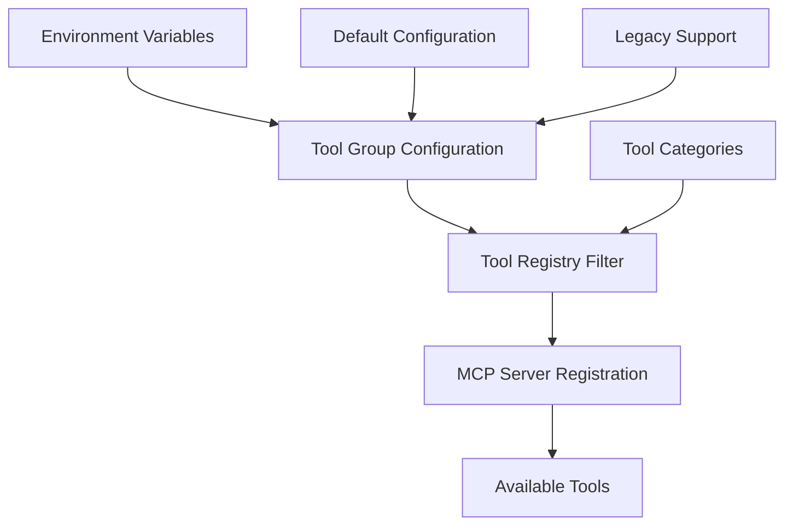
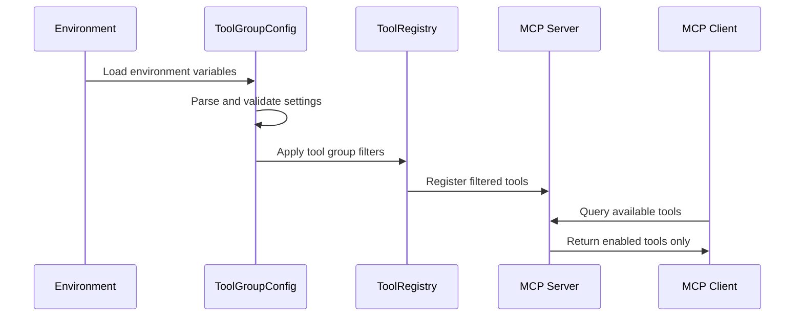

# Design Document

## Overview

The tool group management feature adds selective enabling/disabling of mathematical tool categories through environment variables. This design implements a configuration-driven approach that filters available tools at server startup, providing security, resource management, and deployment flexibility while maintaining backward compatibility.

## Architecture

### High-Level Architecture



### Component Interaction



## Components and Interfaces

### 1. Tool Group Configuration Manager

**Purpose**: Centralized configuration management for tool groups

**Interface**:
```python
class ToolGroupConfig:
    def __init__(self):
        self.enabled_groups: Set[str] = set()
        self.tool_groups: Dict[str, List[str]] = {}
    
    def load_from_environment(self) -> None
    def is_group_enabled(self, group_name: str) -> bool
    def get_enabled_tools(self) -> List[str]
    def get_group_status(self) -> Dict[str, bool]
```

**Responsibilities**:
- Parse environment variables for tool group settings
- Validate tool group names and values
- Provide tool filtering based on enabled groups
- Support preset combinations (SCIENTIFIC, BUSINESS, ENGINEERING)
- Handle backward compatibility with legacy settings

### 2. Tool Group Registry

**Purpose**: Maintains mapping between tool groups and individual tools

**Interface**:
```python
class ToolGroupRegistry:
    TOOL_GROUPS = {
        'basic': ['health_check', 'add', 'subtract', 'multiply', 'divide', 'power', 'square_root', 'calculate'],
        'advanced': ['trigonometric', 'logarithm', 'exponential', 'hyperbolic', 'convert_angle'],
        'statistics': ['descriptive_stats', 'probability_distribution', 'correlation_analysis', 'regression_analysis', 'hypothesis_test'],
        # ... other groups
    }
    
    def get_tools_for_group(self, group_name: str) -> List[str]
    def get_group_for_tool(self, tool_name: str) -> str
    def get_all_groups(self) -> List[str]
```

### 3. Tool Filter

**Purpose**: Filters available tools based on configuration

**Interface**:
```python
class ToolFilter:
    def __init__(self, config: ToolGroupConfig, registry: ToolGroupRegistry):
        pass
    
    def filter_tools(self, all_tools: List[Tool]) -> List[Tool]
    def is_tool_enabled(self, tool_name: str) -> bool
    def get_disabled_tool_error(self, tool_name: str) -> Dict[str, Any]
```

### 4. Enhanced Health Check

**Purpose**: Reports current tool group status

**Interface**:
```python
async def enhanced_health_check() -> Dict[str, Any]:
    return {
        "status": "healthy",
        "enabled_groups": [...],
        "disabled_groups": [...],
        "total_tools": 42,
        "tool_counts_by_group": {...}
    }
```

## Data Models

### Environment Variable Schema

```python
class EnvironmentConfig(BaseModel):
    # Individual group controls
    calculator_enable_basic: bool = True
    calculator_enable_advanced: bool = False
    calculator_enable_statistics: bool = False
    calculator_enable_matrix: bool = False
    calculator_enable_complex: bool = False
    calculator_enable_units: bool = False
    calculator_enable_calculus: bool = False
    calculator_enable_solver: bool = False
    calculator_enable_financial: bool = False
    calculator_enable_currency: bool = False
    calculator_enable_constants: bool = False
    
    # Preset combinations
    calculator_enable_all: bool = False
    calculator_enable_scientific: bool = False
    calculator_enable_business: bool = False
    calculator_enable_engineering: bool = False
    
    # Legacy support
    calculator_enable_all_tools: bool = False
```

### Tool Group Definitions

```python
TOOL_GROUPS = {
    'basic': {
        'tools': ['health_check', 'add', 'subtract', 'multiply', 'divide', 'power', 'square_root', 'calculate'],
        'description': 'Basic arithmetic operations',
        'default_enabled': True
    },
    'advanced': {
        'tools': ['trigonometric', 'logarithm', 'exponential', 'hyperbolic', 'convert_angle'],
        'description': 'Advanced mathematical functions',
        'default_enabled': False
    },
    'statistics': {
        'tools': ['descriptive_stats', 'probability_distribution', 'correlation_analysis', 'regression_analysis', 'hypothesis_test'],
        'description': 'Statistical analysis tools',
        'default_enabled': False
    },
    # ... additional groups
}

PRESET_COMBINATIONS = {
    'scientific': ['basic', 'advanced', 'statistics', 'matrix', 'complex', 'calculus'],
    'business': ['basic', 'financial', 'currency', 'units'],
    'engineering': ['basic', 'advanced', 'matrix', 'complex', 'calculus', 'units', 'constants']
}
```

### Configuration State Model

```python
class ToolGroupState(BaseModel):
    enabled_groups: Set[str]
    disabled_groups: Set[str]
    total_enabled_tools: int
    tool_counts_by_group: Dict[str, int]
    configuration_source: str  # 'environment', 'preset', 'legacy'
    warnings: List[str]
```

## Error Handling

### Configuration Errors

1. **Invalid Group Names**: Log warning and ignore invalid groups
2. **Conflicting Settings**: Preset combinations override individual settings
3. **No Tools Enabled**: Ensure basic group is always available as fallback

### Runtime Errors

1. **Disabled Tool Access**: Return structured error with available alternatives
2. **Tool Not Found**: Distinguish between non-existent and disabled tools

```python
class DisabledToolError(Exception):
    def __init__(self, tool_name: str, group_name: str):
        self.tool_name = tool_name
        self.group_name = group_name
        self.message = f"Tool '{tool_name}' is not available. Enable the '{group_name}' group to access this tool."
```

## Testing Strategy

### Unit Tests

1. **Configuration Parsing**: Test all environment variable combinations
2. **Tool Filtering**: Verify correct tools are enabled/disabled
3. **Preset Combinations**: Test scientific, business, engineering presets
4. **Error Handling**: Test invalid configurations and disabled tool access

### Integration Tests

1. **MCP Server Integration**: Test tool registration with various configurations
2. **Health Check**: Verify status reporting accuracy
3. **Tool Execution**: Test that only enabled tools are accessible

### Configuration Test Matrix

```python
TEST_CONFIGURATIONS = [
    {'basic_only': {'CALCULATOR_ENABLE_BASIC': 'true'}},
    {'scientific': {'CALCULATOR_ENABLE_SCIENTIFIC': 'true'}},
    {'business': {'CALCULATOR_ENABLE_BUSINESS': 'true'}},
    {'custom_combination': {
        'CALCULATOR_ENABLE_BASIC': 'true',
        'CALCULATOR_ENABLE_MATRIX': 'true',
        'CALCULATOR_ENABLE_CALCULUS': 'true'
    }},
    {'all_tools': {'CALCULATOR_ENABLE_ALL': 'true'}},
    {'legacy_support': {'CALCULATOR_ENABLE_ALL_TOOLS': 'true'}}
]
```

## Implementation Phases

### Phase 1: Core Infrastructure
- Implement ToolGroupConfig and ToolGroupRegistry classes
- Add environment variable parsing
- Create tool filtering mechanism

### Phase 2: MCP Integration
- Integrate tool filtering with MCP server registration
- Implement enhanced health check
- Add error handling for disabled tools

### Phase 3: Preset Combinations
- Implement scientific, business, engineering presets
- Add ENABLE_ALL functionality
- Ensure proper precedence handling

### Phase 4: Legacy Support & Documentation
- Add backward compatibility for existing environment variables
- Update documentation with configuration examples
- Add migration guide for existing deployments

## Security Considerations

1. **Tool Isolation**: Disabled tools are not registered, preventing access
2. **Configuration Validation**: Invalid settings are logged and ignored
3. **Default Security**: Only basic tools enabled by default
4. **Audit Trail**: All configuration decisions are logged

## Performance Considerations

1. **Startup Time**: Tool filtering occurs once at startup
2. **Memory Usage**: Only enabled tools consume memory
3. **Runtime Performance**: No performance impact on enabled tools
4. **Configuration Caching**: Environment variables parsed once at startup

## Backward Compatibility

1. **Legacy Environment Variables**: Support existing CALCULATOR_ENABLE_ALL_TOOLS
2. **Default Behavior**: Maintain current functionality when no configuration is provided
3. **Migration Path**: Clear documentation for upgrading existing deployments
4. **Deprecation Timeline**: Gradual phase-out of legacy variables with warnings