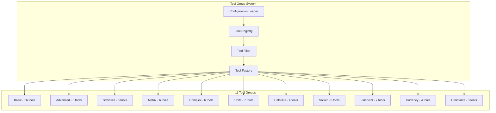

# Architecture Documentation v2.0.1

## Overview

The Scientific Calculator MCP Server v2.0.1 is built with a modular, layered architecture supporting **68 mathematical tools** across **11 specialized domains**. The system emphasizes separation of concerns, configurability, performance, and production readiness while maintaining backward compatibility.

## Related Documentation

- **[Developer Guide](DEVELOPER_GUIDE.md)** - Development setup and contribution guide
- **[API Reference](API_REFERENCE.md)** - Complete API documentation
- **[Configuration Guide](configuration.md)** - Tool group configuration
- **[Security Guide](security.md)** - Security architecture and features
- **[Deployment Guide](deployment.md)** - Production deployment architecture

## Architecture Principles

### 1. **Modular Tool Group System**
- **68 Tools** organized into **11 configurable groups**
- **Selective Enablement**: From 8 basic tools to full 68-tool suite
- **Security by Default**: Only core arithmetic enabled by default
- **Flexible Deployment**: Preset configurations for different use cases

### 2. **Production-Ready Design**
- **Zero High/Medium Security Issues** (Bandit validated)
- **Comprehensive Testing**: 554+ tests with 95%+ coverage
- **Performance Optimized**: < 1ms basic operations, intelligent caching
- **Resource Management**: Configurable limits and monitoring

### 3. **Service-Oriented Architecture**
- **11 Specialized Services**: Each domain has dedicated service layer
- **Strategy Pattern**: Algorithm selection based on input characteristics
- **Repository Pattern**: Data access abstraction with caching
- **Factory Pattern**: Automated tool registration and middleware

### 4. **Configuration-Driven**
- **Environment-Based**: Comprehensive environment variable configuration
- **Preset Support**: Scientific, Business, Engineering, All presets
- **Runtime Validation**: Configuration validation with helpful warnings
- **Migration Support**: Backward compatibility with legacy configurations

## System Architecture

### High-Level Architecture

```
┌─────────────────────────────────────────────────────────────┐
│                    MCP Client                               │
│              (AI Assistant/Application)                    │
└─────────────────────┬───────────────────────────────────────┘
                      │ MCP Protocol (JSON-RPC)
                      │
┌─────────────────────▼───────────────────────────────────────┐
│                 MCP Server (FastMCP)                       │
│                    70 Tools                                │
├─────────────────────────────────────────────────────────────┤
│                Server Layer                                 │
│  ┌─────────────┐ ┌─────────────┐ ┌─────────────┐          │
│  │Tool Registry│ │ Middleware  │ │   Factory   │          │
│  │(11 Groups)  │ │   Stack     │ │             │          │
│  └─────────────┘ └─────────────┘ └─────────────┘          │
├─────────────────────────────────────────────────────────────┤
│                Service Layer (11 Services)                 │
│  ┌─────────────┐ ┌─────────────┐ ┌─────────────┐          │
│  │ Arithmetic  │ │   Matrix    │ │ Statistics  │          │
│  │(16 tools)   │ │(6 tools)    │ │(6 tools)    │          │
│  └─────────────┘ └─────────────┘ └─────────────┘          │
│  ┌─────────────┐ ┌─────────────┐ ┌─────────────┐          │
│  │  Calculus   │ │  Advanced   │ │   Complex   │          │
│  │(4 tools)    │ │(5 tools)    │ │(6 tools)    │          │
│  └─────────────┘ └─────────────┘ └─────────────┘          │
│  ┌─────────────┐ ┌─────────────┐ ┌─────────────┐          │
│  │    Units    │ │   Solver    │ │  Financial  │          │
│  │(7 tools)    │ │(6 tools)    │ │(7 tools)    │          │
│  └─────────────┘ └─────────────┘ └─────────────┘          │
│  ┌─────────────┐ ┌─────────────┐                          │
│  │  Currency   │ │  Constants  │                          │
│  │(4 tools)    │ │(3 tools)    │                          │
│  └─────────────┘ └─────────────┘                          │
├─────────────────────────────────────────────────────────────┤
│               Repository Layer                              │
│  ┌─────────────┐ ┌─────────────┐ ┌─────────────┐          │
│  │    Cache    │ │  Constants  │ │  Currency   │          │
│  │ Repository  │ │ Repository  │ │ Repository  │          │
│  │(Redis-like) │ │(Math/Phys)  │ │(Live Rates) │          │
│  └─────────────┘ └─────────────┘ └─────────────┘          │
├─────────────────────────────────────────────────────────────┤
│                 Core Layer                                  │
│  ┌─────────────┐ ┌─────────────┐ ┌─────────────┐          │
│  │Configuration│ │  Security   │ │   Quality   │          │
│  │& Tool Groups│ │& Validation │ │& Monitoring │          │
│  └─────────────┘ └─────────────┘ └─────────────┘          │
└─────────────────────────────────────────────────────────────┘
```

### Tool Group Architecture



## Layer Details

### Server Layer (`calculator/server/`)

The server layer handles incoming requests and coordinates responses.

#### Key Components:

**`app.py`** - Main application setup
- Initializes all services and repositories
- Sets up middleware stack
- Registers MCP tools
- Provides health checks and monitoring endpoints

**`factory.py`** - Tool registration factory
- Automates MCP tool registration
- Applies consistent error handling
- Manages tool filtering based on configuration
- Provides registration statistics

**`middleware.py`** - Request/response middleware
- Request validation and sanitization
- Response formatting and error handling
- Performance monitoring and logging
- Rate limiting and security checks

**`handlers/`** - Tool-specific handlers
- `arithmetic.py` - Basic mathematical operations
- `matrix.py` - Matrix operations and linear algebra
- `statistics.py` - Statistical analysis functions
- `calculus.py` - Calculus operations
- `utility.py` - Utility functions (constants, conversions)

#### Design Patterns:
- **Factory Pattern**: Automated tool registration
- **Middleware Pattern**: Request/response processing pipeline
- **Handler Pattern**: Operation-specific request handling

### Service Layer (`calculator/services/`)

The service layer contains business logic and orchestrates operations.

#### Key Components:

**`arithmetic.py`** - Arithmetic operations service
- Basic mathematical operations (add, subtract, multiply, divide)
- Advanced functions (trigonometric, logarithmic, exponential)
- Input validation and result caching
- Error handling with detailed context

**`matrix.py`** - Matrix operations service
- Matrix arithmetic (addition, subtraction, multiplication)
- Linear algebra (determinant, inverse, eigenvalues)
- Matrix decompositions (LU, QR, SVD, Cholesky)
- Strategy pattern for algorithm selection

**`statistics.py`** - Statistical analysis service
- Descriptive statistics (mean, median, mode, variance)
- Inferential statistics (t-tests, ANOVA, correlation)
- Data visualization support (histograms, distributions)
- Grouped data analysis

**`calculus.py`** - Calculus operations service
- Symbolic calculus (derivatives, integrals, limits)
- Numerical methods (numerical integration, differentiation)
- Series expansions (Taylor, Fourier)
- Differential equation solving

**`config.py`** - Configuration service
- Centralized configuration management
- Environment variable processing
- Configuration validation with Pydantic
- Dynamic configuration updates

#### Design Patterns:
- **Service Layer Pattern**: Business logic encapsulation
- **Strategy Pattern**: Algorithm selection
- **Template Method Pattern**: Common operation structure

### Strategy Layer (`calculator/strategies/`)

The strategy layer provides algorithm selection and optimization.

#### Key Components:

**`matrix_solver.py`** - Matrix solving strategies
- LU decomposition for general matrices
- Cholesky decomposition for positive definite matrices
- QR decomposition for least squares problems
- Automatic algorithm selection based on matrix properties

**`numerical.py`** - Numerical method strategies
- Adaptive quadrature for integration
- Multiple differentiation methods
- Root finding algorithms
- Optimization strategies

**`optimization.py`** - Optimization strategies
- Performance-based algorithm selection
- Memory usage optimization
- Computation time minimization
- Accuracy vs. speed trade-offs

#### Design Patterns:
- **Strategy Pattern**: Algorithm encapsulation
- **Factory Pattern**: Strategy selection
- **Template Method Pattern**: Common algorithm structure

### Repository Layer (`calculator/repositories/`)

The repository layer manages data access and caching.

#### Key Components:

**`cache.py`** - Caching repository
- LRU cache with TTL support
- Memory management and cleanup
- Cache statistics and monitoring
- Async-safe cache operations

**`constants.py`** - Mathematical constants repository
- Physical constants (speed of light, Planck constant)
- Mathematical constants (π, e, φ)
- Unit conversion factors
- Precision-aware constant retrieval

**`currency.py`** - Currency conversion repository
- Exchange rate caching
- Multiple API fallbacks
- Rate limiting and error handling
- Historical rate support

#### Design Patterns:
- **Repository Pattern**: Data access abstraction
- **Cache-Aside Pattern**: Caching strategy
- **Fallback Pattern**: Error resilience

### Core Layer (`calculator/core/`)

The core layer provides foundational components used across all layers.

#### Key Components:

**`errors/`** - Error handling system
- Custom exception hierarchy
- Structured error responses
- Error recovery strategies
- Logging integration

**`config/`** - Configuration system
- Pydantic-based configuration models
- Environment variable mapping
- Configuration validation
- Settings management

**`monitoring/`** - Monitoring and observability
- Structured logging with correlation IDs
- Performance metrics collection
- Health check endpoints
- System resource monitoring

**`security/`** - Security framework
- Input validation and sanitization
- Rate limiting and throttling
- Security auditing
- Threat detection

**`quality/`** - Code quality monitoring
- Code metrics collection
- Quality standards enforcement
- Automated quality checks
- Quality reporting

#### Design Patterns:
- **Decorator Pattern**: Cross-cutting concerns
- **Observer Pattern**: Event monitoring
- **Chain of Responsibility**: Error handling
- **Singleton Pattern**: Global instances

## Data Flow

### Request Processing Flow

1. **Request Reception**
   ```
   MCP Client → Calculator App → Middleware Stack
   ```

2. **Request Validation**
   ```
   Middleware → Security Validation → Input Sanitization
   ```

3. **Tool Resolution**
   ```
   Tool Factory → Handler Selection → Service Routing
   ```

4. **Business Logic Execution**
   ```
   Service Layer → Strategy Selection → Repository Access
   ```

5. **Response Generation**
   ```
   Result Processing → Response Formatting → Client Response
   ```

### Caching Flow

1. **Cache Check**
   ```
   Service → Cache Repository → Cache Hit/Miss
   ```

2. **Computation (on miss)**
   ```
   Service → Strategy → Computation → Result
   ```

3. **Cache Update**
   ```
   Result → Cache Repository → TTL Management
   ```

### Error Handling Flow

1. **Error Detection**
   ```
   Any Layer → Exception Thrown → Error Handler
   ```

2. **Error Processing**
   ```
   Error Handler → Error Classification → Recovery Strategy
   ```

3. **Error Response**
   ```
   Structured Error → Response Formatting → Client Response
   ```

## Configuration Architecture

### Configuration Hierarchy

1. **Default Values** - Built-in defaults
2. **Configuration Files** - YAML/JSON configuration
3. **Environment Variables** - Runtime overrides
4. **Runtime Updates** - Dynamic configuration changes

### Configuration Categories

- **Performance**: Cache sizes, timeouts, memory limits
- **Features**: Tool group enablement, advanced features
- **Security**: Rate limits, validation rules, audit settings
- **Logging**: Log levels, formats, destinations
- **External APIs**: API keys, endpoints, fallback settings

## Monitoring Architecture

### Metrics Collection

- **Operation Metrics**: Execution time, success rate, error rate
- **System Metrics**: CPU usage, memory usage, cache hit rate
- **Business Metrics**: Tool usage, client activity, feature adoption
- **Security Metrics**: Failed validations, rate limit hits, suspicious activity

### Health Checks

- **Component Health**: Service availability, repository connectivity
- **System Health**: Resource usage, performance metrics
- **External Dependencies**: API availability, network connectivity
- **Configuration Health**: Setting validation, feature flags

### Observability

- **Structured Logging**: JSON logs with correlation IDs
- **Distributed Tracing**: Request flow tracking
- **Metrics Export**: Prometheus-compatible metrics
- **Alerting**: Threshold-based alerts

## Security Architecture

### Defense in Depth

1. **Input Validation**: Schema validation, size limits, content filtering
2. **Rate Limiting**: Per-client limits, adaptive throttling
3. **Security Auditing**: Event logging, pattern detection
4. **Error Handling**: Information disclosure prevention
5. **Resource Limits**: Memory limits, computation timeouts

### Security Monitoring

- **Audit Trail**: All operations logged with context
- **Anomaly Detection**: Unusual pattern identification
- **Threat Intelligence**: Known attack pattern recognition
- **Incident Response**: Automated response to threats

## Performance Architecture

### Optimization Strategies

1. **Caching**: Multi-level caching with intelligent eviction
2. **Algorithm Selection**: Performance-based strategy selection
3. **Resource Management**: Memory and CPU optimization
4. **Lazy Loading**: On-demand module loading
5. **Connection Pooling**: Efficient resource utilization

### Performance Monitoring

- **Response Time Tracking**: P50, P90, P95, P99 percentiles
- **Throughput Monitoring**: Requests per second, concurrent operations
- **Resource Utilization**: CPU, memory, cache efficiency
- **Bottleneck Identification**: Performance profiling and analysis

## Extensibility Architecture

### Adding New Operations

1. **Create Service Method**: Implement business logic
2. **Add Handler**: Create MCP tool handler
3. **Register Tool**: Use factory for registration
4. **Add Tests**: Unit and integration tests
5. **Update Documentation**: API and usage documentation

### Adding New Strategies

1. **Implement Strategy Interface**: Follow strategy pattern
2. **Add Strategy Selection Logic**: Automatic selection criteria
3. **Performance Benchmarking**: Compare with existing strategies
4. **Integration Testing**: Verify strategy integration
5. **Documentation**: Strategy usage and performance characteristics

### Adding New Repositories

1. **Implement Repository Interface**: Follow repository pattern
2. **Add Caching Support**: Integrate with cache layer
3. **Error Handling**: Implement fallback strategies
4. **Configuration**: Add repository-specific settings
5. **Monitoring**: Add repository health checks

## Testing Architecture

### Test Categories

1. **Unit Tests**: Individual component testing
2. **Integration Tests**: Component interaction testing
3. **Performance Tests**: Load and stress testing
4. **Security Tests**: Vulnerability and penetration testing
5. **Compatibility Tests**: Backward compatibility verification

### Test Infrastructure

- **Test Fixtures**: Reusable test data and mocks
- **Test Utilities**: Common testing functions
- **Performance Benchmarks**: Automated performance regression testing
- **Security Scans**: Automated vulnerability scanning
- **Quality Gates**: Automated quality checks in CI/CD

## Deployment Architecture

### Deployment Options

1. **Standalone Server**: Direct Python execution
2. **Container Deployment**: Docker containerization
3. **Serverless Deployment**: AWS Lambda, Azure Functions
4. **MCP Integration**: Direct MCP client integration

### Configuration Management

- **Environment-Specific Configs**: Development, staging, production
- **Secret Management**: API keys, credentials
- **Feature Flags**: Runtime feature control
- **Configuration Validation**: Startup configuration checks

### Monitoring and Alerting

- **Health Endpoints**: Kubernetes-compatible health checks
- **Metrics Export**: Prometheus metrics endpoint
- **Log Aggregation**: Centralized log collection
- **Alert Management**: Threshold-based alerting

## Migration Architecture

### Backward Compatibility

- **Legacy API Support**: Existing interface preservation
- **Gradual Migration**: Incremental adoption support
- **Configuration Migration**: Automatic setting migration
- **Deprecation Warnings**: Clear migration guidance

### Migration Tools

- **Configuration Converter**: Legacy to new format conversion
- **Compatibility Layer**: Legacy interface emulation
- **Migration Validator**: Migration completeness verification
- **Rollback Support**: Safe migration rollback

This architecture provides a solid foundation for the calculator's continued evolution while maintaining high performance, security, and maintainability standards.