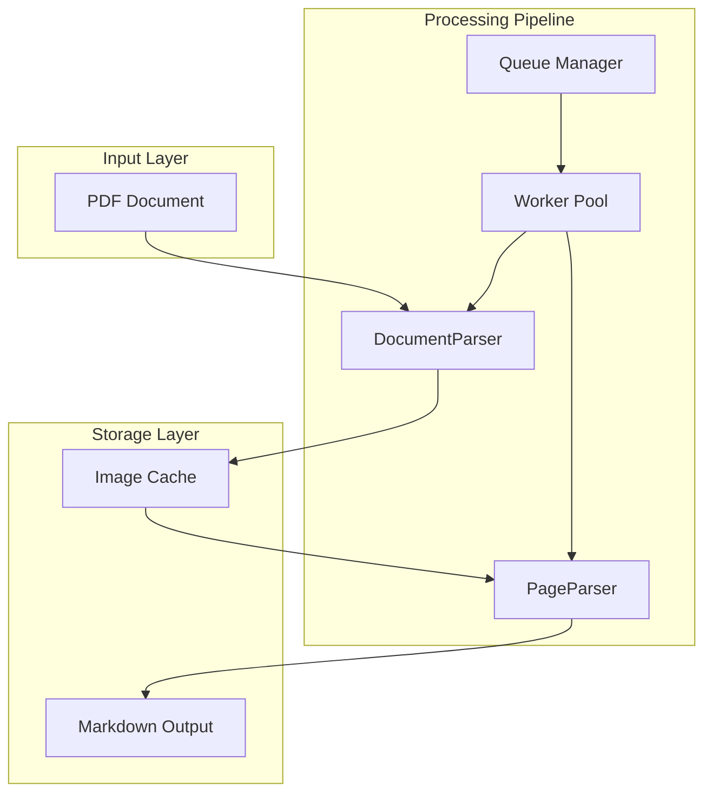
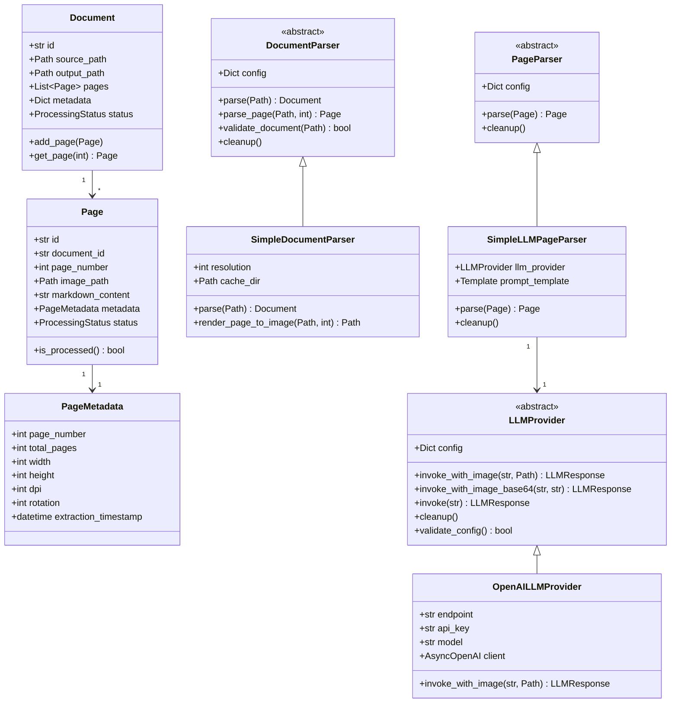
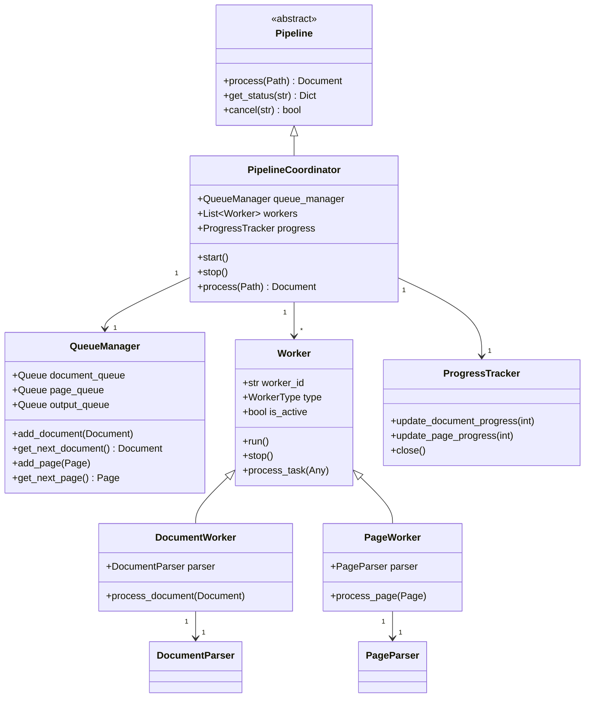
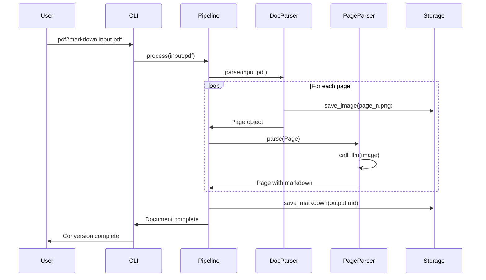
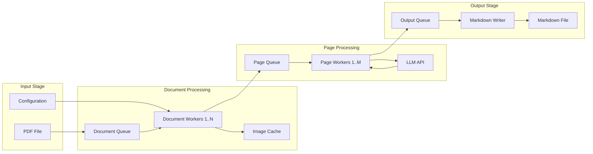

# Low-level Design Document - pdf2markdown Converter

## Table of Contents
1. [Executive Summary](#executive-summary)
2. [Architecture Overview](#architecture-overview)
3. [Project Structure](#project-structure)
4. [Core Components](#core-components)
5. [Class Design](#class-design)
6. [Data Flow Architecture](#data-flow-architecture)
7. [Queue-Based Pipeline System](#queue-based-pipeline-system)
8. [Configuration Management](#configuration-management)
9. [Dependencies](#dependencies)
10. [Error Handling and Logging](#error-handling-and-logging)
11. [Performance Considerations](#performance-considerations)

## Executive Summary

The pdf2markdown converter is a modular, pipeline-based Python library and application designed to convert technical PDF documents into well-structured Markdown format using Large Language Models (LLMs). The system provides both a high-level Python API for programmatic integration and a command-line interface for standalone usage. It employs a two-phase processing approach: document parsing (PDF to images) and page parsing (images to Markdown), with support for parallel processing through a queue-based architecture.

## Architecture Overview



## Project Structure

```
pdf2markdown/
├── src/
│   └── pdf2markdown/
│       ├── __init__.py              # Public API exports
│       ├── __main__.py              # Entry point for CLI
│       ├── api/                     # Library API module
│       │   ├── __init__.py          # Public API exports
│       │   ├── converter.py         # Main PDFConverter class
│       │   ├── config.py           # Config and ConfigBuilder classes
│       │   ├── exceptions.py       # API-specific exceptions
│       │   └── types.py           # Type definitions
│       ├── cli/                     # CLI implementation
│       │   └── main.py             # CLI using library API
│       ├── core/
│       │   ├── __init__.py
│       │   ├── models.py            # Data models (Page, Document, etc.)
│       │   ├── interfaces.py        # Abstract base classes
│       │   └── exceptions.py        # Core exceptions
│       ├── llm_providers/           # LLM provider implementations
│       │   ├── __init__.py
│       │   ├── base.py             # LLMProvider ABC
│       │   ├── factory.py          # Provider factory
│       │   ├── openai.py           # OpenAI provider
│       │   └── transformers.py     # Transformers provider
│       ├── parsers/
│       │   ├── __init__.py
│       │   ├── document/
│       │   │   ├── __init__.py
│       │   │   ├── base.py          # DocumentParser ABC
│       │   │   └── simple.py        # SimpleDocumentParser implementation
│       │   └── page/
│       │       ├── __init__.py
│       │       ├── base.py          # PageParser ABC
│       │       └── simple_llm.py    # SimpleLLMPageParser implementation
│       ├── pipeline/
│       │   ├── __init__.py
│       │   ├── queue_manager.py    # Queue management
│       │   ├── worker.py            # Worker implementation
│       │   ├── coordinator.py       # Pipeline coordinator
│       │   └── progress.py          # Progress tracking and logging
│       ├── config/
│       │   ├── __init__.py
│       │   ├── settings.py          # Configuration management
│       │   └── schemas.py           # Pydantic models for config validation
│       ├── templates/
│       │   └── prompts/
│       │       └── ocr_extraction.j2 # Jinja2 template for LLM prompt
│       └── utils/
│           ├── __init__.py
│           ├── cache.py             # Cache management
│           ├── file_handler.py      # File I/O utilities
│           └── logger.py            # Logging configuration
├── tests/
│   ├── __init__.py
│   ├── test_library_api.py         # Library API tests
│   ├── unit/
│   ├── integration/
│   └── fixtures/
├── config/
│   └── default.yaml                 # Default configuration
├── pyproject.toml                   # Project configuration for PyPI
├── README.md
└── .env.example
```

## Core Components

### 4.1 Library API Layer

The Library API provides a high-level interface for programmatic use of the pdf2markdown converter:

```python
# api/converter.py

class PDFConverter:
    """Main converter class for library API"""
    
    def __init__(self, config: Optional[Union[Config, ConfigDict]] = None):
        """Initialize with configuration"""
        
    async def convert(
        self, pdf_path: Union[str, Path],
        output_path: Optional[Union[str, Path]] = None,
        progress_callback: Optional[AsyncProgressCallback] = None
    ) -> str:
        """Convert PDF to Markdown asynchronously"""
        
    def convert_sync(
        self, pdf_path: Union[str, Path],
        output_path: Optional[Union[str, Path]] = None,
        progress_callback: Optional[ProgressCallback] = None
    ) -> str:
        """Synchronous wrapper for convert"""
        
    async def stream_pages(
        self, pdf_path: Union[str, Path],
        progress_callback: Optional[AsyncProgressCallback] = None
    ) -> AsyncIterator[PageResult]:
        """Stream pages as they're processed"""
        
    async def process_batch(
        self, pdf_paths: List[Union[str, Path]],
        output_dir: Optional[Union[str, Path]] = None
    ) -> List[DocumentResult]:
        """Process multiple PDFs"""
```

#### Configuration System

```python
# api/config.py

class ConfigBuilder:
    """Builder pattern for creating configurations"""
    
    def with_openai(self, api_key: str, model: str = "gpt-4o-mini", **kwargs) -> 'ConfigBuilder':
        """Configure OpenAI provider"""
        
    def with_transformers(self, model_name: str, device: str = "auto", **kwargs) -> 'ConfigBuilder':
        """Configure Transformers provider"""
        
    def with_resolution(self, dpi: int) -> 'ConfigBuilder':
        """Set PDF rendering resolution"""
        
    def with_page_workers(self, workers: int) -> 'ConfigBuilder':
        """Set number of parallel workers"""
        
    def build(self) -> Config:
        """Build and validate configuration"""

class Config:
    """Configuration container"""
    
    @classmethod
    def from_dict(cls, config_dict: ConfigDict) -> 'Config':
        """Create from dictionary"""
        
    @classmethod
    def from_yaml(cls, yaml_path: Union[str, Path]) -> 'Config':
        """Load from YAML file"""
```

### 4.2 LLM Provider System

The LLM Provider system abstracts the interface to Large Language Models, allowing for different implementations:

```python
# llm_providers/base.py

from abc import ABC, abstractmethod
from dataclasses import dataclass
from pathlib import Path
from typing import Any, Optional

@dataclass
class LLMResponse:
    """Response from an LLM provider"""
    content: str
    model: str
    usage: Optional[Dict[str, Any]] = None
    metadata: Optional[Dict[str, Any]] = None

class LLMProvider(ABC):
    """Abstract base class for LLM providers"""
    
    @abstractmethod
    def __init__(self, config: Dict[str, Any]):
        """Initialize the LLM provider with configuration"""
        self.config = config
    
    @abstractmethod
    async def invoke_with_image(
        self, prompt: str, image_path: Path, **kwargs: Any
    ) -> LLMResponse:
        """Invoke the LLM with a text prompt and an image"""
        pass
    
    @abstractmethod
    async def invoke_with_image_base64(
        self, prompt: str, image_base64: str, **kwargs: Any
    ) -> LLMResponse:
        """Invoke the LLM with a text prompt and a base64-encoded image"""
        pass
    
    @abstractmethod
    async def invoke(self, prompt: str, **kwargs: Any) -> LLMResponse:
        """Invoke the LLM with a text prompt only"""
        pass
    
    @abstractmethod
    async def cleanup(self) -> None:
        """Cleanup any resources used by the provider"""
        pass
    
    @abstractmethod
    def validate_config(self) -> bool:
        """Validate the provider configuration"""
        pass
```

#### OpenAI LLM Provider

The OpenAI provider supports any OpenAI-compatible API endpoint:

```python
# llm_providers/openai.py

class OpenAILLMProvider(LLMProvider):
    """LLM provider for OpenAI-compatible APIs"""
    
    def __init__(self, config: Dict[str, Any]):
        super().__init__(config)
        self.endpoint = config.get("endpoint", "https://api.openai.com/v1")
        self.api_key = config.get("api_key")
        self.model = config.get("model", "gpt-4o-mini")
        self.max_tokens = config.get("max_tokens", 4096)
        self.temperature = config.get("temperature", 0.1)
        self.timeout = config.get("timeout", 60)
        
        # Initialize OpenAI client
        self.client = AsyncOpenAI(
            api_key=self.api_key,
            base_url=self.endpoint if self.endpoint != "https://api.openai.com/v1" else None,
            timeout=self.timeout,
        )
```

#### Provider Factory

The factory pattern allows easy creation of providers:

```python
# llm_providers/factory.py

def create_llm_provider(config: Dict[str, Any]) -> LLMProvider:
    """Create an LLM provider from configuration"""
    provider_type = config.get("provider_type", "openai").lower()
    
    if provider_type == "openai":
        return OpenAILLMProvider(config)
    # Future providers: "transformers", "ollama", "anthropic", etc.
    else:
        raise ValueError(f"Unsupported LLM provider type: {provider_type}")
```

### 4.2 Data Models

```python
# core/models.py

from dataclasses import dataclass, field
from typing import Optional, Dict, Any, List
from pathlib import Path
from datetime import datetime
from enum import Enum

class ProcessingStatus(Enum):
    PENDING = "pending"
    PROCESSING = "processing"
    COMPLETED = "completed"
    FAILED = "failed"

@dataclass
class PageMetadata:
    """Metadata for a single page"""
    page_number: int
    total_pages: int
    width: int
    height: int
    dpi: int
    rotation: int = 0
    extraction_timestamp: Optional[datetime] = None
    additional_info: Dict[str, Any] = field(default_factory=dict)

@dataclass
class Page:
    """Represents a single page from a document"""
    id: str
    document_id: str
    page_number: int
    image_path: Optional[Path] = None
    markdown_content: Optional[str] = None
    metadata: Optional[PageMetadata] = None
    status: ProcessingStatus = ProcessingStatus.PENDING
    error_message: Optional[str] = None
    
    def is_processed(self) -> bool:
        return self.status == ProcessingStatus.COMPLETED

@dataclass
class Document:
    """Represents a complete PDF document"""
    id: str
    source_path: Path
    output_path: Optional[Path] = None
    pages: List[Page] = field(default_factory=list)
    metadata: Dict[str, Any] = field(default_factory=dict)
    status: ProcessingStatus = ProcessingStatus.PENDING
    created_at: datetime = field(default_factory=datetime.now)
    completed_at: Optional[datetime] = None
    
    def add_page(self, page: Page) -> None:
        self.pages.append(page)
    
    def get_page(self, page_number: int) -> Optional[Page]:
        return next((p for p in self.pages if p.page_number == page_number), None)
```

### 4.2 Base Classes and Interfaces

```python
# core/interfaces.py

from abc import ABC, abstractmethod
from typing import List, Optional, Dict, Any, AsyncIterator
from pathlib import Path
from .models import Document, Page

class DocumentParser(ABC):
    """Abstract base class for document parsers"""
    
    @abstractmethod
    def __init__(self, config: Dict[str, Any]):
        """Initialize parser with configuration"""
        self.config = config
    
    @abstractmethod
    async def parse(self, document_path: Path) -> Document:
        """Parse a PDF document into a Document object with Pages"""
        pass
    
    @abstractmethod
    async def parse_page(self, document_path: Path, page_number: int) -> Page:
        """Parse a single page from a document"""
        pass
    
    @abstractmethod
    def validate_document(self, document_path: Path) -> bool:
        """Validate if the document can be parsed"""
        pass
    
    @abstractmethod
    async def cleanup(self) -> None:
        """Cleanup resources"""
        pass

class PageParser(ABC):
    """Abstract base class for page parsers"""
    
    @abstractmethod
    def __init__(self, config: Dict[str, Any]):
        """Initialize parser with configuration"""
        self.config = config
    
    @abstractmethod
    async def parse(self, page: Page) -> Page:
        """Convert a page image to markdown"""
        pass
    
    @abstractmethod
    async def cleanup(self) -> None:
        """Cleanup resources"""
        pass

class Pipeline(ABC):
    """Abstract base class for processing pipelines"""
    
    @abstractmethod
    async def process(self, document_path: Path) -> Document:
        """Process a complete document through the pipeline"""
        pass
    
    @abstractmethod
    async def get_status(self, document_id: str) -> Dict[str, Any]:
        """Get processing status for a document"""
        pass
    
    @abstractmethod
    async def cancel(self, document_id: str) -> bool:
        """Cancel processing for a document"""
        pass
```

## Class Design

### 5.1 Class Diagram - Core Components



### 5.2 Class Diagram - Pipeline Components



## Data Flow Architecture

### 6.1 Sequential Data Flow



### 6.2 Pipeline Data Flow



## Queue-Based Pipeline System

### 7.1 Queue Architecture

```python
# pipeline/queue_manager.py

import asyncio
from typing import Optional, Any, Dict
from dataclasses import dataclass
from enum import Enum

class QueuePriority(Enum):
    HIGH = 1
    NORMAL = 2
    LOW = 3

@dataclass
class QueueItem:
    """Wrapper for queue items with priority and metadata"""
    data: Any
    priority: QueuePriority = QueuePriority.NORMAL
    retry_count: int = 0
    max_retries: int = 3
    metadata: Dict[str, Any] = None

class QueueManager:
    """Manages multiple queues for pipeline processing"""
    
    def __init__(self, config: Dict[str, Any]):
        self.config = config
        self.document_queue = asyncio.PriorityQueue(
            maxsize=config.get('document_queue_size', 100)
        )
        self.page_queue = asyncio.PriorityQueue(
            maxsize=config.get('page_queue_size', 1000)
        )
        self.output_queue = asyncio.Queue(
            maxsize=config.get('output_queue_size', 500)
        )
        self.error_queue = asyncio.Queue()
        
    async def add_document(self, document: Document, priority: QueuePriority = QueuePriority.NORMAL):
        """Add a document to the processing queue"""
        item = QueueItem(data=document, priority=priority)
        await self.document_queue.put((priority.value, item))
    
    async def get_next_document(self) -> Optional[QueueItem]:
        """Get the next document from the queue"""
        try:
            priority, item = await self.document_queue.get()
            return item
        except asyncio.QueueEmpty:
            return None
    
    async def add_page(self, page: Page, priority: QueuePriority = QueuePriority.NORMAL):
        """Add a page to the processing queue"""
        item = QueueItem(data=page, priority=priority)
        await self.page_queue.put((priority.value, item))
    
    async def get_next_page(self) -> Optional[QueueItem]:
        """Get the next page from the queue"""
        try:
            priority, item = await self.page_queue.get()
            return item
        except asyncio.QueueEmpty:
            return None
```

### 7.2 Worker Implementation

```python
# pipeline/worker.py

import asyncio
from abc import ABC, abstractmethod
from typing import Any, Optional
from enum import Enum
import logging

class WorkerType(Enum):
    DOCUMENT = "document"
    PAGE = "page"
    OUTPUT = "output"

class Worker(ABC):
    """Base worker class for pipeline processing"""
    
    def __init__(self, worker_id: str, worker_type: WorkerType, queue_manager: QueueManager):
        self.worker_id = worker_id
        self.worker_type = worker_type
        self.queue_manager = queue_manager
        self.is_active = False
        self.logger = logging.getLogger(f"{self.__class__.__name__}.{worker_id}")
        
    @abstractmethod
    async def process_task(self, task: Any) -> Any:
        """Process a single task"""
        pass
    
    async def run(self):
        """Main worker loop"""
        self.is_active = True
        self.logger.info(f"Worker {self.worker_id} started")
        
        while self.is_active:
            try:
                task = await self._get_next_task()
                if task:
                    result = await self.process_task(task.data)
                    await self._handle_result(result)
                else:
                    await asyncio.sleep(0.1)
            except Exception as e:
                self.logger.error(f"Error processing task: {e}")
                await self._handle_error(task, e)
    
    async def stop(self):
        """Stop the worker"""
        self.is_active = False
        self.logger.info(f"Worker {self.worker_id} stopped")
    
    @abstractmethod
    async def _get_next_task(self) -> Optional[QueueItem]:
        """Get the next task from the appropriate queue"""
        pass
    
    @abstractmethod
    async def _handle_result(self, result: Any):
        """Handle the processing result"""
        pass
    
    async def _handle_error(self, task: QueueItem, error: Exception):
        """Handle processing errors"""
        if task and task.retry_count < task.max_retries:
            task.retry_count += 1
            await self._requeue_task(task)
        else:
            await self.queue_manager.error_queue.put({
                'task': task,
                'error': str(error),
                'worker_id': self.worker_id
            })
```

### 7.3 Parallel Processing Configuration

```yaml
# Configuration for parallel processing
pipeline:
  workers:
    document:
      count: 1  # DocumentParser processes one document at a time
      type: sequential
    page:
      count: 10  # Number of parallel page processing workers
      type: parallel
  queues:
    document:
      max_size: 100
      priority_enabled: true
    page:
      max_size: 1000
      priority_enabled: true
    output:
      max_size: 500
      priority_enabled: false
  retry:
    max_attempts: 3
    backoff_factor: 2
    max_delay: 60
```

## Configuration Management

### 8.1 Configuration Schema

```python
# config/schemas.py

from pydantic import BaseModel, Field, HttpUrl
from typing import Optional, Dict, Any
from pathlib import Path

class DocumentParserConfig(BaseModel):
    """Configuration for document parser"""
    type: str = "simple"
    resolution: int = Field(default=300, ge=72, le=600)
    cache_dir: Path = Field(default=Path("/tmp/pdf2markdown/cache"))
    max_page_size: int = Field(default=50_000_000)  # 50MB
    timeout: int = Field(default=30)

class LLMProviderConfig(BaseModel):
    """Configuration for LLM provider"""
    provider_type: str = Field(default="openai")
    endpoint: HttpUrl = Field(default="https://api.openai.com/v1")
    api_key: str
    model: str = Field(default="gpt-4o-mini")
    max_tokens: int = Field(default=4096)
    temperature: float = Field(default=0.1, ge=0, le=2)
    timeout: int = Field(default=60)
    # Penalty parameters to reduce repetition
    presence_penalty: float = Field(default=0.0, ge=-2.0, le=2.0)
    frequency_penalty: float = Field(default=0.0, ge=-2.0, le=2.0)
    repetition_penalty: Optional[float] = Field(default=None, ge=0.0, le=2.0)

class MarkdownValidatorConfig(BaseModel):
    """Configuration for markdown validator"""
    enabled: bool = Field(default=True)
    attempt_correction: bool = Field(default=True)
    strict_mode: bool = Field(default=False)
    max_line_length: int = Field(default=1000, ge=80)
    disabled_rules: List[str] = Field(default_factory=list)
    enabled_rules: List[str] = Field(default_factory=list)

class PageParserConfig(BaseModel):
    """Configuration for page parser"""
    type: str = "simple_llm"
    prompt_template: Path = Field(default=Path("templates/prompts/ocr_extraction.j2"))
    additional_instructions: Optional[str] = None
    validate_markdown: bool = Field(default=True)
    markdown_validator: MarkdownValidatorConfig = Field(default_factory=MarkdownValidatorConfig)

class PipelineConfig(BaseModel):
    """Configuration for pipeline processing"""
    document_workers: int = Field(default=1, ge=1)
    page_workers: int = Field(default=10, ge=1)
    queue_sizes: Dict[str, int] = Field(default_factory=lambda: {
        "document": 100,
        "page": 1000,
        "output": 500
    })
    enable_progress: bool = True
    log_level: str = "INFO"

class AppConfig(BaseModel):
    """Main application configuration"""
    llm_provider: LLMProviderConfig  # Top-level for reuse across components
    document_parser: DocumentParserConfig
    page_parser: PageParserConfig
    pipeline: PipelineConfig
    output_dir: Path = Field(default=Path("./output"))
    temp_dir: Path = Field(default=Path("/tmp/pdf2markdown"))
```

### 8.2 Simplified Prompt Template

```jinja2
{# templates/prompts/ocr_extraction.j2 #}

**CRITICAL**: Output ONLY the markdown content from the document. Do not add any explanations, comments, or text that is not present in the original PDF.

Convert the document image to Markdown following these rules:

## Tables
Use Markdown pipe syntax:
```
| Parameter | Min | Typ | Max | Unit |
|-----------|----:|----:|----:|------|
| Voltage   | 1.7 | 3.3 | 3.6 | V    |
```

## Headers
Use # for main sections, ## for subsections, ### for sub-subsections

## Formatting
- **Bold** for emphasis
- *Italic* for secondary emphasis  
- `Code` for values, registers, pin names
- $LaTeX$ for equations and subscripts (e.g., V_{DD})

## Lists
- Use `-` for bullets
- Use `1.` for numbered lists
- Indent nested items with 2 spaces

## Technical Elements
- Preserve ALL numbers, units, and conditions exactly
- Include every table, equation, and specification
- For diagrams/graphs: **[Type: Brief description]**

## Special Items
- Notes/Warnings: Use blockquotes `> **Note:** ...`
- Omit watermarks and page numbers unless part of content
- Keep all footnotes and references

## Remember
- Output ONLY what's in the document
- NO explanatory text or comments
- NO "Here is the content" or similar phrases
- Start directly with the document content


## Page Context
This is page {{ page_number }} of {{ total_pages }}.



## Additional Instructions
{{ additional_instructions }}

```

### 8.3 Markdown Validation Configuration

```python
# validators/markdown_validator.py

from pymarkdown.api import PyMarkdownApi
from dataclasses import dataclass
from typing import List, Optional

@dataclass
class ValidationIssue:
    """Represents a single markdown validation issue"""
    line_number: int
    column_number: int
    rule_id: str
    rule_name: str
    description: str
    extra_info: str = ""

@dataclass
class ValidationResult:
    """Result of markdown validation"""
    is_valid: bool
    issues: List[ValidationIssue]
    corrected_markdown: Optional[str] = None
    error_message: Optional[str] = None

class MarkdownValidator:
    """Validates and corrects markdown content using PyMarkdown"""
    
    def __init__(self, config: Dict[str, Any]):
        self.config = config
        self.pymarkdown = PyMarkdownApi().log_error_and_above()
        
        # Disable overly strict rules for LLM-generated content
        default_disabled_rules = [
            "MD041",  # First line should be a top-level heading
            "MD012",  # Multiple consecutive blank lines
            "MD022",  # Headings should be surrounded by blank lines
            "MD031",  # Fenced code blocks should be surrounded by blank lines
            "MD032",  # Lists should be surrounded by blank lines
            "MD025",  # Multiple top-level headings
            "MD024",  # Multiple headings with the same content
            "MD013",  # Line length (technical content often has long lines)
            "MD047",  # Files must end with single newline
            "MD040",  # Fenced code blocks should have a language specified
            "MD033",  # Inline HTML (common in technical documents and tables)
            "MD026",  # Trailing punctuation in heading text (common in PDF headings)
            "MD042",  # No empty links (LLMs may generate placeholder links during extraction)
        ]
        
        for rule_id in default_disabled_rules:
            self.pymarkdown.disable_rule_by_identifier(rule_id.lower())
    
    def validate(self, markdown_content: str) -> ValidationResult:
        """Validate markdown content"""
        scan_result = self.pymarkdown.scan_string(markdown_content)
        issues = [self._convert_to_issue(f) for f in scan_result.scan_failures]
        return ValidationResult(
            is_valid=len(issues) == 0,
            issues=issues
        )
    
    async def validate_and_correct(
        self, markdown_content: str, page: Page, 
        llm_provider: LLMProvider, prompt_template: Template
    ) -> ValidationResult:
        """Validate and optionally correct markdown using LLM"""
        result = self.validate(markdown_content)
        
        if not result.is_valid and self.config.get('attempt_correction', True):
            # Re-prompt LLM with validation issues
            correction_prompt = self._create_correction_prompt(result.issues, prompt_template, page)
            response = await llm_provider.invoke_with_image(correction_prompt, page.image_path)
            
            # Validate corrected markdown
            corrected_result = self.validate(response.content)
            corrected_result.corrected_markdown = response.content
            return corrected_result
        
        return result
```

## Dependencies

### 9.1 Core Dependencies

```txt
# requirements.txt

# Core dependencies
pymupdf>=1.23.0           # PDF rendering
Pillow>=10.0.0           # Image processing
aiohttp>=3.9.0           # Async HTTP client
openai>=1.0.0           # OpenAI API client
jinja2>=3.1.0            # Template engine
pydantic>=2.0.0          # Data validation
pyyaml>=6.0             # Configuration files
python-dotenv>=1.0.0     # Environment variables
pymarkdownlnt>=0.9.12   # Markdown validation

# Async and concurrency
asyncio>=3.4.3
aiofiles>=23.0.0         # Async file operations

# Progress and CLI
click>=8.1.0            # CLI framework
rich>=13.0.0            # Rich terminal output

# Utilities
python-multipart>=0.0.6
httpx>=0.25.0           # HTTP client with async support
tenacity>=8.2.0         # Retry logic

# Development dependencies
pytest>=7.4.0
pytest-asyncio>=0.21.0
pytest-cov>=4.1.0
black>=23.0.0
mypy>=1.5.0
ruff>=0.1.0
```

## Error Handling and Logging

### 10.1 Custom Exceptions

```python
# core/exceptions.py

class PDFToMarkdownError(Exception):
    """Base exception for PDF to Markdown converter"""
    pass

class DocumentParsingError(PDFToMarkdownError):
    """Error during document parsing"""
    pass

class PageParsingError(PDFToMarkdownError):
    """Error during page parsing"""
    pass

class LLMConnectionError(PDFToMarkdownError):
    """Error connecting to LLM API"""
    pass

class QueueOverflowError(PDFToMarkdownError):
    """Queue has reached maximum capacity"""
    pass

class ConfigurationError(PDFToMarkdownError):
    """Invalid configuration"""
    pass
```

### 10.2 Logging Configuration

```python
# utils/logger.py

import logging
import logging.handlers
from pathlib import Path
from typing import Optional

def setup_logging(
    level: str = "INFO",
    log_file: Optional[Path] = None,
    format_string: Optional[str] = None
) -> None:
    """Configure application logging"""
    
    if format_string is None:
        format_string = "[%(asctime)s] [%(name)s] [%(levelname)s] %(message)s"
    
    handlers = [logging.StreamHandler()]
    
    if log_file:
        log_file.parent.mkdir(parents=True, exist_ok=True)
        handlers.append(
            logging.handlers.RotatingFileHandler(
                log_file,
                maxBytes=10_485_760,  # 10MB
                backupCount=5
            )
        )
    
    logging.basicConfig(
        level=getattr(logging, level.upper()),
        format=format_string,
        handlers=handlers
    )
```

## Performance Considerations

### 11.1 Memory Management

- **Image Caching**: Rendered page images are stored in a temporary cache directory with automatic cleanup after processing
- **Streaming Processing**: Pages are processed as they become available rather than waiting for the entire document
- **Batch Processing**: LLM API calls can be batched for better throughput
- **Memory Limits**: Configure maximum page size and queue sizes to prevent memory overflow

### 11.2 Optimization Strategies

1. **Adaptive Worker Scaling**: Dynamically adjust worker count based on queue sizes and processing rates
2. **Priority Queuing**: Process high-priority documents/pages first
3. **Connection Pooling**: Reuse HTTP connections to LLM API
4. **Retry Logic**: Implement exponential backoff for failed operations
5. **Progress Tracking**: Use logging for progress tracking without impacting performance

### 11.3 Scalability Considerations

```python
# Performance configuration recommendations
performance:
  document_processing:
    resolution: 200  # Lower resolution for faster processing
    max_concurrent: 1  # Sequential per document requirement
  
  page_processing:
    workers: 10-20  # Optimal for most systems
    connection_pool_size: 20
    
  caching:
    strategy: "lru"  # Least recently used
    max_size_gb: 10
    ttl_hours: 24
    
  monitoring:
    metrics_enabled: true
    log_performance: true
    profile_enabled: false  # Enable for debugging only
```

## Implementation Phases

### Phase 1: Core Infrastructure
- Implement base classes and interfaces
- Set up project structure
- Create data models
- Implement configuration management

### Phase 2: Document Processing
- Implement SimpleDocumentParser
- Add PyMuPDF integration
- Implement image caching
- Add progress tracking for document parsing

### Phase 3: Page Processing
- Implement SimpleLLMPageParser
- Integrate LLM API client
- Add Jinja2 template support
- Implement retry logic

### Phase 4: Pipeline Integration
- Implement QueueManager
- Create Worker classes
- Implement PipelineCoordinator
- Add progress tracking with logging

### Phase 5: Testing and Optimization
- Add comprehensive unit tests
- Implement integration tests
- Performance optimization
- Documentation and examples

## Summary

This technical design provides a comprehensive blueprint for implementing a modular, scalable pdf2markdown converter. The architecture supports:

1. **Modularity**: Easily extensible with new parser implementations
2. **Scalability**: Queue-based architecture with configurable worker pools
3. **Reliability**: Comprehensive error handling and retry mechanisms
4. **Performance**: Parallel processing with adaptive resource management
5. **Maintainability**: Clear separation of concerns and well-defined interfaces

The design follows Python best practices and leverages modern async/await patterns for efficient concurrent processing while respecting the constraint that document parsing must be sequential.