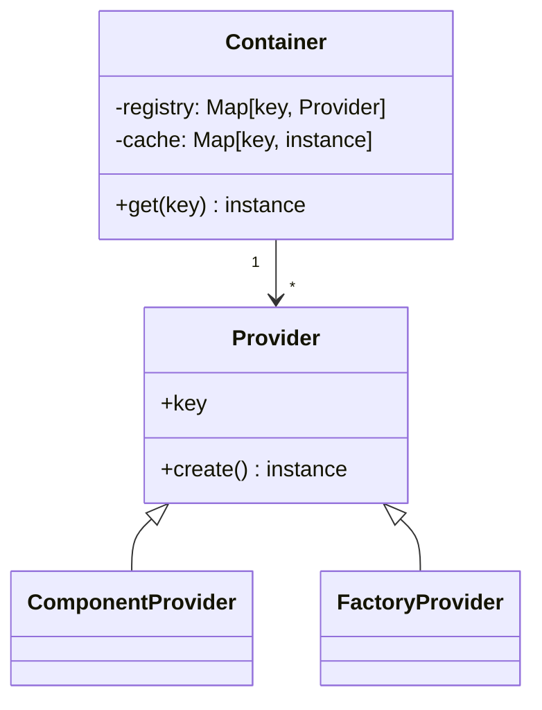
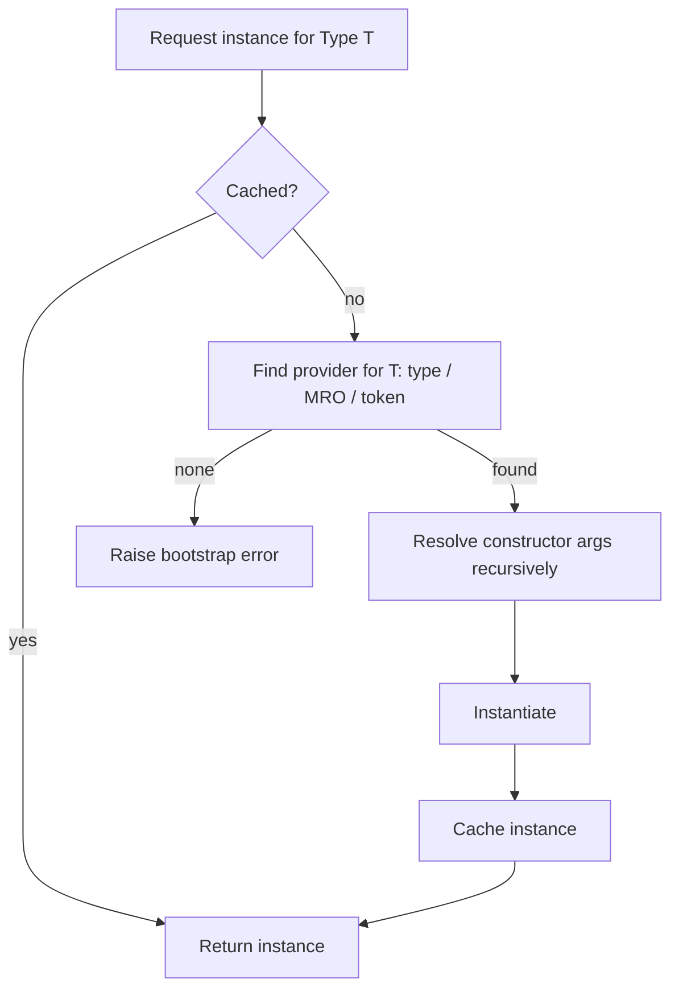

# pico-ioc — Architecture

> Scope: internal model, wiring algorithm, lifecycle, and design trade-offs.  
> Non-goals: user tutorials or recipes (see `GUIDE.md`), product pitch (see `OVERVIEW.md`).

> ⚠️ **Requires Python 3.10+** (uses `typing.Annotated` and `include_extras=True`).

---

## 1) Design goals & non-goals

**Goals**

* **Tiny, predictable DI** for Python apps (CLIs, Flask/FastAPI, services).
* **Fail fast** at bootstrap; deterministic resolution.
* **Ergonomic**: annotate constructors, avoid runtime reflection tricks.
* **Framework-agnostic**: no hard dependency on Flask/FastAPI/etc.
* **Safe by default**: thread/async friendly, no global mutable singletons.

**Non-goals**

* Full Spring-like feature set (AOP, complex scopes, bean post-processors).
* Runtime reconfiguration or hot-swap of graphs.
* Magical auto-imports across the filesystem.

---

## 2) High-level model

* **Component**: class marked with `@component`. Instantiated by the container.
* **Factory component**: class marked with `@factory_component` that owns one or more **providers** declared via `@provides(key=TypeOrToken)`. Providers return *externals* (e.g., `Flask`, clients, engines).
* **Container**: built by `pico_ioc.init(module_or_list)`; resolves dependencies with `container.get(KeyOrType)`.

### Bootstrap sequence (simplified)

```mermaid
sequenceDiagram
    participant App as Your package(s)
    participant IOC as pico-ioc Container
    App->>IOC: init([app, overrides?])
    IOC->>App: scan decorators (@component, @factory_component)
    IOC->>IOC: register providers (key -> factory)
    IOC->>IOC: validate graph (constructor types, duplicates)
    App->>IOC: get(Service)
    IOC->>IOC: resolve deps (Repo, Config, ...)
    IOC-->>App: instance(Service)
````

---

## 3) Discovery & registration

1. **Scan inputs** passed to `init(...)`: a module or list of modules/packages.
2. **Collect**:

   * `@component` classes → registered by **type** (the class itself).
   * `@factory_component` classes → introspected for `@provides(key=...)` methods.
   * `@plugin` classes → collected if explicitly passed to `init(…, plugins=(…))`.
3. **Registry** (immutable after bootstrap):

   * `key -> provider` map. Keys are usually **types**. String tokens are supported but discouraged.

> **Invariant:** A key has **at most one** active provider; the **last registration wins**.
> This enables test overrides by ordering `init([app, test_overrides])`.

---

## 4) Resolution algorithm (deterministic)

When constructing a component `C`:

1. Inspect `__init__(self, ...)` and collect **type-annotated** parameters (excluding `self`).
2. For each parameter `p: T` resolve **by key** using this order:

   1. **Exact type** `T`
   2. **MRO walk**: first registered base class or protocol
   3. **String key** (only if `@provides(key="token")` was used)
3. Instantiate dependencies depth-first; memoize singletons.
4. Construct `C` with resolved instances.

**Failure modes**

* No provider for a required key → **bootstrap error** (fail fast).
* Ambiguous/incompatible registrations → **bootstrap error** with a precise hint.

### 4b) Collection resolution

If a constructor requests `list[T]` or `list[Annotated[T, Q]]`:

* The container resolves **all** registered providers compatible with `T`.
* If qualifiers are present (`Q`), only matching components are returned.
* Order is stable by discovery/registration; no implicit sorting.
* Empty list if no matches.

---

## 5) Lifecycles & scopes

* **Singleton per container** (default): each key is created once and cached.
* **Lazy proxies (optional)**: `@component(lazy=True)` defers instantiation until first use. Use sparingly; prefer eager to surface errors early.

> **Why singleton:** It matches typical app composition (config, DB clients, HTTP apps) and keeps DI simple and fast.

---

## 6) Factories & providers

Use `@factory_component` to integrate **externals**:

```python
from pico_ioc import factory_component, provides
from flask import Flask

@factory_component
class AppFactory:
    @provides(key=Flask)
    def provide_flask(self) -> Flask:
        app = Flask(__name__)
        app.config["JSON_AS_ASCII"] = False
        return app
```

* **Providers** should be **pure constructors** (no long-running work).
* Prefer **typed keys** (e.g., `Flask`) over string tokens.

---

## 7) Concurrency model

* Container state is **immutable after init**.
* Resolution cache is **thread/async safe** via internal isolation (no global singletons).
* Instances you create **must** be thread-safe if shared (container can’t fix non-safe libs).

---

## 8) Error handling & diagnostics

* **Bootstrap phase**:

  * Missing providers → raise with the exact parameter/type.
  * Duplicate keys → last wins; log/trace retains registration order for debugging.
  * Type annotation mismatch → explicit error naming the offending `__init__` param.
* **Runtime**:

  * Exceptions bubble from provider/constructor; container stack traces include the dependency chain (key path).

Tip: Keep constructors **cheap** (I/O at the edges, e.g., in start/serve methods).

---

## 9) Configuration

* Treat config as a **component**:

```python
@component
class Config:
    WORKERS: int = int(os.getenv("WORKERS", "4"))
    DEBUG: bool = os.getenv("DEBUG", "0") == "1"
```

* Inject `Config` wherever needed; do not read `os.getenv` scattered across the codebase.

---

## 10) Extensibility & overrides

### Test overrides (module-based)

Register a factory after the app module:

```python
@factory_component
class TestOverrides:
    @provides(key=Repo)   # same key as production
    def provide_repo(self) -> Repo:
        return FakeRepo()
````

Then:

```python
c = init([app, test_overrides])  # overrides win by order
```

### Direct overrides argument

`init()` also accepts an `overrides` dict for ad-hoc replacement:

```python
c = init(app, overrides={
    Repo: FakeRepo(),                         # constant instance
    "fast_model": lambda: {"mock": True},     # provider
    "expensive": (lambda: object(), True),    # provider with lazy=True
})
```

* **Applied before eager instantiation** → replaced providers never run.
* **Formats supported**:

  * `key: instance` → constant
  * `key: callable` → non-lazy provider
  * `key: (callable, lazy_bool)` → provider with explicit laziness
* With `reuse=True`, calling `init(..., overrides=...)` again mutates the cached container bindings.

### Multi-env composition

Define `app.prod`, `app.dev`, `app.test` packages that import different provider sets, then call `init([app.prod])`, etc.

### Plugins

Classes decorated with `@plugin` and implementing `PicoPlugin` can observe lifecycle events:

* `before_scan(package, binder)`
* `after_ready(container, binder)`

They are passed explicitly to `init(..., plugins=(MyPlugin(),))`.

---

## 11) Performance notes

* **O(1)** provider lookup by key; no reflection at call sites after bootstrap.
* Eager construction surfaces failures early and warms caches.
* Keep providers idempotent and cheap; push heavy I/O to runtime methods.

---

## 12) Security & boundaries

* The container **does not** open sockets/files or spawn threads by itself.
* Side effects belong to **your components**. Keep providers deterministic.
* Avoid storing secrets in code; pass secrets via your own config component.

---

## 13) Reference diagrams

### Registry & resolution (class diagram)



### Resolution flow (activity)



---

## 14) Rationale & trade-offs

* **Typed keys first** → better ergonomics, editor support, less foot-guns than strings.
* **Singleton scope** → keeps mental model simple; Python apps rarely need per-request scoping at the container level (push that to frameworks).
* **No global state** → explicit container ownership clarifies boundaries and testability.
* **Fail fast** → configuration/graph problems are caught at start, not mid-request.

---

## 15) Appendix: FAQs (architecture-level)

* *Why not metaclass magic to auto-wire everything?*
  Determinism and debuggability. Explicit decorators and typed constructors win.

* *Can I lazy-load everything?*
  You can, but you shouldn’t. Lazy only where it truly reduces cost without hiding errors.

* *How do I integrate with Flask/FastAPI?*
  Provide the app/client via a factory (`@provides(key=Flask)`), then `container.get(Flask)` in your bootstrap. See `GUIDE.md`.

### Public API helper

`export_public_symbols_decorated` builds `__getattr__`/`__dir__` for a package’s `__init__.py`,
auto-exporting all `@component`, `@factory_component`, and `@plugin` classes, plus any `__all__`.

---

## 16) Scoped subgraphs (`scope`)

For **unit tests**, lightweight integration, or CLI tools you can build a reduced container
that only includes the dependencies of specific *roots*.

```python
from pico_ioc import scope
from src.runner_service import RunnerService
from tests.fakes import FakeDocker, TestRegistry
import src

c = scope(
    modules=[src],                # packages to scan
    roots=[RunnerService],        # entrypoints of the subgraph
    overrides={
        "docker.DockerClient": FakeDocker(),
        TestRegistry: TestRegistry(),
    },
    strict=True,   # error if a dep is outside the subgraph
    lazy=True,     # instantiate on demand
)
svc = c.get(RunnerService)
```

**Tag-based pruning**

Providers carry `tags: set[str]` metadata (from `@component(tags=...)` or `@provides(..., tags=...)`). `scope()` evaluates tags before walking edges:

- keep if `(include_tags is empty or tags ∩ include_tags ≠ ∅)` and `(tags ∩ exclude_tags = ∅)`.
- Untagged providers behave as neutral (eligible unless excluded).
- This happens prior to dependency traversal, so pruned providers are invisible to the subgraph.

### Semantics

* **Limited reach**: only edges reachable from `roots` are followed.
* **Deterministic overrides**: `overrides > scope.providers > base > autowire`.
* **Optional tags**: `include={"runtime"}`, `exclude={"http"}`.
* **Strict mode**: controls whether fallback to the base container is allowed.
* **Context manager**: `with scope(...):` ensures clean teardown.

### Use cases

* **Unit tests**: run `RunnerService` with fakes without bootstrapping HTTP or sidecars.
* **Integration-lite**: e.g. `WorkflowRunner` + `RunnerService`, but no controllers.
* **Tools/CLI**: bootstrap only `WorkspaceService`.

> Note: `scope` does **not** introduce a new lifecycle scope (like request/session).
> It creates a **bounded container** with the same singleton-per-container semantics.

---

**TL;DR**
`pico-ioc` builds a **deterministic dependency graph** at startup from decorated components, factories, and plugins.
It resolves by **type**, supports **collection injection with qualifiers**, memoizes singletons, and fails fast — so your app wiring stays **predictable, testable, and framework-agnostic**.


