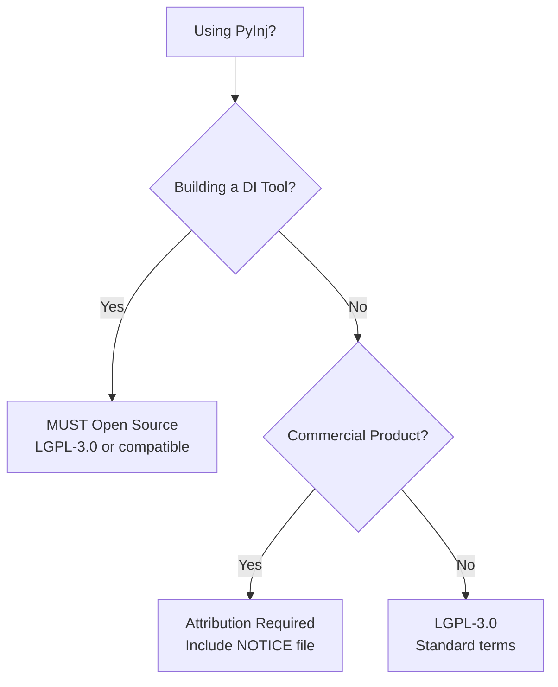

# PyInj License Guide

## Quick Decision Tree



## Understanding PyInj's Dual License

PyInj uses a dual-licensing model similar to Qt and MongoDB, designed to:

1. **Foster open DI ecosystem** - Any DI tools built with PyInj must be open source
2. **Enable commercial adoption** - Products using PyInj internally can remain closed source
3. **Ensure attribution** - Commercial users must acknowledge PyInj (like Android acknowledges Linux)

## License Options Explained

### Option A: LGPL-3.0 with DI-Framework Exception (Copyleft)

**When this applies:**
- You're building a dependency injection framework or library
- You're extending PyInj's DI capabilities
- You're creating tools that generate DI code
- Your product's primary purpose is dependency injection

**Requirements:**
- Your code MUST be open source (LGPL-3.0, GPL-3.0, or AGPL-3.0)
- Modifications to PyInj must be contributed back
- Your users must have access to your source code

**Examples requiring open source:**
```python
# ❌ These MUST be open sourced:

# A new DI framework built on PyInj
class SuperDI(PyInjContainer):
    """Enhanced DI container with extra features"""
    pass

# A code generator for DI
def generate_di_bindings(classes):
    """Generates PyInj registration code"""
    pass

# An extension adding new DI patterns
class PyInjServiceLocator:
    """Service locator pattern for PyInj"""
    pass
```

### Option B: Commercial Attribution License

**When this applies:**
- You're using PyInj internally in your application
- DI is an implementation detail, not your product's purpose
- You're building a commercial SaaS, mobile app, or enterprise software
- Your product happens to use PyInj for its architecture

**Requirements:**
1. Include attribution in your product
2. Include the NOTICE file in distributions
3. Specify the PyInj version used

**Examples allowing closed source:**
```python
# ✅ These can remain closed source (with attribution):

# A web application using PyInj
from pyinj import Container

container = Container()
# ... register your business services
app = FastAPI()  # Your commercial app

# A game engine using PyInj internally
class GameEngine:
    def __init__(self):
        self.di = Container()  # Using PyInj internally
        
# An analytics platform
class AnalyticsPlatform:
    def setup_services(self):
        container = Container()  # Implementation detail
```

## Real-World Scenarios

### Scenario 1: FastAPI Microservice (Commercial OK ✅)
```python
# Your proprietary e-commerce API
from pyinj import Container, inject

container = Container()
# Register your business services
@inject
async def checkout_handler(payment: PaymentService):
    # Your proprietary business logic
    pass
```
**License:** Commercial Attribution - just include NOTICE file

### Scenario 2: New DI Framework (Must Open Source ❌)
```python
# Enhanced DI framework
from pyinj import Container

class SmartContainer(Container):
    def auto_wire(self, module):
        # Auto-discovery and registration
        pass
```
**License:** LGPL-3.0 required - must open source

### Scenario 3: Django Integration Library (Must Open Source ❌)
```python
# django-pyinj integration
from pyinj import Container

class DjangoPyInj:
    def integrate_with_django(self, settings):
        # Bridge Django's DI with PyInj
        pass
```
**License:** LGPL-3.0 required - this extends DI functionality

### Scenario 4: Mobile Banking App (Commercial OK ✅)
```python
# Your proprietary banking app backend
from pyinj import Container, Token

# Using PyInj for internal architecture
auth_token = Token("auth", AuthService)
container.register(auth_token, create_auth_service)
```
**License:** Commercial Attribution - DI is implementation detail

## Attribution Requirements

### For Commercial Products

Add to your documentation/about section:
```
This product includes PyInj v1.2.0 (https://github.com/QriusGlobal/pyinj)
Copyright (c) 2025 Qrius Global, used under Commercial Attribution License
```

### In Your Legal Notices
```
Third-Party Software Notices:

PyInj
-----
Version: 1.2.0
Copyright (c) 2025 Qrius Global
License: Commercial Attribution License
Repository: https://github.com/QriusGlobal/pyinj
```

### Mobile App Store Descriptions
```
Acknowledgments:
Built with PyInj dependency injection (https://github.com/QriusGlobal/pyinj)
```

## FAQ

### Q: I'm building a REST API for my SaaS. What license?
**A:** Commercial Attribution. Your API is not a DI tool, it just uses DI internally.

### Q: I'm making a PyInj plugin for VS Code. What license?
**A:** If it generates DI code or extends PyInj: LGPL-3.0. If it's just syntax highlighting: Commercial Attribution.

### Q: Can I use PyInj in my proprietary enterprise software?
**A:** Yes, under Commercial Attribution license. Include the NOTICE file and attribution.

### Q: I'm forking PyInj to add async improvements. What license?
**A:** LGPL-3.0. Modifications to PyInj itself must be open sourced.

### Q: I'm building a testing framework that uses PyInj. What license?
**A:** If your framework extends DI capabilities: LGPL-3.0. If it just uses PyInj for its own internals: Commercial Attribution.

### Q: Do I need to open source my entire application if it uses PyInj?
**A:** No! Only if you're building DI tools. Regular applications using PyInj internally can stay closed source with attribution.

### Q: Can I sell a product that uses PyInj?
**A:** Yes! Commercial use is allowed under both license options. DI tools must be open source but can be sold. Other products just need attribution.

### Q: What if I'm unsure which license applies?
**A:** Contact legal@qrius.global for clarification. When in doubt, ask yourself: "Is my product's main purpose to provide DI functionality?" If yes → LGPL-3.0. If no → Commercial Attribution.

## Similar Licensing Models

PyInj's dual license is similar to:

- **Qt Framework**: Open source for open source, commercial for commercial
- **MongoDB**: SSPL for services, commercial for products  
- **MySQL**: GPL for open source, commercial for proprietary
- **Android/Linux**: Android acknowledges Linux but apps stay proprietary

The key difference: PyInj specifically targets DI tools for copyleft, allowing everything else commercial use with attribution.

## License Compliance Checklist

### For DI Tools/Frameworks
- [ ] Source code publicly available
- [ ] License file indicates LGPL-3.0 or compatible
- [ ] Modifications to PyInj contributed back
- [ ] Users can access and modify your code

### For Commercial Products
- [ ] NOTICE file included in distribution
- [ ] Attribution in documentation/about
- [ ] PyInj version specified
- [ ] Legal notices updated

## Contact

**Licensing Questions:** legal@qrius.global  
**Technical Questions:** GitHub Issues  
**Commercial Licensing:** Not needed - use Commercial Attribution option

---

*This guide is for informational purposes. For legal authority, refer to the LICENSE file.*