## Simple diagram
```python linenums="1"
--8<-- "simple_rbd.py:13:13,16:"
```

--8<-- "simple_rbd.py:4:8"




## Example with more functionality

```python linenums="1"
--8<-- "example_rbd.py:14:14,17:"
```

--8<-- "example_rbd.py:4:8"

<div class="highlight"></div>
