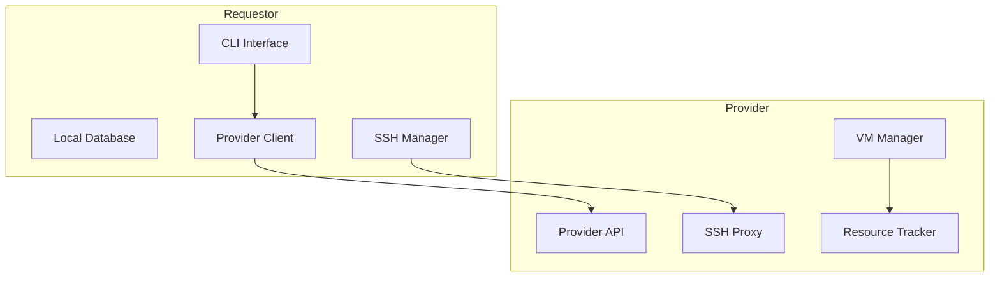
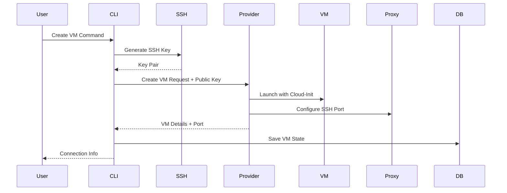
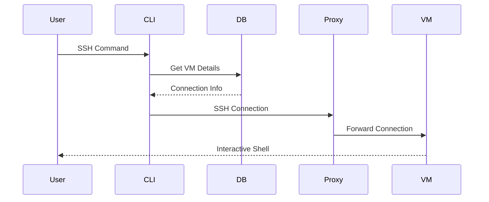

# VM on Golem Requestor

Rent compute on demand — like Airbnb for servers. The `golem` CLI helps you discover providers, fund pay‑as‑you‑go streams, launch VMs, and connect via SSH.

## Quick Start (Rent a VM)

1) Install:

```bash
pip install request-vm-on-golem
```

2) Find providers (testnet by default):

```bash
golem vm providers
```

3) Create a VM (auto‑opens a payment stream if needed):

```bash
golem vm create my-vm --provider-id 0xProvider --cpu 2 --memory 4 --storage 20
```

4) SSH in:

```bash
golem vm ssh my-vm
```

Check your installed version and whether an update is available:

```bash
golem version
```

5) Stop or destroy when done:

```bash
golem vm stop my-vm
golem vm destroy my-vm
```

## Architecture Overview



## How It Works

### 1. VM Creation Flow



When you create a VM:

1. The requestor generates an SSH key pair or uses your system's existing keys
2. The provider receives the public key and injects it during VM creation via cloud-init
3. The provider allocates a dedicated port and configures SSH forwarding
4. Connection details are stored locally for future access

### 2. SSH Connection Flow



The SSH connection process:

1. The CLI retrieves stored VM details from the local database
2. The provider's proxy system forwards your SSH connection to the VM
3. All traffic is securely routed through the allocated port

## Streaming Payments (Native ETH on L2)

This requestor integrates with an on‑chain StreamPayment contract to enable “pay‑as‑you‑go” rentals using native ETH (no ERC20 approvals when the token address is zero).

Flow:

1. Fetch provider info (preferred addresses):
   - `GET http://{provider}:7466/api/v1/provider/info` → `provider_id`, `stream_payment_address`, `glm_token_address` (zero address means native ETH).
2. Compute `ratePerSecond` from provider pricing and requested VM resources.
3. Ensure `deposit >= ratePerSecond * 3600` (≥ 1 hour runway recommended/minimum).
4. Create a stream (`createStream(0x000...0, provider_id, deposit, ratePerSecond)` plus `value=deposit`), capture `stream_id`. For ERC20 mode use a token address and approve first.
5. Create VM: `POST /api/v1/vms` with `stream_id` included.
6. Top‑up over time with `topUp(stream_id, amount)` to extend stopTime and keep the VM running indefinitely.
7. On stop/destroy: the requestor will best‑effort `withdraw` / `terminate` to settle.

CLI helpers

- Open a stream for a planned VM (computes rate from provider pricing):

```bash
golem vm stream open \
  --provider-id 0xProvider \
  --cpu 2 --memory 4 --storage 20 \
  --hours 1
# prints { stream_id, rate_per_second_wei, deposit_wei }
```

- Top up an existing stream:

```bash
# Add 3 hours at prior rate
golem vm stream topup --stream-id 123 --hours 3

# Or specify exact GLM amount
golem vm stream topup --stream-id 123 --glm 25.0
```

- Check stream status via provider (by VM name recorded in your DB):

```bash
golem vm stream status my-vm
# add --json for machine-readable output
```

- Inspect a stream directly on-chain:

```bash
golem vm stream inspect --stream-id 123
```

- Stopping or destroying a VM ends the stream:

```bash
# Stop VM and terminate payment stream (best-effort)
golem vm stop my-vm

# Destroy VM and terminate stream
golem vm destroy my-vm
```

- Create a VM and attach an existing stream (no auto-streams are created by the requestor):

```bash
golem vm create my-vm \
  --provider-id 0xProvider \
  --cpu 2 --memory 4 --storage 20 \
  --stream-id 123
```

Environment (env prefix `GOLEM_REQUESTOR_`):

- `payments_network` — Payments network profile (defaults to `l2.holesky`). Profiles provide RPC + faucet defaults.
- `polygon_rpc_url` — EVM RPC URL (defaults from `payments_network` profile; can be overridden)
- `stream_payment_address` — StreamPayment address (defaults from `contracts/deployments/l2.json`; overridden by provider info)
- `glm_token_address` — Token address (defaults from `contracts/deployments/l2.json`; zero address means native ETH)
  - Optional override of deployments directory: set `GOLEM_DEPLOYMENTS_DIR` to a folder containing `l2.json`.
- `provider_eth_address` — optional dev helper; in production always use `/provider/info`
- `network` — Target network for discovery filtering: `testnet` (default) or `mainnet`

Efficiency tips:

- Batch top‑ups (e.g., add several hours at once) to reduce on‑chain calls.
- Withdrawals are typically executed by providers; requestors don’t need to withdraw.
- The CLI `vm stream open` will prefer the provider’s advertised contract/token addresses to prevent mismatches.

Monitoring and auto top-up:

- The requestor API runs a background monitor that keeps each running VM’s stream funded with at least 1 hour runway (configurable). It checks every 30s and tops up to the target runway.
- Configure via env (prefix `GOLEM_REQUESTOR_`): `stream_monitor_enabled` (default true), `stream_monitor_interval_seconds` (default 30), `stream_min_remaining_seconds` (default 3600), `stream_topup_target_seconds` (default 3600).

## Faucet (Testnet only)

- Request L2 test ETH to cover stream transactions:

```bash
golem wallet faucet
```

- Defaults:
  - Faucet URL and enablement come from the active `payments_network` profile. On `mainnet` (or other profiles without faucet) the command is disabled.
  - CAPTCHA: `https://cap.gobas.me/05381a2cef5e`
  - Override with env: `GOLEM_REQUESTOR_l2_faucet_url`, `GOLEM_REQUESTOR_captcha_url`, `GOLEM_REQUESTOR_captcha_api_key`.

## Installation

```bash
# Install using pip
pip install request-vm-on-golem

# Or install from source
git clone https://github.com/golem/vm-on-golem.git
cd vm-on-golem/requestor-server
pip install -e .
```

## Development

To run the application in development mode, you need to set environment variables to configure development-specific settings. These are defined in the `.env.dev` file.

You can run the server in development mode using one of the following methods:

### Using `source`

First, source the development environment variables:

```bash
source .env.dev
```

Then, run any `golem` command. For example: `golem vm providers`

### Prepending variables

Alternatively, you can prepend the environment variables directly to the command:

```bash
GOLEM_REQUESTOR_ENVIRONMENT="development" GOLEM_REQUESTOR_FORCE_LOCALHOST="true" poetry run golem vm providers
```

### Mode vs. Network

- Development Mode (`GOLEM_REQUESTOR_ENVIRONMENT=development`)
  - Improves local workflows: prefixes central discovery URL with `DEVMODE-` and, when using the central driver, maps provider IPs to `localhost` for easier testing.
  - Does not determine chain selection.

- Network Selection (`--network` or `GOLEM_REQUESTOR_NETWORK`)
  - Filters results by `testnet|mainnet`. Defaults are sensible; most users don’t need to change anything.

- Payments Network (`GOLEM_REQUESTOR_PAYMENTS_NETWORK`)
  - Selects the payments chain profile (e.g., `l2.holesky`, `mainnet`) used for streaming payments; sets default RPC and faucet behavior.
  - Provider discovery filters by this payments network via `vm providers` unless `--all-payments` is supplied. Override payments filter with `--payments-network <name>`.

Examples:
- List providers on mainnet without changing env: `golem vm providers --network mainnet`
- Create a VM while targeting testnet: `golem vm create my-vm --provider-id 0xProvider --cpu 2 --memory 4 --storage 20 --network testnet`

## Usage

### Provider Discovery

List available providers with their resources:

```bash
golem vm providers
```

Example output:

```
────────────────────────────────────────────────
  🌍 Available Providers (3 total)
────────────────────────────────────────────────
Provider ID     Country   CPU    Memory    Disk
provider-1      🌍 SE     💻 4    🧠 8GB    💾 40GB
provider-2      🌍 US     💻 8    🧠 16GB   💾 80GB
provider-3      🌍 DE     💻 2    🧠 4GB    💾 20GB
────────────────────────────────────────────────
```

### Creating a VM

```bash
golem vm create my-webserver --provider-id provider-1 --cpu 2 --memory 4 --storage 20
```

The system will:

1. Verify provider availability
2. Check resource requirements
3. Set up SSH access
4. Deploy and configure the VM
5. Save connection details locally

Example output:

```
────────────────────────────────────────────────
  🎉 VM Deployed Successfully!
────────────────────────────────────────────────

  VM Details
  ┈┈┈┈┈┈┈┈┈┈┈┈┈┈┈┈┈┈┈┈┈┈┈┈┈┈┈
  🏷️  Name      : my-webserver
  💻 Resources  : 2 CPU, 4GB RAM, 20GB Disk
  🟢 Status     : running

  Connection Details
  ┈┈┈┈┈┈┈┈┈┈┈┈┈┈┈┈┈┈┈┈┈┈┈┈┈┈┈
  🌐 IP Address : 192.168.1.100
  🔌 Port       : 50800

  Quick Connect
  ┈┈┈┈┈┈┈┈┈┈┈┈┈┈┈┈┈┈┈┈┈┈┈┈┈┈┈
  🔑 SSH Command : ssh -i ~/.golem/ssh/id_rsa -p 50800 ubuntu@192.168.1.100
────────────────────────────────────────────────
```

### Managing VMs

List your VMs:

```bash
golem vm list
```

Example output:

```
────────────────────────────────────────────────
  📋 Your VMs (2 total)
────────────────────────────────────────────────
Name          Status         IP Address      Resources
my-webserver  ● running     192.168.1.100   2 CPU, 4GB RAM
my-database   ● stopped     192.168.1.101   4 CPU, 8GB RAM
────────────────────────────────────────────────
```

Other commands:

```bash
# SSH into a VM
golem vm ssh my-webserver

# Stop a VM
golem vm stop my-webserver

# Start a VM
golem vm start my-webserver

# Destroy a VM
golem vm destroy my-webserver
```

## Configuration

The requestor uses a hierarchical configuration system:

1. Environment Variables:

```bash
# Base Directory (default: ~/.golem)
export GOLEM_REQUESTOR_BASE_DIR="/path/to/golem/dir"

# Individual Paths (override base dir)
export GOLEM_REQUESTOR_SSH_KEY_DIR="/path/to/keys"
export GOLEM_REQUESTOR_DB_PATH="/path/to/database.db"

# Environment Mode (defaults to "production")
export GOLEM_REQUESTOR_ENVIRONMENT="development"  # Optional: Switch to development mode
export GOLEM_REQUESTOR_FORCE_LOCALHOST="true"    # Optional: Force localhost in development mode
export GOLEM_REQUESTOR_NETWORK="testnet"         # Or "mainnet"; optional filter for listing/creation
```

2. Directory Structure:

```
~/.golem/
  ├── ssh/              # SSH keys
  │   ├── id_rsa       # Private key
  │   └── id_rsa.pub   # Public key
  └── vms.db           # SQLite database
```

## Technical Details

### SSH Key Management

The system intelligently handles SSH keys:

1. Uses existing system SSH keys if available
2. Generates and manages Golem-specific keys if needed
3. Ensures proper key permissions (0600 for private, 0644 for public)
4. Supports key reuse across VMs

### State Management

Local state is maintained in SQLite:

-   VM details and configuration
-   Provider information
-   Connection parameters
-   VM status tracking

### Provider Integration

The requestor communicates with providers through:

1. Network discovery (uses sane defaults; no setup required for most users)
2. Direct API calls for VM management
3. SSH proxy system for secure access
4. Resource tracking for capacity management

## Error Handling

The system provides clear error messages and recovery steps:

```
Error: Unable to establish SSH connection (VM may be starting up)
Solution: Wait a few moments and try again. The VM is likely still initializing.

Error: Provider is no longer available (they may have gone offline)
Solution: Choose a different provider or wait for the original to come back online.

Error: VM not found in local database
Solution: The VM may have been manually removed. Use 'golem vm list' to see available VMs.
```

## Contributing

1. Fork the repository
2. Create a feature branch
3. Make your changes
4. Run the tests
5. Submit a pull request
