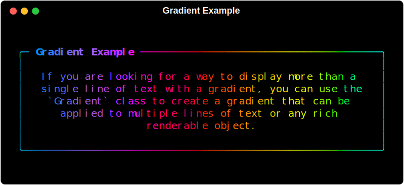

# Gradient

The `Gradient` class accepts any rich.console.ConsoleRenderable and
prints it to a rich.console.Console instance in gradient color.

```python
panel = Panel(
    "If you are looking for a way to display more than \
a single line of text with a gradient, \
you can use the `Gradient` class to \
create a gradient that can be applied to \
multiple lines of text or any rich renderable object.",
    title="Gradient Example",
    title_align="left",
    padding=(1, 2),
    border_style="bold",
    width=60,
)
console.print(Gradient(panel, rainbow=True), justify="center")
```

<!--
If the image is not visible, try using the Markdown image syntax inside the div and add a style attribute for width. Some Markdown renderers (like MkDocs Material) do not support HTML  tags or style attributes directly. This approach works in most documentation tools.
-->


Or if you would like an animated gradient:

```python
console = Console(width=64, record=True)
console.line(2)
panel = Panel(
    "This example demonstrates an animated gradient that shifts colors over time. \
You can use the `Gradient` class to create a gradient that can be applied to any \
rich renderable object, such as text or panels. The animation is achieved by \
incrementing the phase of the gradient.",
    title="Animated Gradient",
    padding=(1, 2),
)
gradient = Gradient(panel, rainbow=True, animated=True)
live_renderable = gradient
# Setup Live to refresh at ~30 FPS
with Live(live_renderable, console=console, refresh_per_second=30):
    with suppress(KeyboardInterrupt):
        while True:
            time.sleep(0.03)
            # Increment phase to animate gradient shift
            gradient.phase += 0.2
```


