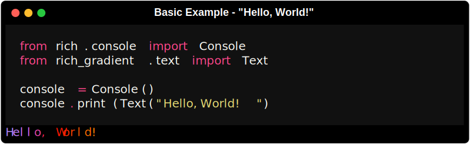
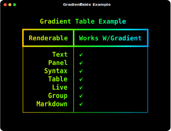

# 

<div class="badges" style="justify-content:full;">
    <a href="https://github.com/astral-sh/uv"></a>
    <a href="https://GitHub.com/maxludden/rich-gradient"></a>
    <a href="https://GitHub.com/maxludden/rich-gradient"></a>
    <a href="https://GitHub.com/maxludden/rich-gradient"></a>
    <a href="https://github.com/Textualize/rich"></a></div>
<div id="spacer"></div>


This library is a wrapper of the great [rich](https://GitHub.com/textualize/rich) library that extends [rich.text.Text](https://github.com/Textualize/rich/blob/master/rich/text.py) to allow for the easy generation gradient text from either user entered colors or randomly if no colors are entered.

Borrowing from [rich-color-ext](https://github.com/maxludden/rich-color-ext) rich_gradient extends the rich standard colors to include:

- 3 or 6 digit hex code (e.g. <span class="red">`#f00`</span> or <span class="red">`#FF0000`</span>)
- RGB color codes (e.g. <span class="red">`rgb(255, 0, 0)`</span>)
- RGB tuples   (e.g. <span class="red">`(255, 0, 0)`</span>)
- CSS3 Color Names (e.g. <span class="rebeccapurple">`rebeccapurple`</span>)

## Installation

### uv (Recommended)

```bash
uv add rich-gradient
```

### Pip

```bash
pip install rich-gradient
```

## Usage

### Text Example

To print a simple gradient import the `Text` class from in the `rich_gradient` library:




## Gradient

If just text is boring, `rich_gradient.gradient.Gradient` allows you to apply a gradient to any `rich.console.ConsoleRenderable`. Such as a `rich.panel.Panel` or `rich.table.Table`;

```python

table = Table(
    title="Gradient Table Example",
    border_style="bold",
)
table.add_column(
    "Renderable",
    style="bold",
    vertical="middle",
    justify="right"
)
table.add_column("Works w/Gradient", justify="left", style="bold")
renderables = [
    "Text",
    "Panel",
    "Syntax",
    "Table",
    "Live",
    "Group",
    "Markdown"
]
for renderable in renderables:
    table.add_row(
        renderable,
        "[b]:heavy_check_mark:[/b]"
    )

console.print(Gradient(table, rainbow=True), justify="center")
```


