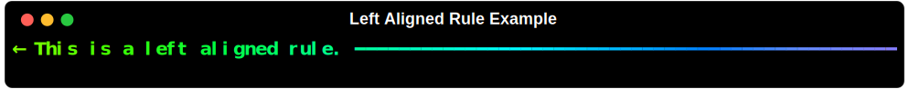

# Rule

The 'Rule` class is based off of the rich.rule.Rule class and is used to define a rule in gradient color and variable thickness.

## Usage

```python
from rich.console import Console
from rich_gradient.rule import Rule

console = Console()
console.print(
    Rule(
        "Hello, world!",
    )
)
```


## Alignment

The `Rule` class supports the same alignment options as the `Rule` class.

### Left Aligned Rule

```python
console.print(
    Rule(
        "← This is a left aligned rule.",
        align="left",
    )
)
```



### Right Aligned Rule

```python
console.print(
    Rule(
        "This is a right aligned rule. →,
        align="right"
    )
)
```


### Center Aligned Rule

```python
console.print(
    Rule(
        "→ This is a center aligned rule. ←",
        align="center"
    )
)
```


!!! note

    The default behavior of rich_gradient.rule.Rule is center aligned.


## Thickness

The `Rule` class supports configurable thickness. Valid integer values are:

0. `thin` (`─`)
1. `double` (`═`)
2. `medium` (`━`) (default)
3. `thick` (`█`)


### Thin Rule

```python
console.print(
    Rule(
        "This is a thin rule",
        thickness=0
    )
)
```


### Double-line Rule

```python
console.print(
    Rule(
        "This is a double-line rule",
        thickness=1
    )
)
```


### Medium Rule

```python
console.print(
    Rule(
        "This is a medium rule",
        thickness=2
    )
)
```


### Thick Rule

```python
console.print(
    Rule(
        "This is a thick rule",
        thickness=3
    )
)
```


## Custom Colored Rule

To create a rule with custom colors, simply supply the <code>colors</code> parameter with a list of colors (as CSS color names, 3 or 6 digit hex codes, rich color names, or rgb color codes).

<div style="background: #271632; color: #eee; padding: 1em; border-radius: 6px; font-family: 'JetBrains Mono', 'Fira Mono', 'Consolas', monospace; font-size: 1em;">
   <span style="color: #6cf;">console</span>.print(<br>
   &nbsp;&nbsp;<span style="color: #9f0;">Rule</span>(<br>
   &nbsp;&nbsp;&nbsp;&nbsp;<span style="color: #aaf;">"This rule has custom colors!",</span><br>
   &nbsp;&nbsp;&nbsp;&nbsp;<span style="color: #f90;">colors</span>=<span style="color:#ff0;">[</span><br>
   &nbsp;&nbsp;&nbsp;&nbsp;&nbsp;&nbsp;<span style="color: #eee;">"<span style='color:#f00;'>#f00</span>",</span>  <span style="color: #888;"># red</span><br>
   &nbsp;&nbsp;&nbsp;&nbsp;&nbsp;&nbsp;<span style="color: #eee;">"<span style='color:#f90;'>#f90</span>",</span>  <span style="color: #888;"># orange</span><br>
   &nbsp;&nbsp;&nbsp;&nbsp;&nbsp;&nbsp;<span style="color: #eee;">"<span style='color:#ff0;'>#ff0</span>",</span>  <span style="color: #888;"># yellow</span><br>
   &nbsp;&nbsp;&nbsp;&nbsp;&nbsp;&nbsp;<span style="color: #eee;">"<span style='color:#9f0;'>#9f0</span>",</span>  <span style="color: #888;"># yellow-green</span><br>
   &nbsp;&nbsp;&nbsp;&nbsp;<span style="color:#ff0;">]</span><br>
   &nbsp;&nbsp;)<br>
)
</div>
<br>


## Custom Title Style

If you would like some distinction between the rule and it's title, simply pass a rich style to the `title_style` parameter:

```python
console.print(
     Rule(
         "Custom Styled Rule Title",
         title_style="bold white",
         align="center"
     )
)
```


