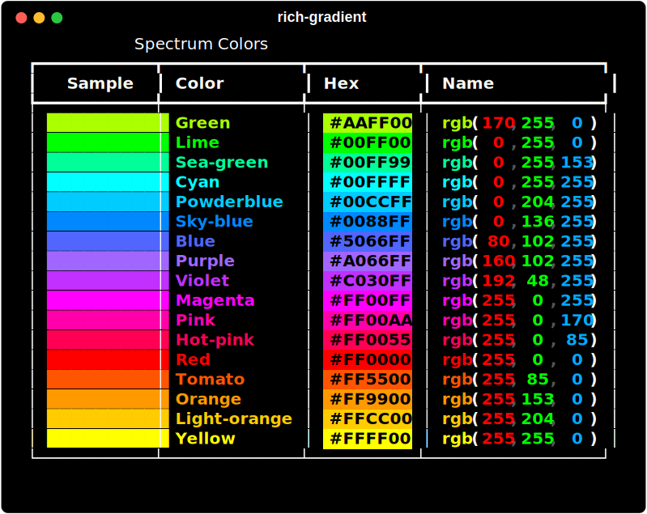

# Spectrum

`rich_gradient.spectrum.Spectrum` provides a convenient way to generate and preview a palette of colors used throughout rich-gradient:

- Generates a list of Rich `Color` objects spanning the spectrum.
- Supports `hues` count, optional reversal, and a `seed` for deterministic order.
- Exposes `.colors`, `.triplets`, `.styles`, `.hex`, and `.names`.
- Renders as a Rich table when printed.

## Usage

```python
from rich.console import Console
from rich_gradient.spectrum import Spectrum

console = Console()
console.print(Spectrum(hues=8, seed=42), justify="center")
```



