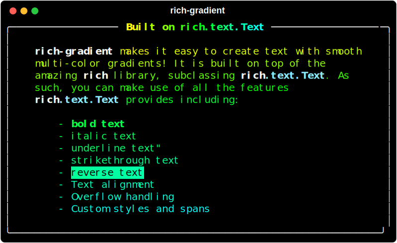

# rich_gradient.text.Text

If you pass `rich_gradient.text.Text` a string, it will print the string to the console in a random gradient. Rich-gradient's `Text` class inherits from `rich.text.Text`. In addition to all of it's parent's parameters, `rich_gradient.text.Text` also accepts:

-  `colors`: (`List[ColorType]`) - A list of strings that can be parsed by `rich.color.Color`.
<blockquote style="padding:50px,margin:20em;background-color: #000;padding:10px;">
  <strong style="padding:10px;">📝 Note</strong> <code>rich_color_ext</code> extends rich to be able to parse:
  <ul>
        <li><strong>CSS color names:</strong>
          <ul>
              <li>◉ rebeccapurple</li>
              <li>◉ salmon</li>
              <li>◉ aliceblue</li>
          </ul>
    </li><li><strong>3-Digit Hex Color Codes:</strong>
        <ul>
            <li>◉ #abc</li>
            <li>◉ #FDC</li>
            <li>◉ #A1f
        </ul>
    </li>
  </ul>
</blockquote>

- `bgcolors` (`List[ColorType]`) - A list of strings that can be parsed by `rich.color.Color to use as the color stops of the background of the style. If a single color is used - it is used for the entire background.
-  `hues`: (`int`) - The number of color stops a gradient should use
-  `rainbow`: (`bool`) - Whether to create a gradient that spans the entire spectrum. Defaults to `False`
-  `markup`: (`bool`) - Whether to respect the inputs existing styles. Defaults  to `True`

---

## Basic Usage of Text

## Gradient Text with Specific Colors

To have more control over the gradient that is printed, you can pass the `colors` parameter a list of colors. Colors can be parsed from:
-  CSS colors names,
-  3 or 6 digit hex codes,
-  `rich.color.Color` instances or names,
-  any string or style that `rich.color.Color` can parse.

---

## Rainbow Gradient Text Example

If four colors isn't enough, you can use the 'rainbow' parameter to generate a rainbow gradient that spans the entire spectrum of colors randomly.

*The rainbow gradient is generated randomly each time the code is run.

---

## Still inherits from `rich.text.Text`

Since `rich_gradient.text.Text` is a subclass of `rich.text.Text`, you can still use all the same methods and parameters as you would.

## `rich_gradient.text.Text → rich.text.Text`

As the rendering of `rich_gradient.text.Text` and `rich.text.Text` are identical,
`rich_gradient.text.Text` has a `.as_rich()` method to convert an instance into a styled
`rich.text.text`.

