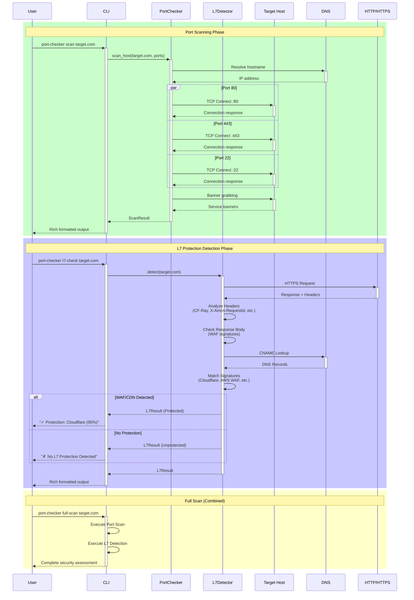

# Simple Port Checker

A comprehensive Python tool for checking firewall ports and detecting L7 protection services (WAF, CDN, etc.).

## Features

- ✅ **Port Scanning**: Check well-known firewall ports and services
- 🛡️ **L7 Protection Detection**: Identify WAF/CDN services (F5, AWS WAF, Azure, Cloudflare, etc.)
- � **DNS Trace**: Advanced DNS CNAME chain analysis and IP protection detection
- �🚀 **Async Support**: High-performance concurrent scanning
- 📊 **Rich Output**: Beautiful terminal output with progress bars
- 🔧 **Unified CLI**: All functionality accessible through a single command interface
- 📦 **Pip Installable**: Available on PyPI
- 🐍 **Type Hints**: Full type hint support for better IDE integration
- 🏗️ **Production Ready**: Follows Python packaging best practices

## Installation

### From PyPI (recommended)
```bash
pip install simple-port-checker
```

### From Source
```bash
git clone https://github.com/htunn/simple-port-checker.git
cd simple-port-checker
pip install -e .
```

## Quick Start

### Command Line Usage

```bash
# Basic port scan
port-checker scan example.com

# Scan specific ports
port-checker scan example.com --ports 80,443,8080

# Check L7 protection
port-checker l7-check example.com

# DNS trace analysis
port-checker dns-trace example.com

# L7 check with DNS tracing
port-checker l7-check example.com --trace-dns

# Full scan with L7 detection
port-checker full-scan example.com

# Scan multiple targets
port-checker scan example.com google.com --output results.json

# Run as Python module
python -m simple_port_checker scan example.com
```

### Python API Usage

```python
from simple_port_checker import PortChecker, L7Detector

# Initialize scanner
scanner = PortChecker()

# Scan ports
results = await scanner.scan_host("example.com", ports=[80, 443, 8080])
print(f"Open ports: {len([p for p in results.ports if p.is_open])}")

# Detect L7 protection
detector = L7Detector()
protection = await detector.detect("example.com")
if protection.primary_protection:
    service = protection.primary_protection.service.value
    confidence = protection.primary_protection.confidence
    print(f"L7 Protection: {service} ({confidence:.0%})")
else:
    print("No L7 protection detected")
```

## Architecture & Flow

The following sequence diagram illustrates the end-to-end flow of Simple Port Checker:



### Key Components

- **CLI**: Rich command-line interface with progress bars and colored output
- **PortChecker**: Async port scanner with configurable concurrency and timeouts
- **L7Detector**: HTTP header and DNS analysis for WAF/CDN detection
- **DNS Resolution**: Hostname to IP mapping and CNAME analysis
- **Target Host**: The system being scanned for open ports and services
- **HTTP/HTTPS**: Web service detection and L7 protection analysis

### Supported Detection Methods

1. **Port Scanning**: TCP connection attempts with banner grabbing
2. **HTTP Header Analysis**: Identifying protection service signatures
3. **DNS Analysis**: CNAME records pointing to CDN/WAF providers
4. **Response Pattern Matching**: Service-specific response signatures
5. **IP Range Detection**: Known IP ranges for major providers

## Supported L7 Protection Services

- **AWS WAF** - Amazon Web Application Firewall
- **Azure WAF** - Microsoft Azure Web Application Firewall  
- **F5 BIG-IP** - F5 Application Security Manager
- **Cloudflare** - Cloudflare WAF and DDoS Protection
- **Akamai** - Akamai Web Application Protector
- **Imperva** - Imperva SecureSphere WAF
- **Sucuri** - Sucuri Website Firewall
- **Fastly** - Fastly Edge Security
- **KeyCDN** - KeyCDN Security
- **MaxCDN** - MaxCDN Security

## Well-Known Ports Checked

| Port | Service | Description |
|------|---------|-------------|
| 80 | HTTP | Web traffic |
| 443 | HTTPS | Secure web traffic |
| 8080 | HTTP-ALT | Alternative HTTP |
| 8443 | HTTPS-ALT | Alternative HTTPS |
| 3389 | RDP | Remote Desktop Protocol |
| 22 | SSH | Secure Shell |
| 21 | FTP | File Transfer Protocol |
| 25 | SMTP | Simple Mail Transfer Protocol |
| 53 | DNS | Domain Name System |
| 110 | POP3 | Post Office Protocol |
| 143 | IMAP | Internet Message Access Protocol |
| 993 | IMAPS | IMAP over SSL |
| 995 | POP3S | POP3 over SSL |
| 587 | SMTP-MSA | SMTP Message Submission |

## CLI Commands

### `port-checker scan`
Scan target hosts for open ports.

```bash
port-checker scan TARGET [OPTIONS]

Options:
  --ports TEXT        Comma-separated list of ports (default: common ports)
  --timeout INTEGER   Connection timeout in seconds (default: 3)
  --concurrent INTEGER Maximum concurrent connections (default: 100)
  --output TEXT       Output file (JSON format)
  --verbose          Enable verbose output
```

### `port-checker l7-check`
Check for L7 protection services.

```bash
port-checker l7-check TARGET [OPTIONS]

Options:
  --timeout INTEGER   Request timeout in seconds (default: 10)
  --user-agent TEXT   Custom User-Agent string
  --output TEXT       Output file (JSON format)
  --verbose          Enable verbose output
```

### `port-checker full-scan`
Perform both port scanning and L7 protection detection.

```bash
port-checker full-scan TARGET [OPTIONS]

Options:
  --ports TEXT        Comma-separated list of ports
  --timeout INTEGER   Connection timeout in seconds
  --concurrent INTEGER Maximum concurrent connections
  --output TEXT       Output file (JSON format)
  --verbose          Enable verbose output
```

## Configuration

Create a configuration file at `~/.port-checker.yaml`:

```yaml
default_ports: [80, 443, 8080, 8443, 22, 21, 25, 53]
timeout: 5
concurrent_limit: 50
user_agent: "SimplePortChecker/1.0"
```

## Development

### Setup Development Environment

```bash
git clone https://github.com/htunn/simple-port-checker.git
cd simple-port-checker
python -m venv venv
source venv/bin/activate  # On Windows: venv\Scripts\activate
pip install -e ".[dev]"
```

### Run Tests

```bash
pytest
pytest --cov=simple_port_checker  # With coverage
```

### Code Formatting

```bash
black src/ tests/
isort src/ tests/
flake8 src/ tests/
mypy src/
```

### Pre-commit Hooks

```bash
pre-commit install
pre-commit run --all-files
```

## What's New in v0.2.0 🎉

This major release brings significant improvements to project structure and functionality:

### 🏗️ **Complete Project Refactoring**
- **Unified CLI**: All functionality now accessible through main `port-checker` command
- **Clean Architecture**: Proper Python package structure following best practices
- **Type Safety**: Full type hint support with `py.typed` file

### 🔍 **Enhanced DNS Analysis**
- **DNS Trace Command**: New `dns-trace` command for detailed CNAME chain analysis
- **Integrated Tracing**: Use `--trace-dns` flag with L7 checks for comprehensive analysis
- **Better Detection**: Improved protection detection through DNS-based analysis

### 🚀 **Production Ready**
- **Security Policy**: Added comprehensive security guidelines
- **Better Testing**: Reorganized test suite following Python standards
- **Documentation**: Updated and improved documentation
- **CI/CD Ready**: Optimized for automated builds and publishing

### ⚡ **Breaking Changes**
- Removed standalone scripts (use unified CLI instead)
- Moved tests to top-level directory
- Removed `run.py` (use `python -m simple_port_checker` or installed commands)

## Contributing

1. Fork the repository
2. Create a feature branch (`git checkout -b feature/amazing-feature`)
3. Commit your changes (`git commit -m 'Add amazing feature'`)
4. Push to the branch (`git push origin feature/amazing-feature`)
5. Open a Pull Request

## License

This project is licensed under the MIT License - see the [LICENSE](LICENSE) file for details.

## Changelog

See [CHANGELOG.md](CHANGELOG.md) for detailed version history.

### v0.2.0 (Latest)
- Major project refactoring and cleanup
- Unified CLI interface with DNS trace functionality
- Production-ready structure with type hints
- Enhanced security and documentation

### v0.1.0 (Initial Release)
- Basic port scanning functionality
- L7 protection detection
- CLI interface
- Async support
- Rich terminal output

## Security Considerations

This tool is intended for legitimate security testing and network diagnostics only. Users are responsible for ensuring they have proper authorization before scanning any networks or systems they do not own.

For security vulnerabilities, please see our [Security Policy](SECURITY.md).

## Support

- 📖 [Documentation](https://github.com/htunn/simple-port-checker#readme)
- 🐛 [Issue Tracker](https://github.com/htunn/simple-port-checker/issues)

## Acknowledgments

- Thanks to the Python community for excellent libraries
- Inspired by nmap and other network scanning tools
- Built with ❤️ for the security community
