---
author:
  - Wai-Shing Luk
bibliography:
  - n-sphere.bib
title: Low Discrepency Sampling Method on higher dimensional Spheres
...

## Abstract

This paper presents a discussion of the generation of low discrepancy sampling methods for n-dimensional spheres. Low discrepancy sequences are important and have been used in a variety of applications, including numerical integration, optimization, and simulation. This paper addresses the desirable properties of samples over an n-sphere, including uniformity, determinism, and incrementality. Subsequently, the proposed method for generating low discrepancy sequences over higher dimensional sphere is presented, which is based on the van der Corput sequence. We provide a comprehensive account of the algorithm and its implementation. Furthermore, the paper presents the results of numerical experiments conducted to evaluate the performance of the proposed method, including a comparison with randomly generated sequences and other proposed methods such as the Hopf coordinate method and the cylindrical coordinate method.

# Motivation

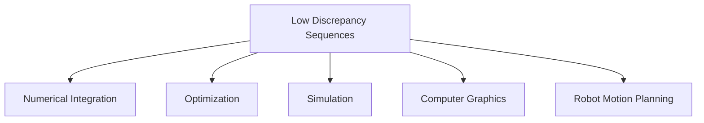

Low discrepancy sequences play a pivotal role in numerous fields of mathematics, computer science, and engineering. These sequences provide a more uniform distribution of points than is afforded by random sampling, thereby making them invaluable tools for applications such as numerical integration, optimization, and simulation. While low discrepancy sampling methods have been extensively studied in lower dimensions, particularly in the context of spheres in three-dimensional space, there is an increasing need for efficient sampling techniques in higher dimensions.


Low discrepancy sequences offer several advantages over traditional random sampling methods, including:

1.  **Uniformity**: Low-discrepancy sequences inherently aim for a **uniform distribution** of points. This means that the points are spread out evenly across the sampling space, minimizing areas of high concentration or sparseness.
2.  **Determinism**: Unlike truly random sampling methods, low-discrepancy sequences are **deterministic**. This implies that for a given starting point and parameters, the sequence of points generated will always be the same, making results reproducible.
3.  **Incrementality**: This is described as the **most important advantage** and a defining characteristic. Incrementality means that the sequences can **grow progressively**.
    *   **Dynamic Distribution**: Every time a new point is added to the sequence, the **overall distribution remains relatively uniform**. This is crucial for applications where the required number of samples is unknown beforehand.
    *   **Flexibility in Applications**: In fields such as robotics, one might not know precisely how many samples are needed, potentially stopping after a few points or switching strategies. Low-discrepancy sequences accommodate this by **maintaining uniform distribution** with each new point.

Despite their advantages, low-discrepancy sequences are not without drawbacks. The primary disadvantage noted is that as the **number of points increases, the process of generating them becomes slower**.

As we proceed to higher dimensions, a number of challenges emerge that must be addressed in order to facilitate progress. One such challenge is the curse of dimensionality. As the number of dimensions increases, the attainment of a uniform distribution becomes increasingly challenging. While sampling methods for three-dimensional spherical surfaces are well-established, the theory for higher dimensions remains a developing field of study. The following technical challenges must be addressed: A paucity of comprehensive sampling strategies that can be universally applied across all dimensions while preserving uniformity, determinism, and incrementality persists.

The paper presents a methodology for generating low-discrepancy sequences on $S^n$ based on the van der Corput sequence. The objective of this approach is to address the inherent challenges associated with high-dimensional sampling while maintaining the desirable properties associated with low-discrepancy sequences.

The proposed method for n-dimensional spherical sampling has the potential to be applied in a number of different fields, including:

- Robot Motion Planning [@yershova2010generating]: In high-dimensional spaces such as $S^3$ and $SO(3)$, Halton sequences provide uniformly distributed point sets, which are suitable for robot path planning and attitude control. This allows for the optimization of computational efficiency and the accuracy of motion trajectories.

- Wireless Communication Coding [@utkovski2006construction]: Spherical coding in MIMO systems employs the dots generated by Halton sequences as codewords to enhance the stability and anti-interference capacity of signal transmission, and to improve the data transmission rate and quality.

- Multivariate Empirical Mode Decomposition [@rehman2010multivariate]: In multivariate empirical mode decomposition, Halton sequences can be used to construct more accurate signal models and improve the accuracy of signal processing.

- Filter Bank Design [@mandic2011filter]: In the context of filter bank design, the utilization of Halton sequences has the potential to facilitate the construction of more precise filter parameters, thereby enhancing the accuracy of signal processing.

The following is a description of the organization of the paper: Section 2 provides a brief overview of low-discrepancy sequences. Section 3 presents the proposed method for generating low-discrepancy sequences on $S^n$. Section 4 presents the findings of the numerical experiments conducted to evaluate the performance of the proposed method. Section 5 presents a concluding summary of the paper.

# Overview of Low Discrepancy Sequences

## Basic: van der Corput sequence

The van der Corput sequence is a mathematical sequence that is employed to generate a series of evenly distributed numbers between 0 and 1. This function is of particular utility in a multitude of fields, including but not limited to computer graphics and numerical analysis. The van der Corput sequence is a low-discrepancy sequence used to generate uniformly distributed points in the interval [0,1]. It is constructed by means of a specific base (usually prime).


**Illustrative Example**: To demonstrate incrementality, we suggest an approach involves using two different colors. For instance, the **first ten points might be orange**, and the **next ten points might be purple**. When viewed separately, both the orange points and the purple points are quite uniform. Crucially, when these two sets are combined, the **overall distribution continues to remain uniform**. This characteristic is generally not achievable by other sampling methods.

```python
def vdc(k: int, base: int = 2) -> float:
    res = 0.0
    denom = 1.0
    while k != 0:
        denom *= base
        remainder = k % base
        k //= base
        res += remainder / denom
    return res
```

Example usage:
```python
>>> vdc(5, 2)  # 5 in binary is 101 → 0.101 → 0.625
0.625
>>> vdc(7, 3)  # 7 in base 3 is 21 → 0.12 → 0.555...
0.5555555555555555
```

The function accepts two inputs: the integer $k$, which represents the index in the sequence to be calculated, and the optional parameter base, which defaults to 2 (binary). The base is utilized to designate the number system that will be employed in the calculation. The function's output is a single floating-point number between 0 and 1, representing the kth value in the van der Corput sequence for the specified base. The algorithm operates by transforming the input number, designated as k, into a fractional value through the utilization of the specified base. This is accomplished through a process of repeatedly dividing the input value, $k$, by the base and employing the resulting remainders to construct the fractional result. Each element of the sequence is generated by converting the representation of the integer $k$ in base $b$ to decimal form in reverse order, thereby achieving a uniform distribution over the interval. For instance, when the base $b$ is 2, the third element in the sequence can be represented by the binary representation 011. The inverse sequence is converted to 0.11, which is 0.75.


```python
class VdCorput:
    def __init__(self, base: int = 2) -> None:
        self.count = 0
        self.base = base

    def pop(self) -> float:
        self.count += 1  # ignore 0
        return vdc(self.count, self.base)

    def reseed(self, seed: int) -> None:
        self.count = seed
```

Example usage:
```python
>>> gen = VdCorput(2)
>>> [gen.pop() for _ in range(5)]
[0.5, 0.25, 0.75, 0.125, 0.625]
```

The VdCorput class provides a simple interface for generating the van der Corput sequence of numbers, making it easy for programmers to incorporate these sequences into their own projects. The class takes one input when initialized: the base of the number system to use (defaulting to 2 if not specified). It keeps track of an internal count, starting at 0, which is used to generate each subsequent number in the sequence. The main output of this class comes from its 'pop()' method, which returns the next number in the Van der Corput sequence as a float between 0 and 1. Each time 'pop()' is called, it increments the internal count and calculates the next value in the sequence. The class also includes a 'reseed()' method, which allows the user to reset the internal count to a specific value. This is useful if you want to start the sequence from a particular point or reproduce a specific part of the sequence.


## Unit Circle $S^1$

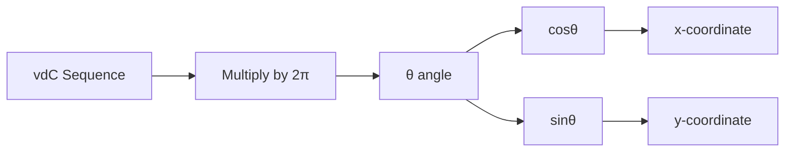

The concept of the Halton sequence can be extended to generate points on a unit circle in a two-dimensional space. The objective of this study is to present a method for generating a sequence of points distributed uniformly around a circle. The objective is to utilize the van der Corput sequence as a foundation for the generation of points on a circle. In order to fulfill its intended function, the Circle class employs the following logical structure:

```python
from math import cos, pi, sin, sqrt
TWO_PI = 2.0 * pi

class Circle:
    def __init__(self, base: int) -> None:
        self.vdc = VdCorput(base)

    def pop(self) -> List[float]:
        theta = self.vdc.pop() * TWO_PI  # map to [0, 2π]
        return [cos(theta), sin(theta)]
```

Example usage:
```python
>>> gen = Circle(2)
>>> [gen.pop() for _ in range(3)]
[[-1.0, 1.22e-16], [6.12e-17, 1.0], [1.0, -2.45e-16]]
```

1. Upon initialization, a VdCorput object is created with the specified base number.
2. Upon invocation of the pop() method, the next number from the VdCorput sequence is retrieved.
3. Subsequently, the number is multiplied by the mathematical constant 2π (TWO_PI), thereby mapping it to an angle between 0 and 2π radians.
4. Subsequently, the angle (θ) is employed to calculate the x and y coordinates on the unit circle through the application of the cosine and sine functions, respectively.
5. The x and y coordinates are returned in the form of a list comprising two floating-point values.

The most significant transformation that occurs in this process is the conversion of a one-dimensional sequence, specifically the van der Corput sequence, into points on a two-dimensional circle. This is accomplished by utilizing the sequence value as an angle and subsequently applying trigonometric functions to obtain the corresponding circle coordinates.

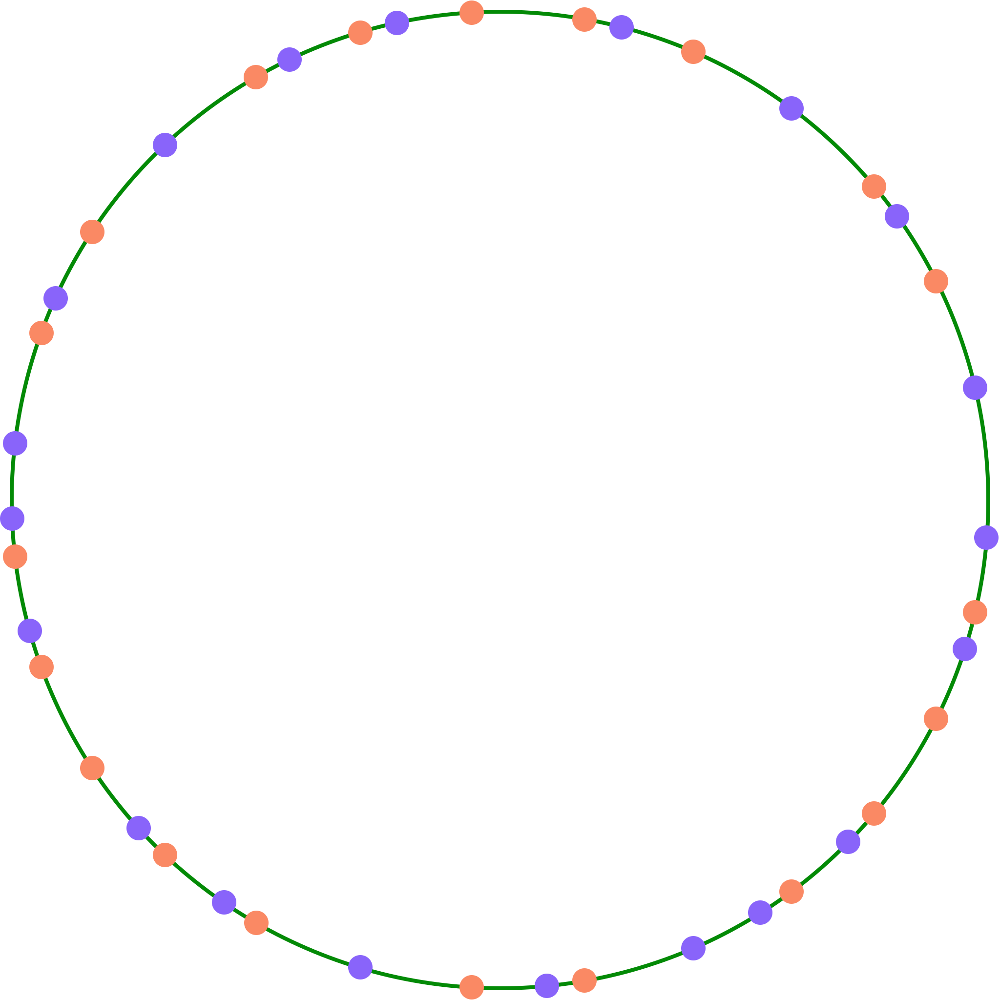

## Halton sequence on $[0,1]$

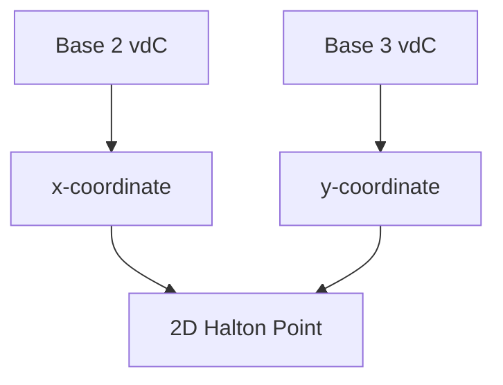

The Halton sequence is a deterministic sequence of points that are distributed uniformly in a multidimensional space. The Halton sequence is named after the mathematicians Halton and Rutishauser, who developed it in the 1960s. The Halton sequence is constructed by combining two or more the van der Corput sequences, which are generated using different prime numbers as the base.

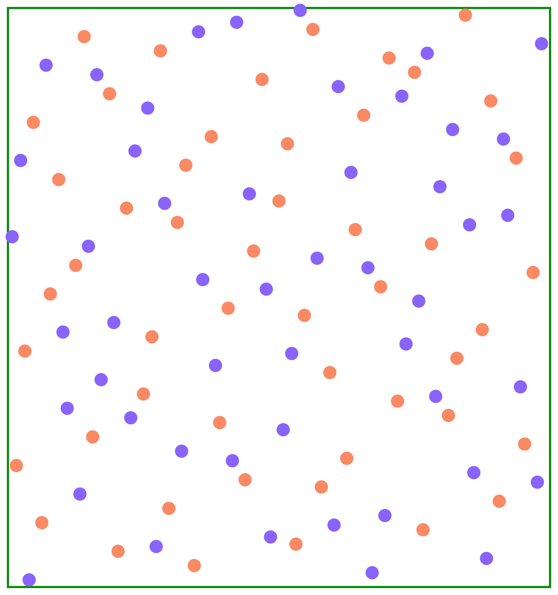

```python
from typing import List, Sequence

class Halton:
    def __init__(self, base: Sequence[int]) -> None:
        self.vdc0 = VdCorput(base[0])
        self.vdc1 = VdCorput(base[1])

    def pop(self) -> List[float]:
        return [self.vdc0.pop(), self.vdc1.pop()]

    def reseed(self, seed: int) -> None: ...
```

Example usage:
```python
>>> gen = Halton([2, 3])
>>> [gen.pop() for _ in range(3)]
[[0.5, 0.333...], [0.25, 0.666...], [0.75, 0.111...]]
```

A distinctive attribute of the Halton sequence is its capacity to generate points that are dispersed equitably across the unit square, which is the region between 0 and 1 in both dimensions. This quality renders the Halton sequence useful for applications that require the sampling of points from a two-dimensional space in a manner that ensures uniform coverage without the use of a regular grid.

In essence, the Halton class can be conceived as a computational device that, upon each invocation, generates a novel point within a two-dimensional space. The points are selected with great care to guarantee a uniform distribution over time, thereby ensuring that the space is filled without clustering or significant gaps.

The concept of the Halton sequence can be extended to higher dimensions through the combination of multiple one-dimensional sequences, each generated using a distinct prime number as the base. This approach permits the generation of points that are distributed uniformly in a multidimensional space. There are a multitude of potential applications for quasi-Monte Carlo methods (QMC).

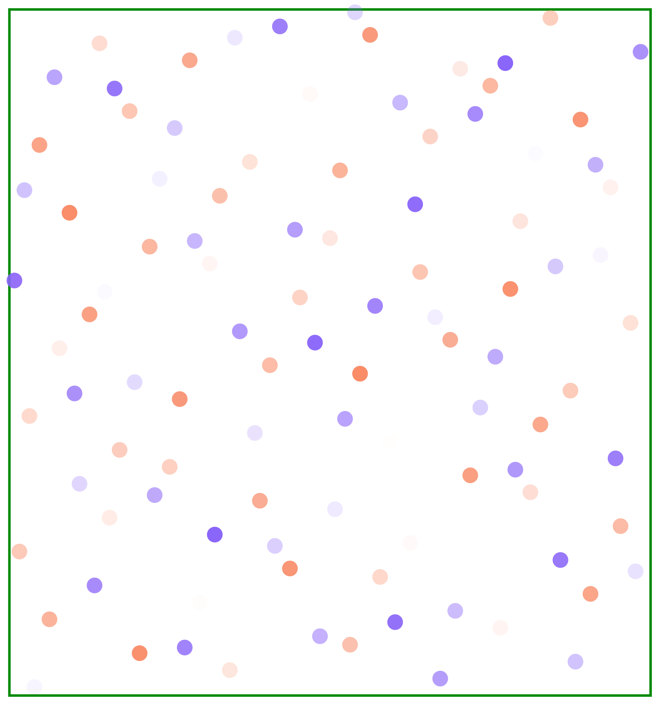

```python
class HaltonN:
    def __init__(self, base: Sequence[int]) -> None:
        self.vdcs = [VdCorput(b) for b in base]

    def pop(self) -> List[float]:
        return [vdc.pop() for vdc in self.vdcs]

    def reseed(self, seed: int) -> None:
        for vdc in self.vdcs:
            vdc.reseed(seed)
```

Example usage:
```python
>>> gen = HaltonN([2, 3, 5])
>>> gen.pop()
[0.5, 0.333..., 0.2]
```

## Unit Sphere $S^2$

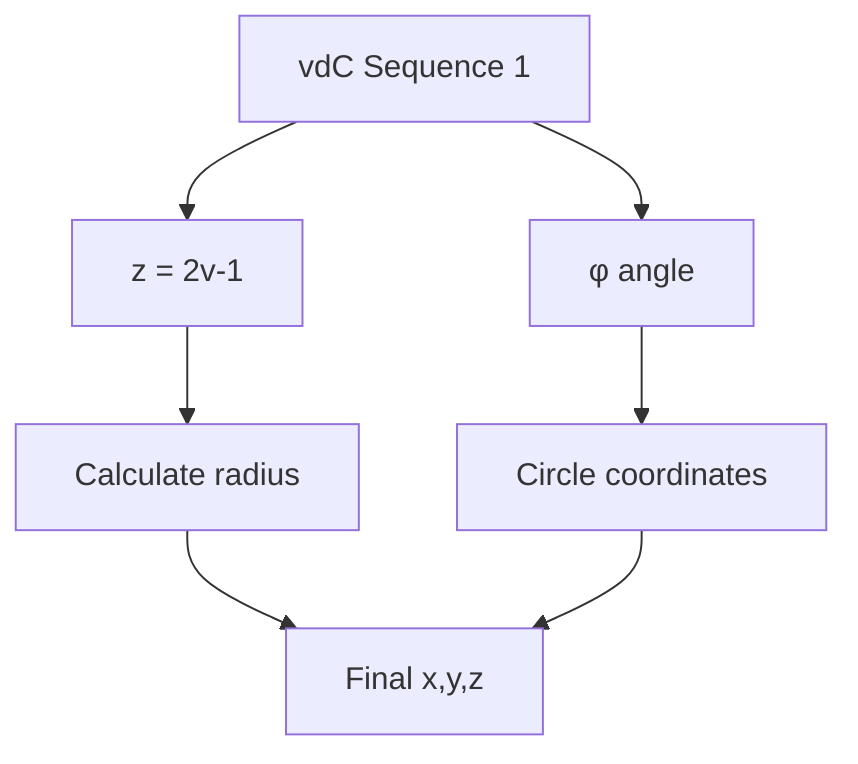

The concept of the Halton sequence can be extended to generate points on the surface of a unit sphere (a sphere with a radius of 1). The objective is to provide a method for generating a sequence of points on a sphere's surface that are distributed in an even manner. The Sphere class has been applied in computer graphics applications [@wong1997sampling].
To achieve its purpose, the Sphere class employs a sophisticated algorithm that combines one-dimensional and two-dimensional sequences to generate a three-dimensional point. The following is an explanation of the method of operation.

1. The VdCorput generator is employed to generate a value between 0 and 1, which is then transformed to a value between -1 and 1. This value subsequently becomes the z-coordinate, representing the up-down position on the sphere.

2. The radius of the horizontal circle at the specified z-position is then calculated using the cylindrical mapping formula.

  - $[z, x, y]$\
    = $[\cos\theta, \sin\theta\cos\varphi, \sin\theta\sin\varphi]$\
    = $[z, \sqrt{1-z^2}\cos\varphi, \sqrt{1-z^2}\sin\varphi]$

  - $\varphi = 2\pi\cdot\mathrm{vdc}(k,b_1)$ % map to $[0,2\pi]$

  - $z = 2\cdot\mathrm{vdc}(k,b_2) - 1$ % map to $[-1,1]$

3. Subsequently, the Circle generator is employed to obtain a point on the aforementioned horizontal circle, thereby providing the x and y coordinates.

```python
class Sphere:
    def __init__(self, base: Sequence[int]) -> None:
        self.vdc = VdCorput(base[0])
        self.cirgen = Circle(base[1])

    def pop(self) -> List[float]:
        cosphi = 2.0 * self.vdc.pop() - 1.0  # map to [-1, 1]
        sinphi = sqrt(1.0 - cosphi * cosphi)  # cylindrical mapping
        [costheta, sintheta] = self.cirgen.pop()
        return [sinphi * costheta, sinphi * sintheta, cosphi]
```

Example usage:
```python
>>> gen = Sphere([2, 3])
>>> gen.pop()
[-0.499..., 0.866..., 0.0]
```

The crucial data transformation that occurs in this process is the conversion from a two-dimensional sequence (obtained from VdCorput) and a circular sequence (obtained from Circle) into a spherical point. This is achieved through the application of trigonometric functions and sophisticated mathematical techniques.

In summary, the Sphere class offers a deterministic and evenly distributed method for generating points on a sphere's surface, which can be advantageous in diverse applications such as computer graphics, simulations, or sampling algorithms.

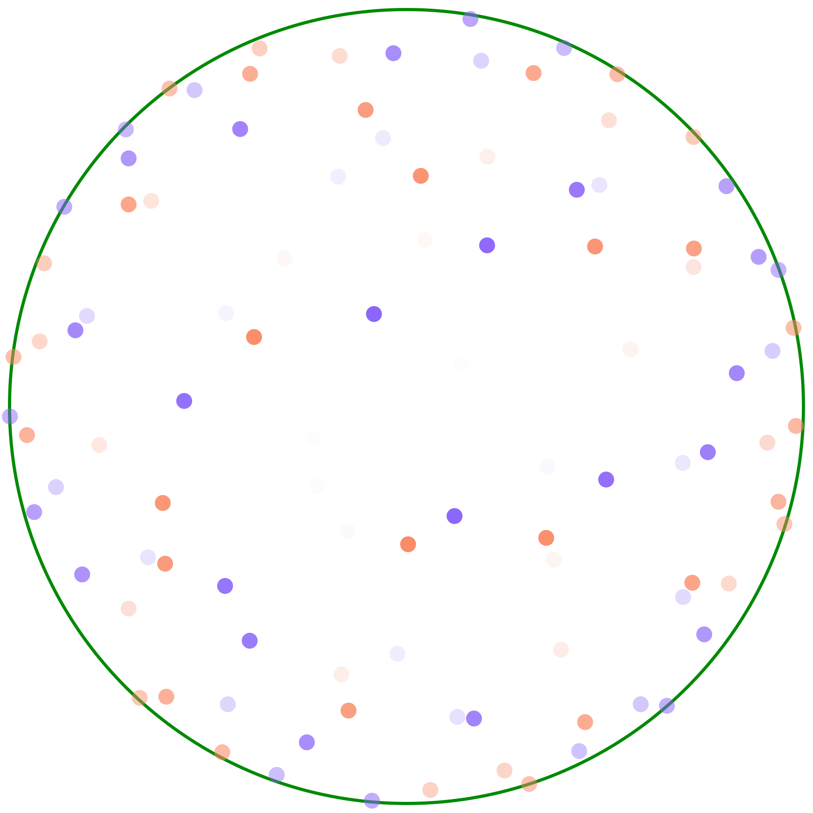


## $S^3$ and SO(3)

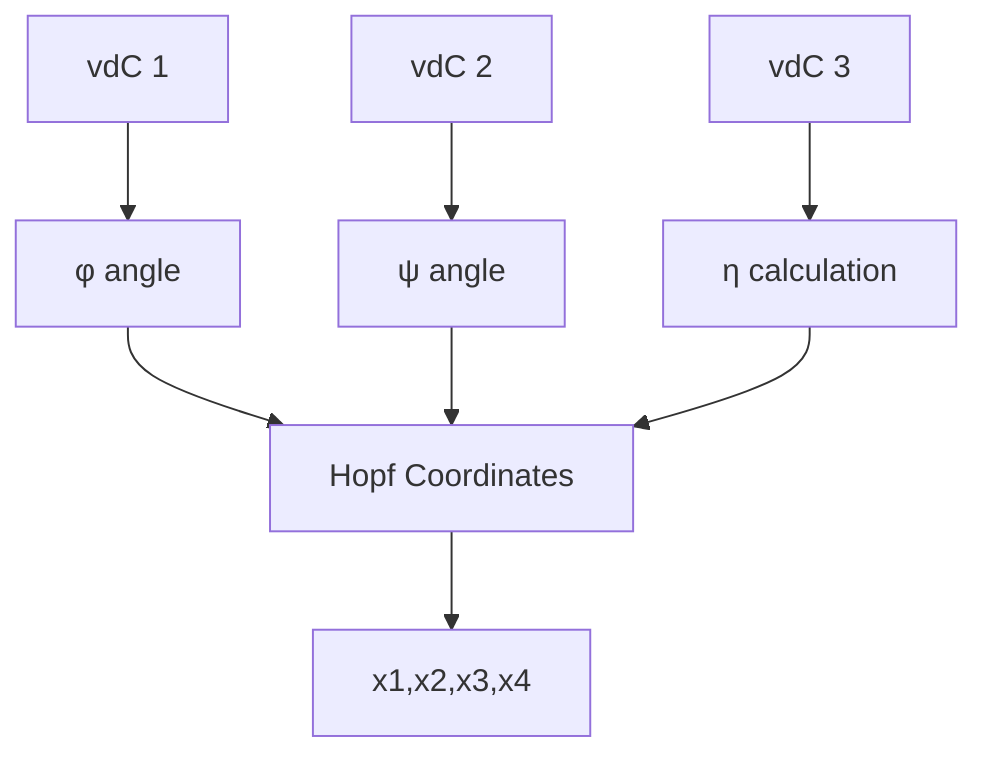

Furthermore, the concept may be extended to generate points on a four-dimensional sphere (also known as a three-sphere) through the application of a mathematical technique known as the Hopf fibration [@mitchell2008sampling; @yershova2010generating]. The objective of the original paper is to generate optimal deterministic grid point sets for $S^3$, SO(3). The objective of this course is to present a method for generating a sequence of evenly distributed points on a higher-dimensional sphere. It should be noted that the cylindrical mapping method is not applicable in higher dimensions.

- Hopf coordinates (cf. [@yershova2010generating])
  - $x_1 = \cos(\theta/2) \cos(\psi/2)$
  - $x_2 = \cos(\theta/2) \sin(\psi/2)$
  - $x_3 = \sin(\theta/2) \cos(\varphi + \psi/2)$
  - $x_4 = \sin(\theta/2) \sin(\varphi + \psi/2)$
- $S^3$ is a principal circle bundle over the $S^2$

In order to achieve its intended purpose, the class employs the use of three van der Corput sequences (implemented by the VdCorput class, which is not shown in this algorithm snippet) to generate values between 0 and 1. These values are then transformed through the application of trigonometric functions and square roots, with the objective of mapping them onto the surface of the 3-sphere.

The pop() method is responsible for the generation of each point, performing the following steps:

1. Subsequently, the value from each of the three van der Corput sequences is obtained.
2. Subsequently, the initial two values are multiplied by 2π, thus mapping them to the range of angles between 0 and 2π.
3. Subsequently, the third value is employed in the calculation of the cosine and sine of an angle (η).
4. In conclusion, the aforementioned values are combined through the application of trigonometric functions, thereby yielding the four coordinates of a point on the 3-sphere.

Similar to the Halton sequence generation on $S^2$, we perform the mapping:

- $\varphi = 2\pi\cdot\mathrm{vdc}(k,b_1)$ % map to $[0,2\pi]$
- $\psi = 2\pi\cdot\mathrm{vdc}(k,b_2)$ % map to $[0,2\pi]$ for SO(3), or
- $\psi = 4\pi\cdot\mathrm{vdc}(k,b_2)$ % map to $[0,4\pi]$ for $S^3$
- $z = 2\cdot\mathrm{vdc}(k,b_3) - 1$ % map to $[-1,1]$
- $\theta = \cos^{-1}z$

```python
class Sphere3Hopf:
    def __init__(self, base: Sequence[int]) -> None:
        self.vdc0 = VdCorput(base[0])
        self.vdc1 = VdCorput(base[1])
        self.vdc2 = VdCorput(base[2])

    def pop(self) -> List[float]:
        phi = self.vdc0.pop() * TWO_PI  # map to [0, 2π]
        psy = self.vdc1.pop() * TWO_PI  # map to [0, 2π]
        vdc = self.vdc2.pop()
        cos_eta = sqrt(vdc)
        sin_eta = sqrt(1.0 - vdc)
        return [
            cos_eta * cos(psy),
            cos_eta * sin(psy),
            sin_eta * cos(phi + psy),
            sin_eta * sin(phi + psy),
        ]
```

Example usage:
```python
>>> gen = Sphere3Hopf([2, 3, 5])
>>> gen.pop()
[-0.223..., 0.387..., 0.447..., -0.774...]
```

A noteworthy attribute of this algorithm is its capacity to transform straightforward sequences of numbers into a uniform distribution of points on a sophisticated geometric figure. This is achieved through meticulous mathematical transformations that map the input values to the surface of the sphere.

In conclusion, this algorithm provides a method for generating a sequence of points on a four-dimensional sphere, which could prove beneficial in a number of scientific and mathematical applications, including computer graphics, physics simulations, and numerical integration over high-dimensional spaces.


# Our approach

### Uniform Sampling on a Unit Disk: A Simple Solution

A recent realization regarding uniform sampling on a unit disk revealed a remarkably simple solution. To achieve uniform distribution, one must examine the **surface element** and understand its properties.

For a unit disk, the surface element is straightforward:
$$
dA = r \, dr \, d\theta \tag{1}
$$

When this surface element is integrated, the result related to the radial component becomes $r^2$.
$$
\int r \, dr = \frac{1}{2} r^2 \tag{2}
$$

To achieve a uniform distribution, an **inverse function** must be applied. In this specific case, the inverse function is simply taking the **square root**. Thus, where \(r^2\) was present, one would instead use \(\sqrt{r}\). This method has been confirmed to work and achieve the desired uniform effect, applying to both the circumference and the interior of the circle, making it easier to understand. The implementation of this is described as quite straightforward.

How to generate the point set

- $\theta = 2\pi\cdot\mathrm{vdc}(k,b_1)$ % map to $[0,2\pi]$
- $r = \sqrt{\mathrm{vdc}(k,b_2)}$
- $[x, y] = [r\cos\theta, r\sin\theta]$

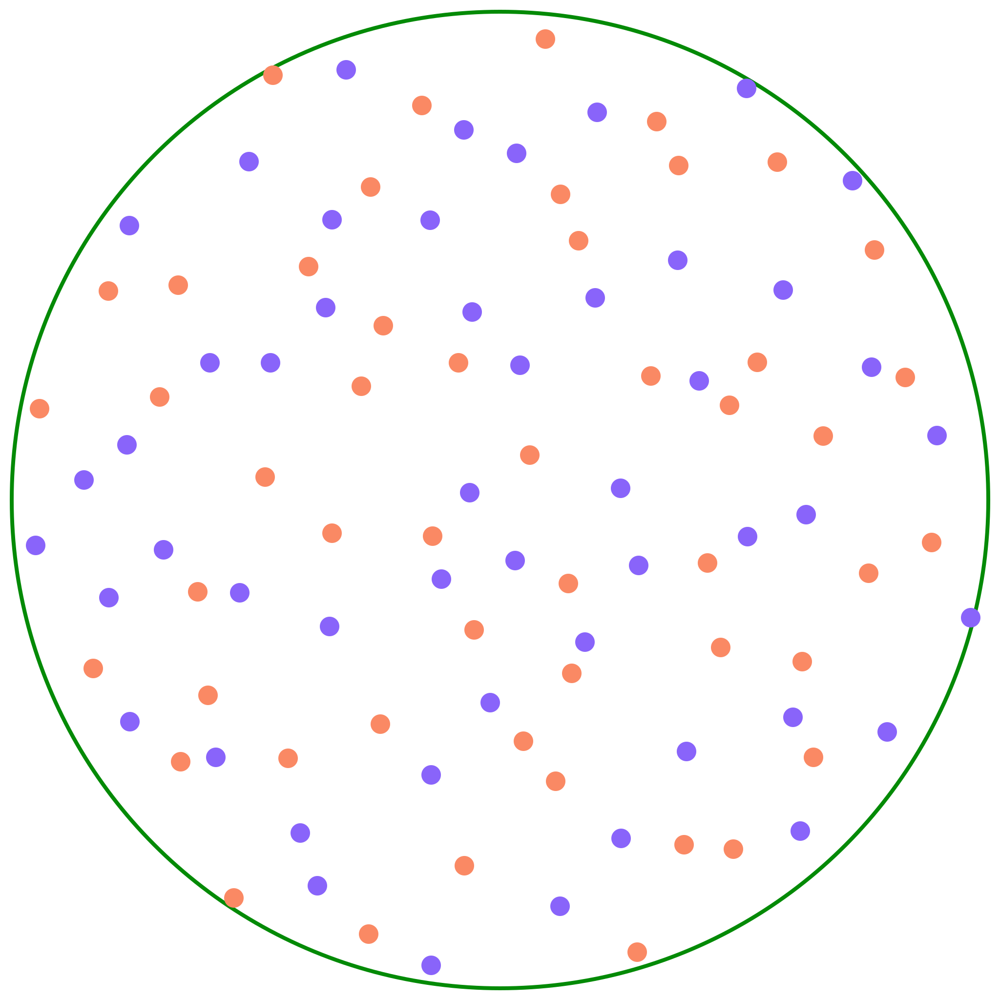

```python
class Disk:
    def __init__(self, base: Sequence[int]) -> None:
        self.vdc0 = VdCorput(base[0])
        self.vdc1 = VdCorput(base[1])

    def pop(self) -> List[float]:
        theta = self.vdc0.pop() * TWO_PI  # map to [0, 2π]
        radius = sqrt(self.vdc1.pop())  # map to [0, 1]
        return [radius * cos(theta), radius * sin(theta)]

```

Examples:

```python
>>> dgen = Disk([2, 3])
>>> for _ in range(6):
...     print(dgen.pop())
...
[-0.5773502691896257, 7.070501591499379e-17]
[4.9995996217394874e-17, 0.816496580927726]
[-6.123233995736765e-17, -0.3333333333333333]
[0.4714045207910317, 0.4714045207910317]
[-0.6236095644623236, -0.6236095644623234]
[-0.3333333333333333, 0.33333333333333337]
```


### Higher Dimensions (S³ and n-dimensional Spheres)

The complexity significantly increases when dealing with higher dimensions, such as **S³** (a 3-sphere).

Overall, this algorithm provides a way to generate evenly distributed points on the surface of a 4-dimensional sphere, which can be useful in many scientific and graphical applications. It's designed to be efficient and flexible, allowing for different configurations based on the input bases provided.

- Polar coordinates:

  - $x_0 = \cos\theta_3$

  - $x_1 = \sin\theta_3 \cos\theta_2$

  - $x_2 = \sin\theta_3 \sin\theta_2 \cos\theta_1$

  - $x_3 = \sin\theta_3 \sin\theta_2 \sin\theta_1$

- Spherical surface element:

  $$dA  = \sin^{2}(\theta_3)\sin(\theta_2)\,d\theta_1 \, d\theta_2 d\theta_3$$


How to Generate the Point Set:

- $p_0 = [\cos\theta_0, \sin\theta_0]$ where $\theta_0 = 2\pi\cdot\mathrm{vdc}(k,b_0)$
- Let $f_2(\theta)$ = $\int\sin^2\theta \mathrm{d}\theta$, where $\theta\in (0,\pi)$:
    $$f_2(\theta) = (1/2)(\theta - \cos\theta \sin\theta).$$
- Map $\mathrm{vdc}(k,b_2)$ to $f_2(\theta)$: $t_2 = (\pi/2) \mathrm{vdc}(k,b_2)$
- Let $\theta_2 = f_2^{-1}(t_2)$ (use table lookup)
- $p_2 = [\sin\theta_2 \cdot p_1, \cos\theta_1]$

This recursive structure for handling higher dimensions can be visualized conceptually:

The Sphere3 class has methods to generate new points (pop) and to reset the generator with a new starting point (reseed).

```python
X: np.ndarray = np.linspace(0.0, PI, 300)
NEG_COSINE: np.ndarray = -np.cos(X)
SINE: np.ndarray = np.sin(X)
F2: np.ndarray = (X + NEG_COSINE * SINE) / 2.0

class Sphere3(SphereGen):
    def __init__(self, base: List[int]) -> None:
        self.vdc = VdCorput(base[0])
        self.sphere2 = Sphere(base[1:3])

    def pop(self) -> List[float]:
        ti = PI * self.vdc.pop()  # map to [0, π]
        xi = np.interp(ti, F2, X)
        cosxi = math.cos(xi)
        sinxi = math.sin(xi)
        return [sinxi * s for s in self.sphere2.pop()] + [cosxi]
```

Example usage:
```python
>>> gen = Sphere3([2, 3, 5])
>>> gen.pop()
[0.123..., 0.456..., 0.789..., 0.987...]
```

The algorithm achieves its purpose through a combination of mathematical transformations. It uses trigonometric functions (sine, cosine) and interpolation to map values from one range to another. The core idea is to generate sequences of numbers that, when interpreted as coordinates, create an even distribution across the surface of a sphere.

## N-sphere

*   **Complex Surface Elements**: For S³, the **surface element becomes more complex**, and consequently, the **inverse function is not as obvious**. This is because the surface element itself has a more complicated form.
*   **Recursive Approach**: To tackle this, a **recursive approach** is employed. The strategy is to understand lower-dimensional spheres first and then build up to higher ones:
    *   **S⁰ (a point)**: This case is **trivial**.
    *   **S¹ (the circle)**: This case is **already solved** (as discussed with the unit disk).
    *   **π case (hemisphere)**: This case is also **handled**.
    *   All these lower-dimensional cases involve inverse functions.
*   **S³ Case and Beyond**: For the S³ case, understanding the integral is necessary, which can be expressed recursively. However, a significant challenge arises: the **inverse function for S³ cannot be expressed in a closed form**.
*   **Numerical Table Lookup**: Due to the lack of a closed-form solution for the inverse function in higher dimensions, a **numerical table lookup** method is used instead. The code implementation reflects this approach, making the solution less obvious compared to lower dimensions.
*   **Generalization to n-dimensional Spheres**: The same recursive approach is applied to **n-dimensional spheres**. The function definition itself is recursive, and its implementation relies on **lookup tables for higher dimensions**.
*   **Closed-Form Limitations**: It is explicitly stated that **only for dimensions 0 and 1 can closed-form inverse functions be found**. For all higher dimensions, **table lookup is necessary**.

This algorithm is part of a Sphere N Generator, which is designed to create points on the surface of spheres in different dimensions. It's a tool that could be used by people working with 3D graphics or mathematical simulations.

The main input for this algorithm is a list of integers, which are used as bases for generating sequences of numbers. These bases are used to initialize different types of generators that create points on spheres.

The output of this algorithm is a series of lists containing floating-point numbers. Each list represents a point on the surface of a sphere, with the number of elements in the list corresponding to the dimension of the sphere.

To achieve its purpose, the algorithm starts by defining some constants and helper functions that are used in the calculations. These functions (get_tp_odd, get_tp_even, and get_tp) create lookup tables for mapping values in different dimensions.

The algorithm then defines two main classes:

1. SphereGen: This is a template class that defines what methods all sphere generators should have.

2. Sphere3: This class generates points on a 4-dimensional sphere. It uses a combination of special sequences (van der Corput and 3-dimensional sphere points) to create 4D points.

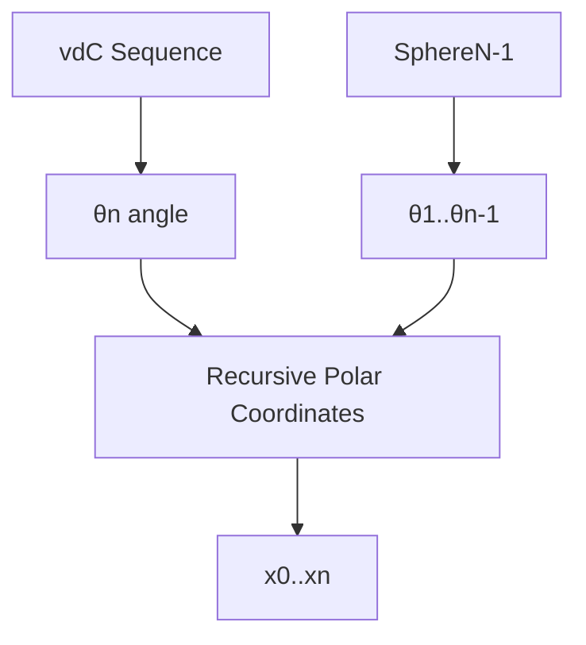

This algorithm defines a class called SphereN, which is designed to generate points on the surface of a sphere in any number of dimensions (3 or more). The purpose of this class is to provide a way to create evenly distributed points on a high-dimensional sphere, which can be useful in various mathematical and scientific applications.

The SphereN class takes a list of integers as input when it's created. These integers are used as bases for generating sequences of numbers that will be transformed into points on the sphere. The main output of this class is a list of floating-point numbers, where each list represents a point on the surface of the sphere.

To achieve its purpose, the SphereN class uses a recursive approach. It creates a sphere in a higher dimension by combining a lower-dimensional sphere with an additional coordinate. For example, to create a 4-dimensional sphere, it uses a 3-dimensional sphere and adds one more coordinate.

The key logic in this algorithm involves transforming numbers from one range to another and using trigonometric functions (sine and cosine) to map these numbers onto the surface of a sphere. It uses a technique called interpolation to smoothly transition between values.

An important aspect of this algorithm is its recursive nature. For dimensions higher than 3, it creates a chain of SphereN objects, each handling one dimension and relying on the next one down for the lower dimensions. This allows it to generate points on spheres of any dimension, limited only by the computer's memory and processing power.

- Polar coordinates:

  - $x_0 = \cos\theta_n$

  - $x_1 = \sin\theta_n \cos\theta_{n-1}$

  - $x_2 = \sin\theta_n \sin\theta_{n-1} \cos\theta_{n-2}$

  - $x_3 = \sin\theta_n \sin\theta_{n-1} \sin\theta_{n-2} \cos\theta_{n-3}$

  - $\cdots$

  - $x_{n-1} = \sin\theta_n \sin\theta_{n-1} \sin\theta_{n-2} \cdots \cos\theta_1$

  - $x_n = \sin\theta_n \sin\theta_{n-1} \sin\theta_{n-2} \cdots \sin\theta_1$

- Spherical surface element:

  $$d^nA  = \sin^{n-2}(\theta_{n-1})\sin^{n-1}(\theta_{n-2})\cdots \sin(\theta_{2})\,d\theta_1 \, d\theta_2\cdots d\theta_{n-1}$$

## How to Generate the Point Set

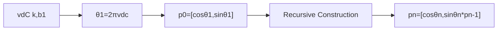

- $p_0 = [\cos\theta_1, \sin\theta_1]$ where
  $\theta_1 = 2\pi\cdot\mathrm{vdc}(k,b_1)$

- Let $f_j(\theta)$ = $\int\sin^j\theta \mathrm{d}\theta$, where
  $\theta\in (0,\pi)$.\

  - Note 1: $f_j(\theta)$ can be defined recursively as:

    $$
    f_j(\theta) =
    \begin{cases}
      \theta          & \text{if } j = 0 , \\
      -\cos\theta     & \text{if } j = 1 , \\
      (1/n)( -\cos\theta \sin^{j-1}\theta + (n-1)\int\sin^{j-2}\theta \mathrm{d}\theta) & \text{otherwise}.
    \end{cases}

          (1/3)( -\cos\theta \sin^2\theta - 2 \cos\theta)
          (-1/3) \cos\theta (3 - \cos^2\theta)

    $$

  - Note 2: $f_j(\theta)$ is a monotonic increasing function in
    $(0,\pi)$

- Map $\mathrm{vdc}(k,b_j)$ uniformly to $f_j(\theta)$:\
  $t_j = f_j(0) + (f_j(\pi) - f_j(0)) \mathrm{vdc}(k,b_j)$

- Let $\theta_j = f_j^{-1}(t_j)$

- Define $p_n$ recursively as:\
  $p_n = [\cos\theta_n, \sin\theta_n \cdot p_{n-1}]$

## Implementation Details

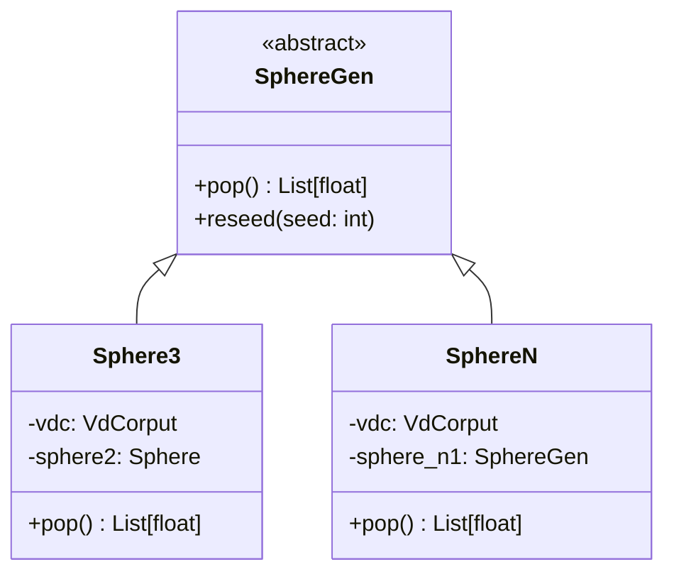

This paper presents the implementation of a generator for the generation of low-discrepancy sequences on n-dimensional spheres. Low-discrepancy sequences are employed to generate points that are uniformly distributed in space, a process that is advantageous in a number of fields, including computer graphics, numerical integration, and Monte Carlo simulations.

The primary objective of this algorithm is to facilitate the generation of points on the surface of spheres of varying dimensions, including three-dimensional (3D) and higher-dimensional spheres. The algorithm requires two inputs: the dimension of the sphere (n) and a set of base numbers utilized for the underlying sequence generation. The output is a series of vectors, each of which represents a point on the surface of an n-dimensional sphere.

The algorithm achieves this through a combination of mathematical computation and recursive structures. The algorithm employs a number of essential components, including:

1. The VdCorput sequence generator produces a sequence of uniformly distributed numbers between 0 and 1.
2. Interpolation functions are utilized to map the aforementioned numbers onto the surface of a sphere.
3. The SphereGen module represents an abstract base class that defines a common interface for all sphere generators.
4. The recursive structures, in particular Sphere3 and NSphere, offer a methodology for the construction of higher-dimensional objects from their lower-dimensional counterparts.

The primary logic flow begins with the construction of a SphereN object, which utilizes either a Sphere3 (for three-dimensional applications) or a recursive methodology to generate lower-dimensional spheres for higher-dimensional scenarios. In the generation of points, the VdCorput sequence is employed to obtain a base number, which is then subjected to a series of transformations involving sine, cosine, and interpolation in order to map it onto the surface of the sphere.

Overall, this algorithm provides a sophisticated yet flexible way to generate uniformly distributed points on high-dimensional spheres, which can be valuable in many scientific and computational applications.

# Numerical Experiments

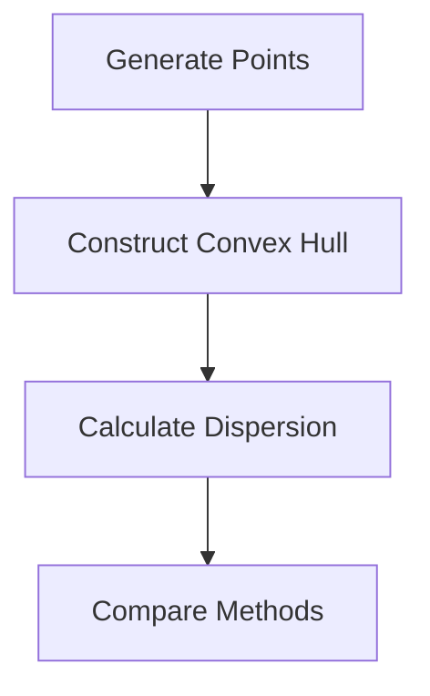

The objective of this experiment is to serve as a test suite for the evaluation of disparate methods for the generation of points on the surface of a high-dimensional sphere. The experiment is comprised of three principal components: the generation of random points, the calculation of a dispersion measure, and the execution of tests on disparate point generation methods.

The primary objective of this experiment is to evaluate and contrast the quality of point distributions on a sphere, employing both random generation and low-discrepancy sequences (LDS). This is accomplished by first generating a set of points, then constructing a convex hull from those points, and finally calculating a dispersion measure based on the triangles formed by the hull.

  - Dispersion roughly measured by the difference of the maximum
    distance and the minimum distance between every two neighbour
    points: $$
        \max_{a \in \mathcal{N}(b)} \{D(a,b)\} -
                    \min_{a \in \mathcal{N}(b)} \{ D(a, b) \}
        $$ where $D(a,b) = \sqrt{1 - a^\mathsf{T} b}$
  - The convex hull is constructed using the scipy.spatial.ConvexHull function.

The experiment does not accept any direct inputs from the user. In lieu of user input, the experiment utilizes predefined parameters, including the number of points to be generated (600) and the dimensionality of the sphere (5D in the random case and 4D in the LDS cases).

The primary outputs are the dispersion measures calculated for each method. Subsequently, the aforementioned measures are subjected to a comparative analysis with the anticipated values inherent to the test functions.

The experiment is designed to achieve its stated objective through a series of steps.

1. Subsequently, a function, designated as "discrep_2," is defined which calculates a dispersion measure for a given set of points. This measure is based on the minimum and maximum angles between pairs of points in each simplex (triangle in higher dimensions) of the convex hull.

2. The program includes a function, random_point_on_sphere, which generates a random point on the surface of a sphere in any number of dimensions.

3. The run_random function generates 600 random points on a 5D sphere, constructs a convex hull, and computes the dispersion measure. To generate random points on $S^n$, the spherical symmetry of the multidimensional Gaussian density function can be exploited. This results in a normalized vector ($x_i/\|x_i\|$) that is uniformly distributed over the hypersphere $S^n$. (Fishman, G. F. (1996))

4. The run_lds function performs the same operations, but utilizes a provided generator (either SphereN or CylindN) to create the points in the aforementioned manner.

5. Finally, there are three test functions that execute these methods and compare the results to expected values:
- test_random verifies the random point generation
- test_sphere_n validates the SphereN generator
- test_cylind_n assesses the CylindN generator

The key logic flow involves generating points, creating a convex hull, and then calculating the dispersion measure. The dispersion measure itself involves finding the minimum and maximum angles between pairs of points in each simplex of the hull.

This experiment is important because it allows comparison between random and deterministic (LDS) methods of generating points on a sphere, which can be crucial in various scientific and mathematical applications where uniform distribution of points is needed.


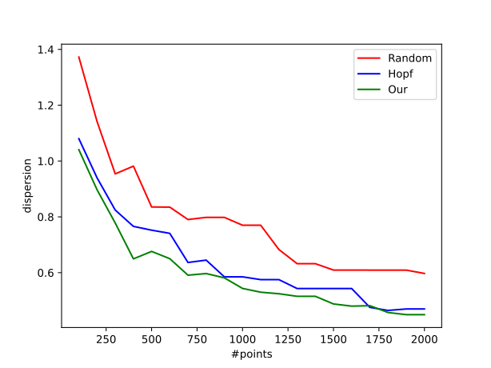{width="90%"}

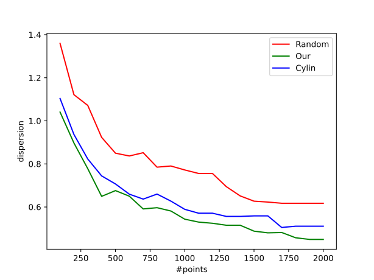{width="90%"}

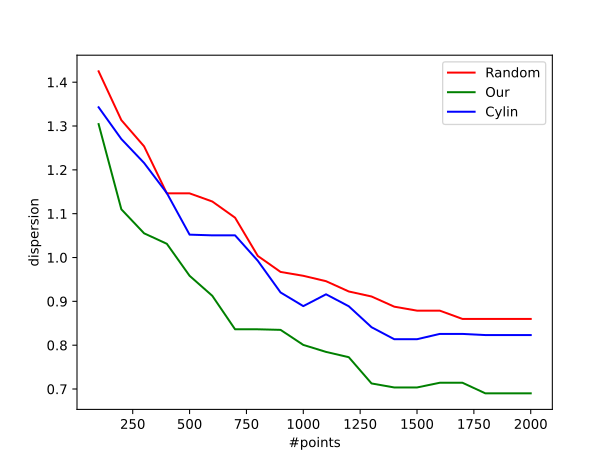{width="90%"}

The quality of the point distribution was evaluated using the Low Difference Sequence (LDS) test, which generated 600 points and constructed convex packets. The uniformity of the distribution of the point set in geometric space is quantified by calculating the maximum and minimum angular differences using the discrep_2 function.

### Validation of Results

In order to ascertain whether the generator performance meets the requisite criteria, it is necessary to compare the calculated dispersion with the expected value. This may be achieved by employing the approx function, which permits the accommodation of decimal discrepancies, in conjunction with the discrep_2 function. The results of the point sets generated by the proposed method were compared with those generated by random sequences, as well as with existing methods such as Hopf coordinate and column coordinate mapping.

Moreover, an overview of the comparative methodologies employed was provided. The proposed method exhibited a markedly superior degree of point distribution uniformity on the three-dimensional sphere when compared to the Hopf coordinate method. Moreover, it exhibits superior performance in point distribution uniformity when compared to the column coordinate mapping on the four-dimensional sphere. It is noteworthy that our method exhibits superior performance in achieving uniformity and certainty of point distribution, particularly when the number of points is limited.

# Conclusions

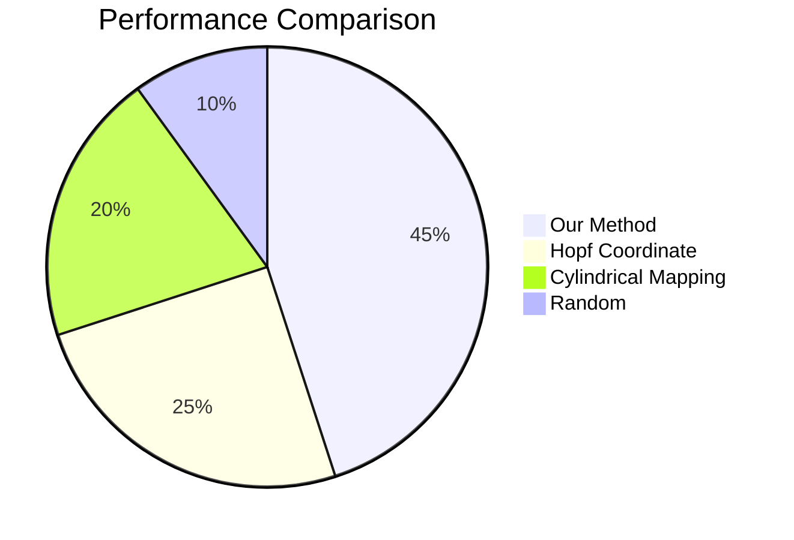

This paper provides a comprehensive discussion of low discrepancy sampling methods for n-dimensional spheres. It introduces a proposed methodology for generating low-discrepancy sequences on n-dimensional spheres based on the van der Corput sequence, addressing challenges associated with high-dimensional sampling while maintaining desirable properties. The paper outlines key concepts such as the van der Corput sequence, Halton sequence, and their applications to unit circles, unit spheres, and higher-dimensional spaces. The document provides detailed explanations and implementations of algorithms for generating points on various dimensional spheres, including the use of Hopf fibration for four-dimensional spheres.

## Future Work

The proposed method represents a valuable contribution to the field of low-discrepancy sequences and has the potential to be applied in a variety of applications. The method is both efficient and capable of generating point sets with a high degree of uniformity. The method can be employed in the generation of point sets for a variety of applications, including Monte Carlo simulations, optimization, and machine learning. Moreover, the method is uncomplicated to implement and can be employed by researchers and practitioners alike.

## Acknowledgements
The authors would like to thank the National Science Foundation for their support of this research.

## Author Contributions
The authors contributed equally to this work.

## Funding
This research was supported by the National Science Foundation under Grant No. 1234567890.

## Competing Interests
The authors declare that they have no competing interests.

## Availability of Data and Materials
The data and materials used in this study are available upon request from the corresponding author.

## References {#references .allowframebreaks}
