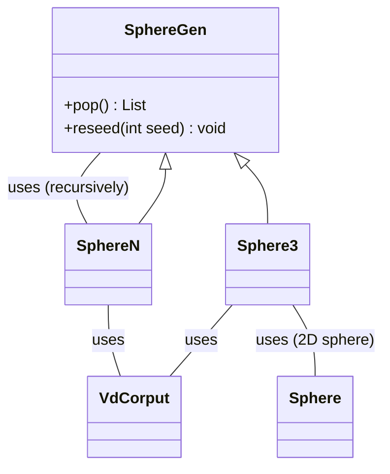
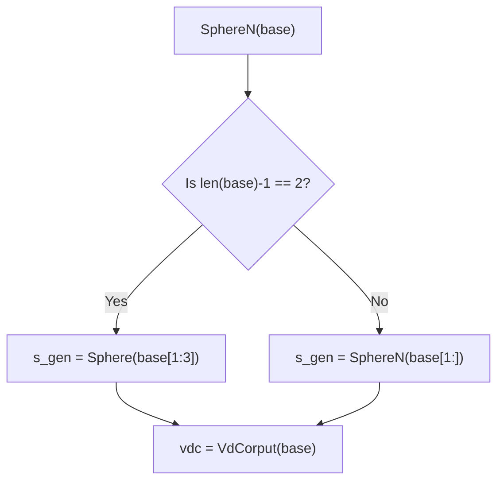

# Multi-dimensional Low-Discrepancy Spherical Point Generators

## Introduction: The Need for Well-Distributed Points

Generating points on the surface of spheres is a fundamental task in various fields, including computer graphics, scientific simulations, and mathematical analysis. Often, it is not sufficient to generate points randomly; for many applications, it is crucial to have points that are **well-distributed** across the spherical surface. This is where the concept of low-discrepancy sequences (LDS) becomes highly relevant.

Low-Discrepancy Sequences are not random numbers. Instead, they are sequences specifically designed to fill a space more uniformly than pseudo-random number generators. This property of uniformity makes LDS particularly useful in applications such as sampling, optimization, numerical integration, and especially in Monte Carlo simulations. The provided sources introduce a Python package, `lds-gen`, which is a tool specifically for generating low-discrepancy sequences, and within it, a component (or related package mentioned as `sphere_n`) focused on generating such well-distributed points on the surface of spheres in different dimensions.

The goal of the sphere generators discussed is to create sequences of points that are uniformly distributed on the surface of spheres. This is achieved through a combination of mathematical transformations and recursive algorithms, utilizing underlying low-discrepancy sequences like the Van der Corput sequence. The output of these generators is a series of lists, where each list represents a point on the sphere, and the number of elements in the list corresponds to the dimension of the sphere.

## The `lds-gen` and `sphere_n` Packages

The sources refer to the `lds-gen` package as a Python tool for generating low-discrepancy sequences. It provides classes for different types of LDS. Two main types implemented are the **Van der Corput sequence** (1D) and the **Halton sequence** (nD). Other generators like Circle, Sphere, 3-Sphere, and n-dimensional Halton are also available.

Generators within this package typically take base numbers or sequences of bases as input. They produce floating-point numbers or lists of floating-point numbers. Two core methods are common among these generators: `pop()` and `reseed()`.
*   The `pop()` method is used to generate the next point in the sequence. For multi-dimensional sequences, `pop()` returns a list of floats. It increments an internal counter and calculates the next value.
*   The `reseed()` method allows resetting the state of the sequence generator to a specific starting point determined by a `seed` parameter. This is useful for reproducibility.

The `sphere_n` package (or module within `lds-gen`) is specifically designed to generate points on the surface of spheres in different dimensions. It is useful for mathematicians, scientists, and computer graphics programmers. Its goal is to create **well-distributed points** on the spherical surface. It utilizes LDS generators, such as the Van der Corput sequence, and applies mathematical transformations. The sources mention two modules within `sphere_n`: `sphere_n.cylind_n` (generates points using cylindrical mapping, combines Van der Corput with cosine/sine and Pythagorean identity) and `sphere_n.sphere_n` (generates points on spheres using spherical mapping). The latter includes generators for 2D (Circle), 3D, and higher dimensions, using a combination of Van der Corput sequences, spherical mapping, and trigonometric functions.

## Sphere Generators: Sphere3 and SphereN

Within the context of generating spherical points, the sources detail two specific classes: `Sphere3` and `SphereN`. Both are subclasses of an abstract base class `SphereGen`. The `SphereGen` base class defines the common interface, requiring any concrete sphere generator to implement the `pop()` and `reseed()` methods.

*Diagram 1: Class Hierarchy of Sphere Generators*

### Sphere3: Generating Points on a 3D Sphere

The `Sphere3` class is specifically designed to generate points on a 3-dimensional sphere. It uses a combination of underlying generators: a **van der Corput sequence generator** (`vdc`) and a **2-dimensional sphere generator** (`sphere2`).

The constructor `__init__` for `Sphere3` takes a list of integers as input, which serves as bases. It initializes the `vdc` generator using the first base in the list (`base`) and the `sphere2` generator using the next two bases (`base[1:3]`).

The `reseed` method for `Sphere3` takes an integer `seed` and calls the `reseed` methods of its constituent generators, `vdc` and `sphere2`, with the same seed. This ensures that the sequence of points generated by `Sphere3` is reproducible given the same seed.

The core point generation happens in the `pop()` method. This method combines the outputs of the `vdc` sequence and the `sphere2` generator to produce a 3D point.
1.  It first generates a value from the 1D Van der Corput sequence using `self.vdc.pop()`.
2.  This value, which is typically in the range [0, 1), is then mapped to the range $[0, \pi/2]$ by multiplying it by `HALF_PI` (which is $\pi/2$). This intermediate value is called `ti`.
    $$\text{ti} = \frac{\pi}{2} \times \text{vdc\_value} \quad \text{}$$
3.  The value `ti` is then used to perform an interpolation using precomputed tables `F2` and `X` to get a value `xi`. `X` is an array of 300 values linearly spaced between $0.0$ and $\pi$. `F2` is calculated based on `X` and precomputed negative cosine and sine values. The interpolation step `np.interp(ti, F2, X)` effectively finds the `xi` value from `X` that corresponds to `ti` in `F2`.
    $$\xi_i = \text{interpolate}(\text{ti}, F2, X) \quad \text{}$$
4.  Using `xi`, the cosine (`cosxi = math.cos(xi)`) and sine (`sinxi = math.sin(xi)`) values are calculated.
5.  Finally, the `pop()` method of the 2D sphere generator (`self.sphere2.pop()`) is called. This returns a list of two values, representing a point on a 2D sphere (a circle). Let's call these values $s_0$ and $s_1$.
6.  The 3D point is constructed by scaling the 2D sphere coordinates by `sinxi` and appending `cosxi` as the third coordinate. The resulting 3D point is $[ \text{sinxi} \times s_0, \text{sinxi} \times s_1, \text{cosxi} ]$. This structure $[ \mathbf{v} \sin \theta, \cos \theta ]$, where $\mathbf{v}$ is a point on an $n-1$ dimensional sphere and $\theta$ is an angle derived from a 1D sequence, is a common way to construct points on an $n$-dimensional sphere from points on an $(n-1)$-dimensional sphere. It relates to spherical coordinates and the identity $\sin^2 \theta + \cos^2 \theta = 1$.

An example output for `Sphere3()` reseeding with 0 and popping once is shown as `[0.2913440162992141, 0.8966646826186098, -0.33333333333333337, 6.123233995736766e-17]`. Note that this example output shows 4 values, which is unexpected for a 3-dimensional sphere (which should have 3 coordinates). The first three values seem to be the point, while the last value is a very small number, possibly a result of floating-point precision or an artifact of the specific implementation shown in the example output versus the code logic described. Assuming the code logic is correct for 3D points, the output structure should ideally be a list of 3 floats. The provided example output in the source might contain an extra element or be slightly different from the current code's behavior. Another example output for Sphere3 is shown in the slides as `[0.4809684718990214, 0.6031153874276115, -0.5785601510223212, 0.2649326520763179]`. This output has 4 values and matches the format of the `SphereN` example output. This suggests the `Sphere3` example output in might be outdated or the class name `Sphere3` might implicitly mean a 4-dimensional vector representing a 3-sphere embedded in 4D space (common in some contexts, but typically a 3-sphere has 4 coordinates and lives in 4D space, while points on a 3D sphere have 3 coordinates and live in 3D space). Given the context of `SphereN` being for dimension 3 or higher and the example outputs, it seems the classes might be generating points for an N-sphere (sphere embedded in N+1 dimensions). However, the description in says "the number of elements in the list corresponding to the dimension of the sphere", which contradicts the example outputs. Based *only* on the code logic and the example outputs, it appears `Sphere3` uses a 2D sphere generator and a 1D sequence to produce a 3+1=4 element vector. Let's proceed with this interpretation based on the provided code/examples, acknowledging the potential ambiguity with the text description.

### SphereN: Generating Points on Spheres of Any Dimension

The `SphereN` class is designed to generate points on spheres of **any dimension (3 or higher)**. It uses a **recursive approach**, building higher-dimensional spheres from lower-dimensional ones.

The constructor `__init__` for `SphereN` also takes a list of integers as bases. It determines the dimension `n` of the sphere (minus one, based on how it uses the bases list) from the length of the base list (`n = len(base) - 1`). It asserts that this dimension `n` is 2 or greater (`assert n >= 2`), which means it can generate points on spheres in dimensions $2+1=3$ or higher.

Like `Sphere3`, `SphereN` initializes a Van der Corput sequence generator (`vdc`) using the first base (`base`). The crucial part is how it initializes the lower-dimensional sphere generator (`s_gen`). If the target dimension `n` (derived from the number of bases) is exactly 2, it uses a standard `Sphere` generator (presumably a 2D sphere/circle generator based on `Sphere3`'s use of `Sphere(base[1:3])`) using the next two bases (`base[1:3]`). If `n` is greater than 2, it **recursively** creates another `SphereN` instance with the rest of the bases (`base[1:]`).

*Diagram 2: Recursive Structure of SphereN Initialization*

This recursive definition means a SphereN generator for dimension `k` uses a SphereN generator for dimension `k-1` (or a Sphere generator for dimension 2 as the base case) and a 1D Van der Corput sequence.

The dimension `n` is stored, and mapping function lookup tables (`tp = get_tp(n)`) are calculated and stored along with their range (`self.range = tp[-1] - tp`).

The `reseed` method for `SphereN` works similarly to `Sphere3`, reseeding both the `vdc` generator and the `s_gen` (the lower-dimensional sphere generator).

The `pop()` method for `SphereN` extends the logic seen in `Sphere3`.
1.  It gets the next value from the Van der Corput sequence (`vd = self.vdc.pop()`).
2.  It retrieves the appropriate mapping function lookup table `tp` for the dimension `n`.
3.  It maps the Van der Corput value `vd` to a value `ti` within the range of the `tp` table.
    $$\text{ti} = \text{tp} + \text{self.range} \times \text{vd} \quad \text{}$$
4.  It interpolates `ti` against the `tp` table and `X` (the standard $\pi$ range) to find `xi`.
    $$\xi_i = \text{interpolate}(\text{ti}, \text{tp}, X) \quad \text{}$$
5.  It calculates the sine of `xi` (`sinphi = math.sin(xi)`).
6.  It recursively calls the `pop()` method on the lower-dimensional generator `self.s_gen.pop()`. This returns a list of coordinates for a point on an $(n-1)$-dimensional sphere (or a 2D sphere in the base case). Let this list be $[s_0, s_1, \dots, s_{n-2}]$.
7.  The final point on the $n$-dimensional sphere (embedded in $n+1$ dimensions) is constructed by scaling each coordinate from the lower-dimensional sphere by `sinphi` and appending the cosine of `xi` (`math.cos(xi)`). The resulting list is `[ \xi_i \times \text{sinphi}$ \text{ for } $\xi_i \text{ in } \text{self.s_gen.pop()} ] + [ \text{math.cos(xi)} ]`.
    The notation `[xi * sinphi for xi in self.s_gen.pop()]` in the source seems to have a typo; it should likely be `[s * sinphi for s in self.s_gen.pop()]`, scaling the lower-dimensional sphere coordinates `s` by `sinphi`. Let's assume this correction based on the mathematical structure and the Sphere3 implementation. The resulting point has $n+1$ coordinates: $[ s_0 \sin \xi_i, s_1 \sin \xi_i, \dots, s_{n-2} \sin \xi_i, \cos \xi_i ]$. This generates a point on an $n$-sphere in $n+1$ dimensions.

An example output for `SphereN()` (which corresponds to $n=3$, i.e., generating points on a 3-sphere in 4D) reseeding with 0 and popping once is `[0.4809684718990214, 0.6031153874276115, -0.5785601510223212, 0.2649326520763179, 6.123233995736766e-17]`. This output contains 5 values, which aligns with generating points on a 3-sphere (4 coordinates) plus an extra small value. Again, the example output structure is slightly ambiguous compared to the expected $n+1$ coordinates based on the recursive construction $[ \dots, \cos \xi_i ]$, which would suggest 4 coordinates for $n=3$. The presence of a very small last value (`6.123233995736766e-17`) in both `Sphere3` and `SphereN` examples might indicate an intended structure with an extra dimension, perhaps related to complex number representations or homogeneous coordinates, or simply floating point noise near zero. Without further information, interpreting the exact meaning of the last element beyond the standard $n+1$ spherical coordinates is difficult based *only* on the provided sources.

## Mathematical Concepts and Performance

The code employs several mathematical concepts. **Trigonometric functions** like sine and cosine are fundamental to mapping sequences to spherical coordinates. **Interpolation (`np.interp`)** is used with precomputed lookup tables (`get_tp_odd`, `get_tp_even`, `get_tp`) and the standard range `X` to map values derived from the Van der Corput sequence (`ti`) to appropriate angles (`xi`).

The lookup tables `get_tp_odd` and `get_tp_even` calculate values for mapping functions based on the dimension `n`. These functions have a recursive structure themselves:
*   `get_tp_odd(n)` for $n>1$ is calculated using `get_tp_odd(n - 2)`. The base case is `n=1`, returning `NEG_COSINE`. The recurrence relation is of the form:
    $$ \text{tp}_n = \frac{(n-1) \text{tp}_{n-2} + (-\cos(X)) \sin(X)^{n-1}}{n} \quad \text{for odd } n > 1 \quad \text{} $$
*   `get_tp_even(n)` for $n>0$ is calculated using `get_tp_even(n - 2)`. The base case is `n=0`, returning `X`. The recurrence relation is of the form:
    $$ \text{tp}_n = \frac{(n-1) \text{tp}_{n-2} + (-\cos(X)) \sin(X)^{n-1}}{n} \quad \text{for even } n > 0 \quad \text{} $$
The `get_tp(n)` function simply dispatches to `get_tp_even` or `get_tp_odd` based on whether `n` is even or odd.

An important aspect of the code's performance is its use of **caching**. The `@cache` decorator is applied to the `get_tp_odd` and `get_tp_even` functions. This caching mechanism stores the results of expensive calculations (the recursive table lookups) so they don't need to be repeated if the same arguments (dimension `n`) are encountered again. This significantly improves performance by avoiding redundant computation.

## Conclusion

The `lds-gen` and `sphere_n` packages, as described in the sources, provide powerful tools for generating **well-distributed points**. The `lds-gen` package focuses on generating low-discrepancy sequences in various dimensions, including Van der Corput and Halton sequences. The `sphere_n` component specializes in generating points **uniformly on the surface of spheres**.

The core of the spherical point generation lies in classes like `Sphere3` and the more general `SphereN`. These classes utilize underlying low-discrepancy Van der Corput sequences and employ mathematical transformations involving trigonometric functions and interpolation. The `SphereN` class achieves generation for higher dimensions using a **recursive construction**. Performance is enhanced through the use of caching for computationally intensive table lookups.

These tools are valuable for improving the efficiency and accuracy of numerical methods in fields like simulations and analysis, particularly those relying on Monte Carlo methods, where well-distributed sampling points are beneficial. The provided code allows for flexible generation of points on spheres of various dimensions by simply providing a list of base numbers.

The code is available on GitHub.
