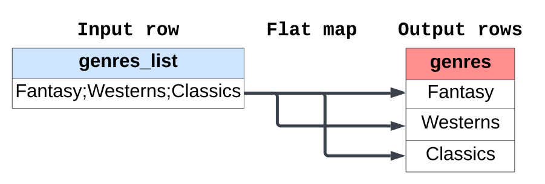
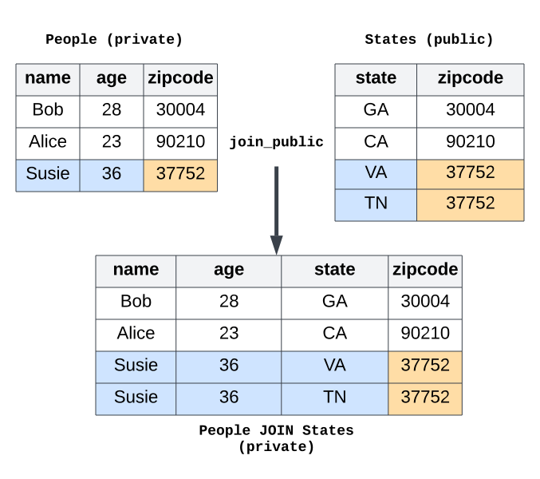
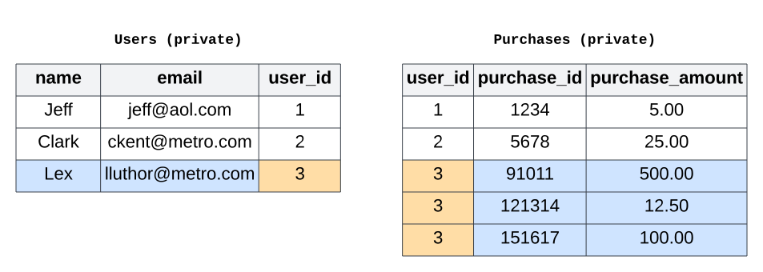

.. _understanding-sensitivity:

Understanding sensitivity
=========================

..
    SPDX-License-Identifier: CC-BY-SA-4.0
    Copyright Tumult Labs 2025

This topic guide goes into detail on the concept of *sensitivity* in
differential privacy.

Sensitivity is the maximum impact that a protected change can have on a query's
results. It directly impacts how much noise must be added to achieve differential
privacy: the bigger the sensitivity, the more noise needs to be added to the result.

With Tumult Analytics, the type of protected change depends on whether the goal is
to hide a fixed number of rows, using
:class:`AddMaxRows<tmlt.analytics.AddMaxRows>`, or arbitrarily many
rows sharing the same privacy identifier, using
:class:`AddRowsWithID<tmlt.analytics.AddRowsWithID>`.

A simple example of sensitivity is the explanation of clamping bounds in
:ref:`the third tutorial <clamping-bounds>`: larger clamping bounds mean
that a single row can have more influence, and more noise needs to be added.
However, the sensitivity is not always so straightforward to estimate. In this
topic guide, we will examine how different types of inputs and transformations
to a query can affect its sensitivity. Understand this relationship will help
you choose what transformations to use to ensure accurate results while
maintaining strong privacy guarantees.

Queries on tables using ``AddMaxRows``
--------------------------------------

Queries on tables using the :class:`AddMaxRows<tmlt.analytics.AddMaxRows>` or
:class:`AddOneRow<tmlt.analytics.AddOneRow>` protected change
protect the addition or removal of rows in the table. This means that any
operation which changes the number of rows requires a corresponding increase to the
protected change. A larger protected change corresponds to a higher sensitivity for a query,
which means more noise needs to be added to the query result. Specifically, sensitivity
scales *linearly* with the protected change.

A few operations can increase the sensitivity of a query in this way:
:meth:`flat maps<tmlt.analytics.QueryBuilder.flat_map>`,
:meth:`public joins<tmlt.analytics.QueryBuilder.join_public>`, and
:meth:`private joins<tmlt.analytics.QueryBuilder.join_private>`.

Flat maps
~~~~~~~~~

A :meth:`flat_map<tmlt.analytics.QueryBuilder.flat_map>` maps each
input row to zero or more new rows. Consider the example from
:ref:`Simple transformations<flat-maps>` tutorial, where each input row is mapped to up
to three new rows, using to the ``max_rows=3`` parameter. On a per-row basis, this operation might look like this:

In this example, the input table was initialized with the
:meth:`AddOneRow<tmlt.analytics.AddOneRow>` protected change,
which is equivalent to
:class:`AddMaxRows<tmlt.analytics.AddMaxRows>` with
``max_rows=1``. However, because the flat map can produce up to three rows for each
input row, the protected change needs to be increased threefold to ``max_rows=3``,
which results in a corresponding threefold increase in sensitivity for the query.

.. note::

    The sensitivity of a query is not affected by the number of rows *actually*
    produced by a flat map, but only by the *maximum* number
    of rows produced by the flat map. In the example above, the sensitivity would be
    the same if all the input rows only had 1 or 2 genres, and no input row produced 3 output rows.

Public joins
~~~~~~~~~~~~

Suppose we have two tables, ``People`` (private table) and ``States`` (public table),
which share a common column, ``zipcode``. A public join between these tables might look
like:

The join output contains one row for each match between the two tables. In this example,
Susie's ZIP code happens to cross state boundaries: the ``zipcode`` value 37752 appears
twice in the ``States`` table! This means that Susie's name and age appear in two rows
in the output table. To hide her contribution to the joined table, we need to increase
the protected change from ``max_rows=1`` to ``max_rows=2``. More generally, if the
protected change protects :math:`n` rows in the private table, and each join key value
appears in at most :math:`m` rows in the public table, then the sensitivity of the join
is :math:`n  *  m`.

.. note::

    Like with flatmaps, the sensitivity increase doesn't depend on the *contents* of the
    private table. It only depends on the contents of the public table, i.e. the
    number of rows in the public table with each value of the join key.

Private joins
~~~~~~~~~~~~~

With private joins, *both* tables are private. This means that, unlike with a public
table in a public join, we cannot use the contents of either table directly to determine
the sensitivity: doing so would reveal information about individuals within the tables,
thus violating the privacy guarantee.

Suppose we have two tables, a ``Users`` table and a ``Purchases`` table, which share a
common column, ``user_id``. Each are initialized with a protected change of ``AddMaxRows(max_rows=1)``:

Since both tables contain sensitive information, we cannot look at
the data directly to calculate the sensitivity. Therefore, we need to truncate both tables by specifying a
:class:`TruncationStrategy<tmlt.analytics.TruncationStrategy>` for
each. The sensitivity computation is more complicated than before:

:math:`\text{sensitivity} = (T_{left}  *  S_{right}  *  M_{right}) + (T_{right}  *  S_{left}  *  M_{left})`

where:

  - :math:`T_{left}` and :math:`T_{right}` are the truncation thresholds, i.e. ``max_rows``, for the left and right tables, respectively. When using :class:`DropNonUnique<tmlt.analytics.TruncationStrategy.DropNonUnique>`, these values are always 1.
  - :math:`S_{left}` and :math:`S_{right}` are factors called the *stability* of each ``TruncationStrategy``. These values are always 2 for :class:`DropExcess<tmlt.analytics.TruncationStrategy.DropExcess>` and 1 for :class:`DropNonUnique<tmlt.analytics.TruncationStrategy.DropNonUnique>`.
  - :math:`M_{left}` and :math:`M_{right}` are the ``max_rows`` parameters of the protected change on the left and right tables, respectively.

In this example, if we choose a truncation strategy of ``DropExcess(max_rows=2)`` for
both tables, they will be truncated to include no more than two rows for each value of
our join key, ``user_id``. The private join might look something like:

.. image:: ../images/private_join_example.svg
    :alt: On the left, a private table with names, user ids and emails. On the right, a private table with user_ids and purchase information. On the bottom, the result of a private join between the two top tables: a private table with names, user ids, emails, and purchase information.
    :align: center

In this case, our ``DropExcess()`` truncation strategies each had bounds of
``max_rows=2``, and our tables each had a protected change of
``AddMaxRows(max_rows=1)``. The sensitivity of the join is then:
:math:`\text{sensitivity} = 2 * 2 * 1 + 2 * 2 * 1 = 8`.

.. Note::

    Even though the ``Users`` table did not *actually* contain more than one row per
    ``user_id``, the sensitivity is still increased via the
    ``DropExcess(max_rows=2)`` truncation strategy. Again, this is because we don't
    look at the contents of private tables directly, and instead use the information
    given by the ``TruncationStrategy`` for each table.

.. Note::

    When we know that a table always contains only one row per join key, it's preferable
    to use ``DropNonUnique``, due to the smaller truncation stability. In this case,
    using ``DropNonUnique`` for the Users table and ``DropExcess(max_rows=2)`` for the
    Purchases table would have led to a join sensitivity of :math:`1 * 2 * 1 + 2 * 1 * 1 = 4`.
    Using ``DropExcess(max_rows=1)`` for the users table would have led to a sensitivity of
    :math:`1 * 2 * 1 + 2 * 2 * 1 = 6` instead.

As you can see, tracking stability can be complicated!

..
    TODO(#2696): Add this back in when describe() actually shows stability info.
    When in doubt, you can use the
    :meth:`describe<tmlt.analytics.Session.describe>` method to see how stability evolves
    with transformations.

Queries on tables using ``AddRowsWithID``
-----------------------------------------

Queries on tables using the
:class:`AddRowsWithID<tmlt.analytics.AddRowsWithID>` protected change
protect the presence of arbitrarily many rows associated with the same privacy ID. In this case,
transformations don't change the protected change: you can perform flat maps, public
joins, or private joins, and the protected change is still ``AddRowsWithID``.

However, before running aggregations, we must use the
:meth:`enforce<tmlt.analytics.QueryBuilder.enforce>` to specify truncation
bounds via constraints. Constraints can be enforced at any point, but it's generally
better to specify them immediately before performing aggregations. There are two main
ways to specify constraints: via a :class:`~tmlt.analytics.MaxRowsPerID`
constraint, or a combination of :class:`~tmlt.analytics.MaxGroupsPerID` and
:class:`~tmlt.analytics.MaxRowsPerGroupPerID`. See the
:ref:`Summary<flow-chart-truncation>` section of tutorial 6 for a visualization of these
truncation paths

The sensitivity of a query using the ``AddRowsWithID`` protected change is impacted by
the type of constraint(s) used to truncate the tables, as well as the type of noise
added to the data. There are three cases:

* Using ``MaxRowsPerID``, the sensitivity increases linearly with the truncation
  parameter.

* Using ``MaxGroupsPerID`` and ``MaxRowsPerGroupPerID``, the sensitivity depends on the
  type of noise added to the data.

  * With *Laplace* noise (the default under ``PureDP``), the sensitivity increases like a product of 
    the two ``max`` truncation parameters:
    :math:`sensitivity = (MaxRowsPerGroupPerID.max)  *  (MaxGroupsPerID.max)`

  * With *Gaussian* noise (the default under ``rhoZCDP``), the sensitivity increases like a product of 
    the ``max`` truncation parameter for ``MaxRowsPerGroupPerID`` and the square root of
    the ``max`` for ``MaxGroupsPerID``:
    :math:`sensitivity = (MaxRowsPerGroupPerID.max)  *  \sqrt{(MaxGroupsPerID.max)}`

For this last case, combining ``MaxGroupsPerID`` and ``MaxRowsPerGroupPerID``, we
visualize the sensitivity in the diagram below.

.. image:: ../images/intuitive_noise_visualization.png
    :alt: Diagram giving an intuition of the sensitivity under PureDP and rhoZCDP, respectively. For small values, the sensitivity is similar, but for larger values, the sensitivity under PureDP is much higher.
    :align: center

Note that the sensitivity determines the noise *multiplier*, but different noise
distributions also have different behaviors: for low sensitivity values and comparable
privacy budgets, Laplace noise tends to have a smaller variance than Gaussian noise. But
for large values of ``MaxGroupsPerID``, the sensitivity used with Gaussian noise will be
much larger than that of Laplace noise, and Gaussian noise will be a better choice.

For a more in-depth comparison of both kinds of noise, you can consult this `blog
post`_.

While this topic guide covers the most common cases of sensitivity tracking in Tumult
Analytics, it is certainly not exhaustive. If you have additional questions, feel free
to reach out to us on 
`our Slack server <https://join.slack.com/t/opendp/shared_invite/zt-1aca9bm7k-hG7olKz6CiGm8htI2lxE8w>`_!

.. _blog post: https://desfontain.es/privacy/gaussian-noise.html

