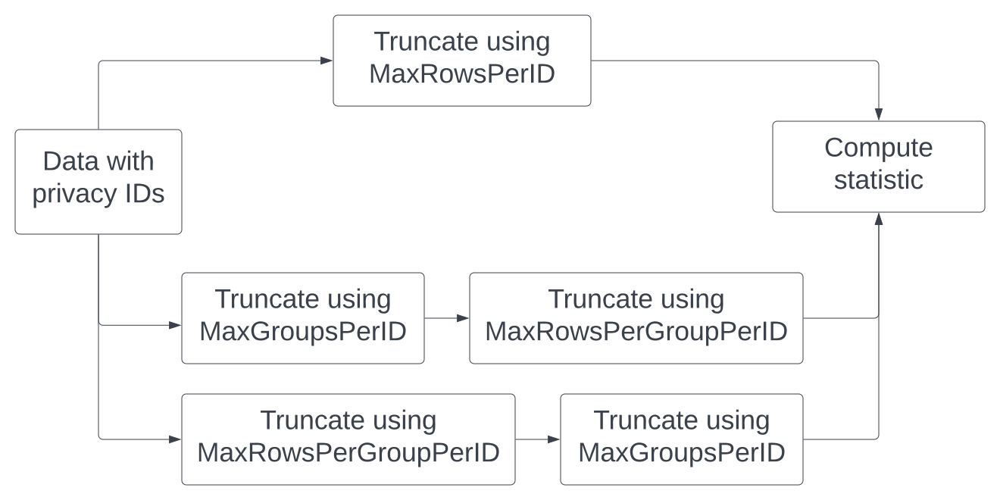

.. _privacy-id-basics:

Working with privacy IDs
========================

..
    SPDX-License-Identifier: CC-BY-SA-4.0
    Copyright Tumult Labs 2025

In previous tutorials, we were working with a table where each person in the
data was associated with exactly one row. But this is not always the case: in
some datasets, the same person can appears in many rows. In this case, it is
common to associate each person with an *identifier*. Then, the
goal becomes to hide whether *all rows that share a given identifier* are present
in the data.

Tumult Analytics refers to these identifiers as *privacy IDs*: an identifier that
maps one-to-one to a person, or more generally to an entity we want to protect.

In this tutorial, we will have a table containing information on books
checked out from the library.
Each row says which book was checked out and by whom. Since we want to protect
the privacy of library users, we will use the *member ID* on each checkout
as our privacy ID. We will then use this data to determine which books at
the library are the most popular, and how many people have checked out those
books.

Setup
-----

We import Python packages...

.. testcode::

    from pyspark import SparkFiles
    from pyspark.sql import SparkSession
    from tmlt.analytics import (
        AddRowsWithID,
        MaxGroupsPerID,
        MaxRowsPerGroupPerID,
        MaxRowsPerID,
        KeySet,
        PureDPBudget,
        QueryBuilder,
        Session,
    )

... and download two datasets: one containing books checked out from
the library, and one that contains a list of the books that the library has. The checkout logs might look like:

.. image:: ../images/mock_checkout_logs.svg
   :alt: An 8x6 table demonstrating the checkout logs data structure. The columns of the table are checkout_date, member_id, title, author, isbn, publication_date, publisher, and genres. The rows of the table are the individual checkouts. The checkout_date column contains dates, the member_id column contains integers, the title, author, isbn, publication_date, publisher, and genres columns contain strings.
   :align: center

Notice that the *same member* may have checked out *many books*, as illustrated by the highlighted rows. This is a defining characteristic of data fit for use with privacy IDs, as we will see in a moment.

.. testcode::

    spark = SparkSession.builder.getOrCreate()
    spark.sparkContext.addFile(
        "https://media.githubusercontent.com/media/opendp/tumult-demo-data/refs/heads/main/checkout-logs.csv"
    )
    spark.sparkContext.addFile(
        "https://raw.githubusercontent.com/opendp/tumult-demo-data/refs/heads/main/library_books.csv"
    )
    checkouts_df = spark.read.csv(
        SparkFiles.get("checkout-logs.csv"), header=True, inferSchema=True
    )
    books_df = spark.read.csv(
        SparkFiles.get("library_books.csv"), header=True, inferSchema=True
    )

Creating a Session with privacy IDs
-----------------------------------

Let's initialize our :class:`Session<tmlt.analytics.Session>` with a
private dataframe containing books checked out from the library.

Since each library member could have checked out any number of books,
we will use the :class:`~tmlt.analytics.AddRowsWithID`
protected change. This protected change will protect adding and removing
*arbitrarily many* rows all sharing the same ID.

.. testcode::

    budget = PureDPBudget(epsilon=float('inf'))
    session = Session.from_dataframe(
        budget,
        "checkouts",
        checkouts_df,
        protected_change=AddRowsWithID(id_column="member_id"),
    )

Initializing our Session like this protects members of our library,
regardless of how many books they've checked out. Let's take a look at our Session:

.. testcode::

    session.describe()

.. testoutput::
    :options: +NORMALIZE_WHITESPACE

    The session has a remaining privacy budget of PureDPBudget(epsilon=inf).
    The following private tables are available:
    Table 'checkouts' (no constraints):
    Column Name       Column Type    ID Col    ID Space          Nullable
    ----------------  -------------  --------  ----------------  ----------
    checkout_date     TIMESTAMP      False                       True
    member_id         INTEGER        True      default_id_space  True
    title             VARCHAR        False                       True
    author            VARCHAR        False                       True
    isbn              VARCHAR        False                       True
    publication_date  INTEGER        False                       True
    publisher         VARCHAR        False                       True
    genres            VARCHAR        False                       True

We can see that our Session has a single table, ``checkouts``, with 7 columns, and that
the 'member_id' column is marked as our ID column.

A simple query with privacy IDs
-------------------------------

Let's find out what the most popular books in our library are! We can do this
by counting how many times each book has been checked out.

This sounds like a simple query combining a group-by operation and a count;
we know :ref:`how to perform those<group-by-queries>`. But if we try to evaluate this
query on our data, we will get an error:

.. code-block::

    keyset = KeySet.from_dataframe(
        books_df.select("title", "author", "isbn")
    )
    count_query = (
        QueryBuilder("checkouts")
        .groupby(keyset)
        .count()
    )
    result = session.evaluate(count_query, PureDPBudget(1))

.. code-block::

    RuntimeError: A constraint on the number of rows contributed by each ID
    is needed to perform this query (e.g. MaxRowsPerID).

This error occurs because there is no limit to how many rows a single person
could contribute to the data: a single library member could borrow 10000 books
or even more! But differential privacy needs to hide the impact of a single
person behind statistical noise… and as we saw with
:ref:`clamping bounds<clamping-bounds>`, this is impossible if this impact
can be arbitrarily large!

To solve this problem, before performing aggregations, we need to limit the
maximum impact that a single library patron can have on the statistic we want
to compute. This is done by *enforcing a constraint* on the data. The simplest
constraint, :class:`~tmlt.analytics.MaxRowsPerID`,
limits the *total number of rows* contributed by each privacy ID. To enforce
it, we simply pass it as parameter to the
:meth:`~tmlt.analytics.QueryBuilder.enforce` operation.
For this query, we will limit the maximum number of contributed rows to 20
per library member.

.. testcode::

    keyset = KeySet.from_dataframe(
        books_df.select("title", "author", "isbn"),
    )
    count_query = (QueryBuilder("checkouts")
        .enforce(MaxRowsPerID(20))
        .groupby(keyset)
        .count()
    )
    result = session.evaluate(count_query, PureDPBudget(1))
    top_five = result.sort("count", ascending=False).limit(5)
    top_five.show()

.. testoutput::
   :hide:
   :options: +NORMALIZE_WHITESPACE

    +--------------------+--------------------+----------+-----+
    |               title|              author|      isbn|count|
    +--------------------+--------------------+----------+-----+
    |...|...|...|...|
    |...|...|...|...|
    |...|...|...|...|
    |...|...|...|...|
    |...|...|...|...|
    +--------------------+--------------------+----------+-----+

.. code-block::

    +--------------------+--------------------+----------+-----+
    |               title|              author|      isbn|count|
    +--------------------+--------------------+----------+-----+
    |Comfort Me with A...|         Ruth Reichl|0375758739| 3787|
    |       The Alchemist|Paulo Coelho/Alan...|0061122416| 2441|
    |The Devil in the ...|Erik Larson/Tony ...|0739303406| 2249|
    |     Eat  Pray  Love|   Elizabeth Gilbert|0143038419| 2071|
    |The Tipping Point...|    Malcolm Gladwell|0316346624| 1884|
    +--------------------+--------------------+----------+-----+

With this additional step limiting the maximum contribution of each privacy ID,
we are now able to run the query and find the five most popular books. This
step is also called *truncation*: we dropped (or *truncated*) some of the data
to enforce the desired constraint.

More constraints
----------------

Limiting the number of rows per privacy ID is not the only way to truncate the
data and perform queries with privacy IDs. Another option is to limit the
number of *groups* that each ID can appear in, and limit the number of
*rows per group* that a single privacy ID can contribute. Let's see an example
by computing how many patrons have checked out each of our top five books.

For this query, we will combine two constraints to truncate our data:

* :class:`~tmlt.analytics.MaxGroupsPerID`: limiting the number of
  groups (here, distinct books) that any library patron can contribute to; and
* :class:`~tmlt.analytics.MaxRowsPerGroupPerID`: limiting the number
  of rows that any library patron can provide for each group.

We will limit each patron to 5 groups (we only consider the 5 most popular
books) and have patrons only appear once per group (we don't want to count the
same patron twice for the same book).

Then, we will create a keyset from our top 5 books and perform a count query:

.. testcode::

    top_five_keyset = KeySet.from_dataframe(
        top_five.select("title", "author", "isbn"),
    )
    count_distinct_query = (
        QueryBuilder("checkouts")
        .enforce(MaxGroupsPerID("isbn", 5))
        .enforce(MaxRowsPerGroupPerID("isbn", 1))
        .groupby(top_five_keyset)
        .count()
    )
    result = session.evaluate(count_distinct_query, PureDPBudget(1.5))
    result.show()

.. testoutput::
   :hide:
   :options: +NORMALIZE_WHITESPACE

    +--------------------+--------------------+----------+-----+
    |               title|              author|      isbn|count|
    +--------------------+--------------------+----------+-----+
    |...|...|...|...|
    |...|...|...|...|
    |...|...|...|...|
    |...|...|...|...|
    |...|...|...|...|
    +--------------------+--------------------+----------+-----+

.. code-block::

    +--------------------+--------------------+----------+-----+
    |               title|              author|      isbn|count|
    +--------------------+--------------------+----------+-----+
    |Comfort Me with A...|         Ruth Reichl|0375758739|  481|
    |     Eat  Pray  Love|   Elizabeth Gilbert|0143038419|  658|
    |       The Alchemist|Paulo Coelho/Alan...|0061122416|  777|
    |The Devil in the ...|Erik Larson/Tony ...|0739303406|  657|
    |The Tipping Point...|    Malcolm Gladwell|0316346624|  549|
    +--------------------+--------------------+----------+-----+

We could also express this query using
:meth:`~tmlt.analytics.QueryBuilder.count_distinct`: limiting each
ID to a single row per library member (per ISBN) is the same as counting
distinct IDs.

.. testcode::

    top_five_keyset = KeySet.from_dataframe(top_five.select("isbn"))
    count_distinct_query = (
        QueryBuilder("checkouts")
        .enforce(MaxGroupsPerID("isbn", 5))
        .groupby(top_five_keyset)
        .count_distinct(["member_id"], name="count")
    )
    result = session.evaluate(
        count_distinct_query, PureDPBudget(1.5)
    ).join(  # Add title/author back to result
        top_five.select("title", "author", "isbn"), on=["isbn"], how="left"
    ).select(  # Reorder dataframe columns
        "title", "author", "isbn", "count"
    )

.. testcode::
    :hide:

    result.show()

.. testoutput::
    :hide:
    :options: +NORMALIZE_WHITESPACE

    +--------------------+--------------------+----------+-----+
    |               title|              author|      isbn|count|
    +--------------------+--------------------+----------+-----+
    |...|...|...|...|
    |...|...|...|...|
    |...|...|...|...|
    |...|...|...|...|
    |...|...|...|...|
    +--------------------+--------------------+----------+-----+

When using :meth:`~tmlt.analytics.QueryBuilder.count_distinct` on the ID column, we no longer need to specify the :class:`~tmlt.analytics.MaxRowsPerGroupPerID` constraint:
Tumult Analytics understands that each ID can contribute at most once per group.

We can then display the results as a graph:

.. code-block::

    import matplotlib.pyplot as plt
    import seaborn as sns

    sns.set_theme(style="whitegrid")
    data_to_plot = result.toPandas().sort_values("count", ascending=False)

    def shorten_title(row):
        if len(row["title"]) < 15:
            return row["title"]
        return row["title"][:12] + "..."

    data_to_plot["short_title"] = data_to_plot.apply(
        lambda row: shorten_title(row), axis=1
    )

    g = sns.barplot(x="title", y="count", data=data_to_plot, color="#1f77b4")
    g.set_xticklabels(
        data_to_plot["short_title"], rotation=45, horizontalalignment="right"
    )
    plt.title("How many members have checked out popular books")
    plt.xlabel("Book Title")
    plt.ylabel("Members")
    plt.tight_layout()
    plt.show()

.. image:: ../images/chart_books_by_unique_members.png
   :alt: A bar chart plotting the number of unique library members who have checked out each book. The most popular book (The Alchemist) has been checked out by about 750 people; each book after that has been checked out by fewer people, with the last book (Comfort Me With...) having been checked out by just under 500 people.
   :align: center

.. _flow-chart-truncation:

Summary
-------

We've seen that when using privacy IDs, we need to truncate the data to limit
how much each privacy ID can contribute to the final statistic. There are two
ways of doing so: using :class:`~tmlt.analytics.MaxRowsPerID`,
or using :class:`~tmlt.analytics.MaxGroupsPerID` and
:class:`~tmlt.analytics.MaxRowsPerGroupPerID`.

ta with privacy IDs" to "truncate using MaxGroupsPerID" to "truncate using MaxRowsPerGroupPerID" to "compute statistic". The third path is "data with privacy IDs" to "truncate using MaxRowsPerGroupPerID" to "truncate using MaxGroupsPerID" to "compute statistic".
   :align: center

As a reminder:

* :class:`~tmlt.analytics.MaxRowsPerID` limits the number of rows
  associated with each privacy ID in a table.
* :class:`~tmlt.analytics.MaxGroupsPerID` limits the number of distinct
  values of the grouping column that may appear for each privacy ID in a table.
* :class:`~tmlt.analytics.MaxRowsPerGroupPerID` limits the number of rows
  associated with each (privacy ID, grouping column value) pair in a table.

To understand the impact of the various constraints in more detail,
you can consult our :ref:`topic guide about sensitivity<understanding-sensitivity>`.
To learn more about how to perform more complex queries on tables initialized with
privacy IDs, you can proceed to the :ref:`next tutorial<advanced-privacy-ids>`.
