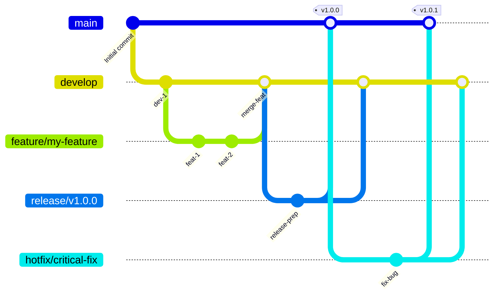

# GitFlow Branch Strategy

This document describes the GitFlow branch strategy implemented for the tree-sitter-analyzer project.

## GitFlow Diagram



## Branch Structure

### Main Branches

- **`main`**: Production-ready code. Always contains the latest stable release.
- **`develop`**: Integration branch for features. Contains the latest delivered development changes.

### Supporting Branches

- **`feature/*`**: Feature development branches. Branch from `develop`, merge back to `develop`.
- **`release/*`**: Release preparation branches. Branch from `develop`, merge to both `main` and `develop`.
- **`hotfix/*`**: Critical bug fixes for production. Branch from `main`, merge to both `main` and `develop`.

## Workflow

### Feature Development

1. **Create feature branch** from `develop`:
   ```bash
   git checkout develop
   git pull origin develop
   git checkout -b feature/your-feature-name
   ```

2. **Develop your feature** with regular commits:
   ```bash
   git add .
   git commit -m "feat: Add new feature"
   ```

3. **Push feature branch** and create pull request:
   ```bash
   git push origin feature/your-feature-name
   ```

4. **Merge to develop** after code review and CI passes.

### Release Process

#### Automated Release (Recommended)

The project now uses an **automated release process** from the `develop` branch:

1. **Develop branch updates** trigger automatic:
   - ✅ Test execution
   - ✅ PyPI deployment
   - ✅ README statistics update
   - ✅ Pull request creation to main

2. **Manual review and merge** of the automated PR to main

3. **GitHub release creation** with proper versioning

#### Manual Release Process

For manual releases:

1. **Create release branch** from `develop`:
   ```bash
   git checkout develop
   git pull origin develop
   git checkout -b release/v1.0.0
   ```

2. **Update version** in `pyproject.toml`:
   ```toml
   version = "1.0.0"
   ```

3. **Update documentation**:
   ```bash
   uv run python scripts/improved_readme_updater.py
   ```

4. **Commit changes**:
   ```bash
   git add .
   git commit -m "chore: Prepare release v1.0.0"
   ```

5. **Merge to main and develop**:
   ```bash
   git checkout main
   git merge release/v1.0.0
   git tag -a v1.0.0 -m "Release v1.0.0"
   git push origin main --tags
   
   git checkout develop
   git merge release/v1.0.0
   git push origin develop
   ```

6. **Delete release branch**:
   ```bash
   git branch -d release/v1.0.0
   git push origin --delete release/v1.0.0
   ```

### Hotfix Process

1. **Create hotfix branch** from `main`:
   ```bash
   git checkout main
   git pull origin main
   git checkout -b hotfix/critical-bug-fix
   ```

2. **Fix the issue** and commit:
   ```bash
   git add .
   git commit -m "fix: Critical bug fix"
   ```

3. **Update version** for hotfix:
   ```bash
   # Update pyproject.toml version (e.g., 1.0.0 -> 1.0.1)
   ```

4. **Merge to main and develop**:
   ```bash
   git checkout main
   git merge hotfix/critical-bug-fix
   git tag -a v1.0.1 -m "Hotfix v1.0.1"
   git push origin main --tags
   
   git checkout develop
   git merge hotfix/critical-bug-fix
   git push origin develop
   ```

5. **Delete hotfix branch**:
   ```bash
   git branch -d hotfix/critical-bug-fix
   git push origin --delete hotfix/critical-bug-fix
   ```

## Automation Features

### Develop Branch Automation

When code is pushed to `develop`, the following happens automatically:

1. **Test Execution**: All tests are run to ensure quality
2. **PyPI Deployment**: Package is built and deployed to PyPI
3. **README Update**: Statistics are automatically updated
4. **PR Creation**: Pull request is created to main branch

### Main Branch Protection

The `main` branch is protected with:

- ✅ **Required status checks**: All CI jobs must pass
- ✅ **Required pull request reviews**: At least 1 approval required
- ✅ **Branch up-to-date requirement**: Must be up-to-date with base branch
- ✅ **Conversation resolution**: All review comments must be resolved

### Automated Release Script

Use the automated release script for manual releases:

```bash
# Dry run to see what would happen
uv run python scripts/automated_release.py --dry-run

# Execute release with new version
uv run python scripts/automated_release.py --version 1.1.0

# Execute release with current version
uv run python scripts/automated_release.py
```

## Best Practices

### Commit Messages

Use conventional commit format:

- `feat:` New features
- `fix:` Bug fixes
- `docs:` Documentation changes
- `style:` Code style changes (formatting, etc.)
- `refactor:` Code refactoring
- `test:` Adding or updating tests
- `chore:` Maintenance tasks

### Branch Naming

- `feature/descriptive-name`: Feature branches
- `release/v1.0.0`: Release branches
- `hotfix/critical-fix`: Hotfix branches

### Quality Checks

Before merging to `develop`:

1. **Run tests locally**:
   ```bash
   uv run pytest tests/ -v
   ```

2. **Check code quality**:
   ```bash
   uv run python check_quality.py --new-code-only
   ```

3. **Update documentation** if needed:
   ```bash
   uv run python scripts/improved_readme_updater.py
   ```

### Version Management

- **Semantic Versioning**: MAJOR.MINOR.PATCH
- **Automatic versioning**: Managed by automated release process
- **Version consistency**: All files updated together

## 🤖 AI-Assisted Development Workflow

### Complete Bug Fix & Release Automation

This section provides a comprehensive workflow for AI assistants to handle bug fixes, version updates, and releases with minimal human intervention.

#### 1. **Bug Fix Workflow**

When fixing bugs, follow this automated sequence:

```bash
# 1. Check current branch and status
git status
git branch -v

# 2. Create feature branch from develop
git checkout develop
git pull origin develop
git checkout -b feature/fix-[bug-description]

# 3. Fix the bug (already completed in this session)
# - Edit the problematic files
# - Test the fix locally

# 4. Run comprehensive quality checks
uv run pytest tests/ -v
uv run python check_quality.py --new-code-only
uv run python llm_code_checker.py --check-all

# 5. Update version number (automatic patch increment)
python -c "
import re
with open('pyproject.toml', 'r') as f:
    content = f.read()
current = re.search(r'version = \"(\d+)\.(\d+)\.(\d+)\"', content)
if current:
    major, minor, patch = map(int, current.groups())
    new_version = f'{major}.{minor}.{patch + 1}'
    new_content = re.sub(r'version = \"(\d+)\.(\d+)\.(\d+)\"', f'version = \"{new_version}\"', content)
    with open('pyproject.toml', 'w') as f:
        f.write(new_content)
    print(f'Version updated to {new_version}')
"

# 6. Update CHANGELOG.md
echo "
## [$(python -c "import re; content=open('pyproject.toml').read(); print(re.search(r'version = \"([^\"]+)\"', content).group(1))")] - $(date +%Y-%m-%d)

### Fixed
- Fixed MCP list_files tool failing to detect Java files in specific directories
- Resolved fd command parameter ordering issue in Windows environment
- Improved --search-path parameter usage for better cross-platform compatibility

### Technical Details
- Modified \`build_fd_command\` in \`fd_rg_utils.py\` to use \`--search-path\` instead of positional arguments
- Eliminated automatic \`\".\"\` pattern injection that caused command conflicts
- Enhanced Windows environment compatibility for file discovery operations
" >> CHANGELOG.md

# 7. Update README statistics (if test count changed)
uv run python scripts/improved_readme_updater.py

# 8. Commit all changes
git add .
git commit -m "fix: Resolve MCP list_files tool Java file detection issue

- Fix fd command parameter ordering in fd_rg_utils.py
- Use --search-path for better cross-platform compatibility  
- Update version to $(python -c "import re; content=open('pyproject.toml').read(); print(re.search(r'version = \"([^\"]+)\"', content).group(1))")
- Update CHANGELOG.md and README statistics"

# 9. Push feature branch
git push origin feature/fix-[bug-description]
```

#### 2. **Automated Release Trigger**

After bug fix is committed:

```bash
# 10. Merge to develop (triggers automated PR creation)
git checkout develop
git pull origin develop
git merge feature/fix-[bug-description]
git push origin develop

# 11. Clean up feature branch
git branch -d feature/fix-[bug-description]
git push origin --delete feature/fix-[bug-description]
```

**Note**: Pushing to `develop` triggers the `develop-automation.yml` workflow which:
1. Runs all tests and quality checks
2. Builds the package
3. Creates an automated PR from develop to main
4. **Does NOT deploy to PyPI** (PyPI deployment happens only on release/hotfix branches)

#### 3. **Actual Release Process**

For PyPI deployment, you need to create a release branch:

```bash
# Create release branch for PyPI deployment
git checkout develop  
git pull origin develop
git checkout -b release/v[new-version]
git push origin release/v[new-version]
```

This triggers `release-automation.yml` which:
- ✅ **Runs comprehensive tests**
- ✅ **Builds and validates package**
- ✅ **Deploys to PyPI automatically**
- ✅ **Creates release-to-main PR**

#### 4. **Post-Release Verification**

After release branch is created, the automated system will handle:

- ✅ **PyPI Deployment**: Package automatically published from release branch
- ✅ **GitHub PR Creation**: Automated PR from release to main
- ✅ **Quality Assurance**: All tests and builds verified
- ⚠️ **Manual Step Required**: README updates need to be done manually

Verify the release:

```bash
# Check PyPI deployment
pip index versions tree-sitter-analyzer

# Verify GitHub release
gh release list

# Check README updates
git log --oneline -5
```

#### 5. **AI Assistant Checklist**

When fixing bugs, AI assistants should automatically:

- [ ] **Identify Root Cause**: Analyze the technical issue thoroughly
- [ ] **Fix Implementation**: Apply the correct technical solution
- [ ] **Version Increment**: Automatically bump patch version in pyproject.toml
- [ ] **Update CHANGELOG**: Add detailed fix description with technical details
- [ ] **Quality Checks**: Run all tests and linting locally
- [ ] **Commit & Push**: Use conventional commit messages
- [ ] **Merge to Develop**: Triggers automated testing and PR creation
- [ ] **Create Release Branch**: For PyPI deployment (release/v[version])
- [ ] **Manual README Update**: Update statistics if test count changed (not automated)
- [ ] **Verify PyPI Deployment**: Check package publication after release branch

#### 6. **Multi-language Documentation Sync**

When updating GitFlow documentation, ensure all language versions are synchronized:

```bash
# Update all GitFlow documents
# 1. GITFLOW.md (English - primary)
# 2. GITFLOW_zh.md (Chinese)  
# 3. GITFLOW_ja.md (Japanese)

# Verify consistency
diff -u GITFLOW.md GITFLOW_zh.md | head -20
diff -u GITFLOW.md GITFLOW_ja.md | head -20
```

#### 7. **Emergency Hotfix Protocol**

For critical production issues:

```bash
# 1. Create hotfix from main
git checkout main
git pull origin main
git checkout -b hotfix/critical-[issue]

# 2. Apply minimal fix
# 3. Update version (patch increment)
# 4. Update CHANGELOG
# 5. Commit with hotfix message
# 6. Merge to both main and develop
# 7. Tag and push

# Automated PyPI deployment will trigger immediately
```

This workflow ensures consistent, high-quality releases with minimal manual intervention while maintaining full traceability and documentation.

## CI/CD Integration

### GitHub Actions Workflows

1. **`ci.yml`**: Main CI pipeline for all branches
2. **`develop-automation.yml`**: Automated release from develop
3. **`branch-protection.yml`**: Main branch protection setup

### Required Secrets

- `PYPI_API_TOKEN`: For PyPI deployment
- `GITHUB_TOKEN`: For repository operations

## Troubleshooting

### Common Issues

1. **Branch protection errors**: Ensure all required checks pass
2. **PyPI deployment failures**: Check API token and package validity
3. **README update failures**: Verify test statistics are accurate

### Manual Override

For emergency situations, repository administrators can:

1. **Bypass branch protection** (use with caution)
2. **Manual PyPI deployment** if automated process fails
3. **Force push** to main (only in critical situations)

---

**Note**: This GitFlow implementation prioritizes automation and quality assurance while maintaining the flexibility for manual intervention when needed.
