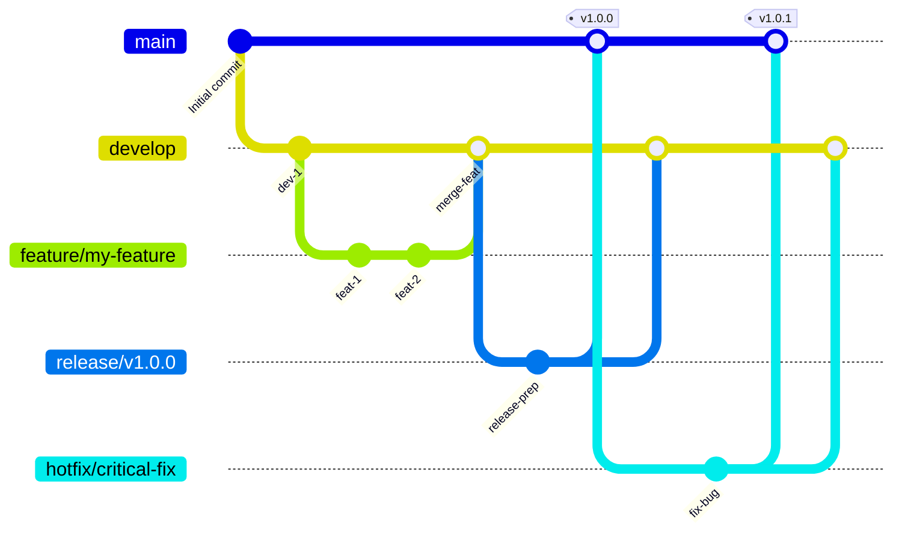

# GitFlow ブランチ戦略 (日本語説明)

このドキュメントでは、`tree-sitter-analyzer`プロジェクトで実装されているGitFlowブランチ戦略を、Mermaidチャートと日本語で解説します。

## GitFlow フロー図



## ブランチ構造

### 主要ブランチ

- **`main`**: 本番環境に対応したコード。常に最新の安定版リリースが含まれます。いつでもデプロイ可能な状態であるべきです。
- **`develop`**: 機能統合用のブランチ。最新の開発変更が含まれており、すべての機能開発の起点となります。

### サポートブランチ

- **`feature/*`**: 機能開発用のブランチ。
    - **派生元**: `develop`
    - **マージ先**: `develop`
    - **命名規則**: `feature/descriptive-name` (例: `feature/user-authentication`)
- **`release/*`**: リリース準備用のブランチ。新しい本番リリースの準備に使用され、軽微なバグ修正やドキュメント生成など、リリースに関連するタスクのみを行います。
    - **派生元**: `develop`
    - **マージ先**: `main` と `develop`
    - **命名規則**: `release/v1.2.0`
- **`hotfix/*`**: 緊急の本番バグ修正用のブランチ。本番環境での重大な問題を迅速に修正するために使用されます。
    - **派生元**: `main`
    - **マージ先**: `main` と `develop`
    - **命名規則**: `hotfix/critical-bug-fix`

## ワークフロー

### 1. 機能開発 (Feature Development)

1.  **`develop` から `feature` ブランチを作成**:
    ```bash
    git checkout develop
    git pull origin develop
    git checkout -b feature/your-feature-name
    ```
2.  **機能開発を行い**、定期的にコミットします。
3.  **開発完了後**、`feature` ブランチをリモートにプッシュし、`develop` ブランチへのプルリクエストを作成します。
4.  コードレビューと継続的インテグレーション（CI）のチェックを通過後、**`develop` にマージ**します。

### 2. リリースプロセス (Release Process)

プロジェクトでは自動化されたリリースプロセスを推奨していますが、手動のプロセスは以下の通りです。

1.  **`develop` から `release` ブランチを作成**:
    ```bash
    git checkout -b release/v1.0.0 develop
    ```
2.  **リリース準備**: バージョン番号の更新、ドキュメントの生成など。
3.  **準備完了後、`main` と `develop` にマージ**:
    ```bash
    # mainブランチに切り替えてマージ
    git checkout main
    git merge release/v1.0.0
    git tag -a v1.0.0 -m "Release v1.0.0" # バージョンタグを付与
    git push origin main --tags

    # developブランチに切り替えてマージ
    git checkout develop
    git merge release/v1.0.0
    git push origin develop
    ```
4.  **`release` ブランチを削除**します。

### 3. 緊急修正 (Hotfix Process)

1.  **`main` から `hotfix` ブランチを作成**:
    ```bash
    git checkout -b hotfix/critical-bug-fix main
    ```
2.  **バグを修正**し、コミットします。
3.  **修正完了後、`main` と `develop` にマージ**:
    ```bash
    # mainブランチに切り替えてマージ
    git checkout main
    git merge hotfix/critical-bug-fix
    git tag -a v1.0.1 -m "Hotfix v1.0.1" # 修正バージョンタグを付与
    git push origin main --tags

    # developブランチに切り替えてマージ
    git checkout develop
    git merge hotfix/critical-bug-fix
    git push origin develop
    ```
4.  **`hotfix` ブランチを削除**します。

## 🤖 AI支援開発ワークフロー

### 完全なバグ修正とリリース自動化

このセクションでは、AIアシスタントがバグ修正、バージョン更新、リリースを最小限の人的介入で処理するための包括的なワークフローを提供します。

#### 1. **バグ修正ワークフロー**

バグを修正する際は、以下の自動化シーケンスに従います：

```bash
# 1. 現在のブランチと状態を確認
git status
git branch -v

# 2. developからfeatureブランチを作成
git checkout develop
git pull origin develop
git checkout -b feature/fix-[バグ説明]

# 3. バグを修正（このセッションで完了済み）
# - 問題のあるファイルを編集
# - ローカルで修正をテスト

# 4. 包括的な品質チェックを実行
uv run pytest tests/ -v
uv run python check_quality.py --new-code-only
uv run python llm_code_checker.py --check-all

# 5. バージョン番号を更新（自動パッチ増分）
python -c "
import re
with open('pyproject.toml', 'r') as f:
    content = f.read()
current = re.search(r'version = \"(\d+)\.(\d+)\.(\d+)\"', content)
if current:
    major, minor, patch = map(int, current.groups())
    new_version = f'{major}.{minor}.{patch + 1}'
    new_content = re.sub(r'version = \"(\d+)\.(\d+)\.(\d+)\"', f'version = \"{new_version}\"', content)
    with open('pyproject.toml', 'w') as f:
        f.write(new_content)
    print(f'バージョンを{new_version}に更新しました')
"

# 6. CHANGELOG.mdを更新
echo "
## [$(python -c "import re; content=open('pyproject.toml').read(); print(re.search(r'version = \"([^\"]+)\"', content).group(1))")] - $(date +%Y-%m-%d)

### 修正
- 特定ディレクトリでMCP list_filesツールがJavaファイルを検出できない問題を修正
- Windows環境でのfdコマンドパラメータ順序問題を解決
- クロスプラットフォーム互換性向上のため--search-pathパラメータ使用を改善

### 技術詳細
- \`fd_rg_utils.py\`の\`build_fd_command\`を位置引数の代わりに\`--search-path\`を使用するよう修正
- コマンド競合の原因となる自動\`\".\"\`パターン注入を除去
- ファイル発見操作のWindows環境互換性を強化
" >> CHANGELOG.md

# 7. README統計を更新（テスト数が変更された場合）
uv run python scripts/improved_readme_updater.py

# 8. すべての変更をコミット
git add .
git commit -m "fix: MCP list_filesツールのJavaファイル検出問題を解決

- fd_rg_utils.pyのfdコマンドパラメータ順序を修正
- クロスプラットフォーム互換性向上のため--search-pathを使用
- バージョンを$(python -c "import re; content=open('pyproject.toml').read(); print(re.search(r'version = \"([^\"]+)\"', content).group(1))")に更新
- CHANGELOG.mdとREADME統計を更新"

# 9. featureブランチをプッシュ
git push origin feature/fix-[バグ説明]
```

#### 2. **自動リリース トリガー**

バグ修正のコミット後：

```bash
# 10. developにマージ（自動PR作成をトリガー）
git checkout develop
git pull origin develop
git merge feature/fix-[バグ説明]
git push origin develop

# 11. featureブランチをクリーンアップ
git branch -d feature/fix-[バグ説明]
git push origin --delete feature/fix-[バグ説明]
```

**注意**：`develop`へのプッシュは`develop-automation.yml`ワークフローをトリガーします：
1. すべてのテストと品質チェックを実行
2. パッケージをビルド
3. developからmainへの自動PRを作成
4. **PyPIにはデプロイしません**（PyPIデプロイはrelease/hotfixブランチでのみ実行）

#### 3. **実際のリリースプロセス**

PyPIデプロイメントには、releaseブランチの作成が必要です：

```bash
# PyPIデプロイメント用のreleaseブランチを作成
git checkout develop  
git pull origin develop
git checkout -b release/v[新バージョン]
git push origin release/v[新バージョン]
```

これにより`release-automation.yml`がトリガーされます：
- ✅ **包括的テストの実行**
- ✅ **パッケージのビルドと検証**
- ✅ **PyPIへの自動デプロイ**
- ✅ **release-to-main PRの作成**

#### 4. **リリース後の検証**

releaseブランチ作成後、自動化システムが以下を処理します：

- ✅ **PyPIデプロイメント**：releaseブランチからパッケージが自動公開
- ✅ **GitHub PR作成**：releaseからmainへの自動PR
- ✅ **品質保証**：すべてのテストとビルドが検証済み
- ⚠️ **手動ステップが必要**：README更新は手動で実行

リリースを検証：

```bash
# PyPIデプロイメントを確認
pip index versions tree-sitter-analyzer

# GitHubリリースを確認
gh release list

# README更新を確認
git log --oneline -5
```

#### 5. **AIアシスタント チェックリスト**

バグ修正時、AIアシスタントは自動的に：

- [ ] **根本原因の特定**：技術的問題を徹底的に分析
- [ ] **修正の実装**：正しい技術的解決策を適用
- [ ] **バージョン増分**：pyproject.tomlでパッチバージョンを自動的にアップ
- [ ] **変更ログ更新**：詳細な修正説明と技術詳細を追加
- [ ] **品質チェック**：すべてのテストとリンティングをローカルで実行
- [ ] **コミット＆プッシュ**：規約に従ったコミットメッセージを使用
- [ ] **Developにマージ**：自動テストとPR作成をトリガー
- [ ] **Releaseブランチ作成**：PyPIデプロイ用 (release/v[バージョン])
- [ ] **手動README更新**：テスト数が変更された場合は統計を更新（自動化されていません）
- [ ] **PyPIデプロイ検証**：releaseブランチ後にパッケージ公開を確認

#### 6. **多言語ドキュメント同期**

GitFlowドキュメントを更新する際は、すべての言語バージョンが同期されていることを確認：

```bash
# すべてのGitFlowドキュメントを更新
# 1. GITFLOW.md（英語 - プライマリ）
# 2. GITFLOW_zh.md（中国語）
# 3. GITFLOW_ja.md（日本語）

# 一貫性を検証
diff -u GITFLOW.md GITFLOW_zh.md | head -20
diff -u GITFLOW.md GITFLOW_ja.md | head -20
```

#### 7. **緊急ホットフィックス プロトコル**

重要な本番問題の場合：

```bash
# 1. mainからホットフィックスを作成
git checkout main
git pull origin main
git checkout -b hotfix/critical-[問題]

# 2. 最小限の修正を適用
# 3. バージョンを更新（パッチ増分）
# 4. 変更ログを更新
# 5. ホットフィックスメッセージでコミット
# 6. mainとdevelopの両方にマージ
# 7. タグ付けしてプッシュ

# 自動PyPIデプロイメントが即座にトリガーされます
```

このワークフローは、完全な追跡可能性とドキュメント化を維持しながら、最小限の手動介入で一貫した高品質のリリースを保証します。

---

*この日本語説明は、[`GITFLOW.md`](GITFLOW.md) の中核的な概念を理解するのに役立ちます。自動化プロセス、品質チェック、CI/CD統合に関する詳細は、元のドキュメントを参照してください。*
