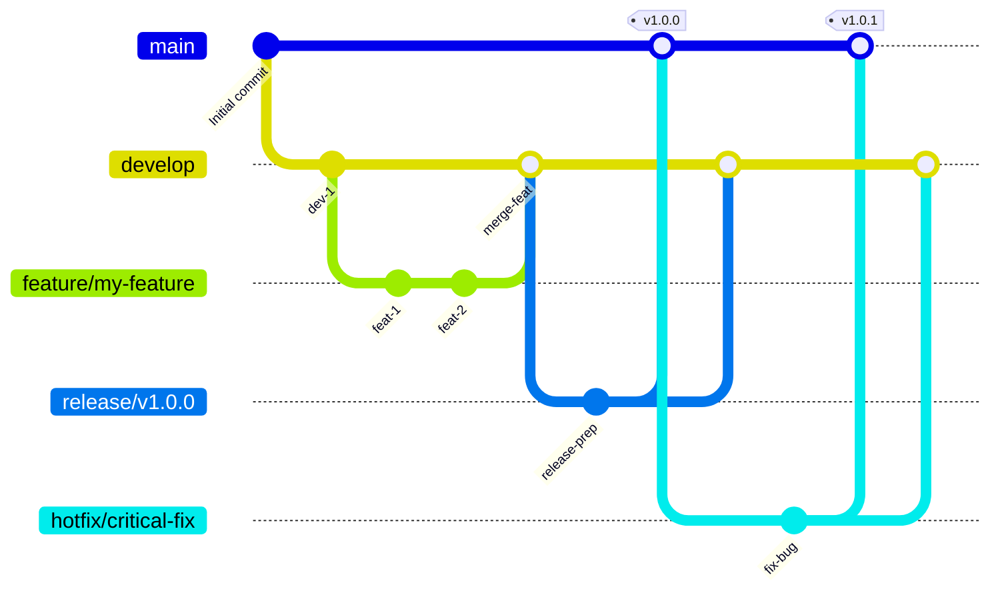

# GitFlow 分支策略 (中文说明)

本文档使用 Mermaid 图表和中文解释了 `tree-sitter-analyzer` 项目中实施的 GitFlow 分支策略。

## GitFlow 流程图



## 分支结构

### 主要分支

- **`main`**: 生产就绪的代码。始终包含最新的稳定版本。任何时候都应该是可部署的状态。
- **`develop`**: 功能集成分支。包含最新的已交付开发变更，是所有功能开发的起点。

### 支持分支

- **`feature/*`**: 功能开发分支。
    - **来源**: `develop`
    - **合并回**: `develop`
    - **命名**: `feature/descriptive-name` (例如: `feature/user-authentication`)
- **`release/*`**: 版本发布准备分支。用于准备新的生产版本，只进行少量 Bug 修复和文档生成等面向发布的任务。
    - **来源**: `develop`
    - **合并回**: `main` 和 `develop`
    - **命名**: `release/v1.2.0`
- **`hotfix/*`**: 紧急生产 Bug 修复分支。用于快速修复生产环境中的关键问题。
    - **来源**: `main`
    - **合并回**: `main` 和 `develop`
    - **命名**: `hotfix/critical-bug-fix`

## 工作流程

### 1. 功能开发 (Feature Development)

1.  **从 `develop` 创建 `feature` 分支**:
    ```bash
    git checkout develop
    git pull origin develop
    git checkout -b feature/your-feature-name
    ```
2.  **进行功能开发**并定期提交。
3.  **开发完成后**，将 `feature` 分支推送到远程，并创建拉取请求 (Pull Request) 到 `develop` 分支。
4.  经过代码审查和持续集成 (CI) 检查通过后，**合并到 `develop`**。

### 2. 版本发布 (Release Process)

项目推荐使用自动化发布流程，但手动流程如下：

1.  **从 `develop` 创建 `release` 分支**:
    ```bash
    git checkout -b release/v1.0.0 develop
    ```
2.  **准备发布**: 更新版本号、生成文档等。
3.  **完成准备后，合并到 `main` 和 `develop`**:
    ```bash
    # 切换到 main 分支并合并
    git checkout main
    git merge release/v1.0.0
    git tag -a v1.0.0 -m "Release v1.0.0" # 打上版本标签
    git push origin main --tags

    # 切换到 develop 分支并合并
    git checkout develop
    git merge release/v1.0.0
    git push origin develop
    ```
4.  **删除 `release` 分支**。

### 3. 紧急修复 (Hotfix Process)

1.  **从 `main` 创建 `hotfix` 分支**:
    ```bash
    git checkout -b hotfix/critical-bug-fix main
    ```
2.  **修复 Bug** 并提交。
3.  **完成修复后，合并到 `main` 和 `develop`**:
    ```bash
    # 切换到 main 分支并合并
    git checkout main
    git merge hotfix/critical-bug-fix
    git tag -a v1.0.1 -m "Hotfix v1.0.1" # 打上修复版本标签
    git push origin main --tags

    # 切换到 develop 分支并合并
    git checkout develop
    git merge hotfix/critical-bug-fix
    git push origin develop
    ```
4.  **删除 `hotfix` 分支**。

## 🤖 AI 辅助开发工作流程

### 完整的 Bug 修复与发布自动化

本节为 AI 助手提供了处理 Bug 修复、版本更新和发布的综合工作流程，最大程度减少人工干预。

#### 1. **Bug 修复工作流程**

修复 Bug 时，遵循以下自动化序列：

```bash
# 1. 检查当前分支和状态
git status
git branch -v

# 2. 从 develop 创建功能分支
git checkout develop
git pull origin develop
git checkout -b feature/fix-[bug-描述]

# 3. 修复 Bug（在本会话中已完成）
# - 编辑有问题的文件
# - 本地测试修复

# 4. 运行综合质量检查
uv run pytest tests/ -v
uv run python check_quality.py --new-code-only
uv run python llm_code_checker.py --check-all

# 5. 更新版本号（自动补丁增量）
python -c "
import re
with open('pyproject.toml', 'r') as f:
    content = f.read()
current = re.search(r'version = \"(\d+)\.(\d+)\.(\d+)\"', content)
if current:
    major, minor, patch = map(int, current.groups())
    new_version = f'{major}.{minor}.{patch + 1}'
    new_content = re.sub(r'version = \"(\d+)\.(\d+)\.(\d+)\"', f'version = \"{new_version}\"', content)
    with open('pyproject.toml', 'w') as f:
        f.write(new_content)
    print(f'版本已更新至 {new_version}')
"

# 6. 更新 CHANGELOG.md
echo "
## [$(python -c "import re; content=open('pyproject.toml').read(); print(re.search(r'version = \"([^\"]+)\"', content).group(1))")] - $(date +%Y-%m-%d)

### 修复
- 修复了 MCP list_files 工具无法在特定目录中检测 Java 文件的问题
- 解决了 Windows 环境下 fd 命令参数排序问题
- 改进了 --search-path 参数使用以提高跨平台兼容性

### 技术详情
- 修改了 \`fd_rg_utils.py\` 中的 \`build_fd_command\` 以使用 \`--search-path\` 而非位置参数
- 消除了导致命令冲突的自动 \`\".\"\` 模式注入
- 增强了文件发现操作的 Windows 环境兼容性
" >> CHANGELOG.md

# 7. 更新 README 统计（如果测试数量改变）
uv run python scripts/improved_readme_updater.py

# 8. 提交所有更改
git add .
git commit -m "fix: 解决 MCP list_files 工具 Java 文件检测问题

- 修复 fd_rg_utils.py 中的 fd 命令参数排序
- 使用 --search-path 提高跨平台兼容性
- 更新版本至 $(python -c "import re; content=open('pyproject.toml').read(); print(re.search(r'version = \"([^\"]+)\"', content).group(1))")
- 更新 CHANGELOG.md 和 README 统计"

# 9. 推送功能分支
git push origin feature/fix-[bug-描述]
```

#### 2. **自动化发布触发**

Bug 修复提交后：

```bash
# 10. 合并到 develop（触发自动化 PR 创建）
git checkout develop
git pull origin develop
git merge feature/fix-[bug-描述]
git push origin develop

# 11. 清理功能分支
git branch -d feature/fix-[bug-描述]
git push origin --delete feature/fix-[bug-描述]
```

**注意**：推送到 `develop` 会触发 `develop-automation.yml` 工作流程：
1. 运行所有测试和质量检查
2. 构建包
3. 创建从 develop 到 main 的自动化 PR
4. **不会部署到 PyPI**（PyPI 部署仅在 release/hotfix 分支进行）

#### 3. **实际发布流程**

要进行 PyPI 部署，需要创建 release 分支：

```bash
# 创建 release 分支进行 PyPI 部署
git checkout develop  
git pull origin develop
git checkout -b release/v[新版本]
git push origin release/v[新版本]
```

这会触发 `release-automation.yml`：
- ✅ **运行综合测试**
- ✅ **构建和验证包**
- ✅ **自动部署到 PyPI**
- ✅ **创建 release-to-main PR**

#### 4. **发布后验证**

创建 release 分支后，自动化系统将处理：

- ✅ **PyPI 部署**：从 release 分支自动发布包
- ✅ **GitHub PR 创建**：从 release 到 main 的自动化 PR
- ✅ **质量保证**：所有测试和构建验证
- ⚠️ **需要手动步骤**：README 更新需要手动完成

验证发布：

```bash
# 检查 PyPI 部署
pip index versions tree-sitter-analyzer

# 验证 GitHub 发布
gh release list

# 检查 README 更新
git log --oneline -5
```

#### 5. **AI 助手检查清单**

修复 Bug 时，AI 助手应自动：

- [ ] **识别根本原因**：彻底分析技术问题
- [ ] **修复实现**：应用正确的技术解决方案
- [ ] **版本增量**：在 pyproject.toml 中自动提升补丁版本
- [ ] **更新变更日志**：添加详细的修复描述和技术细节
- [ ] **质量检查**：本地运行所有测试和代码检查
- [ ] **提交推送**：使用规范的提交消息
- [ ] **合并到 Develop**：触发自动化测试和 PR 创建
- [ ] **创建 Release 分支**：用于 PyPI 部署 (release/v[版本])
- [ ] **手动 README 更新**：如果测试数量改变则更新统计（非自动化）
- [ ] **验证 PyPI 部署**：release 分支后检查包发布

#### 6. **多语言文档同步**

更新 GitFlow 文档时，确保所有语言版本同步：

```bash
# 更新所有 GitFlow 文档
# 1. GITFLOW.md（英语 - 主要）
# 2. GITFLOW_zh.md（中文）
# 3. GITFLOW_ja.md（日语）

# 验证一致性
diff -u GITFLOW.md GITFLOW_zh.md | head -20
diff -u GITFLOW.md GITFLOW_ja.md | head -20
```

#### 7. **紧急热修复协议**

对于关键生产问题：

```bash
# 1. 从 main 创建热修复
git checkout main
git pull origin main
git checkout -b hotfix/critical-[问题]

# 2. 应用最小修复
# 3. 更新版本（补丁增量）
# 4. 更新变更日志
# 5. 使用热修复消息提交
# 6. 合并到 main 和 develop
# 7. 标记并推送

# 自动化 PyPI 部署将立即触发
```

此工作流程确保在保持完整可追溯性和文档的同时，以最少的手动干预实现一致的高质量发布。

---

*此中文说明旨在帮助理解 `GITFLOW.md` 中的核心概念。更详细的自动化流程、质量检查和 CI/CD 集成信息，请参阅原始的 [GITFLOW.md](GITFLOW.md) 文件。*
