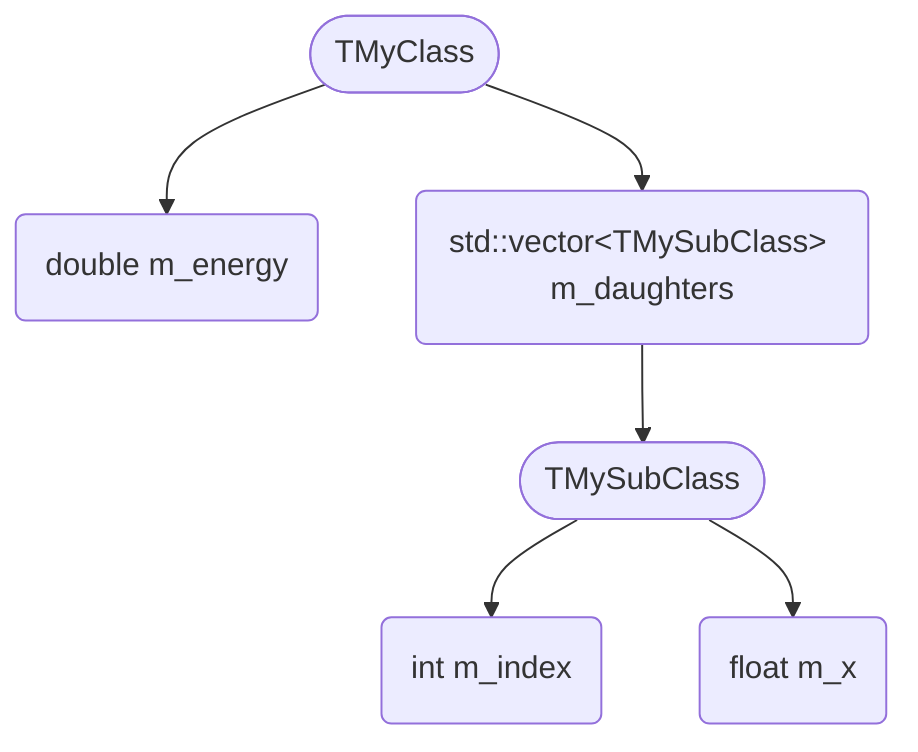

# uproot-custom

This is a prototype repository of an extension that allows `uproot` to read custom classes from ROOT files.

`uproot` can already read some custom classes directly. However, in some cases, custom classes are too complex for `uproot` to read, such as when their `Streamer` methods are overridden or some specific data members are not supported by `uproot`.

This extension privides a `Reader` interface and allows you to read such custom classes by providing  your own `Reader`. The `Reader` interface defines how to read the data members of a class from the binary stream.

## Design overview

In ROOT, data are stored in a tree structure. For example, when a custom class is defined as:

```cpp
class TMySubClass : public TObject {
    int m_index;
    float m_x;
};

class TMyClass : public TObject {
    double m_energy;
    std::vector<MySubClass> m_daughters;
};
```

The data tree is:



To handle the tree-like data structure, `Reader` is introduced. It consists of `Python` and `C++` parts. The `Python` part is responsible for generating the information tree, constructing C++ readers, and reconstructing data to `awkward` array. The `C++` part is responsible for reading the data members of the class from the binary stream.

### Generate information tree

`uproot` can read these structure information from the ROOT file, but not in tree format. So the first step is to generate an information tree from the ROOT file. The information tree is a nested structure that contains the data members of the class, including types, names and children if any.

### Construct C++ readers

According to the information tree, we can instantiate C++ readers and combine them into a tree structure. The top reader drives its sub-readers to read data recursively. After the reading process,
readers obtain the results from their sub-readers recursively, then the top reader returns the final result.

### Reconstruct data to `awkward` array

Since embedding arrays together into `awkward` array in C++ is not straightforward, we left this task to Python. After the C++ reader returns the result, we can reconstruct the data into `awkward` array according to the information tree.

## Predefined readers

`uproot-custom` provides some predefined readers for common ROOT classes:

| Reader             | Description |
|--------------------|-------------|
| BasicTypeReader<T> | Reads basic types like `int`, `float`, `double`, etc. |
| TObjectReader      | Skip `TObject` header when reading classes that inherit from `TObject`. |
| TStringReader      | Reads `TString` |
| STLSeqReader       | Reads `std::vector`, `std::array`, etc. |
| STLMapReader       | Reads `std::map`, `std::unordered_map`, etc. |
| STLStringReader    | Reads `std::string` |
| TArrayReader<T>    | Reads `TArray` types like `TArrayI`, `TArrayF`, `TArrayD`, etc. |
| ObjectReader       | Reads custom classes that inherit from `TObject`. |
| CArrayReader       | Reads C-style arrays like `int[]` |
| EmptyReader        | A reader that does nothing. Some branches may not have any data, and the information of the corresponding class will not be stored in the ROOT file. In this case, `EmptyReader` is used to skip the branch. |

## Implement your own `Reader`

### Full example

A complete example of how to impolement your own readers is available in the [`example`](https://github.com/mrzimu/uproot-custom/tree/main/example) directory. You can also refer to the [Python part](https://github.com/mrzimu/uproot-custom/tree/main/uproot_custom/readers.py) and [C++ part](https://github.com/mrzimu/uproot-custom/tree/main/cpp/src/uproot-custom.cc) of predefined readers for implementation details.

### Pre-requisites

Make sure you have `GCC>13.1`/`Clang>=16.0.0`/`MSVC>=19.31`, `cmake` installed on your system.

1. Create a Python project and install `uproot-custom`:

    ```bash
    mkdir my_reader
    cd my_reader
    python3 -m venv .venv
    source .venv/bin/activate
    pip install uproot-custom
    ```

2. Create a `pyproject.toml` file in the root directory of your project:

    ```toml
    [build-system]
    requires = ["scikit-build-core>=0.11", "pybind11>=2.10.0", "uproot-custom"]
    build-backend = "scikit_build_core.build"

    [project]
    name = "my-reader"
    requires-python = ">=3.9"
    dependencies = ["uproot-custom"]
    version = "0.1.0"

    [tool.scikit-build]
    wheel.packages = ["my_reader"]
    build-dir = "build/{wheel_tag}"
    cmake.source-dir = "cpp"
    cmake.build-type = "Debug" # Comment for release builds

    [tool.black]
    exclude = "/(build|dist|env|.git|.tox|.eggs|.venv)/"
    line-length = 95
    target-version = ['py39', 'py310', 'py311', 'py312', 'py313']
    ```

    you can change the `name`, `version`, and other fields as you like.

    > [!WARNING]
    > If you are releasing the project, specify concrete major and minor versions of `uproot-custom` to ensure the header files are compatible. For example, use `uproot-custom~=1.2` instead of `uproot-custom>=1.2` (may not be compatible with future versions).

### Reader interface

For a custom `Reader`, a C++ part and a Python part are both required.

For C++ part, the constructor must inherit from `IElementReader`, and these methods must be implemented:
- `void read(BinaryBuffer& buffer)`: Read data from the binary buffer.
- `py::object data() const`: Return the data as a Python object. You can return anything defined in `pybind11`, such as `py::tuple`, `py::list`, `py::array_t`, etc.

For Python part, the class must inherit from `uproot_custom.BaseReader` and implement the following class methods:

- `gen_tree_config`: Generate a configuration dictionary for the reader based on the information tree. It should return a dictionary if you want your reader to be used, otherwise return `None`.
- `get_cpp_reader`: Identify the tree configuration and return the C++ reader instance if it matches, otherwise return `None`.
- `reconstruct_array`: Reconstruct the raw data to an `awkward` array according to the tree configuration.

### Implement the C++ reader

1. Create a `cpp` directory in the root directory of your project, and create a `my_reader.cc` file in it.

2. In `my_reader.cc`, include the necessary headers and implement your reader class. For example:

    ```cpp
    #include "uproot-custom/uproot-custom.hh"
    using namespace uproot;

    class MyReader : public IElementReader {
        public:
            // Must at least receive a name
            MyReader( std::string name )
                : IElementReader(name), m_data( std::make_shared<std::vector<int>>() ) {}

            // Implement these methods
            void read( BinaryBuffer& buffer ) {
                // Read data from the buffer
                // Implement your reading logic here
            }

            py::object data() const {
                // Return the data as a Python object
                return make_array( m_data );
            }

        private:
            const std::string m_name;
            std::shared_ptr<std::vector<int>> m_data; // Example data member
    };
    ```

    then declare the C++ module in the same file:

    ```cpp
    PYBIND11_MODULE( my_reader_cpp, m ) {
        register_reader<MyReader>(m, "MyReader");
    }
    ```

    if the constructor requires more parameters, register it with the constructor signature (except the name):

    ```cpp
    // Constructor signature:
    MyReader( std::string name, bool param1, std::vector<IElementReader> sub_readers )

    // Register the reader with the constructor signature:
    PYBIND11_MODULE( my_reader_cpp, m ) {
        register_reader<MyReader, bool, std::vector<IElementReader>>(m, "MyReader");
    }
    ```

> [!IMPORTANT]
> Use `std::shared_ptr` for data members in your reader class, as `uproot-custom` will manage the memory of the data members. This is important to avoid memory leaks and ensure proper cleanup.

3. Create a `CMakeLists.txt` file in `cpp` directory:

    ```cmake
    cmake_minimum_required(VERSION 3.20)

    if(CMAKE_VERSION VERSION_GREATER_EQUAL 3.27)
        cmake_policy(SET CMP0148 NEW)
    endif()

    set(CMAKE_EXPORT_COMPILE_COMMANDS ON)
    set(CMAKE_CXX_STANDARD 20)

    project(${SKBUILD_PROJECT_NAME}
        VERSION ${SKBUILD_PROJECT_VERSION}
        LANGUAGES CXX
    )
        
    set(PYBIND11_NEWPYTHON ON)
    find_package(pybind11 REQUIRED)
    find_package(uproot-custom REQUIRED)

    pybind11_add_module(my_reader_cpp
        my_reader.cc
        # Add other source files here if needed
    )

    target_link_libraries(my_reader_cpp PRIVATE uproot-custom)

    if(DEFINED SKBUILD_PROJECT_NAME)
        install(
            TARGETS my_reader_cpp
            LIBRARY DESTINATION ${SKBUILD_PROJECT_NAME}
        )
    endif()
    ```

### Implement the Python reader

1. Create a `my_reader` directory in the root directory of your project, and create a `__init__.py` file in it.

2. In `__init__.py`, import the C++ module and implement your Python reader class:

    ```python
    from . import my_reader_cpp as _cpp
    from uproot_custom import BaseReader


    class MyReader(BaseReader):
        @classmethod
        def gen_tree_config(
            cls,
            top_type_name: str,
            cls_streamer_info: dict,
            all_streamer_info: dict,
            item_path: str = "",
        ) -> dict | None:
            """
            Identify the node in the information tree,
            return the configuration dictionary if the node is matched,
            otherwise return None.
            """

        @classmethod
        def get_cpp_reader(cls, tree_config) -> _cpp.MyReader | None:
            """
            Identify the tree_config,
            if it is matched, return the C++ reader instance,
            otherwise return None.
            """

        @classmethod
        def reconstruct_array(cls, raw_data, tree_config):
            """
            Reconstruct the raw data to an `awkward` array according to the tree_config.
            """
    ```

    > ![NOTE]
    > The `@classmethod` is not necesarry, but when a regular member method is used, you should pass the instance of the class to `registered_readers`.

### Register the reader

#### Register branch path

The default interpretation `uproot_custom.AsCustom` needs to know which branch to read with custom readers. You can export the branch path with:

```python
import uproot
from uproot_custom import regularize_object_path

f = uproot.open("my_file.root")
branch = f["path/to/my_branch"]

print(regularize_object_path(branch.object_path))
```

This will print the regularized object path like `/my_tree:my_branch`. Then you can add it to the `AsCustom.target_branches` set:

```python
from uproot_custom import AsCustom

AsCustom.target_branches.add("your-branch-path")
```

#### Register the reader

To let `uproot_custom.AsCustom` know your reader, you need to register it:

```python
from uproot_custom import registered_readers
from my_reader import MyReader

registered_readers.add(MyReader)
```

Then you can use `uproot` to read the custom class as usual.

> [!TIP]
> It is recommended to do the registration in your project `__init__.py`, so that you can use your custom reader as long as you import your project.
