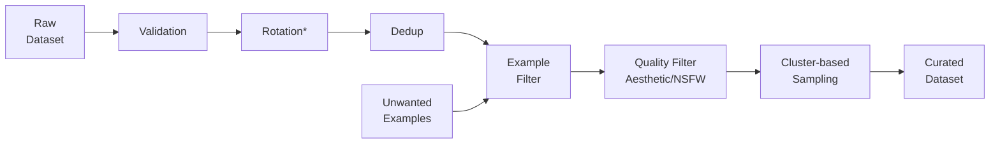

# Vision Data Curation (VDC)

A lightweight framework for cleaning, filtering, and sampling large-scale image datasets.
Built for computer vision researchers and practitioners who want higher-quality data with less manual effort.

## Status

This project is in early development. Most features are functional, but APIs may still change.

- Implemented Features: Input validation, Duplicate removal, Example-based filtering, Aesthetic filtering, NSFW filtering, Hierarchical sampling
- Features in Progress: Rotation correction

Feedback and contributions are welcome.

## Features

VDC provides modular tools for dataset cleanup:

- **Input validation** - detect corrupt files, invalid formats, low resolution, or extreme aspect ratios
- **Example-based filtering** - remove images similar to a set of unwanted examples
- **Image Quality Filtering** - remove images based on aesthetic score or NSFW classification
- **Duplicate removal** - identify and remove near-duplicate images from your dataset
- **Hierarchical K-Means sampling** - select diverse, representative subsets from large datasets

**Coming soon:**

- Rotation correction (correct 90°/180°/270° orientation errors)

## The Curation Pipeline



Note: * = WIP

## Installation

### From PyPI

```sh
pip install vision-data-curation
```

### From Source

```sh
git clone https://gitlab.com/birder/vision-data-curation.git
cd vision-data-curation
pip install -e .
```

Developing directly from the project root allows for script and configuration execution as if fully installed.

## Usage

Each step is a script under `vdc.scripts`.

Examples:

```sh
# Remove corrupt/invalid images
python -m vdc.scripts.sanitize_images data/raw_images/

# Filter based on "Unwanted examples"
python -m vdc.scripts.filter_by_examples data/embeddings.csv --examples bad_examples.csv
```

- Run `python -m vdc.scripts` to see available scripts
- Run `python -m vdc.scripts.<script> --help` for options

Configuration:

- Default settings live in [vdc/conf/config.json](vdc/conf/config.json)
- A `config.json` in your project root will take precedence (or pass `--config` to any script)

## Documentation

For detailed walkthroughs, examples, and in-depth guides, please refer to our [full documentation](docs/README.md).

## License

This project is licensed under the Apache-2.0 License - see the [LICENSE](LICENSE) file for details.
